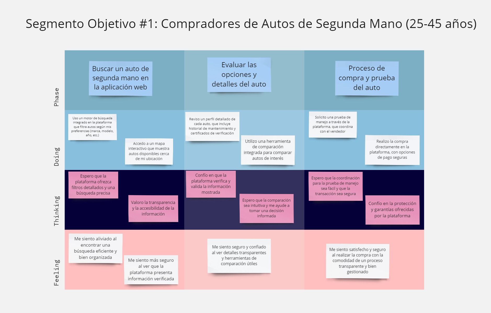
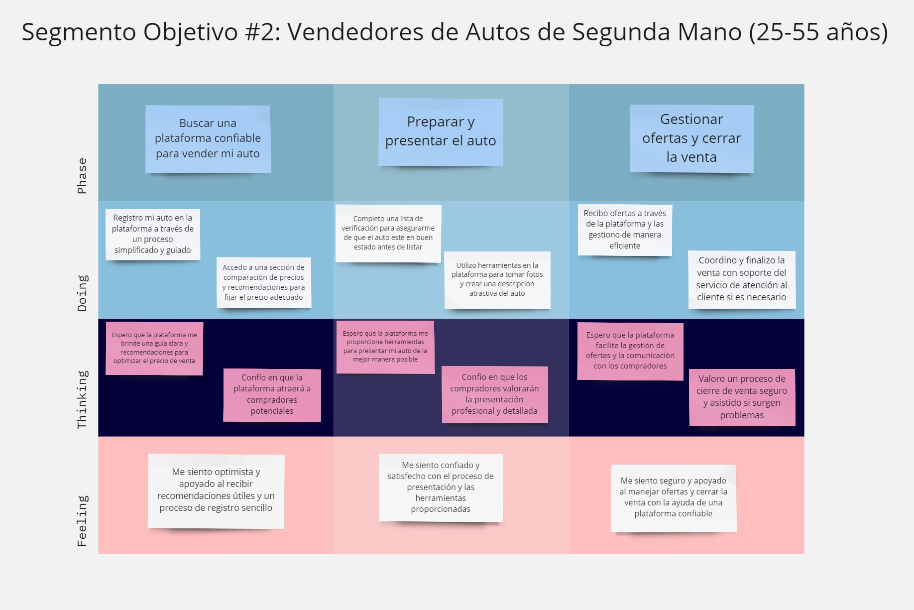

<h1 align="center"> UNIVERSIDAD PERUANA DE CIENCIAS APLICADAS </h1>

<h2 align="center"> INGENIERIA DE SOFTWARE</h2>
<h2 align="center"> CICLO 2025-1</h2>

    

 
<h3 align="center"> Diseño de Experimentos de Ingeniería de Software - WS51 </h3>
<h3 align="center"> Profesor del Curso: Juan Carlos Tinoco Licas </h3>
<h3 align="center"> "INFORME DE TRABAJO FINAL"</h3>
<h3 align="center"> Nombre de Startup: InnoSoft </h3>
<h3 align="center"> Nombre del Producto:   </h3>

| Miembro                        |   Código   |
| :----------------------------- | :--------: |
| Meza Camayo, Lynn Jeeferzon    | U20201C320 |
| Castilla Pachas, César Antonio |            |
| Serrano Uchuya, Gerald Patricio|            |
| Alvarado De La Cruz, Juan Carlos|            |
| Valera Garcés, Samuel Ignacio  |            |

<h3 align="center"> MAYO - 2024   </h3>

## REGISTRO DE VERSIONES

| Versión  |   Fecha   |       Autor     |           Descripción de Modificación           |
|----------|-----------|-----------------|-------------------------------------------------|
|    0.1   | 03/04/25  |     Lynn Meza   | Creaccion Structura del informe                 |
|          |   |        |                  |
|       |   |        |                  |

## PROJECT REPORT COLLABORATION INSIGHTS

URL del respositorio de GitHub de la organización: [https://github.com/orgs/InnoSoft-1ASI0732-Diseno-Experimentos/repositories](https://github.com/orgs/InnoSoft-1ASI0732-Diseno-Experimentos/repositories)

## CONTENIDO

### Tabla de contenido

- [Part I: As-Is Software Project](#part-i-as-is-software-project)
- [Capítulo I: Introducción](#capítulo-i-introducción)
  - [1.1. Startup Profile](#11-startup-profile)
    - [1.1.1. Descripción de la Startup](#111-descripción-de-la-startup)
    - [1.1.2. Perfiles de integrantes del equipo](#112-perfiles-de-integrantes-del-equipo)
  - [1.2. Solution Profile](#12-solution-profile)
    - [1.2.1. Antecedentes y problemática](#121-antecedentes-y-problemática)
    - [1.2.2. Lean UX Process](#122-lean-ux-process)
      - [1.2.2.1. Lean UX Problem Statements](#1221-lean-ux-problem-statements)
      - [1.2.2.2. Lean UX Assumptions](#1222-lean-ux-assumptions)
      - [1.2.2.3. Lean UX Hypothesis Statements](#1223-lean-ux-hypothesis-statements)
      - [1.2.2.4. Lean UX Canvas](#1224-lean-ux-canvas)
  - [1.3. Segmentos objetivo](#13-segmentos-objetivo)
- [Capítulo II: Requirements Elicitation & Analysis](#capítulo-ii-requirements-elicitation--analysis)
  - [2.1. Competidores](#21-competidores)
    - [2.1.1. Análisis competitivo](#211-análisis-competitivo)
    - [2.1.2. Estrategias y tácticas frente a competidores](#212-estrategias-y-tácticas-frente-a-competidores)
  - [2.2. Entrevistas](#22-entrevistas)
    - [2.2.1. Diseño de entrevistas](#221-diseño-de-entrevistas)
    - [2.2.2. Registro de entrevistas](#222-registro-de-entrevistas)
    - [2.2.3. Análisis de entrevistas](#223-análisis-de-entrevistas)
  - [2.3. Needfinding](#23-needfinding)
    - [2.3.1. User Personas](#231-user-personas)
    - [2.3.2. User Task Matrix](#232-user-task-matrix)
    - [2.3.3. User Journey Mapping](#233-user-journey-mapping)
    - [2.3.4. Empathy Mapping](#234-empathy-mapping)
    - [2.3.5. As-is Scenario Mapping](#235-as-is-scenario-mapping)
  - [2.4. Ubiquitous Language](#24-ubiquitous-language)
- [Capítulo III: Requirements Specification](#capítulo-iii-requirements-specification)
  - [3.1. To-Be Scenario Mapping](#31-to-be-scenario-mapping)
  - [3.2. User Stories](#32-user-stories)
  - [3.3. Product Backlog](#33-product-backlog)
  - [3.4. Impact Mapping](#34-impact-mapping)
- [Capítulo IV: Product Design](#capítulo-iv-product-design)
  - [4.1. Style Guidelines](#41-style-guidelines)
    - [4.1.1. General Style Guidelines](#411-general-style-guidelines)
    - [4.1.2. Web Style Guidelines](#412-web-style-guidelines)
    - [4.1.3. Mobile Style Guidelines](#413-mobile-style-guidelines)
      - [4.1.3.1. iOS Mobile Style Guidelines](#4131-ios-mobile-style-guidelines)
      - [4.1.3.2. Android Mobile Style Guidelines](#4132-android-mobile-style-guidelines)
  - [4.2. Information Architecture](#42-information-architecture)
    - [4.2.1. Organization Systems](#421-organization-systems)
    - [4.2.2. Labeling Systems](#422-labeling-systems)
    - [4.2.3. SEO Tags and Meta Tags](#423-seo-tags-and-meta-tags)
    - [4.2.4. Searching Systems](#424-searching-systems)
    - [4.2.5. Navigation Systems](#425-navigation-systems)
  - [4.3. Landing Page UI Design](#43-landing-page-ui-design)
    - [4.3.1. Landing Page Wireframe](#431-landing-page-wireframe)
    - [4.3.2. Landing Page Mock-up](#432-landing-page-mock-up)
  - [4.4. Mobile Applications UX/UI Design](#44-mobile-applications-uxui-design)
    - [4.4.1. Mobile Applications Wireframes](#441-mobile-applications-wireframes)
    - [4.4.2. Mobile Applications Wireflow Diagrams](#442-mobile-applications-wireflow-diagrams)
    - [4.4.3. Mobile Applications Mock-ups](#443-mobile-applications-mock-ups)
    - [4.4.4. Mobile Applications User Flow Diagrams](#444-mobile-applications-user-flow-diagrams)
  - [4.5. Mobile Applications Prototyping](#45-mobile-applications-prototyping)
    - [4.5.1. Android Mobile Applications Prototyping](#451-android-mobile-applications-prototyping)
    - [4.5.2. iOS Mobile Applications Prototyping](#452-ios-mobile-applications-prototyping)
  - [4.6. Web Applications UX/UI Design](#46-web-applications-uxui-design)
    - [4.6.1. Web Applications Wireframes](#461-web-applications-wireframes)
    - [4.6.2. Web Applications Wireflow Diagrams](#462-web-applications-wireflow-diagrams)
    - [4.6.3. Web Applications Mock-ups](#463-web-applications-mock-ups)
    - [4.6.4. Web Applications User Flow Diagrams](#464-web-applications-user-flow-diagrams)
  - [4.7. Web Applications Prototyping](#47-web-applications-prototyping)
  - [4.8. Domain-Driven Software Architecture](#48-domain-driven-software-architecture)
    - [4.8.1. Software Architecture Context Diagram](#481-software-architecture-context-diagram)
    - [4.8.2. Software Architecture Container Diagrams](#482-software-architecture-container-diagrams)
    - [4.8.3. Software Architecture Components Diagrams](#483-software-architecture-components-diagrams)
  - [4.9. Software Object-Oriented Design](#49-software-object-oriented-design)
    - [4.9.1. Class Diagrams](#491-class-diagrams)
    - [4.9.2. Class Dictionary](#492-class-dictionary)
  - [4.10. Database Design](#410-database-design)
    - [4.10.1. Relational/Non-Relational Database Diagram](#4101-relationalnon-relational-database-diagram)
- [Capítulo V: Product Implementation](#capítulo-v-product-implementation)
- [5.1. Software Configuration Management](#51-software-configuration-management)
  - [5.1.1. Software Development Environment Configuration](#511-software-development-environment-configuration)
  - [5.1.2. Source Code Management](#512-source-code-management)
  - [5.1.3. Source Code Style Guide & Conventions](#513-source-code-style-guide--conventions)
  - [5.1.4. Software Deployment Configuration](#514-software-deployment-configuration)
- [5.2. Product Implementation & Deployment](#52-product-implementation--deployment)
  - [5.2.1. Sprint Backlogs](#521-sprint-backlogs)
  - [5.2.2. Implemented Landing Page Evidence](#522-implemented-landing-page-evidence)
  - [5.2.3. Implemented Frontend-Web Application Evidence](#523-implemented-frontend-web-application-evidence)
  - [5.2.4. Implemented Native-Mobile Application Evidence](#524-implemented-native-mobile-application-evidence)
  - [5.2.5. Implemented RESTful API and/or Serverless Backend Evidence](#525-implemented-restful-api-andor-serverless-backend-evidence)
  - [5.2.6. RESTful API documentation](#526-restful-api-documentation)
  - [5.2.7. Team Collaboration Insights](#527-team-collaboration-insights)
- [5.3. Video About-the-Product](#53-video-about-the-product)
- [Part II: Verification, Validation & Pipeline](#part-ii-verification-validation--pipeline)
- [Capítulo VI: Product Verification & Validation](#capítulo-vi-product-verification--validation)
- [6.1. Testing Suites & Validation](#61-testing-suites--validation)
  - [6.1.1. Core Entities Unit Tests](#611-core-entities-unit-tests)
  - [6.1.2. Core Integration Tests](#612-core-integration-tests)
  - [6.1.3. Core Behavior-Driven Development](#613-core-behavior-driven-development)
  - [6.1.4. Core System Tests](#614-core-system-tests)
- [6.2. Static testing & Verification](#62-static-testing--verification)
  - [6.2.1. Static Code Analysis](#621-static-code-analysis)
    - [6.2.1.1. Coding standard & Code conventions](#6211-coding-standard--code-conventions)
    - [6.2.1.2. Code Quality & Code Security](#6212-code-quality--code-security)
  - [6.2.2. Reviews](#622-reviews)
- [6.3. Validation Interviews](#63-validation-interviews)
  - [6.3.1. Diseño de Entrevistas](#631-diseño-de-entrevistas)
  - [6.3.2. Registro de Entrevistas](#632-registro-de-entrevistas)
  - [6.3.3. Evaluaciones según heurísticas](#633-evaluaciones-según-heurísticas)
- [6.4. Auditoría de Experiencias de Usuario](#64-auditoría-de-experiencias-de-usuario)
  - [6.4.1. Auditoría realizada](#641-auditoría-realizada)
    - [6.4.1.1. Información del grupo auditado](#6411-información-del-grupo-auditado)
    - [6.4.1.2. Cronograma de auditoría realizada](#6412-cronograma-de-auditoría-realizada)
    - [6.4.1.3. Contenido de auditoría realizada](#6413-contenido-de-auditoría-realizada)
  - [6.4.2. Auditoría recibida](#642-auditoría-recibida)
    - [6.4.2.1. Información del grupo auditor](#6421-información-del-grupo-auditor)
    - [6.4.2.2. Cronograma de auditoría recibida](#6422-cronograma-de-auditoría-recibida)
    - [6.4.2.3. Contenido de auditoría recibida](#6423-contenido-de-auditoría-recibida)
    - [6.4.2.4. Resumen de modificaciones para subsanar hallazgos](#6424-resumen-de-modificaciones-para-subsanar-hallazgos)
- [Capítulo VII: DevOps Practices](#capítulo-vii-devops-practices)
- [7.1. Continuous Integration](#71-continuous-integration)
  - [7.1.1. Tools and Practices](#711-tools-and-practices)
  - [7.1.2. Build & Test Suite Pipeline Components](#712-build--test-suite-pipeline-components)
- [7.2. Continuous Delivery](#72-continuous-delivery)
  - [7.2.1. Tools and Practices](#721-tools-and-practices)
  - [7.2.2. Stages Deployment Pipeline Components](#722-stages-deployment-pipeline-components)
- [7.3. Continuous deployment](#73-continuous-deployment)
  - [7.3.1. Tools and Practices](#731-tools-and-practices)
  - [7.3.2. Production Deployment Pipeline Components](#732-production-deployment-pipeline-components)
- [7.4. Continuous Monitoring](#74-continuous-monitoring)
  - [7.4.1. Tools and Practices](#741-tools-and-practices)
  - [7.4.2. Monitoring Pipeline Components](#742-monitoring-pipeline-components)
  - [7.4.3. Alerting Pipeline Components](#743-alerting-pipeline-components)
  - [7.4.4. Notification Pipeline Components](#744-notification-pipeline-components)
- [Part III: Experiment-Driven Lifecycle](#part-iii-experiment-driven-lifecycle)
- [Capítulo VIII: Experiment-Driven Development](#capítulo-viii-experiment-driven-development)
- [8.1. Experiment Planning](#81-experiment-planning)
  - [8.1.1. As-Is Summary](#811-as-is-summary)
  - [8.1.2. Raw Material: Assumptions, Knowledge Gaps, Ideas, Claims](#812-raw-material-assumptions-knowledge-gaps-ideas-claims)
  - [8.1.3. Experiment-Ready Questions](#813-experiment-ready-questions)
  - [8.1.4. Question Backlog](#814-question-backlog)
  - [8.1.5. Experiment Cards](#815-experiment-cards)
- [8.2. Experiment Design](#82-experiment-design)
  - [8.2.1. Hypotheses](#821-hypotheses)
  - [8.2.2. Measures](#822-measures)
  - [8.2.3. Conditions](#823-conditions)
  - [8.2.4. Scale Calculations and Decisions](#824-scale-calculations-and-decisions)
  - [8.2.5. Methods Selection](#825-methods-selection)
  - [8.2.6. Data Analytics: Goals, KPIs and Metrics Selection](#826-data-analytics-goals-kpis-and-metrics-selection)
  - [8.2.7. Web and Mobile Tracking Plan](#827-web-and-mobile-tracking-plan)
- [8.3. Experimentation](#83-experimentation)
  - [8.3.1. To-Be User Stories](#831-to-be-user-stories)
  - [8.3.2. To-Be Product Backlog](#832-to-be-product-backlog)
  - [8.3.3. Pipeline-supported, Experiment-Driven To-Be Software Platform Lifecycle](#833-pipeline-supported-experiment-driven-to-be-software-platform-lifecycle)
    - [8.3.3.1. To-Be Sprint Backlogs](#8331-to-be-sprint-backlogs)
    - [8.3.3.2. Implemented To-Be Landing Page Evidence](#8332-implemented-to-be-landing-page-evidence)
    - [8.3.3.3. Implemented To-Be Frontend-Web Application Evidence](#8333-implemented-to-be-frontend-web-application-evidence)
    - [8.3.3.4. Implemented To-Be Native-Mobile Application Evidence](#8334-implemented-to-be-native-mobile-application-evidence)
    - [8.3.3.5. Implemented To-Be RESTful API and/or Serverless Backend Evidence](#8335-implemented-to-be-restful-api-andor-serverless-backend-evidence)
    - [8.3.3.6. Team Collaboration Insights](#8336-team-collaboration-insights)
  - [8.3.4. To-Be Validation Interviews](#834-to-be-validation-interviews)
    - [8.3.4.1. Diseño de Entrevistas](#8341-diseño-de-entrevistas)
    - [8.3.4.2. Registro de Entrevistas](#8342-registro-de-entrevistas)
- [8.4. Experiment Aftermath & Analysis](#84-experiment-aftermath--analysis)
  - [8.4.1. Analysis and Interpretation of Results](#841-analysis-and-interpretation-of-results)
  - [8.4.2. Re-scored and Re-prioritized Question Backlog](#842-re-scored-and-re-prioritized-question-backlog)
- [8.5. Continuous Learning](#85-continuous-learning)
  - [8.5.1. Shareback Session Artifacts: Learning Workflow](#851-shareback-session-artifacts-learning-workflow)
- [8.6. To-Be Software Platform Pre-launch](#86-to-be-software-platform-pre-launch)
  - [8.6.1. About-the-Product Intro Video](#861-about-the-product-intro-video)
- [Conclusiones](#conclusiones)
- [Conclusiones y recomendaciones](#conclusiones-y-recomendaciones)
- [Video About-the-Team](#video-about-the-team)
- [Bibliografía](#bibliografía)
- [Anexos](#anexos)

## STUDENT OUTCOME

<table center>
  <tr>
    <th>CRITERIO ESPECIFICO</th>
    <th>ACCIONES REALIZADAS</th>
    <th>CONCLUSIONES</th>
  </tr>
  <tr>
    <th>4.c.1 Reconoce responsabilidad etica y profesional en situaciones de ingeneria de software</th>
    <td></td>
    <td></td>
  </tr>
  <tr>
    <th>4.c.2 Emite juicios informados considerando el impacto de las soluciones de ingeniería de software en contextos globales, económicos, ambientales y sociales</th>
    <td></td>
    <td></td>
  </tr>
</table>

# Part I: As-Is Software Project
# Capítulo I: Introducción
## 1.1. Startup Profile
### 1.1.1. Descripción de la Startup
### 1.1.2. Perfiles de integrantes del equipo
## 1.2. Solution Profile
### 1.2.1. Antecedentes y problemática
### 1.2.2. Lean UX Process.
#### 1.2.2.1. Lean UX Problem Statements.
#### 1.2.2.2. Lean UX Assumptions.
#### 1.2.2.3. Lean UX Hypothesis Statements.
#### 1.2.2.4. Lean UX Canvas.
## 1.3. Segmentos objetivo.
# Capítulo II: Requirements Elicitation & Analysis
## 2.1. Competidores.
### 2.1.1. Análisis competitivo.
### 2.1.2. Estrategias y tácticas frente a competidores.
## 2.2. Entrevistas.
### 2.2.1. Diseño de entrevistas.
### 2.2.2. Registro de entrevistas.
### 2.2.3. Análisis de entrevistas.
## 2.3. Needfinding.
### 2.3.1. User Personas.
### 2.3.2. User Task Matrix.
### 2.3.3. User Journey Mapping.
### 2.3.4. Empathy Mapping.
### 2.3.5. As-is Scenario Mapping.
## 2.4. Ubiquitous Language.
# Chapter III: Requirements Specifications
## 3.1. To-Be Scenario Mapping

En esta sección, el equipo presenta el To-Be Scenario Mapping para Car2Go, que ilustra las mejoras propuestas en el proceso de compra y venta de autos de segunda mano a través de nuestra plataforma. Este proceso comenzó con una fase de preparación, seguida de una lluvia de ideas individual para identificar mejoras potenciales. Posteriormente, se llevó a cabo una revisión y se identificaron las fases relevantes, que se organizaron en las columnas de Phases, Doing, Thinking y Feeling en la herramienta de mapeo seleccionada. El To-Be Scenario Mapping se comparó con el As-Is Scenario Mapping para identificar y resaltar los cambios propuestos que optimizarán la experiencia del usuario. La captura del mapeo realizado proporciona una visión clara de cómo estas mejoras impactarán en las diferentes etapas del proceso, abordando las necesidades y expectativas de cada User Persona y contribuyendo a nuestra misión de facilitar un proceso de compra y venta intuitivo, seguro y eficiente.

**Segmento objetivo: Compradores de Autos Usados**

*Imagen (N°10). Elaboración propia. Realizado en [Miro](https://miro.com/app/board/uXjVKiyuKZA=/?share_link_id=172702013556). https://miro.com/app/board/uXjVKiyuKZA=/?share_link_id=172702013556*

**Segmento objetivo: Vendedores de Autos Usados**

*Imagen (N°11). Elaboración propia. Realizado en [Miro](https://miro.com/app/board/uXjVKiyuKZA=/?share_link_id=172702013556). https://miro.com/app/board/uXjVKiyuKZA=/?share_link_id=172702013556*

**Segmento objetivo: Talleres Técnicos**

*Imagen (N°12). Elaboración propia. Realizado en [Miro](https://miro.com/app/board/uXjVKiyuKZA=/?share_link_id=172702013556). https://miro.com/app/board/uXjVKiyuKZA=/?share_link_id=172702013556*

## 3.2. User Stories

**Cuadro de Epics**

| Epic ID | Título                                | Descripción                                                                                                                                                                                                            |
|---------|---------------------------------------|------------------------------------------------------------------------------------------------------------------------------------------------------------------------------------------------------------------------|
| EP01    | Plataforma de Compra y Venta de Autos | Implementar la plataforma principal para la compra y venta de autos usados, facilitando la interacción entre compradores y vendedores.                                                                                 |
| EP02    | Certificación y Verificación de Autos | Implementar el proceso para la certificación y verificación de autos a través de talleres técnicos, asegurando la calidad de los vehículos.                                                                            |
| EP03    | Seguridad en la Transacción           | Garantizar que las transacciones de compra y venta sean seguras y confiables mediante sistemas de pago y confirmación de transacciones.                                                                                |
| EP04    | Plataforma de Talleres Técnicos       | Facilitar la integración y gestión de talleres técnicos en la plataforma para ofrecer servicios de certificación y verificación.                                                                                       |
| EP05    | Soporte y Atención al Cliente         | Implementar un sistema de soporte y atención al cliente para resolver dudas y problemas de los usuarios.                                                                                                               |
| EP06    | Experiencia de Usuario en Móvil       | Optimizar la plataforma para ofrecer una experiencia de usuario fluida y eficiente en dispositivos móviles.                                                                                                            |
| EP07    | Análisis y Reportes                   | Implementar herramientas para el análisis y reporte de datos de transacciones y uso de la plataforma.                                                                                                                  |
| EP08    | Gestión de Publicidad y Promociones   | Implementar funcionalidades para que los vendedores puedan promocionar sus autos mediante anuncios destacados, y para que la plataforma pueda ofrecer promociones y campañas publicitarias a compradores y vendedores. |

**Cuadro de User Stories**

| Epic / Story ID | Título | Descripción | Criterios de Aceptación | Relacionado con (Epic ID) |
|-----------------|--------|-------------|--------------------------|---------------------------|
| US-01 | Registro de Usuario | Como visitante quiero registrarme en la plataforma para poder comprar o vender autos. | **Escenario: Registro exitoso de usuario** Given El visitante está en la página de registro When Ingresa datos válidos Then El sistema debe crear una cuenta y redirigir al usuario al perfil.  **Escenario: Registro con datos inválidos** Given El visitante está en la página de registro When Ingresa datos inválidos Then El sistema debe mostrar un mensaje de error. | EP01 |
| US-02 | Búsqueda de Autos | Como comprador quiero buscar autos usados por diferentes criterios para encontrar opciones adecuadas. | **Escenario: Búsqueda exitosa de autos** Given El comprador está en la página de búsqueda When Aplica filtros y hace una búsqueda Then Se deben mostrar los autos que cumplen con los criterios.  **Escenario: No hay autos encontrados** Given El comprador está en la página de búsqueda When No hay autos que cumplan con los criterios Then El sistema debe mostrar un mensaje indicando que no se encontraron resultados. | EP01 |
| US-03 | Listado de Autos | Como vendedor quiero listar mi auto para que los compradores puedan verlo y contactarme. | **Escenario: Listado exitoso de un auto** Given El vendedor está en la página de listado When Completa el formulario y envía la información Then El auto debe aparecer en el listado de autos disponibles.  **Escenario: Listado fallido por información incompleta** Given El vendedor está en la página de listado When Envía información incompleta Then El sistema debe mostrar un mensaje de error y no listar el auto. | EP01 |
| US-04 | Edición de Listado de Autos | Como vendedor quiero poder editar el listado de mi auto para actualizar la información si es necesario. | **Escenario: Edición exitosa del listado** Given El vendedor está en su listado de autos When Edita la información y guarda los cambios Then El listado debe actualizarse con la nueva información.  **Escenario: Edición fallida por información inválida** Given El vendedor está en su listado de autos When Intenta editar información inválida Then El sistema debe mostrar un mensaje de error. | EP01 |
| US-05 | Eliminación de Listado de Autos | Como vendedor quiero eliminar el listado de mi auto si decido no venderlo. | **Escenario: Eliminación exitosa de un listado** Given El vendedor está en la página de gestión de listados When Selecciona eliminar un listado Then El auto debe ser removido de la plataforma.  **Escenario: Eliminación fallida por auto no existente** Given El vendedor está en la página de gestión de listados When Intenta eliminar un auto que no existe Then El sistema debe mostrar un mensaje de error. | EP01 |
| US-06 | Ver Detalles del Auto | Como comprador quiero ver los detalles completos de un auto al hacer clic en él. | **Escenario: Visualización exitosa de detalles** Given El comprador está en la lista de autos When Hace clic en un auto Then Se deben mostrar los detalles completos del auto en una nueva página.  **Escenario: Visualización fallida por auto no disponible** Given El comprador hace clic en un auto que ya no está disponible Then El sistema debe mostrar un mensaje indicando que el auto no está disponible. | EP01 |
| US-07 | Comparar Autos | Como comprador quiero comparar diferentes autos para tomar una decisión informada. | **Escenario: Comparación exitosa de autos** Given El comprador está en la página de comparación When Selecciona varios autos Then Se debe mostrar una tabla comparativa con las características clave de cada auto.  **Escenario: Comparación fallida por selección insuficiente** Given El comprador intenta comparar menos de dos autos Then El sistema debe mostrar un mensaje de error indicando que se necesitan al menos dos autos. | EP01 |
| US-08 | Guardar Autos Favoritos | Como comprador quiero guardar autos favoritos para revisarlos más tarde. | **Escenario: Guardado exitoso de un auto favorito** Given El comprador está viendo un auto When Selecciona "guardar como favorito" Then El auto debe ser añadido a su lista de favoritos accesible desde su perfil.  **Escenario: Guardado fallido por auto ya en favoritos** Given El comprador intenta guardar un auto que ya está en su lista de favoritos Then El sistema debe mostrar un mensaje indicando que el auto ya está guardado. | EP01 |
| US-09 | Notificaciones de Nuevos Listados | Como comprador quiero recibir notificaciones cuando se listan autos que coinciden con mis criterios de búsqueda. | **Escenario: Recepción exitosa de notificaciones** Given El comprador ha guardado sus criterios de búsqueda When Se listan nuevos autos que coinciden Then Debe recibir una notificación por correo electrónico o en la plataforma.  **Escenario: No hay criterios guardados** Given El comprador no ha guardado ningún criterio de búsqueda Then El sistema debe mostrar un mensaje indicando que no hay criterios guardados. | EP01 |
| US-10 | Notificación de Actualización de Estado del Auto | Como comprador quiero recibir notificaciones cuando el estado del auto en el que estoy interesado cambia, como si se vende o se actualiza la información. | **Escenario: Recepción de notificación de cambio de estado** Given El comprador ha mostrado interés en un auto When El estado del auto cambia (se vende, se actualiza, etc.) Then El sistema debe enviar una notificación al comprador sobre el cambio.  **Escenario: No se envían notificaciones a compradores no interesados** Given El comprador no está interesado en el auto Then El sistema no debe enviar notificaciones relacionadas. | EP01 |
| US-11 | Solicitud de Certificación | Como vendedor quiero solicitar una certificación para mi auto a un taller técnico. | **Escenario: Solicitud exitosa de certificación** Given El vendedor está en la página de certificación When Envía una solicitud Then El sistema debe notificar al taller técnico y al vendedor.  **Escenario: Solicitud fallida por campos incompletos** Given El vendedor no completa todos los campos necesarios When Intenta enviar la solicitud Then El sistema debe mostrar un mensaje de error. | EP02 |
| US-12 | Informe de Certificación | Como comprador quiero ver el informe de certificación del auto para asegurarme de su estado. | **Escenario: Visualización exitosa del informe de certificación** Given El comprador está en la página del auto When Selecciona ver el informe de certificación Then El sistema debe mostrar el informe generado por el taller técnico.  **Escenario: Informe no disponible** Given El informe de certificación no está disponible Then El sistema debe mostrar un mensaje indicando que no se puede mostrar el informe. | EP02 |
| US-13 | Solicitud de Inspección de Auto | Como vendedor quiero solicitar una inspección del auto para asegurar su calidad antes de listar. | **Escenario: Solicitud exitosa de inspección** Given El vendedor está en la página de inspección When Envía una solicitud de inspección Then El taller técnico debe recibir una notificación para coordinar la inspección.  **Escenario: Solicitud fallida por información insuficiente** Given El vendedor no proporciona información suficiente Then El sistema debe mostrar un mensaje de error. | EP02 |
| US-14 | Confirmación de Inspección | Como vendedor quiero recibir una confirmación de la inspección para saber que está programada. | **Escenario: Recepción de confirmación de inspección** Given El taller técnico ha programado una inspección When Confirma la cita Then El vendedor debe recibir una notificación con los detalles de la inspección.  **Escenario: No se envía notificación si la inspección no está programada** Given La inspección no se ha programado Then El vendedor no debe recibir notificación. | EP02 |
| US-15 | Actualización del Estado de Inspección | Como vendedor quiero recibir actualizaciones sobre el estado de la inspección de mi auto. | **Escenario: Recepción de actualización sobre el estado de inspección** Given La inspección está en progreso When El taller técnico actualiza el estado Then El vendedor debe recibir una notificación con la actualización.  **Escenario: No se envían actualizaciones si no hay inspección programada** Given El vendedor no tiene una inspección programada Then No debe recibir actualizaciones. | EP02 |
| US-16 | Sistema de Pago Seguro | Como comprador quiero un sistema de pago seguro para realizar mis transacciones. | **Escenario: Pago exitoso** Given El comprador está en la página de pago When Introduce los datos de pago y confirma Then El sistema debe procesar el pago y enviar una confirmación.  **Escenario: Pago fallido por datos inválidos** Given El comprador introduce datos de pago inválidos Then El sistema debe mostrar un mensaje de error. | EP03 |
| US-17 | Confirmación de Transacción | Como vendedor quiero recibir una confirmación de la transacción una vez que se complete la venta. | **Escenario: Recepción de confirmación de venta** Given La venta ha sido completada When El sistema procesa el pago Then El vendedor debe recibir una confirmación por correo electrónico y en su perfil.  **Escenario: Transacción fallida** Given La transacción falla Then El vendedor debe recibir un mensaje de error indicando la falla. | EP03 |
| US-18 | Historial de Transacciones | Como usuario quiero acceder a un historial de todas mis transacciones realizadas en la plataforma. | **Escenario: Visualización del historial de transacciones** Given El usuario está en su perfil When Accede a la sección de historial Then Debe ver una lista de todas las transacciones realizadas con detalles.  **Escenario: No hay transacciones realizadas** Given El usuario no ha realizado transacciones Then El sistema debe mostrar un mensaje indicando que no hay transacciones. | EP03 |
| US-19 | Reembolso de Transacción | Como comprador quiero solicitar un reembolso si no estoy satisfecho con la compra. | **Escenario: Solicitud exitosa de reembolso** Given El comprador está en la página de historial de transacciones When Solicita un reembolso Then El sistema debe procesar la solicitud y notificar al comprador del estado.  **Escenario: Solicitud fallida por falta de derecho a reembolso** Given El comprador no tiene derecho a reembolso Then El sistema debe mostrar un mensaje de error. | EP03 |
| US-20 | Registro de Taller Técnico | Como taller técnico quiero registrarme en la plataforma para ofrecer servicios de certificación. | **Escenario: Registro exitoso del taller** Given El taller está en la página de registro When Completa el formulario y envía la información Then El taller debe aparecer en la lista de talleres disponibles.  **Escenario: Registro fallido por información incompleta** Given El taller no completa todos los campos requeridos Then El sistema debe mostrar un mensaje de error. | EP04 |
| US-21  | Gestión de Solicitudes de Certificación  | Como taller técnico quiero gestionar solicitudes de certificación para coordinar inspecciones.             | Dado que el taller está en la página de gestión de solicitudes, cuando recibe una nueva solicitud, entonces debe poder aceptarla o rechazarla y coordinar una inspección. | EP04   |
| US-22  | Actualización de Información del Taller  | Como taller técnico quiero actualizar mi información de perfil en la plataforma.                            | Dado que el taller técnico está en la página de perfil, cuando actualiza la información y guarda los cambios, entonces el perfil debe reflejar la nueva información.       | EP04   |
| US-23  | Revisión de Certificaciones               | Como taller técnico quiero revisar todas las certificaciones realizadas para llevar un registro.            | Dado que el taller está en la página de certificaciones, cuando revisa la lista, entonces debe ver todas las certificaciones realizadas con detalles y estado.             | EP04   |
| US-24  | Sistema de Soporte en Vivo                | Como usuario quiero tener acceso a soporte en vivo para resolver problemas o dudas de inmediato.            | Dado que el usuario está en la plataforma, cuando accede a la función de soporte en vivo, entonces debe poder iniciar una conversación con un agente de soporte.          | EP05   |
| US-25  | Centro de Ayuda y FAQ                     | Como usuario quiero acceder a un centro de ayuda y FAQ para encontrar respuestas a mis preguntas comunes.   | Dado que el usuario está en la página de ayuda, cuando busca en el centro de ayuda, entonces debe encontrar respuestas a preguntas frecuentes y soluciones a problemas.   | EP05   |
| US-26  | Envío de Consultas por Correo Electrónico| Como usuario quiero enviar consultas por correo electrónico para recibir asistencia cuando no puedo usar el chat en vivo. | Dado que el usuario está en la página de soporte, cuando envía una consulta por correo electrónico, entonces el sistema debe confirmar la recepción y dar un tiempo estimado de respuesta. | EP05   |
| US-27  | Acceso al almacenamiento del dispositivo | Como vendedor, quiero subir fotos de mi auto desde la galería para mostrar el vehículo correctamente.       | Dado que el vendedor está en la plataforma desde un dispositivo móvil, cuando accede a la galería, entonces debe poder seleccionar y subir imágenes del vehículo. | EP06    |
| US-28  | Acceso a la cámara del dispositivo | Como vendedor, quiero poder capturar imágenes directamente desde la cámara de mi dispositivo móvil para mostrar el vehículo correctamente. | Dado que el vendedor está en la plataforma desde un dispositivo móvil, cuando accede a la cámara, entonces debe poder tomar fotos y subirlas directamente.         | EP06    |
| US-29  | Optimización para Móviles                 | Como usuario quiero que la plataforma esté optimizada para dispositivos móviles para tener una experiencia de usuario fluida. | Dado que el usuario accede a la plataforma desde un dispositivo móvil, entonces la interfaz debe adaptarse y funcionar correctamente en pantallas pequeñas.                    | EP06   |
| US-30  | Pruebas de Usabilidad en Móviles          | Como desarrollador quiero realizar pruebas de usabilidad en móviles para asegurar una experiencia de usuario eficiente. | Dado que el desarrollador está realizando pruebas, cuando evalúa la plataforma en diferentes dispositivos móviles, entonces debe identificar y corregir problemas de usabilidad. | EP06   |
| US-31  | Reportes de Transacciones                 | Como administrador quiero generar reportes de transacciones para analizar el rendimiento de la plataforma.  | Dado que el administrador está en la página de reportes, cuando solicita un reporte, entonces debe recibir un archivo con los datos de transacciones en el formato solicitado. | EP07   |
| US-32  | Análisis de Datos de Uso                  | Como administrador quiero analizar datos de uso de la plataforma para identificar tendencias y oportunidades de mejora. | Dado que el administrador está en la página de análisis, cuando selecciona el rango de fechas y los parámetros de análisis, entonces debe recibir gráficos y estadísticas detalladas. | EP07   |
| US-33  | Publicar Anuncio Destacado                | Como vendedor quiero poder publicar un anuncio destacado para que mi auto tenga mayor visibilidad.         | Dado que el vendedor está en la página de listado, cuando selecciona "Anuncio Destacado" y paga, entonces el auto debe aparecer en una sección destacada de la plataforma. | EP08   |
| US-34  | Configuración de Duración del Anuncio Destacado | Como vendedor quiero elegir la duración de tiempo durante la cual mi anuncio estará destacado.         | Dado que el vendedor está configurando el anuncio destacado, cuando selecciona la duración y paga, entonces el sistema debe mostrar el anuncio en la sección destacada durante el tiempo elegido. | EP08   |
| US-35  | Crear Promociones para Compradores        | Como administrador quiero crear promociones y descuentos para atraer compradores a la plataforma.           | Dado que el administrador está en la página de promociones, cuando crea una nueva promoción, entonces el sistema debe aplicarla a los autos correspondientes y notificar a los compradores. | EP08   |
| US-36  | Notificaciones de Promociones             | Como comprador quiero recibir notificaciones sobre nuevas promociones y descuentos disponibles.             | Dado que el comprador ha optado por recibir notificaciones, cuando se crea una nueva promoción, entonces el sistema debe enviar una notificación por correo electrónico o en la plataforma. | EP08   |
| US-37  | Gestión de Promociones para Vendedores    | Como vendedor quiero gestionar mis propias promociones para aumentar la visibilidad de mis autos.           | Dado que el vendedor está en la página de promociones, cuando crea o actualiza una promoción, entonces el sistema debe reflejar los cambios en la visibilidad de su anuncio. | EP08   |
| US-38  | Reportes de Efectividad de Promociones    | Como administrador quiero ver reportes sobre la efectividad de las promociones para analizar su impacto.    | Dado que el administrador está en la página de reportes de promociones, cuando solicita un reporte, entonces debe recibir información detallada sobre la efectividad de las promociones en términos de vistas y conversiones. | EP08   |
| US-39  | Configuración de Anuncios Publicitarios   | Como administrador quiero configurar anuncios publicitarios en la plataforma para monetizar el tráfico.     | Dado que el administrador está en la página de configuración de anuncios, cuando establece parámetros y carga anuncios, entonces estos deben mostrarse en áreas específicas de la plataforma. | EP08   |

**Technical Stories**

| Technical Story ID | User Story ID | Título                                             | Descripción                                                                                                           | Escenario                                                                                                                                                                                                           | Epic ID |
|---------------------|---------------|----------------------------------------------------|-----------------------------------------------------------------------------------------------------------------------|---------------------------------------------------------------------------------------------------------------------------------------------------------------------------------------------------------------------|---------|
| TS-01               | US-01         | Registro de Usuario a través de la API            | Como desarrollador quiero registrar usuarios a través de la API para permitirles crear cuentas en la plataforma.       | **Escenario: Registro exitoso de usuario** Given El Endpoint "/api/v1/users/sign-up" está disponible When Se envía una POST Request con datos válidos de usuario Then Se recibe una respuesta con Status 201 And La Respuesta incluye un ID de usuario y detalles de la cuenta.  **Escenario: Registro con datos inválidos** Given El Endpoint "/api/v1/users/sign-up" está disponible When Se envía una POST Request con datos inválidos Then Se recibe una respuesta con Status 400 And La Respuesta incluye un mensaje de error detallado. | EP01    |
| TS-02               | US-02         | Búsqueda de Autos a través de la API              | Como desarrollador quiero implementar la búsqueda de autos a través de la API para que los compradores puedan filtrar opciones. | **Escenario: Búsqueda de autos con filtros aplicados** Given El Endpoint "/api/v1/vehicle/all" está disponible When Se envía una GET Request con filtros como marca y modelo Then Se recibe una respuesta con Status 200 And La Respuesta incluye una lista de autos que coinciden con los filtros.  **Escenario: Búsqueda sin resultados** Given El Endpoint "/api/v1/vehicle/all" está disponible When Se envía una GET Request con filtros que no coinciden con ningún auto Then Se recibe una respuesta con Status 200 And La Respuesta incluye una lista vacía. | EP01    |
| TS-03               | US-03         | Listado de Autos a través de la API              | Como desarrollador quiero listar autos a través de la API para permitir que los compradores vean los autos disponibles. | **Escenario: Listar un auto correctamente** Given El Endpoint "/api/v1/vehicle" está disponible When Se envía una GET Request al endpoint Then Se recibe una respuesta con Status 200 And La Respuesta incluye una lista de autos disponibles con detalles como nombre, precio y ubicación.  **Escenario: Listar autos con parámetros de búsqueda** Given El Endpoint "/api/v1/vehicle" está disponible When Se envía una GET Request con parámetros de búsqueda como marca, modelo y año Then Se recibe una respuesta con Status 200 And La Respuesta incluye una lista de autos que coinciden con los parámetros de búsqueda. And Los detalles de cada auto incluyen nombre, precio, y ubicación. | EP01    |
| TS-04               | US-04         | Edición de Listado de Autos a través de la API   | Como desarrollador quiero permitir la edición de los listados de autos a través de la API para que los vendedores puedan actualizar la información de sus autos. | **Escenario: Editar un listado de auto existente** Given El Endpoint "/api/v1/vehicle/{id}" está disponible When Se envía una PUT Request con el ID del auto y los nuevos detalles Then Se recibe una respuesta con Status 200 And La Respuesta incluye los detalles actualizados del auto.  **Escenario: Editar un listado con datos inválidos** Given El Endpoint "/api/v1/vehicle/{id}" está disponible When Se envía una PUT Request con el ID del auto y datos inválidos Then Se recibe una respuesta con Status 400 And La Respuesta incluye un mensaje de error detallado sobre los datos inválidos. | EP01    |
| TS-05               | US-05         | Eliminación de Listado de Autos a través de la API | Como desarrollador quiero permitir la eliminación de listados de autos a través de la API para que los vendedores puedan retirar sus autos del mercado. | **Escenario: Eliminar un listado de auto correctamente** Given El Endpoint "/api/v1/vehicle/{id}" está disponible When Se envía una DELETE Request con el ID del auto Then Se recibe una respuesta con Status 204 And El auto debe ser removido de la lista de autos disponibles.  **Escenario: Intento de eliminar un auto inexistente** Given El Endpoint "/api/v1/vehicle/{id}" está disponible When Se envía una DELETE Request con un ID de auto que no existe Then Se recibe una respuesta con Status 404 And La Respuesta incluye un mensaje de error indicando que el auto no fue encontrado. | EP01    |
| TS-06               | US-06         | Ver Detalles del Auto a través de la API         | Como desarrollador quiero mostrar los detalles completos de un auto a través de la API para que los compradores puedan ver información detallada. | **Escenario: Ver detalles de un auto** Given El Endpoint "/api/v1/vehicle/{id}" está disponible When Se envía una GET Request con el ID del auto Then Se recibe una respuesta con Status 200 And La Respuesta incluye todos los detalles del auto como nombre, precio, y características.  **Escenario: Ver detalles de un auto que no existe** Given El Endpoint "/api/v1/vehicle/{id}" está disponible When Se envía una GET Request con un ID de auto que no existe Then Se recibe una respuesta con Status 404 And La Respuesta incluye un mensaje de error indicando que el auto no fue encontrado. | EP01    |
| TS-07               | US-08         | Guardar Autos Favoritos a través de la API      | Como desarrollador quiero permitir a los compradores guardar autos favoritos a través de la API para que puedan revisarlos más tarde. | **Escenario: Guardar un auto como favorito** Given El Endpoint "/api/v1/users/{userId}/favorites" está disponible When Se envía una POST Request con el ID del auto a guardar Then Se recibe una respuesta con Status 200 And La Respuesta confirma que el auto ha sido añadido a la lista de favoritos del usuario.  **Escenario: Guardar un auto ya en favoritos** Given El Endpoint "/api/v1/users/{userId}/favorites" está disponible When Se envía una POST Request con un ID de auto que ya está en la lista de favoritos Then Se recibe una respuesta con Status 200 And La Respuesta confirma que el auto ya está en la lista de favoritos del usuario. | EP01    |
| TS-08               | US-09         | Nuevos Listados a través de la API | Como desarrollador quiero que los compradores visualicen los vehiculos más recientes en el Home. | **Escenario: Enviar notificación de nuevo listado** Given El Endpoint "/api/v1/notifications/new-listings" está disponible When Se envía una POST Request con los criterios de búsqueda del comprador Then Se recibe una respuesta con Status 200 And El comprador debe recibir una notificación por correo electrónico o en la plataforma.  **Escenario: No enviar notificación si no hay nuevos listados** Given El Endpoint "/api/v1/notifications/new-listings" está disponible When Se envía una POST Request con criterios de búsqueda y no hay nuevos listados Then Se recibe una respuesta con Status 200 And El comprador no recibe notificaciones. | EP01    |
| TS-09               | US-11         | Solicitud de Certificación a través de la API    | Como desarrollador quiero permitir a los vendedores solicitar certificación para sus autos a través de la API. | **Escenario: Solicitar certificación para un auto** Given El Endpoint "/api/v1/certifications/request" está disponible When Se envía una POST Request con el ID del auto y los detalles de certificación Then Se recibe una respuesta con Status 201 And El taller técnico y el vendedor deben recibir una notificación de la solicitud.  **Escenario: Solicitud de certificación con datos inválidos** Given El Endpoint "/api/v1/certifications/request" está disponible When Se envía una POST Request con datos inválidos Then Se recibe una respuesta con Status 400 And La Respuesta incluye un mensaje de error detallado sobre los datos inválidos. | EP02    |
| TS-10               | US-12         | Ver Informe de Certificación a través de la API | Como desarrollador quiero permitir a los compradores ver el informe de certificación del auto a través de la API para asegurar la calidad del vehículo. | **Escenario: Ver informe de certificación** Given El Endpoint "/api/v1/vehicle/{id}/certification-report" está disponible When Se envía una GET Request con el ID del auto Then Se recibe una respuesta con Status 200 And La Respuesta incluye el informe de certificación generado por el taller técnico.  **Escenario: Ver informe para un auto sin certificación** Given El Endpoint "/api/v1/vehicle/{id}/certification-report" está disponible When Se envía una GET Request con el ID de un auto sin certificación Then Se recibe una respuesta con Status 404 And La Respuesta incluye un mensaje de error indicando que no se encontró el informe. | EP02    |
| TS-11               | US-13         | Solicitud de Inspección de Auto a través de la API | Como desarrollador quiero permitir a los vendedores solicitar una inspección de sus autos a través de la API para asegurar su calidad antes de listar. | **Escenario: Solicitar inspección para un auto** Given El Endpoint "/api/v1/inspections/request" está disponible When Se envía una POST Request con el ID del auto y detalles de la inspección Then Se recibe una respuesta con Status 201 And El taller técnico debe recibir una notificación de la solicitud de inspección.  **Escenario: Solicitud de inspección con datos inválidos** Given El Endpoint "/api/v1/inspections/request" está disponible When Se envía una POST Request con datos inválidos Then Se recibe una respuesta con Status 400 And La Respuesta incluye un mensaje de error detallado sobre los datos inválidos. | EP02    |
| TS-12               | US-14         | Confirmación de Inspección a través de la API   | Como desarrollador quiero permitir a los talleres técnicos confirmar las citas de inspección a través de la API para que los vendedores reciban la confirmación. | **Escenario: Confirmar una inspección** Given El Endpoint "/api/v1/inspections/{id}/confirm" está disponible When Se envía una PUT Request con el ID de la inspección y los detalles de confirmación Then Se recibe una respuesta con Status 200 And El vendedor debe recibir una notificación con los detalles de la inspección confirmada.  **Escenario: Confirmar una inspección que no existe** Given El Endpoint "/api/v1/inspections/{id}/confirm" está disponible When Se envía una PUT Request con un ID de inspección que no existe Then Se recibe una respuesta con Status 404 And La Respuesta incluye un mensaje de error indicando que la inspección no fue encontrada. | EP02    |
| TS-13               | US-15         | Actualización del Estado de Inspección a través de la API | Como desarrollador quiero permitir a los talleres técnicos actualizar el estado de la inspección a través de la API para que los vendedores reciban actualizaciones. | **Escenario: Actualizar el estado de la inspección** Given El Endpoint "/api/v1/inspections/{id}/status" está disponible When Se envía una PUT Request con el ID de la inspección y el nuevo estado Then Se recibe una respuesta con Status 200 And El vendedor debe recibir una notificación con la actualización del estado de la inspección.  **Escenario: Actualizar estado para una inspección que no existe** Given El Endpoint "/api/v1/inspections/{id}/status" está disponible When Se envía una PUT Request con un ID de inspección que no existe Then Se recibe una respuesta con Status 404 And La Respuesta incluye un mensaje de error indicando que la inspección no fue encontrada. | EP02    |
| TS-14               | US-16         | Sistema de Pago Seguro a través de la API       | Como desarrollador quiero implementar un sistema de pago seguro a través de la API para que los compradores puedan completar sus compras de manera segura. | **Escenario: Procesar un pago exitoso** Given El Endpoint "/api/v1/payments" está disponible When Se envía una POST Request con los datos de pago válidos Then Se recibe una respuesta con Status 200 And La Respuesta incluye una confirmación de pago y detalles de la transacción.  **Escenario: Procesar un pago con datos inválidos** Given El Endpoint "/api/v1/payments" está disponible When Se envía una POST Request con datos de pago inválidos Then Se recibe una respuesta con Status 400 And La Respuesta incluye un mensaje de error detallado sobre los datos inválidos. | EP03    |
| TS-15               | US-17         | Confirmación de Transacción a través de la API | Como desarrollador quiero enviar una confirmación de la venta al vendedor a través de la API para asegurar que la transacción fue exitosa. | **Escenario: Confirmar una transacción exitosa** Given El Endpoint "/api/v1/transactions/{id}/confirm" está disponible When Se envía una PUT Request con el ID de la transacción Then Se recibe una respuesta con Status 200 And El vendedor debe recibir una confirmación por su perfil.  **Escenario: Confirmar una transacción que no existe** Given El Endpoint "/api/v1/transactions/{id}/confirm" está disponible When Se envía una PUT Request con un ID de transacción que no existe Then Se recibe una respuesta con Status 404 And La Respuesta incluye un mensaje de error indicando que la transacción no fue encontrada. | EP03    |
| TS-16               | US-18         | Historial de Transacciones a través de la API  | Como desarrollador quiero permitir a los usuarios ver un historial de sus transacciones a través de la API para que puedan revisar sus actividades en la plataforma. | **Escenario: Ver historial de transacciones** Given El Endpoint "/api/v1/users/{userId}/transactions" está disponible When Se envía una GET Request con el ID del usuario Then Se recibe una respuesta con Status 200 And La Respuesta incluye una lista de todas las transacciones realizadas por el usuario con detalles.  **Escenario: Ver historial de transacciones para un usuario sin transacciones** Given El Endpoint "/api/v1/users/{userId}/transactions" está disponible When Se envía una GET Request con el ID de un usuario sin transacciones Then Se recibe una respuesta con Status 200 And La Respuesta incluye una lista vacía. | EP03    |
| TS-17               | US-20         | Mensajería entre Compradores y Vendedores a través de la API | Como desarrollador quiero implementar un sistema de mensajería entre compradores y vendedores a través de la API para facilitar la comunicación. | **Escenario: Enviar un mensaje** Given El Endpoint "/api/v1/messages" está disponible When Se envía una POST Request con los detalles del mensaje (remitente, destinatario y contenido) Then Se recibe una respuesta con Status 201 And La Respuesta incluye una confirmación de que el mensaje fue enviado.  **Escenario: Enviar un mensaje sin contenido** Given El Endpoint "/api/v1/messages" está disponible When Se envía una POST Request sin contenido en el mensaje Then Se recibe una respuesta con Status 400 And La Respuesta incluye un mensaje de error detallado sobre la falta de contenido. | EP04    |
| TS-18               | US-21         | Ver Mensajes Recibidos a través de la API     | Como desarrollador quiero permitir a los usuarios ver los mensajes recibidos a través de la API para que puedan gestionar sus comunicaciones. | **Escenario: Ver mensajes recibidos** Given El Endpoint "/api/v1/users/{userId}/messages" está disponible When Se envía una GET Request con el ID del usuario Then Se recibe una respuesta con Status 200 And La Respuesta incluye una lista de todos los mensajes recibidos por el usuario.  **Escenario: Ver mensajes recibidos para un usuario sin mensajes** Given El Endpoint "/api/v1/users/{userId}/messages" está disponible When Se envía una GET Request con el ID de un usuario sin mensajes Then Se recibe una respuesta con Status 200 And La Respuesta incluye una lista vacía. | EP04    |
| TS-19               | US-22         | Marcar Mensajes como Leídos a través de la API | Como desarrollador quiero permitir a los usuarios marcar mensajes como leídos a través de la API para gestionar la bandeja de entrada. | **Escenario: Marcar un mensaje como leído** Given El Endpoint "/api/v1/messages/{id}/read" está disponible When Se envía una PUT Request con el ID del mensaje Then Se recibe una respuesta con Status 200 And La Respuesta confirma que el mensaje ha sido marcado como leído.  **Escenario: Marcar un mensaje como leído que no existe** Given El Endpoint "/api/v1/messages/{id}/read" está disponible When Se envía una PUT Request con un ID de mensaje que no existe Then Se recibe una respuesta con Status 404 And La Respuesta incluye un mensaje de error indicando que el mensaje no fue encontrado. | EP04    |
| TS-20               | US-23         | Actualización del Perfil del Usuario a través de la API | Como desarrollador quiero permitir a los usuarios actualizar su perfil a través de la API para que puedan mantener su información actualizada. | **Escenario: Actualizar perfil de usuario** Given El Endpoint "/api/v1/users/{userId}" está disponible When Se envía una PUT Request con el ID del usuario y los nuevos detalles del perfil Then Se recibe una respuesta con Status 200 And La Respuesta incluye los detalles actualizados del perfil.  **Escenario: Actualizar perfil con datos inválidos** Given El Endpoint "/api/v1/users/{userId}" está disponible When Se envía una PUT Request con datos inválidos para el perfil Then Se recibe una respuesta con Status 400 And La Respuesta incluye un mensaje de error detallado sobre los datos inválidos. | EP05    |
| TS-21               | US-26         | Gestión de Roles de Usuario a través de la API | Como desarrollador quiero permitir la gestión de roles de usuario a través de la API para asignar permisos adecuados a los usuarios. | **Escenario: Asignar un rol a un usuario** Given El Endpoint "/api/v1/users/{userId}/roles" está disponible When Se envía una POST Request con el ID del usuario y el rol a asignar Then Se recibe una respuesta con Status 200 And La Respuesta incluye una confirmación de que el rol ha sido asignado.  **Escenario: Asignar un rol a un usuario con datos inválidos** Given El Endpoint "/api/v1/users/{userId}/roles" está disponible When Se envía una POST Request con un rol inválido o un ID de usuario que no existe Then Se recibe una respuesta con Status 400 And La Respuesta incluye un mensaje de error detallado. | EP05    |
| TS-22               | US-28         | Auditoría de Accesos a través de la API          | Como desarrollador quiero implementar un sistema de auditoría para registrar accesos y cambios realizados a través de la API. | **Escenario: Registrar un acceso a la API** Given El Endpoint "/api/v1/audit/access" está disponible When Se envía una POST Request con detalles del acceso (usuario, endpoint, y acción) Then Se recibe una respuesta con Status 201 And La Respuesta incluye una confirmación de que el acceso ha sido registrado.  **Escenario: Registrar un acceso con datos inválidos** Given El Endpoint "/api/v1/audit/access" está disponible When Se envía una POST Request con datos de acceso inválidos Then Se recibe una respuesta con Status 400 And La Respuesta incluye un mensaje de error detallado sobre los datos inválidos. | EP06    |
| TS-23               | US-29         | Generación de Reportes de Actividad a través de la API | Como desarrollador quiero generar reportes de actividad a través de la API para analizar el uso y la interacción con la plataforma. | **Escenario: Generar un reporte de actividad** Given El Endpoint "/api/v1/reports/activity" está disponible When Se envía una GET Request con los parámetros de filtro como fecha y tipo de actividad Then Se recibe una respuesta con Status 200 And La Respuesta incluye un reporte con los datos de actividad solicitados.  **Escenario: Generar un reporte con parámetros inválidos** Given El Endpoint "/api/v1/reports/activity" está disponible When Se envía una GET Request con parámetros inválidos Then Se recibe una respuesta con Status 400 And La Respuesta incluye un mensaje de error detallado sobre los parámetros inválidos. | EP06    |
| TS-24               | US-31         | Publicar Anuncio Destacado a través de la API        | Como desarrollador quiero permitir a los vendedores publicar anuncios destacados a través de la API para aumentar la visibilidad de sus autos. | **Escenario: Publicar un anuncio destacado** Given El Endpoint "/api/v1/vehicle/{vehicleId}/highlight" está disponible When Se envía una POST Request con el ID del auto y detalles del anuncio destacado Then Se recibe una respuesta con Status 201 And La Respuesta incluye una confirmación de que el anuncio ha sido destacado.  **Escenario: Publicar un anuncio destacado para un auto no existente** Given El Endpoint "/api/v1/vehicle/{vehicleId}/highlight" está disponible When Se envía una POST Request con un ID de auto que no existe Then Se recibe una respuesta con Status 404 And La Respuesta incluye un mensaje de error indicando que el auto no fue encontrado. | EP08    |
| TS-25               | US-32         | Configuración de Duración del Anuncio Destacado a través de la API | Como desarrollador quiero permitir a los vendedores elegir la duración de tiempo para la que su anuncio estará destacado a través de la API. | **Escenario: Configurar duración del anuncio destacado** Given El Endpoint "/api/v1/vehicle/{vehicleId}/highlight/duration" está disponible When Se envía una PUT Request con el ID del auto y la duración deseada Then Se recibe una respuesta con Status 200 And La Respuesta incluye una confirmación de que la duración del anuncio ha sido actualizada.  **Escenario: Configurar duración con un valor inválido** Given El Endpoint "/api/v1/vehicle/{vehicleId}/highlight/duration" está disponible When Se envía una PUT Request con una duración inválida Then Se recibe una respuesta con Status 400 And La Respuesta incluye un mensaje de error detallado sobre la duración inválida. | EP08    |
| TS-26               | US-33         | Crear Promociones para Compradores a través de la API | Como desarrollador quiero permitir a los administradores crear promociones y descuentos para compradores a través de la API para atraer más usuarios a la plataforma. | **Escenario: Crear una nueva promoción** Given El Endpoint "/api/v1/promotions" está disponible When Se envía una POST Request con los detalles de la promoción (tipo, descuento, fechas) Then Se recibe una respuesta con Status 201 And La Respuesta incluye una confirmación de que la promoción ha sido creada.  **Escenario: Crear una promoción con datos inválidos** Given El Endpoint "/api/v1/promotions" está disponible When Se envía una POST Request con datos inválidos para la promoción Then Se recibe una respuesta con Status 400 And La Respuesta incluye un mensaje de error detallado sobre los datos inválidos. | EP08    |
| TS-27               | US-34         | Notificaciones de Promociones a través de la API     | Como desarrollador quiero implementar un sistema para enviar notificaciones a los compradores sobre nuevas promociones y descuentos a través de la API. | **Escenario: Enviar notificación de nueva promoción** Given El Endpoint "/api/v1/notifications/promotions" está disponible When Se envía una POST Request con los detalles de la promoción y los destinatarios Then Se recibe una respuesta con Status 200 And La Respuesta incluye una confirmación de que la notificación ha sido enviada.  **Escenario: Enviar notificación a usuarios sin suscripción** Given El Endpoint "/api/v1/notifications/promotions" está disponible When Se envía una POST Request a usuarios que no han optado por recibir notificaciones Then Se recibe una respuesta con Status 400 And La Respuesta incluye un mensaje de error indicando que los usuarios no están suscritos a notificaciones. | EP08    |
| TS-28               | US-35         | Gestión de Promociones para Vendedores a través de la API | Como desarrollador quiero permitir a los vendedores gestionar sus propias promociones a través de la API para aumentar la visibilidad de sus autos. | **Escenario: Crear o actualizar una promoción para un auto** Given El Endpoint "/api/v1/vehicle/{vehicleId}/promotions" está disponible When Se envía una POST Request con el ID del auto y los detalles de la promoción Then Se recibe una respuesta con Status 200 And La Respuesta incluye una confirmación de que la promoción ha sido creada o actualizada.  **Escenario: Crear o actualizar una promoción con datos inválidos** Given El Endpoint "/api/v1/vehicle/{vehicleId}/promotions" está disponible When Se envía una POST Request con datos inválidos para la promoción Then Se recibe una respuesta con Status 400 And La Respuesta incluye un mensaje de error detallado sobre los datos inválidos. | EP08    |
| TS-29               | US-37         | Configuración de Anuncios Publicitarios a través de la API | Como desarrollador quiero permitir a los administradores configurar anuncios publicitarios en la plataforma a través de la API para monetizar el tráfico. | **Escenario: Configurar un anuncio publicitario** Given El Endpoint "/api/v1/ads" está disponible When Se envía una POST Request con los detalles del anuncio (ubicación, contenido, duración) Then Se recibe una respuesta con Status 201 And La Respuesta incluye una confirmación de que el anuncio ha sido configurado.  **Escenario: Configurar un anuncio con datos inválidos** Given El Endpoint "/api/v1/ads" está disponible When Se envía una POST Request con datos inválidos para el anuncio Then Se recibe una respuesta con Status 400 And La Respuesta incluye un mensaje de error detallado sobre los datos inválidos. | EP08    |
| TS-30               | US-16         | Deploy de Web Service Backend                   | Como desarrollador quiero desplegar el servicio backend para que la aplicación web pueda interactuar con los servicios y datos necesarios.                    | **Escenario: Deploy exitoso de Web Service Backend** Given El servidor de producción está configurado correctamente When Se realiza un deploy del backend utilizando el pipeline de CI/CD Then El servicio se despliega correctamente sin errores And El backend está accesible desde la URL de producción.  **Escenario: Fallo en el deploy de Web Service Backend** Given El servidor de producción está configurado correctamente When Se realiza un deploy del backend utilizando el pipeline de CI/CD Then El deploy falla debido a un error de configuración o de compatibilidad de versiones And Se muestra un mensaje de error detallado con los logs de la falla. | EP03    |
| TS-31               | US-27         | Deploy de Web Application (Frontend)            | Como desarrollador quiero desplegar la aplicación frontend para que los usuarios puedan interactuar con la interfaz de usuario y consumir los servicios backend. | **Escenario: Deploy exitoso de Web Application (Frontend)** Given La aplicación frontend está lista para producción When Se realiza un deploy de la aplicación frontend a través del pipeline de CI/CD Then La aplicación se despliega correctamente en el servidor de producción And Los usuarios pueden acceder al frontend a través de la URL de producción.  **Escenario: Fallo en el deploy de Web Application (Frontend)** Given La aplicación frontend está lista para producción When Se realiza un deploy de la aplicación frontend a través del pipeline de CI/CD Then El deploy falla debido a un error en el código o en la configuración de producción And Se muestra un mensaje de error detallado con los logs del fallo. | EP06    |
| TS-32               | US-18         | Implementación de filtros de estados de transacción | Como desarrollador quiero implementar filtros para los estados de transacción de manera que los usuarios puedan consultar sus transacciones de forma más eficiente. | **Escenario: Filtro exitoso por estado de transacción** Given El sistema tiene transacciones con diferentes estados (Pendiente, Completada, Cancelada) When El usuario selecciona un filtro para el estado "Pendiente" Then Se muestran solo las transacciones con el estado "Pendiente" And La interfaz de usuario refleja correctamente el filtro seleccionado.  **Escenario: Filtro sin resultados** Given El sistema tiene transacciones con diferentes estados When El usuario selecciona un filtro para el estado "Cancelada" y no hay transacciones en ese estado Then Se muestra un mensaje de que no se encontraron transacciones con ese estado. | EP03    |

        

## 3.3. Impact Mapping

En esta sección, se presenta el Impact Mapping para Car2Go, diseñado para alcanzar el objetivo de establecerse como la plataforma líder en la compra y venta de autos de segunda mano en el mercado nacional en el próximo año. El Impact Mapping se centra en tres segmentos clave: Compradores de Autos Usados, Vendedores de Autos Usados y Talleres Técnicos. Para cada segmento, se han definido impactos específicos que contribuirán a lograr el objetivo general, junto con los entregables necesarios para provocar estos impactos. Las historias de usuario resultantes guiarán el desarrollo de funcionalidades y características, asegurando que Car2Go cumpla con las expectativas de sus usuarios y facilite una experiencia de compra y venta de autos que sea intuitiva, segura y confiable. Esta planificación se ha realizado utilizando la plataforma UXPressia.

**Segmento objetivo: Compradores de Autos Usados**

#### Impact Mapping 1:

*Imagen (N°13). Elaboración propia. Realizado en UXPRESSIA*

**Segmento objetivo: Vendedores de Autos Usados**

#### Impact Mapping 2:

*Imagen (N°14). Elaboración propia. Realizado en UXPRESSIA*

**Segmento objetivo: Talleres Técnicos**

#### Impact Mapping 3:

*Imagen (N°15). Elaboración propia. Realizado en UXPRESSIA*
    
## 3.4. Product Backlog

En esta sección del Product Backlog se encuentran recopiladas todas las User Stories identificadas para el desarrollo de nuestra plataforma Car2Go. Cada User Story representa una funcionalidad o requerimiento específico que contribuirá a mejorar la experiencia del usuario y a alcanzar los objetivos del proyecto. Las historias están ordenadas por prioridad, considerando tanto la importancia para los usuarios como la complejidad técnica y el valor de negocio. El Product Backlog será actualizado periódicamente a medida que se avanza en el desarrollo y se obtienen nuevos requerimientos, asegurando que siempre refleje las necesidades actuales del proyecto.

| #Orden | User Story ID | Título                                           | Descripción                                                                                                                                               | Story Points (1/2/3/5/8) |
|--------|---------------|--------------------------------------------------|-----------------------------------------------------------------------------------------------------------------------------------------------------------|--------------------------|
| 1      | US-24         | Sistema de Soporte en Vivo                       | Como usuario quiero tener acceso a soporte en vivo para resolver problemas o dudas de inmediato.                                                          | 5                        |
| 2      | US-25         | Centro de Ayuda y FAQ                            | Como usuario quiero acceder a un centro de ayuda y FAQ para encontrar respuestas a mis preguntas comunes.                                                 | 3                        |
| 3      | US-26         | Envío de Consultas por Correo Electrónico        | Como usuario quiero enviar consultas por correo electrónico para recibir asistencia cuando no puedo usar el chat en vivo.                                 | 3                        |
| 4      | US-27         | Optimización para Móviles                        | Como usuario quiero que la plataforma esté optimizada para dispositivos móviles para tener una experiencia de usuario fluida.                             | 5                        |
| 5      | US-28         | Pruebas de Usabilidad en Móviles                 | Como desarrollador quiero realizar pruebas de usabilidad en móviles para asegurar una experiencia de usuario eficiente.                                   | 5                        |
| 6      | US-31         | Publicar Anuncio Destacado                       | Como vendedor quiero poder publicar un anuncio destacado para que mi auto tenga mayor visibilidad.                                                        | 5                        |
| 7      | US-32         | Configuración de Duración del Anuncio Destacado  | Como vendedor quiero elegir la duración de tiempo durante la cual mi anuncio estará destacado.                                                            | 3                        |
| 8      | US-33         | Crear Promociones para Compradores               | Como administrador quiero crear promociones y descuentos para atraer compradores a la plataforma.                                                         | 5                        |
| 9      | US-34         | Notificaciones de Promociones                    | Como comprador quiero recibir notificaciones sobre nuevas promociones y descuentos disponibles.                                                           | 3                        |
| 10     | US-35         | Gestión de Promociones para Vendedores           | Como vendedor quiero gestionar mis propias promociones para aumentar la visibilidad de mis autos.                                                         | 3                        |
| 11     | US-36         | Reportes de Efectividad de Promociones           | Como administrador quiero ver reportes sobre la efectividad de las promociones para analizar su impacto.                                                  | 5                        |
| 12     | US-37         | Configuración de Anuncios Publicitarios          | Como administrador quiero configurar anuncios publicitarios en la plataforma para monetizar el tráfico.                                                   | 5                        |
| 13     | US-02         | Búsqueda de Autos                                | Como comprador quiero buscar autos usados por diferentes criterios para encontrar opciones adecuadas.                                                     | 5                        |
| 14     | US-03         | Listado de Autos                                 | Como vendedor quiero listar mi auto para que los compradores puedan verlo y contactarme.                                                                  | 5                        |
| 15     | US-04         | Edición de Listado de Autos                      | Como vendedor quiero poder editar el listado de mi auto para actualizar la información si es necesario.                                                   | 3                        |
| 16     | US-05         | Eliminación de Listado de Autos                  | Como vendedor quiero eliminar el listado de mi auto si decido no venderlo.                                                                                | 3                        |
| 17     | US-06         | Ver Detalles del Auto                            | Como comprador quiero ver los detalles completos de un auto al hacer clic en él.                                                                          | 5                        |
| 18     | US-07         | Comparar Autos                                   | Como comprador quiero comparar diferentes autos para tomar una decisión informada.                                                                        | 5                        |
| 19     | US-08         | Guardar Autos Favoritos                          | Como comprador quiero guardar autos favoritos para revisarlos más tarde.                                                                                  | 3                        |
| 20     | US-09         | Notificaciones de Nuevos Listados                | Como comprador quiero recibir notificaciones cuando se listan autos que coinciden con mis criterios de búsqueda.                                          | 3                        |
| 21     | US-10         | Notificación de Actualización de Estado del Auto | Como comprador quiero recibir notificaciones cuando el estado del auto en el que estoy interesado cambia, como si se vende o se actualiza la información. | 3                        |
| 22     | US-11         | Solicitud de Certificación                       | Como vendedor quiero solicitar una certificación para mi auto a un taller técnico.                                                                        | 3                        |
| 23     | US-12         | Informe de Certificación                         | Como comprador quiero ver el informe de certificación del auto para asegurarme de su estado.                                                              | 3                        |
| 24     | US-13         | Solicitud de Inspección de Auto                  | Como vendedor quiero solicitar una inspección del auto para asegurar su calidad antes de listar.                                                          | 3                        |
| 25     | US-14         | Confirmación de Inspección                       | Como vendedor quiero recibir una confirmación de la inspección para saber que está programada.                                                            | 3                        |
| 26     | US-15         | Actualización del Estado de Inspección           | Como vendedor quiero recibir actualizaciones sobre el estado de la inspección de mi auto.                                                                 | 3                        |
| 27     | US-16         | Sistema de Pago Seguro                           | Como comprador quiero un sistema de pago seguro para completar mi compra.                                                                                 | 5                        |
| 28     | US-17         | Confirmación de Transacción                      | Como vendedor quiero recibir una confirmación de la venta para asegurarme de que la transacción fue exitosa.                                              | 3                        |
| 29     | US-18         | Historial de Transacciones                       | Como usuario quiero ver un historial de todas mis transacciones realizadas en la plataforma.                                                              | 3                        |
| 30     | US-19         | Reembolso de Transacción                         | Como comprador quiero solicitar un reembolso en caso de problemas con la compra.                                                                          | 3                        |
| 31     | US-20         | Registro de Taller Técnico                       | Como taller técnico quiero registrarme en la plataforma para ofrecer servicios de certificación.                                                          | 3                        |
| 32     | US-21         | Gestión de Solicitudes de Certificación          | Como taller técnico quiero gestionar solicitudes de certificación para coordinar inspecciones.                                                            | 3                        |
| 33     | US-22         | Actualización de Información del Taller          | Como taller técnico quiero actualizar mi información de perfil en la plataforma.                                                                          | 3                        |
| 34     | US-23         | Revisión de Certificaciones                      | Como taller técnico quiero revisar todas las certificaciones realizadas para llevar un registro.                                                          | 3                        |
| 35     | US-29         | Reportes de Transacciones                        | Como administrador quiero generar reportes de transacciones para analizar el rendimiento de la plataforma.                                                | 5                        |
| 36     | US-30         | Análisis de Datos de Uso                         | Como administrador quiero analizar datos de uso de la plataforma para identificar tendencias y oportunidades de mejora.                                   | 5                        |
| 37     | US-01         | Registro de Usuario                              | Como visitante quiero registrarme en la plataforma para poder comprar o vender autos.                                                                     | 3                        |

# Capítulo IV: Product Design
## 4.1. Style Guidelines.
### 4.1.1. General Style Guidelines.
### 4.1.2. Web Style Guidelines.
### 4.1.3. Mobile Style Guidelines.
#### 4.1.3.1. iOS Mobile Style Guidelines.
#### 4.1.3.2. Android Mobile Style Guidelines.
## 4.2. Information Architecture.
### 4.2.1. Organization Systems.
### 4.2.2. Labeling Systems.
### 4.2.3. SEO Tags and Meta Tags
### 4.2.4. Searching Systems.
### 4.2.5. Navigation Systems.
## 4.3. Landing Page UI Design.
### 4.3.1. Landing Page Wireframe.
### 4.3.2. Landing Page Mock-up.
## 4.4. Mobile Applications UX/UI Design.
### 4.4.1. Mobile Applications Wireframes.
### 4.4.2. Mobile Applications Wireflow Diagrams.
### 4.4.3. Mobile Applications Mock-ups.
### 4.4.4. Mobile Applications User Flow Diagrams.
## 4.5. Mobile Applications Prototyping.
### 4.5.1. Android Mobile Applications Prototyping.
### 4.5.2. iOS Mobile Applications Prototyping.
## 4.6. Web Applications UX/UI Design.
### 4.6.1. Web Applications Wireframes.
### 4.6.2. Web Applications Wireflow Diagrams.
### 4.6.3. Web Applications Mock-ups.
### 4.6.4. Web Applications User Flow Diagrams.
## 4.7. Web Applications Prototyping.
## 4.8. Domain-Driven Software Architecture.
### 4.8.1. Software Architecture Context Diagram.
### 4.8.2. Software Architecture Container Diagrams.
### 4.8.3. Software Architecture Components Diagrams.
## 4.9. Software Object-Oriented Design.
### 4.9.1. Class Diagrams.
### 4.9.2. Class Dictionary.
## 4.10. Database Design.
### 4.10.1. Relational/Non-Relational Database Diagram.
# Capítulo V: Product Implementation
## 5.1. Software Configuration Management.
### 5.1.1. Software Development Environment Configuration.
### 5.1.2. Source Code Management.
### 5.1.3. Source Code Style Guide & Conventions.
### 5.1.4. Software Deployment Configuration.
## 5.2. Product Implementation & Deployment.
### 5.2.1. Sprint Backlogs.
### 5.2.2. Implemented Landing Page Evidence
### 5.2.3. Implemented Frontend-Web Application Evidence
### 5.2.4. Implemented Native-Mobile Application Evidence
### 5.2.5. Implemented RESTful API and/or Serverless Backend Evidence
### 5.2.6. RESTful API documentation
### 5.2.7. Team Collaboration Insights
## 5.3. Video About-the-Product.
# Part II: Verification, Validation & Pipeline
# Capítulo VI: Product Verification & Validation
## 6.1. Testing Suites & Validation
### 6.1.1. Core Entities Unit Tests.
### 6.1.2. Core Integration Tests.
### 6.1.3. Core Behavior-Driven Development
### 6.1.4. Core System Tests.
## 6.2. Static testing & Verification
### 6.2.1. Static Code Analysis
#### 6.2.1.1. Coding standard & Code conventions.
#### 6.2.1.2. Code Quality & Code Security.
### 6.2.2. Reviews
## 6.3. Validation Interviews.
### 6.3.1. Diseño de Entrevistas.
### 6.3.2. Registro de Entrevistas.
### 6.3.3. Evaluaciones según heurísticas.
## 6.4. Auditoría de Experiencias de Usuario
### 6.4.1. Auditoría realizada.
#### 6.4.1.1. Información del grupo auditado.
#### 6.4.1.2. Cronograma de auditoría realizada.
#### 6.4.1.3. Contenido de auditoría realizada.
### 6.4.2. Auditoría recibida.
#### 6.4.2.1. Información del grupo auditor.
#### 6.4.2.2. Cronograma de auditoría recibida.
#### 6.4.2.3. Contenido de auditoría recibida.
#### 6.4.2.4. Resumen de modificaciones para subsanar hallazgos.
# Capítulo VII: DevOps Practices
## 7.1. Continuous Integration
### 7.1.1. Tools and Practices.
### 7.1.2. Build & Test Suite Pipeline Components.
## 7.2. Continuous Delivery
### 7.2.1. Tools and Practices.
### 7.2.2. Stages Deployment Pipeline Components.
## 7.3. Continuous deployment
### 7.3.1. Tools and Practices.
### 7.3.2. Production Deployment Pipeline Components.
## 7.4. Continuous Monitoring
### 7.4.1. Tools and Practices
### 7.4.2. Monitoring Pipeline Components
### 7.4.3. Alerting Pipeline Components
### 7.4.4. Notification Pipeline Components.
# Part III: Experiment-Driven Lifecycle
# Capítulo VIII: Experiment-Driven Development
## 8.1. Experiment Planning
### 8.1.1. As-Is Summary.
### 8.1.2. Raw Material: Assumptions, Knowledge Gaps, Ideas, Claims.
### 8.1.3. Experiment-Ready Questions.
### 8.1.4. Question Backlog.
### 8.1.5. Experiment Cards.
## 8.2. Experiment Design
### 8.2.1. Hypotheses.
### 8.2.2. Measures.
### 8.2.3. Conditions.
### 8.2.4. Scale Calculations and Decisions.
### 8.2.5. Methods Selection.
### 8.2.6. Data Analytics: Goals, KPIs and Metrics Selection.
### 8.2.7. Web and Mobile Tracking Plan.
## 8.3. Experimentation
### 8.3.1. To-Be User Stories.
### 8.3.2. To-Be Product Backlog
### 8.3.3. Pipeline-supported, Experiment-Driven To-Be Software Platform Lifecycle
#### 8.3.3.1. To-Be Sprint Backlogs
#### 8.3.3.2. Implemented To-Be Landing Page Evidence
#### 8.3.3.3. Implemented To-Be Frontend-Web Application Evidence
#### 8.3.3.4. Implemented To-Be Native-Mobile Application Evidence
#### 8.3.3.5. Implemented To-Be RESTful API and/or Serverless Backend Evidence
#### 8.3.3.6. Team Collaboration Insights
### 8.3.4. To-Be Validation Interviews
#### 8.3.4.1. Diseño de Entrevistas.
#### 8.3.4.2. Registro de Entrevistas.
## 8.4. Experiment Aftermath & Analysis
### 8.4.1. Analysis and Interpretation of Results
### 8.4.2. Re-scored and Re-prioritized Question Backlog
## 8.5. Continuous Learning
### 8.5.1. Shareback Session Artifacts: Learning Workflow
## 8.6. To-Be Software Platform Pre-launch
### 8.6.1. About-the-Product Intro Video
# Conclusiones
## Conclusiones y recomendaciones.
# Video About-the-Team.
# Bibliografía
# Anexos

