<p align="center">
    <strong>Universidad Peruana de Ciencias Aplicadas</strong><br>
<br>
    <br>
<br>
    <strong>Ingeniería de Software - 7mo Ciclo</strong><br>
<br>
    <strong>Diseño de Experimentos de Ingeniería de Software - 1ASI0732-2510-4430 </strong><br>  
<br>
    <strong>Juan Carlos Tinoco Licas</strong><br>
    <br> <strong>INFORME DE TRABAJO FINAL - TF </strong> 
</p>

<p align="center">
    <strong>Startup: InnoSoft </strong><br>
    <strong>Producto:  Car2Go </strong>
</p>

<h3 align="center" >Team Members:</h3>
<table>
  <tr>
      <th style="text-align:center;">Member</th>
      <th style="text-align:center;">Code</th>
  </tr>
  <tr>
      <td>Meza Camayo, Lynn Jeeferzon</td>
      <td>U20201C320</td>
  </tr>
  <tr>
      <td>Castilla Pachas, César Antonio</td>
      <td>U202218735</td>
  </tr>
  <tr>
      <td>Serrano Uchuya, Gerald Patricio</td>
      <td>U202122876</td>
  </tr>
  <tr>
      <td>Valera Garces, Samuel Ignacio</td>
      <td>U202111952</td>
  </tr>
  <tr>
      <td>Alvarado De La Cruz, Juan Carlos</td>
      <td>U202216150</td>
  </tr>
</table>

# Registro de Versiones del Informe

| Versión | Fecha      | Autor                                                                                       | Descripción de modificación |
| ------- | ---------- | ------------------------------------------------------------------------------------------- | --------------------------- |
| V0.1    | 27/04/2025 | Lynn Jeeferzon <br> César Antonio <br> Gerald Patricio <br> Samuel Ignacio <br> Juan Carlos | Desarrollo del primer Hito  |
| V0.2    | 15/04/2025 | Lynn Jeeferzon <br> César Antonio <br> Gerald Patricio <br> Samuel Ignacio <br> Juan Carlos | Desarrollo de Trabajo Parcial  |s

---

**Project Report Collaboration Insights**
URL del repositorio de GitHub de la organización: [https://github.com/Cibersofa](https://github.com/UPC-PRE-SI729-2402-WX51-G3-Cibersofa)

_TB1_

Para el desarrollo de la entrega TB1, se opto por dividir el trabajo de la siguiente forma:

| Integrante                       | Actvidades Asignadas                                                             |
| -------------------------------- | -------------------------------------------------------------------------------- |
| Serrano Uchuya, Gerald Patricio  | - capitulo 4 - 5- Capitulo 1<br> - Entrevista vendedor                           |
| Castilla Pachas Cesar Antonio    | - Capitulo 3 <br> - App movil <br> - Entrevista vendedor                         |
| Meza Camayo, Lynn Jeeferzon      | - app movil- Capitulo 4 <br> - Entrevista Comprador <br>                         |
| Valera Garces, Samuel Ignacio    | - Capitulo 1-3 -> modificaciones <br> - landing page <br> - Entrevista Comprador |
| Alvarado De La Cruz, Juan Carlos | -app web- Capitulo 4 <br> - Entrevista Comprador y vendedor                      |

**Evidencia**:


---

_TP1_

Para el desarrollo de la entrega TP1, se opto por dividir el trabajo de la siguiente forma:

| Integrante                       | Actvidades Asignadas |
| -------------------------------- | -------------------- |
| Serrano Uchuya, Gerald Patricio  | - capitulo 6         |
| Castilla Pachas Cesar Antonio    | - capitulo 6         |
| Meza Camayo, Lynn Jeeferzon      | - Capitulo 7 - SaaS  |
| Valera Garces, Samuel Ignacio    | - Capitulo 7         |
| Alvarado De La Cruz, Juan Carlos | -capitulo 6          |

**Evidencia**:

## 

_TB2_

Para el desarrollo de la entrega TB2, se opto por dividir el trabajo de la siguiente forma:

| Integrante | Actvidades Asignadas                                               |
| ---------- | ------------------------------------------------------------------ |
|            | - Entrevista <br> - BC vechile <br> - Actualización en el Frontend |
|            | - Entrevista <br> - BC Payment <br> - Actualización en el Frontend |
|            | - Entrevista <br> - BC Profile <br> - Actualización en el Frontend |
|            | - Entrevista <br> - BC Payment <br> - Actualización en el Frontend |
|            | - Entrevista <br> - BC Payment <br> - Actualización en el Frontend |

**Evidencia**:


---

_TF1_

Para el desarrollo de la entrega TF1, se opto por dividir el trabajo de la siguiente forma:

| Integrante | Actvidades Asignadas |
| ---------- | -------------------- |
|            | -                    |
|            | -                    |
|            | -                    |
|            | -                    |
|            | -                    |

**Evidencia**:


---

# Student Outcome

En el siguiente cuadro se describe las acciones realizadas y enunciados de
conclusiones cual por parte del grupo, que permiten sustentar el haber alcanzado el logro del ABET – EAC - Student Outcome 5.

<table>
  <tr>
    <td><b>Criterio específico</b></td>
    <td><b>Acciones realizadas</b></td>
    <td><b>Conclusiones</b></td>
  </tr>
  <tr>
    <td><b>4.c.1 Reconoce responsabilidad
ética y profesional en
situaciones de ingeniería de
software </b></td>
    <td>TB1:<br>Castilla Pachas Cesar Antonio: <br>Identifico y asumo mi responsabilidad ética y profesional al analizar y tomar decisiones en proyectos de ingeniería de software, respetando principios de honestidad, confidencialidad y calidad. <br>
    <br>Serrano Uchuya, Gerald Patricio: <br>En esta entrega, demostré responsabilidad ética y profesional al realizar una entrevista a vendedores, garantizando confidencialidad y uso ético de los datos. En el diseño de la Information Architecture, prioricé claridad y accesibilidad para el usuario. Además, los diagramas de clases y base de datos se desarrollaron bajo principios de integridad, seguridad y escalabilidad, asegurando un sistema robusto y alineado con estándares de la ingeniería de software. <br>
    <br>Alvarado De La Cruz, Juan Carlos <br>Durante el desarrollo del proyecto, me comprometí a actuar con responsabilidad ética y profesional al diseñar y validar las soluciones de software. Consideré principios fundamentales como la protección de datos personales, la transparencia en el uso de la información y la entrega de un producto de alta calidad. Participé activamente en la creación de prototipos y validaciones, asegurando que las decisiones tomadas respetaran los estándares éticos y profesionales de la ingeniería de software.<br>
    <br>Valera Garces, Samuel Ignacio <br> Para este proyecto, me propuse a cumplir mis responsabilidades, asegurando asi demostrar etica y profesionalismo. Ademaás, participé en la reuniones demostrando mi capacidad para el trabajo en equipo, asi como también comparti mis ideas y resultados con mi grupo.<br>
    <br>Meza Camayo, Lynn Jeeferzon <br> Reconocí mi responsabilidad ética y profesional al realizar entrevistas con compradores y vendedores, garantizando confidencialidad y uso adecuado de los datos. En el diseño de wireframes y wireflows, prioricé interfaces intuitivas y accesibles, y en el desarrollo móvil, seguí buenas prácticas de seguridad y calidad, cumpliendo con estándares éticos y técnicos.<br>
    <br>TP:<br>Valera Garces, Samuel Ignacio <br> Me encargué de configurar el pipeline de CI/CD con GitHub Actions, aplicando buenas prácticas como flutter analyze y flutter test. Estas acciones aseguraron la calidad del código y fomentaron un desarrollo responsable, transparente y profesional dentro del equipo.<br><br>Castilla Pachas, Cesar Antonio<br> En esta entrega, avancé principalmente con la implementación de pruebas de sistema y pruebas BDD. A través de estas pruebas, reconocí mi responsabilidad profesional al validar que el sistema funcione de forma correcta, segura y conforme a los roles definidos. Me aseguré de que los endpoints respondan adecuadamente ante solicitudes válidas y que se respete la autenticación y autorización de cada usuario. Este enfoque de validación no solo mejora la calidad del software, sino que también refleja un compromiso ético con la confianza y seguridad de los usuarios que interactuarán con la plataforma.<br>
    <br>Alvarado De La Cruz, Juan Carlos<br>Reconocí mi responsabilidad ética y profesional al desarrollar una prueba de integración para el repositorio de usuarios (UserRepository) en el backend del sistema. Me aseguré de validar correctamente la persistencia de datos, respetando principios de calidad y consistencia de la información. Para ello, utilicé una base de datos H2 aislada, evitando riesgos sobre datos reales y promoviendo buenas prácticas en pruebas automatizadas, lo cual es clave para entregar software confiable y mantenible.<br>
    <br>Meza Camayo, Lynn: Me encargue de desplegar a produccion el pipiline components, aplicando buenas practicas de flutter y desplegando en la nube.</br> 
    <br>Serrano Uchuya, Gerald Patricio <br>Se desarrollaron las pruebas unitarias de las entidades principales de la plataforma para garantizar el correcto funcionamiento de sus comandos y queries, así como de los controladores. De este modo, se brinda un software competente que cumpla con lo que ofrece sin problemas.<br>

<br>
   </td>
    <td>tb1: Car2Go fue diseñado con el objetivo de ofrecer una experiencia de usuario excepcional y diferenciarse de la competencia. Los estilos visuales seleccionados, junto con una cuidadosa organización de la información, garantizan no solo coherencia estética, sino también una navegación intuitiva y un acceso simplificado a las funciones clave para todos los usuarios, independientemente de su nivel de experiencia.<br>
    tp:Durante esta entrega se reafirmó el compromiso con la responsabilidad ética y profesional en la ingeniería de software. La implementación del Acuerdo de Servicio SaaS, la documentación detallada de la API, la ejecución de pruebas rigurosas y la adopción de prácticas DevOps para la integración, entrega y despliegue continuo, aseguraron no solo la calidad técnica del producto sino también la transparencia y seguridad para los usuarios. Este enfoque ético garantiza que el desarrollo se realice respetando la privacidad, la fiabilidad y la integridad del software, respondiendo a las necesidades reales del mercado y fomentando la confianza en la plataforma.
</tr>
<br><br>
  <tr>
    <td><b>4.c.2 Emite juicios informados
considerando el impacto de las
soluciones de ingeniería de
software en contextos globales,
económicos, ambientales y
sociales</b></td>
<td>
TB1:<br>Castilla Pachas Cesar Antonio: <br>Formulo juicios fundamentados evaluando cómo las soluciones de software afectan de manera global, económica, ambiental y social, proponiendo alternativas responsables.<br>
<br>Serrano Uchuya, Gerald Patricio: <br>Mediante entrevistas a vendedores de autos, identifiqué necesidades clave y diseñé funcionalidades para la plataforma, evaluando su impacto económico (optimización de ventas), social (transparencia en transacciones) y ambiental (potencial para promover vehículos sostenibles), asegurando que la solución aporte valor tanto a usuarios como al sector automotriz.<br>
<br>Alvarado De La Cruz, Juan Carlos: <br>Realicé un análisis detallado del impacto de nuestras soluciones en diferentes contextos. Evalué cómo la plataforma Car2Go podría optimizar procesos de compra-venta de vehículos a nivel económico, fomentar prácticas responsables en lo social y promover una mayor conciencia ambiental. Además, propuse mejoras que permitieran al sistema adaptarse a un entorno global competitivo, buscando siempre aportar valor sostenible a largo plazo.<br>
<br>Valera Garces, Samuel Ignacio: <br>Mediante la busqueda actica de informacion, recursos, el analisis de datos y las entrevistas con potenciales clientes, logré estimar la importancia del pryecto, viendo como una plataforma como la que estamos desarrollando podria ayudar a multiples personas en el pais.<br>
<br>Meza Camayo, Lynn Jeeferzon <br>Desarrollé las aplicaciones móviles analizando el impacto real de cada decisión técnica. Elegí arquitecturas ligeras para optimizar recursos, implementé sólo funcionalidades que resolvieran necesidades genuinas de usuarios, y descarté elementos superfluos que pudieran afectar rendimiento o accesibilidad. Así aseguré que la solución fuera técnicamente sólida, socialmente útil y ambientalmente consciente.<br>
<br>TP:<br>Valera Garces, Samuel Ignacio <br> Implementar CI/CD permitió optimizar recursos y reducir errores, mejorando la eficiencia del desarrollo. Esta decisión aportó valor económico y técnico al proyecto, mostrando un enfoque consciente y sostenible en la entrega de software.<br><br>Castilla Pachas, Cesar Antonio<br> En esta etapa del proyecto me enfoqué en la validación de funcionalidades clave mediante pruebas BDD y pruebas de sistema. Esta labor me permitió reflexionar sobre el impacto que puede tener una solución como Car2Go en el contexto económico y social: por ejemplo, facilitar la compraventa de vehículos de forma segura puede reducir fraudes y generar nuevas oportunidades de ingreso para vendedores independientes. Además, al validar rigurosamente los procesos críticos, contribuyo a que la plataforma sea confiable y accesible para diversos perfiles de usuarios, lo cual es clave para su sostenibilidad e impacto positivo a nivel social. <br>
<br>Alvarado De La Cruz, Juan Carlos<br> Al implementar esta prueba de integración, comprendí la importancia de asegurar la confiabilidad de los datos en un sistema que conecta compradores y vendedores de vehículos. Esta validación contribuye a un sistema más robusto, lo cual impacta positivamente en el contexto social (transacciones más seguras), económico (menor riesgo de errores que afecten operaciones) y profesional (mayor confianza del usuario). Esta acción refuerza la responsabilidad del software como una herramienta que debe funcionar correctamente en escenarios reales y diversos.<br>
<br>Meza Camayo, Lynn<br> Desarrolle la implementación de de Continuous deployment con buenas practizas y herramientas y Production Deployment Pipeline Components.</br>
  <br>Serrano Uchuya, Gerald Patricio <br>La implementación de pruebas unitarias permite garantizar que los modelos core de nuestra aplicación funcionen correctamente y el usuario no tenga inconvenientes con el uso de la plataforma.<br>
</td>
    <td>Car2Go fue diseñado con el objetivo de ofrecer una experiencia de usuario excepcional y destacar frente a la competencia. Los estilos visuales cuidadosamente seleccionados y la organización meticulosa de la información garantizan una coherencia visual sólida. Además, facilitan la navegación y el acceso a las funciones clave, haciendo que tanto usuarios con experiencia técnica como aquellos menos familiarizados con la tecnología puedan utilizar la plataforma de manera eficiente. <br>
    tp:Durante esta entrega, se evidenció la capacidad de emitir juicios informados respecto al impacto de las soluciones de ingeniería de software desarrolladas. Se consideraron aspectos globales, económicos, ambientales y sociales en la implementación del proyecto, buscando generar un producto que no solo sea técnicamente eficiente, sino también responsable y sostenible. La solución propuesta promueve la inclusión digital al facilitar el acceso seguro a la compra y venta de autos de segunda mano, contribuyendo a una economía circular y fomentando prácticas que minimizan el impacto ambiental asociado a la producción y consumo de vehículos nuevos. De esta manera, el proyecto refleja una visión integral que valora tanto la innovación tecnológica como su repercusión en la sociedad y el entorno.</br>
</tr>
<br><br>
</table>

# Contenido

### Tabla de contenido

- [Registro de Versiones del Informe](#registro-de-versiones-del-informe)
  - [](#)
- [Student Outcome](#student-outcome)
- [Contenido](#contenido)
  - [Tabla de contenido](#tabla-de-contenido)
- [Chapter I: Introducción](#chapter-i-introducción)
  - [1.1. StartUp Profile](#11-startup-profile)
    - [1.1.1. Description de la StartUp](#111-description-de-la-startup)
    - [1.1.2. Perfiles de integrantes del equipo](#112-perfiles-de-integrantes-del-equipo)
  - [1.2. Solution Profile](#12-solution-profile)
    - [1.2.1. Antecedentes y problemática](#121-antecedentes-y-problemática)
    - [1.2.2. Lean UX Process](#122-lean-ux-process)
      - [1.2.2.1. Lean UX Problem Statements](#1221-lean-ux-problem-statements)
      - [1.2.2.2. Lean UX Assumptions](#1222-lean-ux-assumptions)
      - [1.2.2.3. Lean UX Hypothesis Statements](#1223-lean-ux-hypothesis-statements)
      - [1.2.2.4. Lean UX Canvas](#1224-lean-ux-canvas)
  - [1.3. Segmentos Objetivo](#13-segmentos-objetivo)
- [Chapter II: Requirements Elicitation \& Analysis](#chapter-ii-requirements-elicitation--analysis)
  - [2.1. Competidores](#21-competidores)
  - [2.1.1. Análisis competitivo](#211-análisis-competitivo)
  - [2.1.2. Estrategias y tácticas frente a competidores](#212-estrategias-y-tácticas-frente-a-competidores)
  - [2.2. Entrevistas](#22-entrevistas)
    - [2.2.1. Diseño de entrevistas](#221-diseño-de-entrevistas)
      - [Segmento 1: Compradores de Autos de Segunda Mano](#segmento-1-compradores-de-autos-de-segunda-mano)
      - [Segmento 2: Vendedores de Autos de Segunda Mano](#segmento-2-vendedores-de-autos-de-segunda-mano)
  - [2.2.2. Registro de entrevistas.](#222-registro-de-entrevistas)
  - [2.2.3. Análisis de entrevistas](#223-análisis-de-entrevistas)
  - [2.3. Needfinding.](#23-needfinding)
  - [2.3.1. User Personas.](#231-user-personas)
    - [Compradores de segunda mano:](#compradores-de-segunda-mano)
    - [Vendedores de segunda mano:](#vendedores-de-segunda-mano)
    - [Talleres mecánicos:](#talleres-mecánicos)
  - [2.3.2. User Task Matrix.](#232-user-task-matrix)
  - [2.3.3. User Journey Mapping.](#233-user-journey-mapping)
    - [Compradores de segunda mano:](#compradores-de-segunda-mano-1)
    - [Vendedores de segunda mano:](#vendedores-de-segunda-mano-1)
    - [Talleres mecánicos:](#talleres-mecánicos-1)
  - [2.3.4. Empathy Mapping.](#234-empathy-mapping)
    - [Compradores de segunda mano:](#compradores-de-segunda-mano-2)
    - [Vendedores de segunda mano:](#vendedores-de-segunda-mano-2)
    - [Talleres mecánicos:](#talleres-mecánicos-2)
  - [2.3.5. As-is Scenario Mapping](#235-as-is-scenario-mapping)
    - [Segmento Objetivo #1: Compradores de autos de segunda mano (25-45 años)](#segmento-objetivo-1-compradores-de-autos-de-segunda-mano-25-45-años)
    - [Segmento Objetivo #2: Vendedores de autos de segunda mano (25-55 años)](#segmento-objetivo-2-vendedores-de-autos-de-segunda-mano-25-55-años)
  - [2.4 Ubiquitous Language](#24-ubiquitous-language)
- [Chapter III: Requirements Specifications](#chapter-iii-requirements-specifications)
  - [3.1. To-Be Scenario Mapping](#31-to-be-scenario-mapping)
  - [3.2. User Stories](#32-user-stories)
  - [3.3. Impact Mapping](#33-impact-mapping)
    - [Impact Mapping 1:](#impact-mapping-1)
    - [Impact Mapping 2:](#impact-mapping-2)
    - [Impact Mapping 3:](#impact-mapping-3)
  - [3.4. Product Backlog](#34-product-backlog)
- [Capítulo IV: Product Design](#capítulo-iv-product-design)
  - [4.1. Style Guidelines.](#41-style-guidelines)
    - [4.1.1. General Style Guidelines.](#411-general-style-guidelines)
  - [](#-1)
    - [4.1.2. Web Style Guidelines.](#412-web-style-guidelines)
    - [4.1.3. Mobile Style Guidelines.](#413-mobile-style-guidelines)
      - [4.1.3.1. iOS Mobile Style Guidelines.](#4131-ios-mobile-style-guidelines)
      - [4.1.3.2. Android Mobile Style Guidelines.](#4132-android-mobile-style-guidelines)
  - [4.2. Information Architecture.](#42-information-architecture)
    - [4.2.1. Organization Systems.](#421-organization-systems)
    - [4.2.2. Labeling Systems.](#422-labeling-systems)
    - [4.2.3. SEO Tags and Meta Tags](#423-seo-tags-and-meta-tags)
    - [4.2.4. Searching Systems.](#424-searching-systems)
    - [4.2.5. Navigation Systems.](#425-navigation-systems)
  - [4.3. Landing Page UI Design.](#43-landing-page-ui-design)
    - [4.3.1. Landing Page Wireframe.](#431-landing-page-wireframe)
    - [4.3.2. Landing Page Mock-up.](#432-landing-page-mock-up)
  - [4.4. Mobile Applications UX/UI Design.](#44-mobile-applications-uxui-design)
    - [4.4.1. Mobile Applications Wireframes.](#441-mobile-applications-wireframes)
    - [4.4.2. Mobile Applications Wireflow Diagrams.](#442-mobile-applications-wireflow-diagrams)
    - [4.4.3. Mobile Applications Mock-ups.](#443-mobile-applications-mock-ups)
    - [4.4.4. Mobile Applications User Flow Diagrams.](#444-mobile-applications-user-flow-diagrams)
  - [4.5. Mobile Applications Prototyping.](#45-mobile-applications-prototyping)
    - [4.5.1. Android Mobile Applications Prototyping.](#451-android-mobile-applications-prototyping)
    - [4.5.2. iOS Mobile Applications Prototyping.](#452-ios-mobile-applications-prototyping)
  - [4.6. Web Applications UX/UI Design.](#46-web-applications-uxui-design)
    - [4.6.1. Web Applications Wireframes.](#461-web-applications-wireframes)
    - [4.6.2. Web Applications Wireflow Diagrams.](#462-web-applications-wireflow-diagrams)
    - [4.6.3. Web Applications Mock-ups.](#463-web-applications-mock-ups)
      - [Login](#login)
    - [Vista del vendedor](#vista-del-vendedor)
    - [Vista del comprador](#vista-del-comprador)
    - [Vista del mecánico](#vista-del-mecánico)
    - [4.6.4. Web Applications User Flow Diagrams.](#464-web-applications-user-flow-diagrams)
  - [4.7. Web Applications Prototyping.](#47-web-applications-prototyping)
  - [4.8. Domain-Driven Software Architecture.](#48-domain-driven-software-architecture)
    - [4.8.1. Software Architecture Context Diagram.](#481-software-architecture-context-diagram)
    - [4.8.2. Software Architecture Container Diagrams.](#482-software-architecture-container-diagrams)
    - [4.8.3. Software Architecture Components Diagrams.](#483-software-architecture-components-diagrams)
    - [- Authentication Bounded Context](#--authentication-bounded-context)
    - [- Payment Bounded Context](#--payment-bounded-context)
    - [- User Interaction Bounded Context](#--user-interaction-bounded-context)
    - [- Vehicle Management Bounded Context](#--vehicle-management-bounded-context)
  - [4.9. Software Object-Oriented Design.](#49-software-object-oriented-design)
    - [4.9.1. Class Diagrams.](#491-class-diagrams)
    - [4.9.2. Class Dictionary.](#492-class-dictionary)
  - [4.10. Database Design.](#410-database-design)
    - [4.10.1. Relational/Non-Relational Database Diagram.](#4101-relationalnon-relational-database-diagram)
- [Capítulo V: Product Implementation](#capítulo-v-product-implementation)
  - [5.1. Software Configuration Management.](#51-software-configuration-management)
    - [5.1.1. Software Development Environment Configuration.](#511-software-development-environment-configuration)
    - [5.1.2. Source Code Management.](#512-source-code-management)
    - [5.1.3. Source Code Style Guide \& Conventions.](#513-source-code-style-guide--conventions)
    - [5.1.4. Software Deployment Configuration.](#514-software-deployment-configuration)
  - [5.2. Product Implementation \& Deployment.](#52-product-implementation--deployment)
    - [Sprint 1](#sprint-1)
    - [5.2.1. Sprint Backlogs.](#521-sprint-backlogs)
    - [Tabla de control de estado Sprint 1](#tabla-de-control-de-estado-sprint-1)
    - [5.2.2. Implemented Landing Page Evidence](#522-implemented-landing-page-evidence)
- [-Sección inicio:](#-sección-inicio)
- [-Sección What We Offer:](#-sección-what-we-offer)
- [-Sección Planes:](#-sección-planes)
- [-Sección About Us::](#-sección-about-us)
- [-Sección Our Team:](#-sección-our-team)
- [-Sección Contacto:](#-sección-contacto)
  - [5.2.3. Implemented Frontend-Web Application Evidence](#523-implemented-frontend-web-application-evidence)
  - [5.2.4. Implemented Native-Mobile Application Evidence](#524-implemented-native-mobile-application-evidence)
  - [5.2.5. Implemented RESTful API and/or Serverless Backend Evidence](#525-implemented-restful-api-andor-serverless-backend-evidence)
  - [5.2.6. RESTful API documentation](#526-restful-api-documentation)
  - [5.2.7. Team Collaboration Insights](#527-team-collaboration-insights)
  - [5.3. Video About-the-Product.](#53-video-about-the-product)
- [Part II: Verification, Validation \& Pipeline](#part-ii-verification-validation--pipeline)
- [Capítulo VI: Product Verification \& Validation](#capítulo-vi-product-verification--validation)
  - [6.1. Testing Suites \& Validation](#61-testing-suites--validation)
    - [6.1.1. Core Entities Unit Tests.](#611-core-entities-unit-tests)
    - [6.1.2. Core Integration Tests.](#612-core-integration-tests)
    - [6.1.3. Core Behavior-Driven Development](#613-core-behavior-driven-development)
    - [6.1.4. Core System Tests.](#614-core-system-tests)
  - [6.2. Static testing \& Verification](#62-static-testing--verification)
    - [6.2.1. Static Code Analysis](#621-static-code-analysis)
      - [6.2.1.1. Coding standard \& Code conventions.](#6211-coding-standard--code-conventions)
      - [6.2.1.2. Code Quality \& Code Security.](#6212-code-quality--code-security)
    - [6.2.2. Reviews](#622-reviews)
  - [6.3. Validation Interviews.](#63-validation-interviews)
    - [6.3.1. Diseño de Entrevistas.](#631-diseño-de-entrevistas)
    - [6.3.2. Registro de Entrevistas.](#632-registro-de-entrevistas)
    - [6.3.3. Evaluaciones según heurísticas.](#633-evaluaciones-según-heurísticas)
  - [6.4. Auditoría de Experiencias de Usuario](#64-auditoría-de-experiencias-de-usuario)
    - [6.4.1. Auditoría realizada.](#641-auditoría-realizada)
      - [6.4.1.1. Información del grupo auditado.](#6411-información-del-grupo-auditado)
      - [6.4.1.2. Cronograma de auditoría realizada.](#6412-cronograma-de-auditoría-realizada)
      - [6.4.1.3. Contenido de auditoría realizada.](#6413-contenido-de-auditoría-realizada)
    - [6.4.2. Auditoría recibida.](#642-auditoría-recibida)
      - [6.4.2.1. Información del grupo auditor.](#6421-información-del-grupo-auditor)
      - [6.4.2.2. Cronograma de auditoría recibida.](#6422-cronograma-de-auditoría-recibida)
      - [6.4.2.3. Contenido de auditoría recibida.](#6423-contenido-de-auditoría-recibida)
      - [6.4.2.4. Resumen de modificaciones para subsanar hallazgos.](#6424-resumen-de-modificaciones-para-subsanar-hallazgos)
- [Capítulo VII: DevOps Practices](#capítulo-vii-devops-practices)
  - [7.1. Continuous Integration](#71-continuous-integration)
    - [7.1.1. Tools and Practices.](#711-tools-and-practices)
    - [7.1.2. Build \& Test Suite Pipeline Components.](#712-build--test-suite-pipeline-components)
  - [7.2. Continuous Delivery](#72-continuous-delivery)
    - [7.2.1. Tools and Practices.](#721-tools-and-practices)
    - [7.2.2. Stages Deployment Pipeline Components.](#722-stages-deployment-pipeline-components)
  - [7.3. Continuous deployment](#73-continuous-deployment)
    - [7.3.1. Tools and Practices.](#731-tools-and-practices)
    - [7.3.2. Production Deployment Pipeline Components.](#732-production-deployment-pipeline-components)
  - [7.4. Continuous Monitoring](#74-continuous-monitoring)
    - [7.4.1. Tools and Practices](#741-tools-and-practices)
    - [7.4.2. Monitoring Pipeline Components](#742-monitoring-pipeline-components)
    - [7.4.3. Alerting Pipeline Components](#743-alerting-pipeline-components)
    - [7.4.4. Notification Pipeline Components.](#744-notification-pipeline-components)
- [Part III: Experiment-Driven Lifecycle](#part-iii-experiment-driven-lifecycle)
- [Capítulo VIII: Experiment-Driven Development](#capítulo-viii-experiment-driven-development)
  - [8.1. Experiment Planning](#81-experiment-planning)
    - [8.1.1. As-Is Summary.](#811-as-is-summary)
    - [8.1.2. Raw Material: Assumptions, Knowledge Gaps, Ideas, Claims.](#812-raw-material-assumptions-knowledge-gaps-ideas-claims)
    - [8.1.3. Experiment-Ready Questions.](#813-experiment-ready-questions)
    - [8.1.4. Question Backlog.](#814-question-backlog)
    - [8.1.5. Experiment Cards.](#815-experiment-cards)
  - [8.2. Experiment Design](#82-experiment-design)
    - [8.2.1. Hypotheses.](#821-hypotheses)
    - [8.2.2. Measures.](#822-measures)
    - [8.2.3. Conditions.](#823-conditions)
    - [8.2.4. Scale Calculations and Decisions.](#824-scale-calculations-and-decisions)
    - [8.2.5. Methods Selection.](#825-methods-selection)
    - [8.2.6. Data Analytics: Goals, KPIs and Metrics Selection.](#826-data-analytics-goals-kpis-and-metrics-selection)
    - [8.2.7. Web and Mobile Tracking Plan.](#827-web-and-mobile-tracking-plan)
  - [8.3. Experimentation](#83-experimentation)
    - [8.3.1. To-Be User Stories.](#831-to-be-user-stories)
    - [8.3.2. To-Be Product Backlog](#832-to-be-product-backlog)
    - [8.3.3. Pipeline-supported, Experiment-Driven To-Be Software Platform Lifecycle](#833-pipeline-supported-experiment-driven-to-be-software-platform-lifecycle)
      - [8.3.3.1. To-Be Sprint Backlogs](#8331-to-be-sprint-backlogs)
      - [8.3.3.2. Implemented To-Be Landing Page Evidence](#8332-implemented-to-be-landing-page-evidence)
      - [8.3.3.3. Implemented To-Be Frontend-Web Application Evidence](#8333-implemented-to-be-frontend-web-application-evidence)
      - [8.3.3.4. Implemented To-Be Native-Mobile Application Evidence](#8334-implemented-to-be-native-mobile-application-evidence)
      - [8.3.3.5. Implemented To-Be RESTful API and/or Serverless Backend Evidence](#8335-implemented-to-be-restful-api-andor-serverless-backend-evidence)
      - [8.3.3.6. Team Collaboration Insights](#8336-team-collaboration-insights)
    - [8.3.4. To-Be Validation Interviews](#834-to-be-validation-interviews)
      - [8.3.4.1. Diseño de Entrevistas.](#8341-diseño-de-entrevistas)
      - [8.3.4.2. Registro de Entrevistas.](#8342-registro-de-entrevistas)
  - [8.4. Experiment Aftermath \& Analysis](#84-experiment-aftermath--analysis)
    - [8.4.1. Analysis and Interpretation of Results](#841-analysis-and-interpretation-of-results)
    - [8.4.2. Re-scored and Re-prioritized Question Backlog](#842-re-scored-and-re-prioritized-question-backlog)
  - [8.5. Continuous Learning](#85-continuous-learning)
    - [8.5.1. Shareback Session Artifacts: Learning Workflow](#851-shareback-session-artifacts-learning-workflow)
  - [8.6. To-Be Software Platform Pre-launch](#86-to-be-software-platform-pre-launch)
    - [8.6.1. About-the-Product Intro Video](#861-about-the-product-intro-video)
- [Conclusiones](#conclusiones)
  - [Conclusiones y recomendaciones.](#conclusiones-y-recomendaciones)
- [Video About-the-Team.](#video-about-the-team)
- [Bibliografía](#bibliografía)
- [Anexos](#anexos)

<br><br>

# Chapter I: Introducción

## 1.1. StartUp Profile

En esta sección describiremos el perfil de nuestra Startup.

### 1.1.1. Description de la StartUp

InnoSoft es una startup creada en 2024 por un grupo de estudiantes de Ingeniería de Software.
Nuestra plataforma "Car2Go" está dedicada a transformar el mercado de autos de segunda mano,
ofreciendo una solución innovadora y accesible para personas que desean comprar o vender vehículos usados.

- Misión: Nuestra misión es facilitar la compra y venta de autos de segunda mano mediante
  una plataforma intuitiva y eficiente, proporcionando a nuestros usuarios todas
  las herramientas necesarias para que el proceso sea sencillo, seguro y confiable.

- Visión: Aspiramos a convertirnos en la principal plataforma Nacional para la compra y
  venta de autos de segunda mano, impulsando la confianza y
  la satisfacción de nuestros usuarios en cada transacción.

### 1.1.2. Perfiles de integrantes del equipo

<table align="center"  border="1" width="70%" style="text-align:center;">
     <tr align="center">
        <td rowspan="3">

        </td>
        <td align="left">
            <b>Nombre y Apellido: </b>
            <br>            
Lynn Jeeferzon, Meza Camayo
        </td>
    </tr>
    <tr>
        <td align="left">
        <b>Carrera: </b>
        <br>
        Ing. de Software
        </td>
    </tr>
    <tr>
        <td align="left">
        <b>Acerca de: </b>
        <br>
Mi nombre es Lynn Jeeferzon Meza Camayo, tengo 21 años. Me considero un integrante activo, comprometido con el trabajo y con muchas ganas de aprender más de este proyecto y curso.
<br> Escogí esta carrera por mi interés en saber cómo se crean la juegos, aplicaciones y software. <br> Me gusta la tecnología, leer novelas ligeras y jugar videojuegos de trabajo en equipo con amigos. Cuento con conocimiento en C++, HTML, Git,JavaScript,  Java y SQL.
        </td>
    </tr>
    <tr align="center">
        <td rowspan="3">

        </td>
        <td align="left">
            <b>Nombre y Apellido:</b>
            <br>            
Cesar Antonio, Castilla Pachas
        </td>
    </tr>
    <tr>
        <td align="left">
        <b>Carrera:</b>
        <br>
        Ing. de Software
        </td>
    </tr>
    <tr>
        <td align="left">
        <b>Acerca de:</b>
        <br>
Tengo 21 años y estudió la carrera de Ingeniería de Software en la Universidad Peruana de Ciencias Aplicadas. Me encanta crear páginas web y dar soluciones creativas, soy una persona responsable y puntual. Además, me encanta trabajar en equipo. Cada día me gusta aprender algo nuevo y poder ampliar mis conocimientos.
        </td>
    </tr>
<tr align="center">
        <td rowspan="3">

        </td>
        <td align="left">
            <b>Nombre y Apellido: </b>
            <br>            
Gerald Patricio Serrano Uchuya
        </td>
    </tr>
    <tr>
        <td align="left">
        <b>Carrera:</b>
        <br>
        Ing. de Software
        </td>
    </tr>
    <tr>
        <td align="left">
        <b>Acerca de:</b>
        <br>
Soy Gerald Serrano. Estoy en 7mp ciclo de Ingeniería de software. Me enfoco en las tecnologías web como Angular, ASP.net y Spring. Soy alguien muy entusiasta al momento de aprender nuevas tecnologías y me gusta cumplir lo mejor que pueda mis responsibilidades en un grupo de trabajo.
        </td>
    </tr>
    <tr align="center">
        <td rowspan="3">

        </td>
        <td align="left">
            <b>Nombre y Apellido:</b>
            <br>            
Samuel Ignacio, Valera Garces        
        </td>
    </tr>
    <tr>
        <td align="left">
        <b>Carrera:</b>
        <br>
        Ing. de Software
        </td>
    </tr>
    <tr>
        <td align="left">
        <b>Acerca de:</b>
        <br>
            Hola, mi nombre es Samuel, estudiante de la carrera de Ingeniería de software. Me considero una persona responsable, empática y con adaptación rápida al trabajo en equipo. Cuento con conocimiento en diversos lenguajes de programacion. Mi objetivo a futuro es utilizar la tecnología para el desarrollo de aplicaciones que necesite la sociedad en el día a día. En mis tiempos libres, me gusta practicar guitarra y leer.
        </td>
    </tr>
    <tr align="center">
        <td rowspan="3">

        </td>
        <td align="left">
            <b>Nombre y Apellido:</b>
            <br>            
Juan Carlos, Alvarado De La Cruz
        </td>
    </tr>
    <tr>
        <td align="left">
        <b>Carrera:</b>
        <br>
        Ing. de Software
        </td>
    </tr>
    <tr>
        <td align="left">
        <b>Acerca de:</b>
        <br>
Soy Juan Carlos Alvarado, soy estudiante de la carrera de Ing. de Software. Me gusta resolver problemas y aprender cosas que son de mi interés, tengo experiencia programando en C++ y en Python.
        </td>
    </tr>
</table>

## 1.2. Solution Profile

En esta sección se detallan los aspectos claves de nuestra solución de software, incluyendo sus
características distintivas, propuestas de valor y estrategias de monetización.

**Nombre del producto:** Car2Go

**Descripción:** Car2Go es una plataforma innovadora diseñada para facilitar la compra y
venta de autos de segunda mano, conectando de manera eficiente a compradores y vendedores.
La plataforma ofrece una experiencia fluida y sin problemas, permitiendo a los usuarios explorar vehículos,
gestionar sus publicaciones y comunicarse de manera efectiva. Car2Go proporciona herramientas de seguimiento
en tiempo real para las transacciones y opciones de personalización que garantizan una experiencia óptima y segura.

**Monetización:** Car2Go generará ingresos mediante una combinación de planes de suscripción y
comisiones por venta. Los vendedores podrán elegir entre diferentes planes de suscripción,
que ofrecen acceso a funciones avanzadas como la destacación de anuncios, herramientas de marketing
y análisis detallados. Además, se aplicará una comisión básica por cada transacción completada.
Los compradores realizarán el pago a través de transferencia bancaria, subiendo una captura de pantalla
del comprobante para que el vendedor confirme la transacción. Esta estrategia mixta asegura que tanto los usuarios que opten por un plan de
suscripción como aquellos que prefieran pagar por transacción puedan beneficiarse de la plataforma.

### 1.2.1. Antecedentes y problemática

La industria de compra y venta de autos de segunda mano enfrenta desafíos significativos
en términos de seguridad, eficiencia y accesibilidad. Los compradores y vendedores se encuentran
bajo presión debido a la creciente demanda de vehículos usados, pero enfrentan obstáculos como la falta
de plataformas seguras, la dificultad para verificar la autenticidad de los pagos,
y la escasez de herramientas tecnológicas que faciliten transacciones confiables y sin fricciones.

- **What?**  
  La industria automotriz de segunda mano enfrenta desafíos importantes en la
  gestión eficiente de las transacciones y la seguridad de las mismas,
  debido a la falta de plataformas tecnológicas adecuadas que garanticen procesos transparentes y seguros.
  <br><br>
- **When?**  
  Este problema se ha intensificado en los últimos años, especialmente con el crecimiento del mercado de autos usados,
  impulsado por el aumento de la demanda y la necesidad de opciones más accesibles para los consumidores.
  <br><br>
- **Where?**  
  Este problema es global y afecta a compradores y vendedores en diversas regiones del mundo, tanto en mercados desarrollados como en desarrollo.
  <br><br>
- **Who?**  
  Los compradores y vendedores de autos usados, desde individuos hasta concesionarios pequeños, están directamente involucrados en estas dificultades,
  ya que son responsables de realizar transacciones seguras y exitosas en un mercado competitivo.
  <br><br>
- **Why?**  
  Es crucial abordar esta problemática porque la compra y venta de autos de segunda mano es una parte esencial de la economía global, ofreciendo opciones
  asequibles para los consumidores y contribuyendo al desarrollo económico de muchos países.
  <br><br>
- **How?**  
  Se necesitan soluciones tecnológicas innovadoras que ayuden a los usuarios a realizar transacciones de manera más segura, eficiente y confiable, optimizando
  la experiencia de compra y venta y garantizando la transparencia en cada paso del proceso.
  <br><br>
- **How much?**  
  El costo de implementar estas soluciones tecnológicas puede variar según la escala de la plataforma y los
  recursos disponibles para la adopción de tecnología en el mercado de autos de segunda mano.
  <br><br>

### 1.2.2. Lean UX Process

#### 1.2.2.1. Lean UX Problem Statements

- En la industria de compra y venta de autos de segunda mano, existe
  una falta de plataformas tecnológicas integradas que permitan a los compradores y vendedores realizar
  transacciones de manera segura y eficiente. Este vacío tecnológico dificulta la confianza entre las partes y
  la optimización del proceso de compra-venta, lo que conduce a una experiencia frustrante y puede limitar el crecimiento de este mercado.
  Además, mejorar la colaboración entre compradores, vendedores y talleres técnicos es crucial para garantizar transacciones transparentes y
  satisfactorias para todas las partes involucradas.

#### 1.2.2.2. Lean UX Assumptions

**Business Outcomes:**

- Lograr un crecimiento mensual del 20% en el número de usuarios activos de la plataforma, medido por el número de transacciones realizadas a través de Car2Go.
  <br><br>
- Tener al menos 200 vehículos vendidos a través de la plataforma en el primer año de lanzamiento.
  <br><br>
- Alcanzar una tasa de satisfacción del 85% entre los usuarios al final del primer año, lo que indicará una alta retención y confianza en la plataforma.

**Users Assumptions :**

**1. ¿Quien es el usuario?**

- Compradores de autos usados
  <br><br>
- Vendedores de autos usados
  <br><br>
- Talleres técnicos

**2. ¿Donde entra nuestro producto en su trabajo o su vida?**

- Car2Go se integra directamente en la vida de los compradores y vendedores al facilitar el proceso de transacción, haciéndolo más seguro y accesible.

**3. ¿Cual es el problema que nuestro producto soluciona?**

- Falta de transparencia y confianza en las transacciones de autos usados.

- Dificultades en la verificación del estado del vehículo y la confirmación de pagos.

- Complejidad en la comunicación entre compradores, vendedores y talleres técnicos.

**4. ¿Como y cuando nuestro producto es usado?**

- La plataforma será utilizada durante todo el proceso de compra y venta, desde la búsqueda del vehículo hasta
  la confirmación del pago. Los talleres técnicos usarán aquella información para ofrecer sus servicios.

**5. ¿Que caracteristicas son importantes?**

- Sistema de filtrado y verificación de vehículos
- Transacciones seguras mediante verificación de pago.
- Organización y seguimiento del proceso de compra-venta.
- Información detallada y transparente sobre los vehículos
- Comunicación eficiente entre compradores y vendedores

**6. ¿Como deberia nuestro producto verse o comportarse?**

- El producto debe verse con una interfaz simple, interactiva, atractiva e inclusiva. Debe poder comportarse correctamente, ser capaz de llamar la atención de quien la use, pero tambien otorgar una experiencia innovadora y acogedora a nuestro segmento objetivo.

**User Outcomes:**

- **Compradores de Autos Usados:** Establecer como objetivo aumentar la confianza en el proceso de compra de vehículos usados, logrando una reducción del 30% en el número de incidencias críticas reportadas por compradores durante el primer año de uso de Car2Go.
- **Vendedores de Autos Usados:** Mejorar la tasa de conversión de ventas en un 25% durante el primer año, garantizando que solo los vehículos verificados y aprobados sean listados en la plataforma. Esto reducirá los problemas relacionados con la venta y aumentará la satisfacción del vendedor.
- **Talleres Técnicos:** Incrementar el número de inspecciones y certificaciones realizadas en un 40% durante el primer año, facilitando una mayor colaboración con Car2Go. Este aumento se logrará mediante la integración eficiente de sus servicios en la plataforma y la generación de más oportunidades de verificación.

¿Que está intentando conseguir el usuario?

- **Compradores:** Quiero encontrar un auto confiable y realizar la compra de manera segura.
- **Vendedores:** Quiero vender mis autos de manera rápida y segura.
- **Talleres Técnicos:** Quiero ofrecer mis servicios de inspección y certificación de vehículos de manera eficiente y confiable.

¿Como se quiere sentir el usuario?

- **Compradores de autos usados:** Quiero sentir confianza y seguridad al momento de realizar mi compra.
- **Vendedores de autos usados:** Quiero sentirme respaldado y protegido durante el proceso de venta.
- **Talleres Técnicos:** Quiero sentirme valorado y reconocido por mi trabajo en la plataforma.

¿Como nuestro producto lo acerca a su objetivo?

- **Compradores de autos usados:** Les proporciona una plataforma segura para encontrar y comprar vehículos usados.
- **Vendedores de autos usados:** Les facilita el proceso de venta, asegurando la transacción y reduciendo riesgos.
- **Talleres Técnicos:** Les conecta con clientes potenciales, incrementando la demanda de sus servicios.

¿Por que nuestros usuarios se interesarian por nuestro producto? ¿Que beneficio podrian obtener?

- **Compradores de autos usados:** Acceso a una plataforma segura y confiable para comprar autos usados.
- **Vendedores de autos usados:** Capacidad de vender sus vehículos de manera rápida y sin riesgos.
- **Talleres Técnicos:** Oportunidad de ofrecer servicios a un mercado específico y creciente.

¿Que cambio en su comportamiento veremos que nos dira que nuestro objetivo ha sido logrado?

- **Compradores y Vendedores:** Esperamos que la plataforma se utilice de manera constante para todas las transacciones
  de autos usados, lo que indicará un aumento en la confianza y la seguridad en el proceso. Un incremento en el número de
  transacciones realizadas a través de Car2Go, junto con una reducción en las quejas o disputas relacionadas con la transparencia
  y la verificación, nos indicará que la plataforma está cumpliendo su objetivo de mejorar la confianza en el mercado de autos usados.

- **Talleres Técnicos:** Esperamos que los talleres técnicos vean un aumento en la demanda de sus servicios a través de la plataforma,
  lo que indicará que los usuarios confían en su trabajo y están dispuestos a pagar por sus servicios. Un incremento en el número de inspecciones
  y certificaciones realizadas a través de Car2Go demostrará que los talleres técnicos están obteniendo beneficios significativos de su colaboración con la plataforma.

**Feature Assumptions**

- **Creemos que** el producto debe contar con planes estándar y premium que se adapten a las necesidades del usuario, ofreciendo flexibilidad y valor agregado.
  <br><br>
- **Creemos que** el producto debe poder proporcionar opciones de valoración y revisión de autos por parte de los talleres técnicos.
  <br><br>
- **Creemos que** el producto debe ofrecer un sistema de verificación de pagos y transacciones seguras.
  <br><br>
- **Creemos que** el producto debe facilitar la comunicación directa entre compradores y vendedores para mejorar la transparencia y la confianza.

#### 1.2.2.3. Lean UX Hypothesis Statements

- Creemos que al implementar un proceso riguroso de verificación para cada vehículo antes de su inclusión en la plataforma, podemos aumentar la confianza de los compradores en la calidad y la transparencia de las ofertas, lo que resultará en una mayor seguridad en las transacciones y una reducción en las disputas.
  <br><br>
- Creemos que al integrar un sistema de inspecciones y certificaciones realizadas por talleres técnicos a través de Car2Go, podemos incrementar la demanda de servicios técnicos, lo que beneficiará a los talleres y garantizará la calidad de los vehículos disponibles en la plataforma.
  <br><br>
- Creemos que al ofrecer una plataforma exclusiva sin freemium y con un filtro de calidad para los vehículos, podemos mejorar la eficiencia del proceso de compra-venta, aumentando la satisfacción del cliente y optimizando las transacciones al asegurar que solo los vehículos que cumplen con los estándares de calidad sean mostrados.
  <br><br>
- Creemos que al proporcionar una interfaz intuitiva y amigable, podemos mejorar la experiencia general del usuario en la plataforma, resultando en una mayor satisfacción y un aumento en el uso continuo de Car2Go.
  <br><br>
- Creemos que al implementar un sistema de verificación de pagos y transacciones seguras, podemos reducir los riesgos de fraude y estafas, lo que aumentará la confianza de los usuarios en la plataforma y fomentará la realización de transacciones seguras y confiables.

<br><br>
<br><br>
<br><br><br><br><br><br><br><br><br><br><br><br><br><br><br><br><br><br>

#### 1.2.2.4. Lean UX Canvas

<table>
    <tr>
        <th >BUSINESS PROBLEM</th>
        <th>SOLUTION IDEAS</th>
        <th>BUSINESS OUTCOMES</th>
    </tr>
    <tr>
        <td >
            En la industria de compra y venta de autos de segunda mano, existe una falta de plataformas tecnológicas integradas que permitan a los compradores y vendedores realizar transacciones de manera segura y eficiente. Este vacío tecnológico dificulta la confianza entre las partes y la optimización del proceso de compra-venta, lo que conduce a una experiencia frustrante y puede limitar el crecimiento de este mercado. Además, mejorar la colaboración entre compradores, vendedores y talleres técnicos es crucial para garantizar transacciones transparentes y satisfactorias para todas las partes involucradas.
        </td>
        <td>
            Desarrollo de una plataforma tecnológica para la gestión eficiente de la compra y venta de autos usados.<br>
            Implementación de funciones estándar y premium para satisfacer las necesidades de compradores y vendedores.<br>
            Creación de un sistema de verificación de vehículos y un directorio de talleres técnicos para garantizar la calidad y seguridad de las transacciones.<br>
            Integración de herramientas para simplificar la gestión de transacciones, incluyendo la verificación de pagos, la documentación de vehículos, y la logística de entrega y recepción.
        </td>
        <td>
            <ul>
                <li>Incremento de la adopción y fidelización de usuarios: Al brindar una solución completa para la compra-venta de autos usados, aspiramos a aumentar significativamente la aceptación en nuestra plataforma.</li>
                <li>Optimización de la eficiencia operativa: Al implementar procesos automatizados y herramientas de gestión avanzada, buscamos optimizar la eficiencia operativa de la plataforma.</li>
                <li>Reducción de pérdidas económicas: Al ofrecer un sistema de gestión de transacciones sólido, minimizaremos las pérdidas económicas tanto para los usuarios como para la plataforma, garantizando ingresos recurrentes y una mejor experiencia de usuario.</li>
            </ul>
        </td>
    </tr>
    <tr>
        <th >USER & CUSTOMERS</th>
        <th> </th>
        <th>USER BENEFITS</th>
    </tr>
    <tr>
        <td >
            <ul>
                <li>Compradores de autos usados</li>
                <li>Vendedores de autos usados</li>
                <li>Talleres técnicos</li>
            </ul>
        </td>
        <td>
        </td>
        <td>
            <ul>
                <li>Seguridad al tener un sistema de verificación sólido</li>
                <li>Facilidad al realizar transacciones de compra-venta</li>
                <li>Acceso a servicios de inspección y certificación confiables</li>
            </ul>
        </td>
    </tr>
    <tr>
        <th>HYPOTHESIS</th>
        <th>WHAT'S THE MOST IMPORTANT THING WE NEED TO LEARN FIRST?</th>
        <th>WHATS THE LEAST AMOUNT OF WORK WE NEED TO DO TO LEARN THE MOST IMPORTANT THING?</th>
    </tr>
    <tr>
        <td>
            <ul>
                <li>Creemos que, al implementar un riguroso proceso de verificación para cada vehículo, podemos aumentar la confianza de los compradores en la calidad y la transparencia de las ofertas, lo que reducirá las disputas y aumentará la seguridad en las transacciones.</li>
                <li>Creemos que, al ofrecer un proceso de compra-venta optimizado y sin freemium, podemos mejorar la eficiencia del proceso, lo que resultará en una mayor satisfacción del cliente y optimizará las transacciones al asegurar que solo se muestren vehículos que cumplen con los estándares de calidad.</li>
                <li>Creemos que, al integrar un sistema de inspecciones y certificaciones realizadas por talleres técnicos, podemos fortalecer la demanda de servicios técnicos, lo que beneficiará a los talleres y garantizará la calidad de los vehículos disponibles.</li>
                <li>Creemos que, al proporcionar una interfaz intuitiva y amigable, podemos mejorar la experiencia general del usuario para hacer más fácil el proceso de compra-venta, lo que resultará en mayor adopción de la plataforma de compra-venta de autos de 2Go.</li>
            </ul>
        </td>
        <td>
            <ul>
                <li>Los recursos que deberíamos tener para mantener una plataforma de tal magnitud.</li>
                <li>La tecnología necesaria para operar eficazmente la plataforma.</li>
                <li>La demanda y disposición del mercado para la plataforma.</li>
            </ul>
        </td>
        <td>
            <ul>
                <li>Realizar encuestas y entrevistas con usuarios potenciales para evaluar la demanda y disposición del mercado.</li>
                <li>Desarrollar un prototipo de baja fidelidad sobre la interfaz y las funcionalidades clave de la plataforma para obtener retroalimentación temprana de los usuarios.</li>
                <li>Plantear un formato de resolución planteando las tareas más importantes e información faltante.</li>
            </ul>
        </td>
    </tr>
</table>
<!--
<div align=center>
    
</div>
-->
## 1.3. Segmentos Objetivo

**Compradores de Autos Usados:**

- Personas interesadas en adquirir un vehículo de segunda mano, que buscan opciones asequibles y confiables en el mercado.
- Buscan una plataforma que garantice la calidad y transparencia de los vehículos.
- Interesados en un proceso de compra sencillo, con acceso a vehículos certificados y con historial claro.

**Vendedores de Autos Usados:**

- Individuos que desean vender sus vehículos de manera rápida y segura.
- Buscan una plataforma que les permita listar sus vehículos de forma eficiente y atraer a compradores potenciales.
- Interesados en un proceso de venta transparente y sin complicaciones, con opciones de verificación y pagos seguros.

  <br><br><br><br>

# Chapter II: Requirements Elicitation & Analysis

## 2.1. Competidores

Nuestros competidores abarcan una variedad de empresas en el mercado de autos de segunda mano, que se han ido fortaleciendo a lo largo del tiempo en plataformas digitales. Esto abarca grandes sitios webs de venta de vehículos usados.

Aquí unos competidores directos que proporcionan servicios similares al nuestro:

- **NeoAuto**: [NeoAuto](https://neoauto.com/venta-de-autos-usados-en-lima?gad_source=1&gclid=Cj0KCQjw_sq2BhCUARIsAIVqmQtS4NTpmRTLgjG9aqoxczpnBP_zQPfrGnqWX53OOE22ruL_N90cup8aAvHuEALw_wcB)

  NeoAuto es una plataforma en línea disponible para web y dispositivos móviles que facilita la compra y venta de autos de segunda mano. Fundada por un equipo de innovadores peruanos, NeoAuto ha logrado posicionarse como uno de los líderes en el mercado automotriz de segunda mano en Perú. La plataforma permite a los usuarios acceder a una amplia variedad de vehículos usados, todos verificados para garantizar su calidad y confiabilidad. Gracias a su gran aceptación, NeoAuto se ha expandido y ahora es un referente en el sector automotriz en el país, ayudando a miles de peruanos a encontrar su auto ideal.

<br><br>

- **AUTOLAND Perú**: [AutoLand Perú](https://autoland.com.pe/seminuevos/)

  AutoLand Perú es un portal en línea especializado en la compra y venta de vehículos de segunda mano, accesible tanto desde su sitio web como desde su aplicación móvil. Fundado por un grupo de expertos en el sector automotriz peruano, AutoLand Perú se ha destacado por ofrecer una plataforma confiable y segura para transacciones de autos usados. La plataforma permite a los usuarios explorar una extensa selección de vehículos, todos sometidos a rigurosas inspecciones para asegurar su calidad. Gracias a su enfoque en la satisfacción del cliente, AutoLand Perú se ha consolidado como una de las opciones preferidas en el mercado de autos de segunda mano en el país.

<br><br>

- **Autopia.pe**: [Autopia.pe](https://www.autopia.pe)

  Autopia.pe es una plataforma digital especializada en la compra y venta de autos de segunda mano, diseñada para brindar a los usuarios una experiencia simple y segura. Fundada por un equipo de emprendedores peruanos apasionados por el sector automotriz, Autopia.pe se ha posicionado rápidamente como una opción confiable para quienes buscan vehículos usados en Perú. La plataforma ofrece una amplia gama de autos, todos inspeccionados y certificados para garantizar su estado y calidad. Gracias a su enfoque en la transparencia y la satisfacción del cliente, Autopia.pe se ha convertido en una referencia clave en el mercado automotriz de segunda mano en el país.
  <br><br><br><br><br><br><br><br><br><br><br><br><br><br><br><br><br><br><br><br><br><br>

## 2.1.1. Análisis competitivo

<table>
 <tr>
    <th colspan="6">Competitive Analysis Landscape</th>
  </tr>
  <tr>
  <th>¿Por qué llevar a cabo este análisis?</th>
    <td colspan="6"> Realizaremos un análisis competitivo porque es muy importante identificar oportunidades de diferenciación, entender las fortalezas y debilidades de los competidores, y adaptar la estrategia para posicionar mejor la plataforma en el mercado.</td>
  </tr>
  <tr>
    <th></th>
    <th></th>
    <th>Car2Go</th>
    <th>NeoAuto</th>
    <th>AutoLand Perú</th>
    <th>Autopia.pe</th>
  </tr>
  <tr>
    <th rowspan="2">Perfil</th>
    <td><strong>Overview</strong></td>
    <td>Plataforma de compra y venta de autos de segunda mano con un fuerte énfasis en la verificación y certificación de datos.</td>
    <td>Plataforma en línea para la compra y venta de autos de segunda mano en Perú, con una sólida presencia en el mercado.</td>
    <td>Plataforma especializada en la compra y venta de vehículos usados, con un énfasis en la confiabilidad y seguridad de las transacciones.</td>
    <td>Plataforma digital enfocada en la simplicidad y seguridad de la compra y venta de autos de segunda mano.</td>
  </tr>
  <tr>
    <td><strong>Ventaja competitiva ¿Qué valor ofrece a los clientes?</strong></td>
    <td>Seguridad y confianza al comprar, sabiendo que todos los datos y fotos están verificados y actualizados regularmente. Ahorran tiempo al evitar pasos adicionales de verificación.</td>
    <td>Acceso a una gran cantidad de opciones y confianza en una plataforma bien establecida.</td>
    <td>Tranquilidad al saber que los autos han pasado por un proceso de inspección.</td>
    <td>Proceso de compra sencillo y seguro, con una selección de vehículos que han sido inspeccionados.</td>
  </tr>
  <tr>
    <th rowspan="2">Perfil de Marketing</th>
    <td><strong>Mercado objetivo</strong></td>
    <td>Compradores y vendedores de autos de segunda mano que buscan seguridad y confianza en su adquisición.</td>
    <td>Consumidores peruanos interesados en comprar o vender autos usados a través de una plataforma confiable.</td>
    <td>Consumidores peruanos que priorizan la seguridad y confiabilidad en la compra de un auto de segunda mano.</td>
    <td>Usuarios que buscan una plataforma fácil de usar para comprar o vender autos usados, con énfasis en la transparencia y satisfacción del cliente.</td>
  </tr>
  <tr>
    <td><strong>Estrategias de marketing</strong></td>
    <td>Campañas focalizadas en redes sociales y Google ads, orientadas a personas que buscan comprar un auto usado.</td>
    <td>Campañas de branding en televisión, radio y redes sociales para mantener la visibilidad de la marca a nivel nacional.</td>
    <td>Anuncios en prensa, radio y televisión local que resalten la confiabilidad y las rigurosas inspecciones de los autos en venta.</td>
    <td>Campañas en redes sociales enfocadas a un público más joven, destacando la facilidad de uso y la transparencia de la plataforma.</td>
  </tr>
  <tr>
    <th rowspan="3">Perfil de Producto</th>
    <td><strong>Productos & Servicios</strong></td>
    <td>Autos verificados y certificados mensualmente, con asesoría personalizada.</td>
    <td>Amplio catálogo de autos usados, con servicios adicionales como financiamiento y seguros.</td>
    <td>Autos usados con inspecciones rigurosas y garantía limitada.</td>
    <td>Autos seleccionados con inspección única al momento de la publicación, enfocados en la transparencia.</td>
  </tr>
  <tr>
    <td><strong>Precios & Costos</strong></td>
    <td>Precios medio-altos debido a las certificaciones mensuales; costos operativos elevados por las inspecciones regulares.</td>
    <td>Variedad de precios, desde opciones económicas hasta de alta gama; costos moderados por verificación básica.</td>
    <td>Precios competitivos con un enfoque en el valor a través de la calidad; costos relacionados con inspecciones detalladas.</td>
    <td>Precios variados con enfoque en la transparencia; costos de mantenimiento digital y una única certificación inicial.</td>
  </tr>
  <tr>
    <td><strong>Canales de distribución (Web y/o Móvil)</strong></td>
    <td>Distribución digital a través de web y app, con apoyo de talleres asociados.</td>
    <td>Distribución principal en su sitio web y aplicación móvil, con apoyo de socios financieros.</td>
    <td>Distribución en línea y en puntos de venta físicos.</td>
    <td>Distribución digital a través de su sitio web y app, con atención al cliente en línea.</td>
  </tr>
  <tr>
    <th rowspan="4">Análisis SWOT</th>
    <td><strong>Fortalezas</strong></td>
    <td>Verificación y certificación mensual de vehículo, lo que garantiza alta confianza y seguridad para el comprador.</td>
    <td>Amplia oferta de vehículos y sólida presencia en el mercado, con servicios adicionales como financiamiento.</td>
    <td>Inspecciones rigurosas y garantía limitada que refuerzan la calidad y seguridad de los autos vendidos.</td>
    <td>Transparencia en la información del vehículo y proceso de compra simplificado.</td>
  </tr>
  <tr>
    <td><strong>Debilidades</strong></td>
    <td>Costos operativos altos debido a las inspecciones mensuales, lo que puede traducirse en precios más altos para los usuarios.</td>
    <td>Menor enfoque en la verificación continua de datos, lo que puede generar dudas sobre la autenticidad de la información.</td>
    <td>Dependencia de puntos de venta físicos puede limitar el alcance y la comodidad en comparación con plataformas digitales puras.</td>
    <td>Inspección única puede no ofrecer el mismo nivel de garantía continua que la verificación mensual de Car2Go.</td>
  </tr>
  <tr>
    <td><strong>Oportunidades</strong></td>
    <td>Expansión de otros mercados que valoren la verificación continua y el valor añadido de vehículos certificados.</td>
    <td>Expansión de servicios adicionales como seguros y financiamiento para atraer a más compradores.</td>
    <td>Potencial para integrar más tecnología y herramientas digitales para mejorar la experiencia del usuario.</td>
    <td>Ampliar la oferta de servicios adicionales y mejorar la frecuencia de inspección para competir con plataformas que ofrezcan verificación continua.</td>
  </tr>
  <tr>
    <td><strong>Amenazas</strong></td>
    <td>Competencia de plataformas con menores costos operativos y precios más bajos que no ofrecen verificación continua.</td>
    <td>Riesgo de pérdida de credibilidad si no se mejora la verificación de datos frente a competidores más transparentes.</td>
    <td>Competencia creciente de plataformas digitales que ofrecen una experiencia más ágil y moderna.</td>
    <td>Riesgo de quedar atrás si no se actualizan las prácticas de verificación y certificación para igualar a competidores con procesos más exhaustivos.</td>
  </tr>
</table>

## 2.1.2. Estrategias y tácticas frente a competidores

<table style="width:100%">
  <thead>
    <tr>
      <th>Categoría</th>
      <th>Estrategias y Tácticas</th>
    </tr>
  </thead>
  <tbody>
    <tr>
      <td><strong>Oportunidades</strong></td>
      <td>- O1: Verificación continua<br>- O2: Expansión de mercado<br>- O3: Alianzas estratégicas<br>- O4: Valor añadido de servicios adicionales</td>
    </tr>
    <tr>
      <td><strong>Amenazas</strong></td>
      <td>- A1: Competencia de precios bajos<br>- A2: Plataforma digital de competencia<br>- A3: Mayor alcance y visibilidad</td>
    </tr>
    <tr>
      <td><strong>Fortalezas</strong></td>
      <td>- F1: Garantía de calidad<br>- F2: Seguridad al comprador<br>- F3: Proceso de compra simplificado<br>- F4: Credibilidad de información</td>
    </tr>
    <tr>
      <td><strong>Estrategias FO (Ofensivas)</strong></td>
      <td>- FO1: Promoción de verificación continua<br>- FO2: Expansión a nuevos mercados</td>
    </tr>
    <tr>
      <td><strong>Estrategias FA (Defensivas)</strong></td>
      <td>- FA1: Fortalecimiento de la experiencia del usuario<br>- FA2: Mejora continua en el proceso de verificación<br>- FA3: Mantenimiento de precios competitivos</td>
    </tr>
    <tr>
      <td><strong>Debilidades</strong></td>
      <td>- D1: Costos operativos<br>- D2: Menor flexibilidad<br>- D3: Menor alcance de mercado</td>
    </tr>
    <tr>
      <td><strong>Estrategias DO (Reorientación)</strong></td>
      <td>- DO1: Optimización de costos operativos<br>- DO2: Expansión digital</td>
    </tr>
    <tr>
      <td><strong>Estrategias DA (Supervivencia)</strong></td>
      <td>- DA1: Ajuste de precios<br>- DA2: Reducción de costos<br>- DA3: A</td>
    </tr>
  </tbody>
</table>

## 2.2. Entrevistas

### 2.2.1. Diseño de entrevistas

#### Segmento 1: Compradores de Autos de Segunda Mano

1. ¿Cuáles son los factores más importantes para ti al comprar un auto de segunda mano?
2. ¿Qué tipo de información consideras imprescindible antes de decidirte a comprar un vehículo?
3. ¿Cómo sueles verificar la credibilidad del vendedor y el estado del vehículo?
4. ¿Te sentirías más seguro si el auto tuviera un historial de revisiones verificadas por talleres?
5. ¿Qué tan importante es para ti la transparencia en la información del vehículo (kilometraje, accidentes previos, etc.)?
6. ¿Estarías dispuesto a pagar más por un auto con datos verificables y reportes de un taller confiable?
7. ¿Qué dificultades has enfrentado en el pasado al intentar comprar un auto usado?
8. ¿Qué tan cómodo te sientes utilizando aplicaciones o plataformas en línea para comprar vehículos?
9. ¿Qué funciones adicionales te gustaría ver en una plataforma que te conecte con vendedores de autos usados?
10. ¿Confías más en un vendedor particular o en concesionarios al comprar autos de segunda mano? ¿Por qué?

#### Segmento 2: Vendedores de Autos de Segunda Mano

1. ¿Cuáles son los principales desafíos que enfrentas al vender un auto de segunda mano?
2. ¿Cómo sueles garantizar la credibilidad y confiabilidad de la información que proporcionas a los compradores?
3. ¿Qué tan dispuesto estarías a someter tu vehículo a una revisión en un taller para obtener un reporte verificable?
4. ¿Crees que la existencia de un historial de revisiones ayudaría a vender más rápido tu vehículo?
5. ¿Qué información consideras clave para atraer a compradores potenciales?
6. ¿Qué tan cómodo te sentirías subiendo y compartiendo datos detallados y verificados del vehículo en una plataforma en línea?
7. ¿Cómo evalúas el impacto de una plataforma que asegure la veracidad de los datos en el proceso de venta de tu vehículo?
8. ¿Cuáles son tus expectativas en cuanto al tiempo que te toma vender un auto? ¿Crees que esta plataforma podría acelerarlo?
9. ¿Qué tan dispuesto estarías a pagar una tarifa adicional por servicios que aumenten la confianza del comprador?
10. ¿Qué características o servicios adicionales te gustaría que ofreciera una plataforma dedicada a la venta de autos de segunda mano?

<br><br><br><br>

## 2.2.2. Registro de entrevistas.

### **Segmento 1: Compradores de Autos de Segunda Mano**

### **Entrevistado 1:**

- **Nombre y Apellido:** Piero Ricaldi Solis
- **Edad:** 23 años
- **Tiempo de la entrevista:** 2:48
- **Evidencia de la reunión:**
<br><br>

  <div align=center>
    
  </div>
<br><br>

- **URL del video:** <https://upcedupe-my.sharepoint.com/:v:/g/personal/u20201c320_upc_edu_pe/EQtn_9T6rBpCtL5UbA802LQBJMlBk9RKEmm_UDCCrcZYZg?nav=eyJyZWZlcnJhbEluZm8iOnsicmVmZXJyYWxBcHAiOiJTdHJlYW1XZWJBcHAiLCJyZWZlcnJhbFZpZXciOiJTaGFyZURpYWxvZy1MaW5rIiwicmVmZXJyYWxBcHBQbGF0Zm9ybSI6IldlYiIsInJlZmVycmFsTW9kZSI6InZpZXcifX0%3D&e=42NQEh>
  <br><br>
- **Informe de Resumen sobre la entrevista:**

  Piero Ricaldi Solis, nos comenta que los factores principales para que compre un auto este en buen estado, conocer su historial de mantenimiento y si tuvo accidentes. Por ello, siempre pide llevar a un mecánico para verificar su estado. El indica que se sentiría cómodo si hubiera una plataforma que brinde todos los factores que la ve que es necesario para la compra de auto.

---

<br><br><br><br><br><br><br><br><br><br><br><br>

### **Entrevistado 2:**

- **Nombre y Apellido:** Ariana Quiñones
- **Edad:** 25 años
- **Tiempo de la entrevista:** 3:34
- **Evidencia de la reunión:**
<br><br>

  <div align=center>
    
  </div>
<br><br>

- **URL del video:** <https://upcedupe-my.sharepoint.com/:v:/g/personal/u202111952_upc_edu_pe/EcZzvgGJOyxKqQTOXEenuD4BJvtPrntKl-Tm1przfoEL-g?e=iGw7pW>
  <br><br>
- **Informe de Resumen sobre la entrevista:**

  Ariana Quiñones, emprendedora de 25 años, habló sobre su interés en comprar autos usados. Destaca la importancia de la confianza en el vendedor, los registros en regla, el historial de mantenimiento, y la verificación en talleres certificados. Prefiere comprar en concesionarios por la seguridad que ofrecen y estaría dispuesta a pagar más por un auto con
  información transparente. También considera útiles las plataformas online que faciliten contacto directo con el vendedor y den seguimiento postventa.

---

<br><br><br><br><br><br><br><br><br><br><br><br>

### Entrevistado 3:

- Nombre y Apellido: Joan Teves
- Edad: 26 años
- Tiempo de la entrevista: 3:22
- Evidencia de la reunión:
<br><br>

  <div align=center>
    
  </div>
<br><br>

- URL del video: <https://upcedupe-my.sharepoint.com/:v:/g/personal/u202216150_upc_edu_pe/ET3RfpgE0qtEriq6mNOAshQB5-9tT4T_lDtaoaJwQQecxg?nav=eyJyZWZlcnJhbEluZm8iOnsicmVmZXJyYWxBcHAiOiJPbmVEcml2ZUZvckJ1c2luZXNzIiwicmVmZXJyYWxBcHBQbGF0Zm9ybSI6IldlYiIsInJlZmVycmFsTW9kZSI6InZpZXciLCJyZWZlcnJhbFZpZXciOiJNeUZpbGVzTGlua0NvcHkifX0&e=W4fcwE>
  <br><br>
- Informe de Resumen sobre la entrevista:

  Joan prioriza el estado mecánico, kilometraje, historial de accidentes y reputación del vendedor al comprar un auto de segunda mano. Necesita información clara sobre mantenimiento, kilometraje real, accidentes, dueños anteriores y deudas. Para verificar, revisa documentos oficiales y a veces lleva un mecánico de confianza.

Destaca que la transparencia es clave y estaría dispuesto a pagar más por un auto con historial técnico verificado. Aunque usa plataformas online para buscar opciones, prefiere que haya validaciones confiables. Confía más en concesionarios, pero también considera particulares si todo está en regla.

---

<br><br><br><br><br><br><br><br><br><br><br><br>

### **Segmento 2: Vendedores de Autos de Segunda Mano**

### **Entrevistado 1:**

- **Nombre y Apellido:** Carlos Alberto
- **Edad:** 26 años
- **Tiempo de la entrevista:** 4:45
- **Evidencia de la reunión:**
<br><br>

  <div align=center>
    
  </div>
<br><br>

- **URL del video:** <https://upcedupe-my.sharepoint.com/:v:/g/personal/u20201c320_upc_edu_pe/ETJOQGQPtd5Ci0nMhu6505EBvhdlegMbiaLTdhGkFiyGAQ?nav=eyJyZWZlcnJhbEluZm8iOnsicmVmZXJyYWxBcHAiOiJTdHJlYW1XZWJBcHAiLCJyZWZlcnJhbFZpZXciOiJTaGFyZURpYWxvZy1MaW5rIiwicmVmZXJyYWxBcHBQbGF0Zm9ybSI6IldlYiIsInJlZmVycmFsTW9kZSI6InZpZXcifX0%3D&e=UdJMcj>
  <br><br>
- **Informe de Resumen sobre la entrevista:**

Carlos Alberto, emprender del rubro de venta de autos usados. Nos indica que el mejor punto en ventas de autos el tener la confianza de los compradores, uno de esta confianza es de que no tenga fallas los autos, pero lo principal es mostrando el historial de los autos, como las revisiones y los mantenimientos estén documentados. Además, considera genial utilizar plataformas porque ayuda vender autos más rápidos.

---

<br><br><br><br><br><br><br><br><br><br><br><br>

### **Entrevistado 2:**

- **Nombre y Apellido:** Gonzalo Carhuancote
- **Edad:** 27 años
- **Tiempo de la entrevista:** 3:26
- **Evidencia de la reunión:**
<br><br>

  <div align=center>
    
  </div>
<br><br>

- **URL del video:** [https://upcedupe-my.sharepoint.com/:v:/g/personal/u202216150_upc_edu_pe/ESSfgeVbn0RMmZWCS8jYbRgBKpuGSSry0eVl3E2Fwhq6QA?nav=eyJyZWZlcnJhbEluZm8iOnsicmVmZXJyYWxBcHAiOiJPbmVEcml2ZUZvckJ1c2luZXNzIiwicmVmZXJyYWxBcHBQbGF0Zm9ybSI6IldlYiIsInJlZmVycmFsTW9kZSI6InZpZXciLCJyZWZlcnJhbFZpZXciOiJNeUZpbGVzTGlua0NvcHkifX0&e=y3t3Cc](link)
  <br><br>
- **Informe de Resumen sobre la entrevista:**

  El principal reto al vender un auto de segunda mano es generar confianza. Para lograrlo, el vendedor muestra documentos, historial de mantenimiento y permite revisiones técnicas. Cree que un historial verificable acelera la venta y está dispuesto a compartir información en plataformas seguras y pagar tarifas adicionales si mejoran la confianza. Sugiere que las plataformas ofrezcan verificación técnica, asesoría legal, financiamiento y valoraciones basadas en experiencias reales.

---

<br><br><br><br><br><br><br><br><br><br><br><br>

### **Entrevistado 3:**

- **Nombre y Apellido:** Mijael Yen
- **Edad:** 22 años
- **Tiempo de la entrevista:** 8:46
- **Evidencia de la reunión:**
<br><br>

  <div align=center>
    
  </div>
<br><br>

- **URL del video:** [(Link Entrevista)](<[link](https://upcedupe-my.sharepoint.com/:v:/g/personal/u202122876_upc_edu_pe/EQthj2hJ9ItIsxTMuQdwZVIBKDh7E9d098j54Xed3wRA_g?nav=eyJyZWZlcnJhbEluZm8iOnsicmVmZXJyYWxBcHAiOiJTdHJlYW1XZWJBcHAiLCJyZWZlcnJhbFZpZXciOiJTaGFyZURpYWxvZy1MaW5rIiwicmVmZXJyYWxBcHBQbGF0Zm9ybSI6IldlYiIsInJlZmVycmFsTW9kZSI6InZpZXcifX0%3D&e=qlCcdZ)>)
  <br><br>
- **Informe de Resumen sobre la entrevista:**

  Mijael Yen, de 22 años, es analista de ciberseguridad y vendedor ocasional de autos junto a su padre. Explicó que uno de los mayores desafíos al vender autos de segunda mano es generar confianza con los compradores, ya que la venta implica una inversión significativa. Por ello, Mijael enfatiza la importancia de proporcionar toda la documentación del auto, incluyendo certificados de revisión técnica y detalles sobre reparaciones. Comentó que un comprador informado y que tiene acceso a los antecedentes del auto es más probable que confíe en la venta, lo que agiliza el proceso.

---

<br><br><br><br><br><br><br><br><br><br><br><br>

## 2.2.3. Análisis de entrevistas

**Segmento objetivo: Compradores de Autos de Segunda Mano**

Analisis de entrevista Compradores 3:
En la entrevista, Ariana representa al comprador joven que prioriza la confianza y la transparencia en las transacciones de autos usados. Su interés en registros verificables y su preferencia por concesionarios reflejan una necesidad de seguridad jurídica y técnica. También muestra apertura a plataformas digitales, siempre que éstas ofrezcan acompañamiento posterior a la compra. Esto indica una oportunidad para el mercado online de autos usados si fortalece garantías, historial verificado y soporte al cliente.
**Segmento objetivo: Vendedores de Autos de Segunda Mano**

Mijael Yen y Jefrey Sanchez coincidieron en que la desconfianza de los compradores es el principal desafío al intentar vender autos de segunda mano. Ambos destacaron la importancia de proporcionar documentación que garantice la autenticidad del estado del vehículo. Mijael ve en la transparencia una oportunidad para generar confianza con el comprador, mientras que Jefrey considera que establecer un precio justo es clave para acelerar la venta. El análisis muestra que la confianza y una comunicación clara sobre el estado del auto son factores determinantes en el éxito de una venta.

<br><br><br><br><br><br><br><br><br><br><br><br><br><br><br><br><br><br><br><br><br><br><br><br><br><br><br><br><br><br><br><br>

## 2.3. Needfinding.

## 2.3.1. User Personas.

### Compradores de segunda mano:


### Vendedores de segunda mano:


<br><br><br><br><br><br>

### Talleres mecánicos:


<br><br><br><br>

## 2.3.2. User Task Matrix.

A continuación, presentaremos los User Task Matrix de los segmentos objetivos que encontramos.

<table>
 <tr>
    <th>Task Matrix</th>
    <th colspan="2">Vendedor de autos</th>
    <th colspan="2">Comprador de autos</th>
  </tr>
  <tr>
    <th></th>
    <th>Frecuencia</th>
    <th>Importancia</th>
    <th>Frecuencia</th>
    <th>Importancia</th>

  </tr>
  <tr>
    <th>Inspeccionar la pintura del vehículo</th>
    <th>Alta</th>
    <th>Alta</th>
    <th>Alta</th>
    <th>Alta</th>
  </tr>
  <tr>
    <th>Revisar el kilometraje</th>
    <th>Alta</th>
    <th>Alta</th>
    <th>Alta</th>
    <th>Alta</th>
  </tr>
  <tr>
    <th>Revisar el historial de mantenimiento</th>
    <th>Media</th>
    <th>Alta</th>
    <th>Alta</th>
    <th>Alta</th>

  </tr>
  <tr>
    <th>Evaluar el interior del vehículo</th>
    <th>Alta</th>
    <th>Media</th>
    <th>Alta</th>
    <th>Media</th>
  </tr>
  <tr>
    <th>Verificar el funcionamiento del motor</th>
    <th>Media</th>
    <th>Alta</th>
    <th>Alta</th>
    <th>Alta</th>
  </tr>
  <tr>
    <th>Comprobar el sistema de frenos</th>
    <th>Media</th>
    <th>Alta</th>
    <th>Alta</th>
    <th>Alta</th>
  </tr>
  <tr>
    <th>Verificar los documentos legales</th>
    <th>Alta</th>
    <th>Alta</th>
    <th>Alta</th>
    <th>Alta</th>
  </tr>
  <tr>
    <th>Revisar el estado de la batería</th>
    <th>Media</th>
    <th>Media</th>
    <th>Media</th>
    <th>Media</th>
  </tr>
  <tr>
    <th>Verificar las llantas y la suspensión</th>
    <th>Media</th>
    <th>Alta</th>
    <th>Alta</th>
    <th>Alta</th>
  </tr>
  <tr>
    <th>Revisar posibles fugas de fluidos</th>
    <th>Baja</th>
    <th>Media</th>
    <th>Media</th>
    <th>Alta</th>
  </tr>
</table>

Podemos ver que hay muchas actividades que comparten los 2 segmentos sin embargo se diferencian en ciertas partes técnicas, como el mecánico, y estética, en cuanto a los vendedores y compradores.
<br><br><br><br>

## 2.3.3. User Journey Mapping.

### Compradores de segunda mano:


<br><br><br><br><br><br><br><br>

### Vendedores de segunda mano:


### Talleres mecánicos:

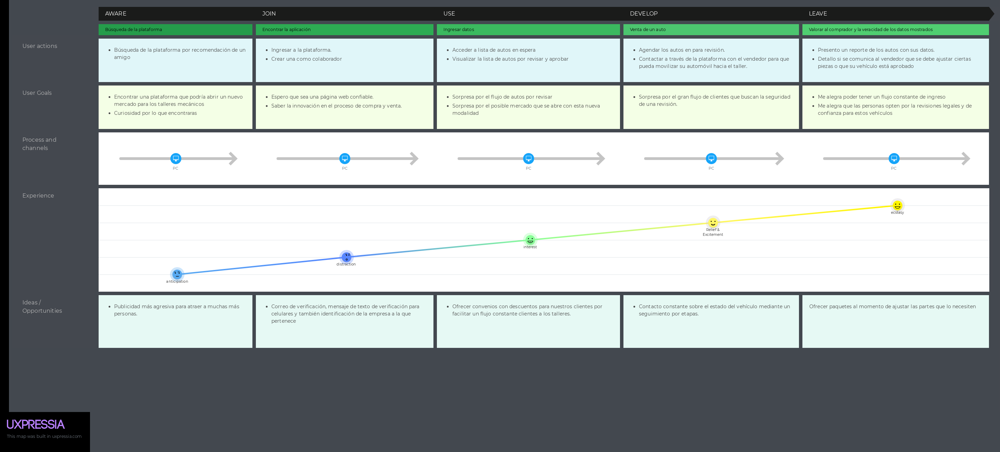
<br><br><br><br><br><br><br><br><br><br><br><br><br><br><br><br><br><br><br><br>

## 2.3.4. Empathy Mapping.

### Compradores de segunda mano:


<br><br><br><br><br><br>

### Vendedores de segunda mano:

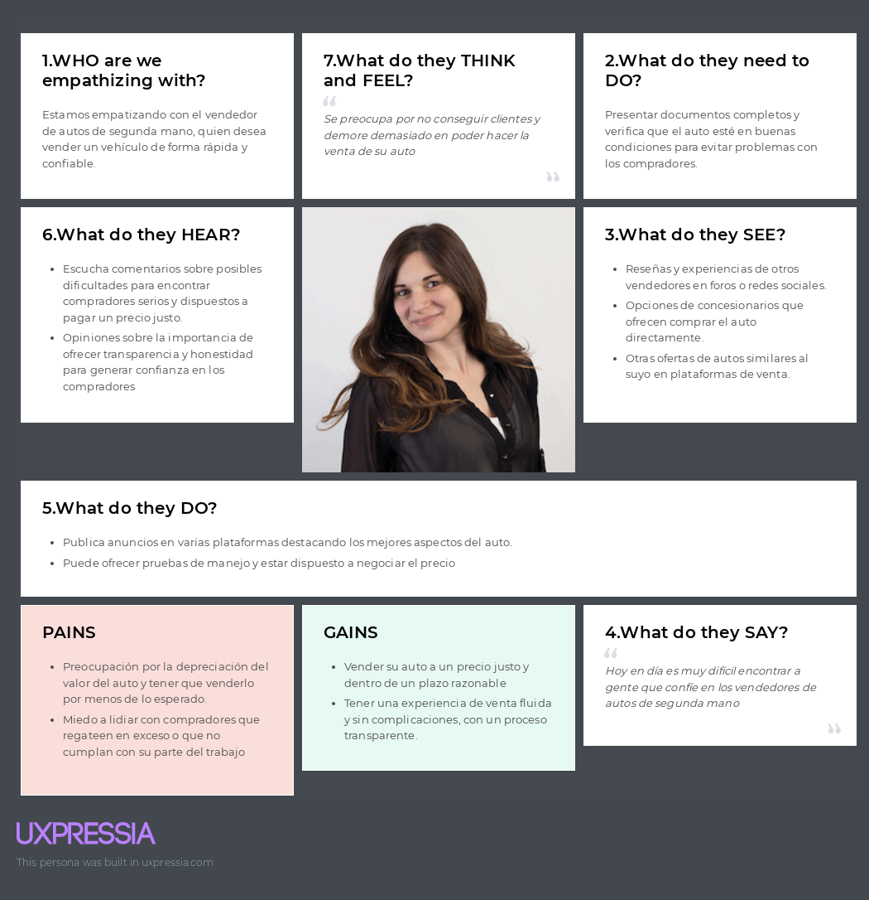

<br><br><br><br><br><br><br><br><br><br><br><br><br>

### Talleres mecánicos:


<br><br><br><br><br><br><br><br><br>

## 2.3.5. As-is Scenario Mapping

### Segmento Objetivo #1: Compradores de autos de segunda mano (25-45 años)


### Segmento Objetivo #2: Vendedores de autos de segunda mano (25-55 años)


[LINK DEL MIRO](https://miro.com/app/board/uXjVMm70eUI=/?share_link_id=313743584808)
<br><br>

## 2.4 Ubiquitous Language

1. **Comprador:** Persona que está interesada en adquirir un auto de segunda mano.

2. **Vendedor:** Persona que ofrece su auto para la venta en la plataforma.

3. **Auto Verificado:** Vehículo que ha pasado por una inspección técnica realizada por un taller mecánico asociado.

4. **Taller Mecánico:** Entidad o empresa encargada de revisar y certificar el estado de los autos listados en la plataforma.

5. **Transacción Segura:** Proceso de compra-venta en el que se utiliza el sistema de pagos de la plataforma para asegurar que ambas partes cumplan con sus compromisos.

6. **Anuncio Destacado:** Publicación que aparece en la parte superior de los resultados de búsqueda para mejorar la visibilidad del auto que está en venta.

7. **Inspección Técnica:** Proceso mediante el cual un taller verifica el estado del auto en términos de mecánica, carrocería, y documentación.

8. **Historial del Auto:** Registro de los eventos relevantes asociados al vehículo, como reparaciones, multas o accidentes anteriores.

9. **Kilometraje:** Distancia total recorrida por el auto, un indicador clave del desgaste del vehículo.

# Chapter III: Requirements Specifications

## 3.1. To-Be Scenario Mapping

En esta sección, el equipo presenta el To-Be Scenario Mapping para Car2Go, que ilustra las mejoras propuestas en el proceso de compra y venta de autos de segunda mano a través de nuestra plataforma. Este proceso comenzó con una fase de preparación, seguida de una lluvia de ideas individual para identificar mejoras potenciales. Posteriormente, se llevó a cabo una revisión y se identificaron las fases relevantes, que se organizaron en las columnas de Phases, Doing, Thinking y Feeling en la herramienta de mapeo seleccionada. El To-Be Scenario Mapping se comparó con el As-Is Scenario Mapping para identificar y resaltar los cambios propuestos que optimizarán la experiencia del usuario. La captura del mapeo realizado proporciona una visión clara de cómo estas mejoras impactarán en las diferentes etapas del proceso, abordando las necesidades y expectativas de cada User Persona y contribuyendo a nuestra misión de facilitar un proceso de compra y venta intuitivo, seguro y eficiente.

**Segmento objetivo: Compradores de Autos Usados**

_Imagen (N°10). Elaboración propia. Realizado en [Miro](https://miro.com/app/board/uXjVKiyuKZA=/?share_link_id=172702013556). https://miro.com/app/board/uXjVKiyuKZA=/?share_link_id=172702013556_

**Segmento objetivo: Vendedores de Autos Usados**

_Imagen (N°11). Elaboración propia. Realizado en [Miro](https://miro.com/app/board/uXjVKiyuKZA=/?share_link_id=172702013556). https://miro.com/app/board/uXjVKiyuKZA=/?share_link_id=172702013556_

**Segmento objetivo: Talleres Técnicos**

_Imagen (N°12). Elaboración propia. Realizado en [Miro](https://miro.com/app/board/uXjVKiyuKZA=/?share_link_id=172702013556). https://miro.com/app/board/uXjVKiyuKZA=/?share_link_id=172702013556_

## 3.2. User Stories

**Cuadro de Epics**

| Epic ID | Título                                | Descripción                                                                                                                                                                                                            |
| ------- | ------------------------------------- | ---------------------------------------------------------------------------------------------------------------------------------------------------------------------------------------------------------------------- |
| EP01    | Plataforma de Compra y Venta de Autos | Implementar la plataforma principal para la compra y venta de autos usados, facilitando la interacción entre compradores y vendedores.                                                                                 |
| EP02    | Certificación y Verificación de Autos | Implementar el proceso para la certificación y verificación de autos a través de talleres técnicos, asegurando la calidad de los vehículos.                                                                            |
| EP03    | Seguridad en la Transacción           | Garantizar que las transacciones de compra y venta sean seguras y confiables mediante sistemas de pago y confirmación de transacciones.                                                                                |
| EP04    | Plataforma de Talleres Técnicos       | Facilitar la integración y gestión de talleres técnicos en la plataforma para ofrecer servicios de certificación y verificación.                                                                                       |
| EP05    | Soporte y Atención al Cliente         | Implementar un sistema de soporte y atención al cliente para resolver dudas y problemas de los usuarios.                                                                                                               |
| EP06    | Experiencia de Usuario en Móvil       | Optimizar la plataforma para ofrecer una experiencia de usuario fluida y eficiente en dispositivos móviles.                                                                                                            |
| EP07    | Análisis y Reportes                   | Implementar herramientas para el análisis y reporte de datos de transacciones y uso de la plataforma.                                                                                                                  |
| EP08    | Gestión de Publicidad y Promociones   | Implementar funcionalidades para que los vendedores puedan promocionar sus autos mediante anuncios destacados, y para que la plataforma pueda ofrecer promociones y campañas publicitarias a compradores y vendedores. |

**Cuadro de User Stories**

| Epic / Story ID | Título                                           | Descripción                                                                                                                                               | Criterios de Aceptación                                                                                                                                                                                                                                                                                                                                                                                                                                            | Relacionado con (Epic ID) |
| --------------- | ------------------------------------------------ | --------------------------------------------------------------------------------------------------------------------------------------------------------- | ------------------------------------------------------------------------------------------------------------------------------------------------------------------------------------------------------------------------------------------------------------------------------------------------------------------------------------------------------------------------------------------------------------------------------------------------------------------ | ------------------------- |
| US-01           | Registro de Usuario                              | Como visitante quiero registrarme en la plataforma para poder comprar o vender autos.                                                                     | **Escenario: Registro exitoso de usuario**<br>Given El visitante está en la página de registro<br>When Ingresa datos válidos<br>Then El sistema debe crear una cuenta y redirigir al usuario al perfil.<br><br>**Escenario: Registro con datos inválidos**<br>Given El visitante está en la página de registro<br>When Ingresa datos inválidos<br>Then El sistema debe mostrar un mensaje de error.                                                                | EP01                      |
| US-02           | Búsqueda de Autos                                | Como comprador quiero buscar autos usados por diferentes criterios para encontrar opciones adecuadas.                                                     | **Escenario: Búsqueda exitosa de autos**<br>Given El comprador está en la página de búsqueda<br>When Aplica filtros y hace una búsqueda<br>Then Se deben mostrar los autos que cumplen con los criterios.<br><br>**Escenario: No hay autos encontrados**<br>Given El comprador está en la página de búsqueda<br>When No hay autos que cumplan con los criterios<br>Then El sistema debe mostrar un mensaje indicando que no se encontraron resultados.             | EP01                      |
| US-03           | Listado de Autos                                 | Como vendedor quiero listar mi auto para que los compradores puedan verlo y contactarme.                                                                  | **Escenario: Listado exitoso de un auto**<br>Given El vendedor está en la página de listado<br>When Completa el formulario y envía la información<br>Then El auto debe aparecer en el listado de autos disponibles.<br><br>**Escenario: Listado fallido por información incompleta**<br>Given El vendedor está en la página de listado<br>When Envía información incompleta<br>Then El sistema debe mostrar un mensaje de error y no listar el auto.               | EP01                      |
| US-04           | Edición de Listado de Autos                      | Como vendedor quiero poder editar el listado de mi auto para actualizar la información si es necesario.                                                   | **Escenario: Edición exitosa del listado**<br>Given El vendedor está en su listado de autos<br>When Edita la información y guarda los cambios<br>Then El listado debe actualizarse con la nueva información.<br><br>**Escenario: Edición fallida por información inválida**<br>Given El vendedor está en su listado de autos<br>When Intenta editar información inválida<br>Then El sistema debe mostrar un mensaje de error.                                      | EP01                      |
| US-05           | Eliminación de Listado de Autos                  | Como vendedor quiero eliminar el listado de mi auto si decido no venderlo.                                                                                | **Escenario: Eliminación exitosa de un listado**<br>Given El vendedor está en la página de gestión de listados<br>When Selecciona eliminar un listado<br>Then El auto debe ser removido de la plataforma.<br><br>**Escenario: Eliminación fallida por auto no existente**<br>Given El vendedor está en la página de gestión de listados<br>When Intenta eliminar un auto que no existe<br>Then El sistema debe mostrar un mensaje de error.                        | EP01                      |
| US-06           | Ver Detalles del Auto                            | Como comprador quiero ver los detalles completos de un auto al hacer clic en él.                                                                          | **Escenario: Visualización exitosa de detalles**<br>Given El comprador está en la lista de autos<br>When Hace clic en un auto<br>Then Se deben mostrar los detalles completos del auto en una nueva página.<br><br>**Escenario: Visualización fallida por auto no disponible**<br>Given El comprador hace clic en un auto que ya no está disponible<br>Then El sistema debe mostrar un mensaje indicando que el auto no está disponible.                           | EP01                      |
| US-07           | Comparar Autos                                   | Como comprador quiero comparar diferentes autos para tomar una decisión informada.                                                                        | **Escenario: Comparación exitosa de autos**<br>Given El comprador está en la página de comparación<br>When Selecciona varios autos<br>Then Se debe mostrar una tabla comparativa con las características clave de cada auto.<br><br>**Escenario: Comparación fallida por selección insuficiente**<br>Given El comprador intenta comparar menos de dos autos<br>Then El sistema debe mostrar un mensaje de error indicando que se necesitan al menos dos autos.     | EP01                      |
| US-08           | Guardar Autos Favoritos                          | Como comprador quiero guardar autos favoritos para revisarlos más tarde.                                                                                  | **Escenario: Guardado exitoso de un auto favorito**<br>Given El comprador está viendo un auto<br>When Selecciona "guardar como favorito"<br>Then El auto debe ser añadido a su lista de favoritos accesible desde su perfil.<br><br>**Escenario: Guardado fallido por auto ya en favoritos**<br>Given El comprador intenta guardar un auto que ya está en su lista de favoritos<br>Then El sistema debe mostrar un mensaje indicando que el auto ya está guardado. | EP01                      |
| US-09           | Notificaciones de Nuevos Listados                | Como comprador quiero recibir notificaciones cuando se listan autos que coinciden con mis criterios de búsqueda.                                          | **Escenario: Recepción exitosa de notificaciones**<br>Given El comprador ha guardado sus criterios de búsqueda<br>When Se listan nuevos autos que coinciden<br>Then Debe recibir una notificación por correo electrónico o en la plataforma.<br><br>**Escenario: No hay criterios guardados**<br>Given El comprador no ha guardado ningún criterio de búsqueda<br>Then El sistema debe mostrar un mensaje indicando que no hay criterios guardados.                | EP01                      |
| US-10           | Notificación de Actualización de Estado del Auto | Como comprador quiero recibir notificaciones cuando el estado del auto en el que estoy interesado cambia, como si se vende o se actualiza la información. | **Escenario: Recepción de notificación de cambio de estado**<br>Given El comprador ha mostrado interés en un auto<br>When El estado del auto cambia (se vende, se actualiza, etc.)<br>Then El sistema debe enviar una notificación al comprador sobre el cambio.<br><br>**Escenario: No se envían notificaciones a compradores no interesados**<br>Given El comprador no está interesado en el auto<br>Then El sistema no debe enviar notificaciones relacionadas. | EP01                      |
| US-11           | Solicitud de Certificación                       | Como vendedor quiero solicitar una certificación para mi auto a un taller técnico.                                                                        | **Escenario: Solicitud exitosa de certificación**<br>Given El vendedor está en la página de certificación<br>When Envía una solicitud<br>Then El sistema debe notificar al taller técnico y al vendedor.<br><br>**Escenario: Solicitud fallida por campos incompletos**<br>Given El vendedor no completa todos los campos necesarios<br>When Intenta enviar la solicitud<br>Then El sistema debe mostrar un mensaje de error.                                      | EP02                      |
| US-12           | Informe de Certificación                         | Como comprador quiero ver el informe de certificación del auto para asegurarme de su estado.                                                              | **Escenario: Visualización exitosa del informe de certificación**<br>Given El comprador está en la página del auto<br>When Selecciona ver el informe de certificación<br>Then El sistema debe mostrar el informe generado por el taller técnico.<br><br>**Escenario: Informe no disponible**<br>Given El informe de certificación no está disponible<br>Then El sistema debe mostrar un mensaje indicando que no se puede mostrar el informe.                      | EP02                      |
| US-13           | Solicitud de Inspección de Auto                  | Como vendedor quiero solicitar una inspección del auto para asegurar su calidad antes de listar.                                                          | **Escenario: Solicitud exitosa de inspección**<br>Given El vendedor está en la página de inspección<br>When Envía una solicitud de inspección<br>Then El taller técnico debe recibir una notificación para coordinar la inspección.<br><br>**Escenario: Solicitud fallida por información insuficiente**<br>Given El vendedor no proporciona información suficiente<br>Then El sistema debe mostrar un mensaje de error.                                           | EP02                      |
| US-14           | Confirmación de Inspección                       | Como vendedor quiero recibir una confirmación de la inspección para saber que está programada.                                                            | **Escenario: Recepción de confirmación de inspección**<br>Given El taller técnico ha programado una inspección<br>When Confirma la cita<br>Then El vendedor debe recibir una notificación con los detalles de la inspección.<br><br>**Escenario: No se envía notificación si la inspección no está programada**<br>Given La inspección no se ha programado<br>Then El vendedor no debe recibir notificación.                                                       | EP02                      |
| US-15           | Actualización del Estado de Inspección           | Como vendedor quiero recibir actualizaciones sobre el estado de la inspección de mi auto.                                                                 | **Escenario: Recepción de actualización sobre el estado de inspección**<br>Given La inspección está en progreso<br>When El taller técnico actualiza el estado<br>Then El vendedor debe recibir una notificación con la actualización.<br><br>**Escenario: No se envían actualizaciones si no hay inspección programada**<br>Given El vendedor no tiene una inspección programada<br>Then No debe recibir actualizaciones.                                          | EP02                      |
| US-16           | Sistema de Pago Seguro                           | Como comprador quiero un sistema de pago seguro para realizar mis transacciones.                                                                          | **Escenario: Pago exitoso**<br>Given El comprador está en la página de pago<br>When Introduce los datos de pago y confirma<br>Then El sistema debe procesar el pago y enviar una confirmación.<br><br>**Escenario: Pago fallido por datos inválidos**<br>Given El comprador introduce datos de pago inválidos<br>Then El sistema debe mostrar un mensaje de error.                                                                                                 | EP03                      |
| US-17           | Confirmación de Transacción                      | Como vendedor quiero recibir una confirmación de la transacción una vez que se complete la venta.                                                         | **Escenario: Recepción de confirmación de venta**<br>Given La venta ha sido completada<br>When El sistema procesa el pago<br>Then El vendedor debe recibir una confirmación por correo electrónico y en su perfil.<br><br>**Escenario: Transacción fallida**<br>Given La transacción falla<br>Then El vendedor debe recibir un mensaje de error indicando la falla.                                                                                                | EP03                      |
| US-18           | Historial de Transacciones                       | Como usuario quiero acceder a un historial de todas mis transacciones realizadas en la plataforma.                                                        | **Escenario: Visualización del historial de transacciones**<br>Given El usuario está en su perfil<br>When Accede a la sección de historial<br>Then Debe ver una lista de todas las transacciones realizadas con detalles.<br><br>**Escenario: No hay transacciones realizadas**<br>Given El usuario no ha realizado transacciones<br>Then El sistema debe mostrar un mensaje indicando que no hay transacciones.                                                   | EP03                      |
| US-19           | Reembolso de Transacción                         | Como comprador quiero solicitar un reembolso si no estoy satisfecho con la compra.                                                                        | **Escenario: Solicitud exitosa de reembolso**<br>Given El comprador está en la página de historial de transacciones<br>When Solicita un reembolso<br>Then El sistema debe procesar la solicitud y notificar al comprador del estado.<br><br>**Escenario: Solicitud fallida por falta de derecho a reembolso**<br>Given El comprador no tiene derecho a reembolso<br>Then El sistema debe mostrar un mensaje de error.                                              | EP03                      |
| US-20           | Registro de Taller Técnico                       | Como taller técnico quiero registrarme en la plataforma para ofrecer servicios de certificación.                                                          | **Escenario: Registro exitoso del taller**<br>Given El taller está en la página de registro<br>When Completa el formulario y envía la información<br>Then El taller debe aparecer en la lista de talleres disponibles.<br><br>**Escenario: Registro fallido por información incompleta**<br>Given El taller no completa todos los campos requeridos<br>Then El sistema debe mostrar un mensaje de error.                                                           | EP04                      |
| US-21           | Gestión de Solicitudes de Certificación          | Como taller técnico quiero gestionar solicitudes de certificación para coordinar inspecciones.                                                            | Dado que el taller está en la página de gestión de solicitudes,<br>cuando recibe una nueva solicitud,<br>entonces debe poder aceptarla o rechazarla y coordinar una inspección.                                                                                                                                                                                                                                                                                    | EP04                      |
| US-22           | Actualización de Información del Taller          | Como taller técnico quiero actualizar mi información de perfil en la plataforma.                                                                          | Dado que el taller técnico está en la página de perfil,<br>cuando actualiza la información y guarda los cambios,<br>entonces el perfil debe reflejar la nueva información.                                                                                                                                                                                                                                                                                         | EP04                      |
| US-23           | Revisión de Certificaciones                      | Como taller técnico quiero revisar todas las certificaciones realizadas para llevar un registro.                                                          | Dado que el taller está en la página de certificaciones,<br>cuando revisa la lista,<br>entonces debe ver todas las certificaciones realizadas con detalles y estado.                                                                                                                                                                                                                                                                                               | EP04                      |
| US-24           | Sistema de Soporte en Vivo                       | Como usuario quiero tener acceso a soporte en vivo para resolver problemas o dudas de inmediato.                                                          | Dado que el usuario está en la plataforma,<br>cuando accede a la función de soporte en vivo,<br>entonces debe poder iniciar una conversación con un agente de soporte.                                                                                                                                                                                                                                                                                             | EP05                      |
| US-25           | Centro de Ayuda y FAQ                            | Como usuario quiero acceder a un centro de ayuda y FAQ para encontrar respuestas a mis preguntas comunes.                                                 | Dado que el usuario está en la página de ayuda,<br>cuando busca en el centro de ayuda,<br>entonces debe encontrar respuestas a preguntas frecuentes y soluciones a problemas.                                                                                                                                                                                                                                                                                      | EP05                      |
| US-26           | Envío de Consultas por Correo Electrónico        | Como usuario quiero enviar consultas por correo electrónico para recibir asistencia cuando no puedo usar el chat en vivo.                                 | Dado que el usuario está en la página de soporte,<br>cuando envía una consulta por correo electrónico,<br>entonces el sistema debe confirmar la recepción y dar un tiempo estimado de respuesta.                                                                                                                                                                                                                                                                   | EP05                      |
| US-27           | Acceso al almacenamiento del dispositivo         | Como vendedor, quiero subir fotos de mi auto desde la galería para mostrar el vehículo correctamente.                                                     | Dado que el vendedor está en la plataforma desde un dispositivo móvil,<br>cuando accede a la galería,<br>entonces debe poder seleccionar y subir imágenes del vehículo.                                                                                                                                                                                                                                                                                            | EP06                      |
| US-28           | Acceso a la cámara del dispositivo               | Como vendedor, quiero poder capturar imágenes directamente desde la cámara de mi dispositivo móvil para mostrar el vehículo correctamente.                | Dado que el vendedor está en la plataforma desde un dispositivo móvil,<br>cuando accede a la cámara,<br>entonces debe poder tomar fotos y subirlas directamente.                                                                                                                                                                                                                                                                                                   | EP06                      |
| US-29           | Optimización para Móviles                        | Como usuario quiero que la plataforma esté optimizada para dispositivos móviles para tener una experiencia de usuario fluida.                             | Dado que el usuario accede a la plataforma desde un dispositivo móvil,<br>entonces la interfaz debe adaptarse y funcionar correctamente en pantallas pequeñas.                                                                                                                                                                                                                                                                                                     | EP06                      |
| US-30           | Pruebas de Usabilidad en Móviles                 | Como desarrollador quiero realizar pruebas de usabilidad en móviles para asegurar una experiencia de usuario eficiente.                                   | Dado que el desarrollador está realizando pruebas,<br>cuando evalúa la plataforma en diferentes dispositivos móviles,<br>entonces debe identificar y corregir problemas de usabilidad.                                                                                                                                                                                                                                                                             | EP06                      |
| US-31           | Reportes de Transacciones                        | Como administrador quiero generar reportes de transacciones para analizar el rendimiento de la plataforma.                                                | Dado que el administrador está en la página de reportes,<br>cuando solicita un reporte,<br>entonces debe recibir un archivo con los datos de transacciones en el formato solicitado.                                                                                                                                                                                                                                                                               | EP07                      |
| US-32           | Análisis de Datos de Uso                         | Como administrador quiero analizar datos de uso de la plataforma para identificar tendencias y oportunidades de mejora.                                   | Dado que el administrador está en la página de análisis,<br>cuando selecciona el rango de fechas y los parámetros de análisis,<br>entonces debe recibir gráficos y estadísticas detalladas.                                                                                                                                                                                                                                                                        | EP07                      |
| US-33           | Publicar Anuncio Destacado                       | Como vendedor quiero poder publicar un anuncio destacado para que mi auto tenga mayor visibilidad.                                                        | Dado que el vendedor está en la página de listado,<br>cuando selecciona "Anuncio Destacado" y paga,<br>entonces el auto debe aparecer en una sección destacada de la plataforma.                                                                                                                                                                                                                                                                                   | EP08                      |
| US-34           | Configuración de Duración del Anuncio Destacado  | Como vendedor quiero elegir la duración de tiempo durante la cual mi anuncio estará destacado.                                                            | Dado que el vendedor está configurando el anuncio destacado,<br>cuando selecciona la duración y paga,<br>entonces el sistema debe mostrar el anuncio en la sección destacada durante el tiempo elegido.                                                                                                                                                                                                                                                            | EP08                      |
| US-35           | Crear Promociones para Compradores               | Como administrador quiero crear promociones y descuentos para atraer compradores a la plataforma.                                                         | Dado que el administrador está en la página de promociones,<br>cuando crea una nueva promoción,<br>entonces el sistema debe aplicarla a los autos correspondientes y notificar a los compradores.                                                                                                                                                                                                                                                                  | EP08                      |
| US-36           | Notificaciones de Promociones                    | Como comprador quiero recibir notificaciones sobre nuevas promociones y descuentos disponibles.                                                           | Dado que el comprador ha optado por recibir notificaciones,<br>cuando se crea una nueva promoción,<br>entonces el sistema debe enviar una notificación por correo electrónico o en la plataforma.                                                                                                                                                                                                                                                                  | EP08                      |
| US-37           | Gestión de Promociones para Vendedores           | Como vendedor quiero gestionar mis propias promociones para aumentar la visibilidad de mis autos.                                                         | Dado que el vendedor está en la página de promociones,<br>cuando crea o actualiza una promoción,<br>entonces el sistema debe reflejar los cambios en la visibilidad de su anuncio.                                                                                                                                                                                                                                                                                 | EP08                      |
| US-38           | Reportes de Efectividad de Promociones           | Como administrador quiero ver reportes sobre la efectividad de las promociones para analizar su impacto.                                                  | Dado que el administrador está en la página de reportes de promociones,<br>cuando solicita un reporte,<br>entonces debe recibir información detallada sobre la efectividad de las promociones en términos de vistas y conversiones.                                                                                                                                                                                                                                | EP08                      |
| US-39           | Configuración de Anuncios Publicitarios          | Como administrador quiero configurar anuncios publicitarios en la plataforma para monetizar el tráfico.                                                   | Dado que el administrador está en la página de configuración de anuncios,<br>cuando establece parámetros y carga anuncios,<br>entonces estos deben mostrarse en áreas específicas de la plataforma.                                                                                                                                                                                                                                                                | EP08                      |

**Technical Stories**

| Technical Story ID | User Story ID | Título                                                             | Descripción                                                                                                                                                           | Escenario                                                                                                                                                                                                                                                                                                                                                                                                                                                                                                                                                                                                                                                                                                                                                              | Epic ID |
| ------------------ | ------------- | ------------------------------------------------------------------ | --------------------------------------------------------------------------------------------------------------------------------------------------------------------- | ---------------------------------------------------------------------------------------------------------------------------------------------------------------------------------------------------------------------------------------------------------------------------------------------------------------------------------------------------------------------------------------------------------------------------------------------------------------------------------------------------------------------------------------------------------------------------------------------------------------------------------------------------------------------------------------------------------------------------------------------------------------------- | ------- |
| TS-01              | US-01         | Registro de Usuario a través de la API                             | Como desarrollador quiero registrar usuarios a través de la API para permitirles crear cuentas en la plataforma.                                                      | **Escenario: Registro exitoso de usuario**<br>Given El Endpoint "/api/v1/users/sign-up" está disponible<br>When Se envía una POST Request con datos válidos de usuario<br>Then Se recibe una respuesta con Status 201<br>And La Respuesta incluye un ID de usuario y detalles de la cuenta.<br><br>**Escenario: Registro con datos inválidos**<br>Given El Endpoint "/api/v1/users/sign-up" está disponible<br>When Se envía una POST Request con datos inválidos<br>Then Se recibe una respuesta con Status 400<br>And La Respuesta incluye un mensaje de error detallado.                                                                                                                                                                                            | EP01    |
| TS-02              | US-02         | Búsqueda de Autos a través de la API                               | Como desarrollador quiero implementar la búsqueda de autos a través de la API para que los compradores puedan filtrar opciones.                                       | **Escenario: Búsqueda de autos con filtros aplicados**<br>Given El Endpoint "/api/v1/vehicle/all" está disponible<br>When Se envía una GET Request con filtros como marca y modelo<br>Then Se recibe una respuesta con Status 200<br>And La Respuesta incluye una lista de autos que coinciden con los filtros.<br><br>**Escenario: Búsqueda sin resultados**<br>Given El Endpoint "/api/v1/vehicle/all" está disponible<br>When Se envía una GET Request con filtros que no coinciden con ningún auto<br>Then Se recibe una respuesta con Status 200<br>And La Respuesta incluye una lista vacía.                                                                                                                                                                     | EP01    |
| TS-03              | US-03         | Listado de Autos a través de la API                                | Como desarrollador quiero listar autos a través de la API para permitir que los compradores vean los autos disponibles.                                               | **Escenario: Listar un auto correctamente**<br>Given El Endpoint "/api/v1/vehicle" está disponible<br>When Se envía una GET Request al endpoint<br>Then Se recibe una respuesta con Status 200<br>And La Respuesta incluye una lista de autos disponibles con detalles como nombre, precio y ubicación.<br><br>**Escenario: Listar autos con parámetros de búsqueda**<br>Given El Endpoint "/api/v1/vehicle" está disponible<br>When Se envía una GET Request con parámetros de búsqueda como marca, modelo y año<br>Then Se recibe una respuesta con Status 200<br>And La Respuesta incluye una lista de autos que coinciden con los parámetros de búsqueda.<br>And Los detalles de cada auto incluyen nombre, precio, y ubicación.                                   | EP01    |
| TS-04              | US-04         | Edición de Listado de Autos a través de la API                     | Como desarrollador quiero permitir la edición de los listados de autos a través de la API para que los vendedores puedan actualizar la información de sus autos.      | **Escenario: Editar un listado de auto existente**<br>Given El Endpoint "/api/v1/vehicle/{id}" está disponible<br>When Se envía una PUT Request con el ID del auto y los nuevos detalles<br>Then Se recibe una respuesta con Status 200<br>And La Respuesta incluye los detalles actualizados del auto.<br><br>**Escenario: Editar un listado con datos inválidos**<br>Given El Endpoint "/api/v1/vehicle/{id}" está disponible<br>When Se envía una PUT Request con el ID del auto y datos inválidos<br>Then Se recibe una respuesta con Status 400<br>And La Respuesta incluye un mensaje de error detallado sobre los datos inválidos.                                                                                                                              | EP01    |
| TS-05              | US-05         | Eliminación de Listado de Autos a través de la API                 | Como desarrollador quiero permitir la eliminación de listados de autos a través de la API para que los vendedores puedan retirar sus autos del mercado.               | **Escenario: Eliminar un listado de auto correctamente**<br>Given El Endpoint "/api/v1/vehicle/{id}" está disponible<br>When Se envía una DELETE Request con el ID del auto<br>Then Se recibe una respuesta con Status 204<br>And El auto debe ser removido de la lista de autos disponibles.<br><br>**Escenario: Intento de eliminar un auto inexistente**<br>Given El Endpoint "/api/v1/vehicle/{id}" está disponible<br>When Se envía una DELETE Request con un ID de auto que no existe<br>Then Se recibe una respuesta con Status 404<br>And La Respuesta incluye un mensaje de error indicando que el auto no fue encontrado.                                                                                                                                    | EP01    |
| TS-06              | US-06         | Ver Detalles del Auto a través de la API                           | Como desarrollador quiero mostrar los detalles completos de un auto a través de la API para que los compradores puedan ver información detallada.                     | **Escenario: Ver detalles de un auto**<br>Given El Endpoint "/api/v1/vehicle/{id}" está disponible<br>When Se envía una GET Request con el ID del auto<br>Then Se recibe una respuesta con Status 200<br>And La Respuesta incluye todos los detalles del auto como nombre, precio, y características.<br><br>**Escenario: Ver detalles de un auto que no existe**<br>Given El Endpoint "/api/v1/vehicle/{id}" está disponible<br>When Se envía una GET Request con un ID de auto que no existe<br>Then Se recibe una respuesta con Status 404<br>And La Respuesta incluye un mensaje de error indicando que el auto no fue encontrado.                                                                                                                                 | EP01    |
| TS-07              | US-08         | Guardar Autos Favoritos a través de la API                         | Como desarrollador quiero permitir a los compradores guardar autos favoritos a través de la API para que puedan revisarlos más tarde.                                 | **Escenario: Guardar un auto como favorito**<br>Given El Endpoint "/api/v1/users/{userId}/favorites" está disponible<br>When Se envía una POST Request con el ID del auto a guardar<br>Then Se recibe una respuesta con Status 200<br>And La Respuesta confirma que el auto ha sido añadido a la lista de favoritos del usuario.<br><br>**Escenario: Guardar un auto ya en favoritos**<br>Given El Endpoint "/api/v1/users/{userId}/favorites" está disponible<br>When Se envía una POST Request con un ID de auto que ya está en la lista de favoritos<br>Then Se recibe una respuesta con Status 200<br>And La Respuesta confirma que el auto ya está en la lista de favoritos del usuario.                                                                          | EP01    |
| TS-08              | US-09         | Nuevos Listados a través de la API                                 | Como desarrollador quiero que los compradores visualicen los vehiculos más recientes en el Home.                                                                      | **Escenario: Enviar notificación de nuevo listado**<br>Given El Endpoint "/api/v1/notifications/new-listings" está disponible<br>When Se envía una POST Request con los criterios de búsqueda del comprador<br>Then Se recibe una respuesta con Status 200<br>And El comprador debe recibir una notificación por correo electrónico o en la plataforma.<br><br>**Escenario: No enviar notificación si no hay nuevos listados**<br>Given El Endpoint "/api/v1/notifications/new-listings" está disponible<br>When Se envía una POST Request con criterios de búsqueda y no hay nuevos listados<br>Then Se recibe una respuesta con Status 200<br>And El comprador no recibe notificaciones.                                                                             | EP01    |
| TS-09              | US-11         | Solicitud de Certificación a través de la API                      | Como desarrollador quiero permitir a los vendedores solicitar certificación para sus autos a través de la API.                                                        | **Escenario: Solicitar certificación para un auto**<br>Given El Endpoint "/api/v1/certifications/request" está disponible<br>When Se envía una POST Request con el ID del auto y los detalles de certificación<br>Then Se recibe una respuesta con Status 201<br>And El taller técnico y el vendedor deben recibir una notificación de la solicitud.<br><br>**Escenario: Solicitud de certificación con datos inválidos**<br>Given El Endpoint "/api/v1/certifications/request" está disponible<br>When Se envía una POST Request con datos inválidos<br>Then Se recibe una respuesta con Status 400<br>And La Respuesta incluye un mensaje de error detallado sobre los datos inválidos.                                                                              | EP02    |
| TS-10              | US-12         | Ver Informe de Certificación a través de la API                    | Como desarrollador quiero permitir a los compradores ver el informe de certificación del auto a través de la API para asegurar la calidad del vehículo.               | **Escenario: Ver informe de certificación**<br>Given El Endpoint "/api/v1/vehicle/{id}/certification-report" está disponible<br>When Se envía una GET Request con el ID del auto<br>Then Se recibe una respuesta con Status 200<br>And La Respuesta incluye el informe de certificación generado por el taller técnico.<br><br>**Escenario: Ver informe para un auto sin certificación**<br>Given El Endpoint "/api/v1/vehicle/{id}/certification-report" está disponible<br>When Se envía una GET Request con el ID de un auto sin certificación<br>Then Se recibe una respuesta con Status 404<br>And La Respuesta incluye un mensaje de error indicando que no se encontró el informe.                                                                              | EP02    |
| TS-11              | US-13         | Solicitud de Inspección de Auto a través de la API                 | Como desarrollador quiero permitir a los vendedores solicitar una inspección de sus autos a través de la API para asegurar su calidad antes de listar.                | **Escenario: Solicitar inspección para un auto**<br>Given El Endpoint "/api/v1/inspections/request" está disponible<br>When Se envía una POST Request con el ID del auto y detalles de la inspección<br>Then Se recibe una respuesta con Status 201<br>And El taller técnico debe recibir una notificación de la solicitud de inspección.<br><br>**Escenario: Solicitud de inspección con datos inválidos**<br>Given El Endpoint "/api/v1/inspections/request" está disponible<br>When Se envía una POST Request con datos inválidos<br>Then Se recibe una respuesta con Status 400<br>And La Respuesta incluye un mensaje de error detallado sobre los datos inválidos.                                                                                               | EP02    |
| TS-12              | US-14         | Confirmación de Inspección a través de la API                      | Como desarrollador quiero permitir a los talleres técnicos confirmar las citas de inspección a través de la API para que los vendedores reciban la confirmación.      | **Escenario: Confirmar una inspección**<br>Given El Endpoint "/api/v1/inspections/{id}/confirm" está disponible<br>When Se envía una PUT Request con el ID de la inspección y los detalles de confirmación<br>Then Se recibe una respuesta con Status 200<br>And El vendedor debe recibir una notificación con los detalles de la inspección confirmada.<br><br>**Escenario: Confirmar una inspección que no existe**<br>Given El Endpoint "/api/v1/inspections/{id}/confirm" está disponible<br>When Se envía una PUT Request con un ID de inspección que no existe<br>Then Se recibe una respuesta con Status 404<br>And La Respuesta incluye un mensaje de error indicando que la inspección no fue encontrada.                                                     | EP02    |
| TS-13              | US-15         | Actualización del Estado de Inspección a través de la API          | Como desarrollador quiero permitir a los talleres técnicos actualizar el estado de la inspección a través de la API para que los vendedores reciban actualizaciones.  | **Escenario: Actualizar el estado de la inspección**<br>Given El Endpoint "/api/v1/inspections/{id}/status" está disponible<br>When Se envía una PUT Request con el ID de la inspección y el nuevo estado<br>Then Se recibe una respuesta con Status 200<br>And El vendedor debe recibir una notificación con la actualización del estado de la inspección.<br><br>**Escenario: Actualizar estado para una inspección que no existe**<br>Given El Endpoint "/api/v1/inspections/{id}/status" está disponible<br>When Se envía una PUT Request con un ID de inspección que no existe<br>Then Se recibe una respuesta con Status 404<br>And La Respuesta incluye un mensaje de error indicando que la inspección no fue encontrada.                                      | EP02    |
| TS-14              | US-16         | Sistema de Pago Seguro a través de la API                          | Como desarrollador quiero implementar un sistema de pago seguro a través de la API para que los compradores puedan completar sus compras de manera segura.            | **Escenario: Procesar un pago exitoso**<br>Given El Endpoint "/api/v1/payments" está disponible<br>When Se envía una POST Request con los datos de pago válidos<br>Then Se recibe una respuesta con Status 200<br>And La Respuesta incluye una confirmación de pago y detalles de la transacción.<br><br>**Escenario: Procesar un pago con datos inválidos**<br>Given El Endpoint "/api/v1/payments" está disponible<br>When Se envía una POST Request con datos de pago inválidos<br>Then Se recibe una respuesta con Status 400<br>And La Respuesta incluye un mensaje de error detallado sobre los datos inválidos.                                                                                                                                                 | EP03    |
| TS-15              | US-17         | Confirmación de Transacción a través de la API                     | Como desarrollador quiero enviar una confirmación de la venta al vendedor a través de la API para asegurar que la transacción fue exitosa.                            | **Escenario: Confirmar una transacción exitosa**<br>Given El Endpoint "/api/v1/transactions/{id}/confirm" está disponible<br>When Se envía una PUT Request con el ID de la transacción<br>Then Se recibe una respuesta con Status 200<br>And El vendedor debe recibir una confirmación por su perfil.<br><br>**Escenario: Confirmar una transacción que no existe**<br>Given El Endpoint "/api/v1/transactions/{id}/confirm" está disponible<br>When Se envía una PUT Request con un ID de transacción que no existe<br>Then Se recibe una respuesta con Status 404<br>And La Respuesta incluye un mensaje de error indicando que la transacción no fue encontrada.                                                                                                    | EP03    |
| TS-16              | US-18         | Historial de Transacciones a través de la API                      | Como desarrollador quiero permitir a los usuarios ver un historial de sus transacciones a través de la API para que puedan revisar sus actividades en la plataforma.  | **Escenario: Ver historial de transacciones**<br>Given El Endpoint "/api/v1/users/{userId}/transactions" está disponible<br>When Se envía una GET Request con el ID del usuario<br>Then Se recibe una respuesta con Status 200<br>And La Respuesta incluye una lista de todas las transacciones realizadas por el usuario con detalles.<br><br>**Escenario: Ver historial de transacciones para un usuario sin transacciones**<br>Given El Endpoint "/api/v1/users/{userId}/transactions" está disponible<br>When Se envía una GET Request con el ID de un usuario sin transacciones<br>Then Se recibe una respuesta con Status 200<br>And La Respuesta incluye una lista vacía.                                                                                       | EP03    |
| TS-17              | US-20         | Mensajería entre Compradores y Vendedores a través de la API       | Como desarrollador quiero implementar un sistema de mensajería entre compradores y vendedores a través de la API para facilitar la comunicación.                      | **Escenario: Enviar un mensaje**<br>Given El Endpoint "/api/v1/messages" está disponible<br>When Se envía una POST Request con los detalles del mensaje (remitente, destinatario y contenido)<br>Then Se recibe una respuesta con Status 201<br>And La Respuesta incluye una confirmación de que el mensaje fue enviado.<br><br>**Escenario: Enviar un mensaje sin contenido**<br>Given El Endpoint "/api/v1/messages" está disponible<br>When Se envía una POST Request sin contenido en el mensaje<br>Then Se recibe una respuesta con Status 400<br>And La Respuesta incluye un mensaje de error detallado sobre la falta de contenido.                                                                                                                             | EP04    |
| TS-18              | US-21         | Ver Mensajes Recibidos a través de la API                          | Como desarrollador quiero permitir a los usuarios ver los mensajes recibidos a través de la API para que puedan gestionar sus comunicaciones.                         | **Escenario: Ver mensajes recibidos**<br>Given El Endpoint "/api/v1/users/{userId}/messages" está disponible<br>When Se envía una GET Request con el ID del usuario<br>Then Se recibe una respuesta con Status 200<br>And La Respuesta incluye una lista de todos los mensajes recibidos por el usuario.<br><br>**Escenario: Ver mensajes recibidos para un usuario sin mensajes**<br>Given El Endpoint "/api/v1/users/{userId}/messages" está disponible<br>When Se envía una GET Request con el ID de un usuario sin mensajes<br>Then Se recibe una respuesta con Status 200<br>And La Respuesta incluye una lista vacía.                                                                                                                                            | EP04    |
| TS-19              | US-22         | Marcar Mensajes como Leídos a través de la API                     | Como desarrollador quiero permitir a los usuarios marcar mensajes como leídos a través de la API para gestionar la bandeja de entrada.                                | **Escenario: Marcar un mensaje como leído**<br>Given El Endpoint "/api/v1/messages/{id}/read" está disponible<br>When Se envía una PUT Request con el ID del mensaje<br>Then Se recibe una respuesta con Status 200<br>And La Respuesta confirma que el mensaje ha sido marcado como leído.<br><br>**Escenario: Marcar un mensaje como leído que no existe**<br>Given El Endpoint "/api/v1/messages/{id}/read" está disponible<br>When Se envía una PUT Request con un ID de mensaje que no existe<br>Then Se recibe una respuesta con Status 404<br>And La Respuesta incluye un mensaje de error indicando que el mensaje no fue encontrado.                                                                                                                          | EP04    |
| TS-20              | US-23         | Actualización del Perfil del Usuario a través de la API            | Como desarrollador quiero permitir a los usuarios actualizar su perfil a través de la API para que puedan mantener su información actualizada.                        | **Escenario: Actualizar perfil de usuario**<br>Given El Endpoint "/api/v1/users/{userId}" está disponible<br>When Se envía una PUT Request con el ID del usuario y los nuevos detalles del perfil<br>Then Se recibe una respuesta con Status 200<br>And La Respuesta incluye los detalles actualizados del perfil.<br><br>**Escenario: Actualizar perfil con datos inválidos**<br>Given El Endpoint "/api/v1/users/{userId}" está disponible<br>When Se envía una PUT Request con datos inválidos para el perfil<br>Then Se recibe una respuesta con Status 400<br>And La Respuesta incluye un mensaje de error detallado sobre los datos inválidos.                                                                                                                   | EP05    |
| TS-21              | US-26         | Gestión de Roles de Usuario a través de la API                     | Como desarrollador quiero permitir la gestión de roles de usuario a través de la API para asignar permisos adecuados a los usuarios.                                  | **Escenario: Asignar un rol a un usuario**<br>Given El Endpoint "/api/v1/users/{userId}/roles" está disponible<br>When Se envía una POST Request con el ID del usuario y el rol a asignar<br>Then Se recibe una respuesta con Status 200<br>And La Respuesta incluye una confirmación de que el rol ha sido asignado.<br><br>**Escenario: Asignar un rol a un usuario con datos inválidos**<br>Given El Endpoint "/api/v1/users/{userId}/roles" está disponible<br>When Se envía una POST Request con un rol inválido o un ID de usuario que no existe<br>Then Se recibe una respuesta con Status 400<br>And La Respuesta incluye un mensaje de error detallado.                                                                                                       | EP05    |
| TS-22              | US-28         | Auditoría de Accesos a través de la API                            | Como desarrollador quiero implementar un sistema de auditoría para registrar accesos y cambios realizados a través de la API.                                         | **Escenario: Registrar un acceso a la API**<br>Given El Endpoint "/api/v1/audit/access" está disponible<br>When Se envía una POST Request con detalles del acceso (usuario, endpoint, y acción)<br>Then Se recibe una respuesta con Status 201<br>And La Respuesta incluye una confirmación de que el acceso ha sido registrado.<br><br>**Escenario: Registrar un acceso con datos inválidos**<br>Given El Endpoint "/api/v1/audit/access" está disponible<br>When Se envía una POST Request con datos de acceso inválidos<br>Then Se recibe una respuesta con Status 400<br>And La Respuesta incluye un mensaje de error detallado sobre los datos inválidos.                                                                                                         | EP06    |
| TS-23              | US-29         | Generación de Reportes de Actividad a través de la API             | Como desarrollador quiero generar reportes de actividad a través de la API para analizar el uso y la interacción con la plataforma.                                   | **Escenario: Generar un reporte de actividad**<br>Given El Endpoint "/api/v1/reports/activity" está disponible<br>When Se envía una GET Request con los parámetros de filtro como fecha y tipo de actividad<br>Then Se recibe una respuesta con Status 200<br>And La Respuesta incluye un reporte con los datos de actividad solicitados.<br><br>**Escenario: Generar un reporte con parámetros inválidos**<br>Given El Endpoint "/api/v1/reports/activity" está disponible<br>When Se envía una GET Request con parámetros inválidos<br>Then Se recibe una respuesta con Status 400<br>And La Respuesta incluye un mensaje de error detallado sobre los parámetros inválidos.                                                                                         | EP06    |
| TS-24              | US-31         | Publicar Anuncio Destacado a través de la API                      | Como desarrollador quiero permitir a los vendedores publicar anuncios destacados a través de la API para aumentar la visibilidad de sus autos.                        | **Escenario: Publicar un anuncio destacado**<br>Given El Endpoint "/api/v1/vehicle/{vehicleId}/highlight" está disponible<br>When Se envía una POST Request con el ID del auto y detalles del anuncio destacado<br>Then Se recibe una respuesta con Status 201<br>And La Respuesta incluye una confirmación de que el anuncio ha sido destacado.<br><br>**Escenario: Publicar un anuncio destacado para un auto no existente**<br>Given El Endpoint "/api/v1/vehicle/{vehicleId}/highlight" está disponible<br>When Se envía una POST Request con un ID de auto que no existe<br>Then Se recibe una respuesta con Status 404<br>And La Respuesta incluye un mensaje de error indicando que el auto no fue encontrado.                                                  | EP08    |
| TS-25              | US-32         | Configuración de Duración del Anuncio Destacado a través de la API | Como desarrollador quiero permitir a los vendedores elegir la duración de tiempo para la que su anuncio estará destacado a través de la API.                          | **Escenario: Configurar duración del anuncio destacado**<br>Given El Endpoint "/api/v1/vehicle/{vehicleId}/highlight/duration" está disponible<br>When Se envía una PUT Request con el ID del auto y la duración deseada<br>Then Se recibe una respuesta con Status 200<br>And La Respuesta incluye una confirmación de que la duración del anuncio ha sido actualizada.<br><br>**Escenario: Configurar duración con un valor inválido**<br>Given El Endpoint "/api/v1/vehicle/{vehicleId}/highlight/duration" está disponible<br>When Se envía una PUT Request con una duración inválida<br>Then Se recibe una respuesta con Status 400<br>And La Respuesta incluye un mensaje de error detallado sobre la duración inválida.                                         | EP08    |
| TS-26              | US-33         | Crear Promociones para Compradores a través de la API              | Como desarrollador quiero permitir a los administradores crear promociones y descuentos para compradores a través de la API para atraer más usuarios a la plataforma. | **Escenario: Crear una nueva promoción**<br>Given El Endpoint "/api/v1/promotions" está disponible<br>When Se envía una POST Request con los detalles de la promoción (tipo, descuento, fechas)<br>Then Se recibe una respuesta con Status 201<br>And La Respuesta incluye una confirmación de que la promoción ha sido creada.<br><br>**Escenario: Crear una promoción con datos inválidos**<br>Given El Endpoint "/api/v1/promotions" está disponible<br>When Se envía una POST Request con datos inválidos para la promoción<br>Then Se recibe una respuesta con Status 400<br>And La Respuesta incluye un mensaje de error detallado sobre los datos inválidos.                                                                                                    | EP08    |
| TS-27              | US-34         | Notificaciones de Promociones a través de la API                   | Como desarrollador quiero implementar un sistema para enviar notificaciones a los compradores sobre nuevas promociones y descuentos a través de la API.               | **Escenario: Enviar notificación de nueva promoción**<br>Given El Endpoint "/api/v1/notifications/promotions" está disponible<br>When Se envía una POST Request con los detalles de la promoción y los destinatarios<br>Then Se recibe una respuesta con Status 200<br>And La Respuesta incluye una confirmación de que la notificación ha sido enviada.<br><br>**Escenario: Enviar notificación a usuarios sin suscripción**<br>Given El Endpoint "/api/v1/notifications/promotions" está disponible<br>When Se envía una POST Request a usuarios que no han optado por recibir notificaciones<br>Then Se recibe una respuesta con Status 400<br>And La Respuesta incluye un mensaje de error indicando que los usuarios no están suscritos a notificaciones.         | EP08    |
| TS-28              | US-35         | Gestión de Promociones para Vendedores a través de la API          | Como desarrollador quiero permitir a los vendedores gestionar sus propias promociones a través de la API para aumentar la visibilidad de sus autos.                   | **Escenario: Crear o actualizar una promoción para un auto**<br>Given El Endpoint "/api/v1/vehicle/{vehicleId}/promotions" está disponible<br>When Se envía una POST Request con el ID del auto y los detalles de la promoción<br>Then Se recibe una respuesta con Status 200<br>And La Respuesta incluye una confirmación de que la promoción ha sido creada o actualizada.<br><br>**Escenario: Crear o actualizar una promoción con datos inválidos**<br>Given El Endpoint "/api/v1/vehicle/{vehicleId}/promotions" está disponible<br>When Se envía una POST Request con datos inválidos para la promoción<br>Then Se recibe una respuesta con Status 400<br>And La Respuesta incluye un mensaje de error detallado sobre los datos inválidos.                      | EP08    |
| TS-29              | US-37         | Configuración de Anuncios Publicitarios a través de la API         | Como desarrollador quiero permitir a los administradores configurar anuncios publicitarios en la plataforma a través de la API para monetizar el tráfico.             | **Escenario: Configurar un anuncio publicitario**<br>Given El Endpoint "/api/v1/ads" está disponible<br>When Se envía una POST Request con los detalles del anuncio (ubicación, contenido, duración)<br>Then Se recibe una respuesta con Status 201<br>And La Respuesta incluye una confirmación de que el anuncio ha sido configurado.<br><br>**Escenario: Configurar un anuncio con datos inválidos**<br>Given El Endpoint "/api/v1/ads" está disponible<br>When Se envía una POST Request con datos inválidos para el anuncio<br>Then Se recibe una respuesta con Status 400<br>And La Respuesta incluye un mensaje de error detallado sobre los datos inválidos.                                                                                                   | EP08    |
| TS-30              | US-16         | Deploy de Web Service Backend                                      | Como desarrollador quiero desplegar el servicio backend para que la aplicación web pueda interactuar con los servicios y datos necesarios.                            | **Escenario: Deploy exitoso de Web Service Backend**<br>Given El servidor de producción está configurado correctamente<br>When Se realiza un deploy del backend utilizando el pipeline de CI/CD<br>Then El servicio se despliega correctamente sin errores<br>And El backend está accesible desde la URL de producción.<br><br>**Escenario: Fallo en el deploy de Web Service Backend**<br>Given El servidor de producción está configurado correctamente<br>When Se realiza un deploy del backend utilizando el pipeline de CI/CD<br>Then El deploy falla debido a un error de configuración o de compatibilidad de versiones<br>And Se muestra un mensaje de error detallado con los logs de la falla.                                                               | EP03    |
| TS-31              | US-27         | Deploy de Web Application (Frontend)                               | Como desarrollador quiero desplegar la aplicación frontend para que los usuarios puedan interactuar con la interfaz de usuario y consumir los servicios backend.      | **Escenario: Deploy exitoso de Web Application (Frontend)**<br>Given La aplicación frontend está lista para producción<br>When Se realiza un deploy de la aplicación frontend a través del pipeline de CI/CD<br>Then La aplicación se despliega correctamente en el servidor de producción<br>And Los usuarios pueden acceder al frontend a través de la URL de producción.<br><br>**Escenario: Fallo en el deploy de Web Application (Frontend)**<br>Given La aplicación frontend está lista para producción<br>When Se realiza un deploy de la aplicación frontend a través del pipeline de CI/CD<br>Then El deploy falla debido a un error en el código o en la configuración de producción<br>And Se muestra un mensaje de error detallado con los logs del fallo. | EP06    |
| TS-32              | US-18         | Implementación de filtros de estados de transacción                | Como desarrollador quiero implementar filtros para los estados de transacción de manera que los usuarios puedan consultar sus transacciones de forma más eficiente.   | **Escenario: Filtro exitoso por estado de transacción**<br>Given El sistema tiene transacciones con diferentes estados (Pendiente, Completada, Cancelada)<br>When El usuario selecciona un filtro para el estado "Pendiente"<br>Then Se muestran solo las transacciones con el estado "Pendiente"<br>And La interfaz de usuario refleja correctamente el filtro seleccionado.<br><br>**Escenario: Filtro sin resultados**<br>Given El sistema tiene transacciones con diferentes estados<br>When El usuario selecciona un filtro para el estado "Cancelada" y no hay transacciones en ese estado<br>Then Se muestra un mensaje de que no se encontraron transacciones con ese estado.                                                                                  | EP03    |

<br><br><br><br><br><br><br><br>

## 3.3. Impact Mapping

En esta sección, se presenta el Impact Mapping para Car2Go, diseñado para alcanzar el objetivo de establecerse como la plataforma líder en la compra y venta de autos de segunda mano en el mercado nacional en el próximo año. El Impact Mapping se centra en tres segmentos clave: Compradores de Autos Usados, Vendedores de Autos Usados y Talleres Técnicos. Para cada segmento, se han definido impactos específicos que contribuirán a lograr el objetivo general, junto con los entregables necesarios para provocar estos impactos. Las historias de usuario resultantes guiarán el desarrollo de funcionalidades y características, asegurando que Car2Go cumpla con las expectativas de sus usuarios y facilite una experiencia de compra y venta de autos que sea intuitiva, segura y confiable. Esta planificación se ha realizado utilizando la plataforma UXPressia.

**Segmento objetivo: Compradores de Autos Usados**

#### Impact Mapping 1:


_Imagen (N°13). Elaboración propia. Realizado en UXPRESSIA_

**Segmento objetivo: Vendedores de Autos Usados**

#### Impact Mapping 2:


_Imagen (N°14). Elaboración propia. Realizado en UXPRESSIA_

<br><br><br><br>

## 3.4. Product Backlog

En esta sección del Product Backlog se encuentran recopiladas todas las User Stories identificadas para el desarrollo de nuestra plataforma Car2Go. Cada User Story representa una funcionalidad o requerimiento específico que contribuirá a mejorar la experiencia del usuario y a alcanzar los objetivos del proyecto. Las historias están ordenadas por prioridad, considerando tanto la importancia para los usuarios como la complejidad técnica y el valor de negocio. El Product Backlog será actualizado periódicamente a medida que se avanza en el desarrollo y se obtienen nuevos requerimientos, asegurando que siempre refleje las necesidades actuales del proyecto.

| #Orden | User Story ID | Título                                           | Descripción                                                                                                                                               | Story Points (1/2/3/5/8) |
| ------ | ------------- | ------------------------------------------------ | --------------------------------------------------------------------------------------------------------------------------------------------------------- | ------------------------ |
| 1      | US-24         | Sistema de Soporte en Vivo                       | Como usuario quiero tener acceso a soporte en vivo para resolver problemas o dudas de inmediato.                                                          | 5                        |
| 2      | US-25         | Centro de Ayuda y FAQ                            | Como usuario quiero acceder a un centro de ayuda y FAQ para encontrar respuestas a mis preguntas comunes.                                                 | 3                        |
| 3      | US-26         | Envío de Consultas por Correo Electrónico        | Como usuario quiero enviar consultas por correo electrónico para recibir asistencia cuando no puedo usar el chat en vivo.                                 | 3                        |
| 4      | US-27         | Optimización para Móviles                        | Como usuario quiero que la plataforma esté optimizada para dispositivos móviles para tener una experiencia de usuario fluida.                             | 5                        |
| 5      | US-28         | Pruebas de Usabilidad en Móviles                 | Como desarrollador quiero realizar pruebas de usabilidad en móviles para asegurar una experiencia de usuario eficiente.                                   | 5                        |
| 6      | US-31         | Publicar Anuncio Destacado                       | Como vendedor quiero poder publicar un anuncio destacado para que mi auto tenga mayor visibilidad.                                                        | 5                        |
| 7      | US-32         | Configuración de Duración del Anuncio Destacado  | Como vendedor quiero elegir la duración de tiempo durante la cual mi anuncio estará destacado.                                                            | 3                        |
| 8      | US-33         | Crear Promociones para Compradores               | Como administrador quiero crear promociones y descuentos para atraer compradores a la plataforma.                                                         | 5                        |
| 9      | US-34         | Notificaciones de Promociones                    | Como comprador quiero recibir notificaciones sobre nuevas promociones y descuentos disponibles.                                                           | 3                        |
| 10     | US-35         | Gestión de Promociones para Vendedores           | Como vendedor quiero gestionar mis propias promociones para aumentar la visibilidad de mis autos.                                                         | 3                        |
| 11     | US-36         | Reportes de Efectividad de Promociones           | Como administrador quiero ver reportes sobre la efectividad de las promociones para analizar su impacto.                                                  | 5                        |
| 12     | US-37         | Configuración de Anuncios Publicitarios          | Como administrador quiero configurar anuncios publicitarios en la plataforma para monetizar el tráfico.                                                   | 5                        |
| 13     | US-02         | Búsqueda de Autos                                | Como comprador quiero buscar autos usados por diferentes criterios para encontrar opciones adecuadas.                                                     | 5                        |
| 14     | US-03         | Listado de Autos                                 | Como vendedor quiero listar mi auto para que los compradores puedan verlo y contactarme.                                                                  | 5                        |
| 15     | US-04         | Edición de Listado de Autos                      | Como vendedor quiero poder editar el listado de mi auto para actualizar la información si es necesario.                                                   | 3                        |
| 16     | US-05         | Eliminación de Listado de Autos                  | Como vendedor quiero eliminar el listado de mi auto si decido no venderlo.                                                                                | 3                        |
| 17     | US-06         | Ver Detalles del Auto                            | Como comprador quiero ver los detalles completos de un auto al hacer clic en él.                                                                          | 5                        |
| 18     | US-07         | Comparar Autos                                   | Como comprador quiero comparar diferentes autos para tomar una decisión informada.                                                                        | 5                        |
| 19     | US-08         | Guardar Autos Favoritos                          | Como comprador quiero guardar autos favoritos para revisarlos más tarde.                                                                                  | 3                        |
| 20     | US-09         | Notificaciones de Nuevos Listados                | Como comprador quiero recibir notificaciones cuando se listan autos que coinciden con mis criterios de búsqueda.                                          | 3                        |
| 21     | US-10         | Notificación de Actualización de Estado del Auto | Como comprador quiero recibir notificaciones cuando el estado del auto en el que estoy interesado cambia, como si se vende o se actualiza la información. | 3                        |
| 22     | US-11         | Solicitud de Certificación                       | Como vendedor quiero solicitar una certificación para mi auto a un taller técnico.                                                                        | 3                        |
| 23     | US-12         | Informe de Certificación                         | Como comprador quiero ver el informe de certificación del auto para asegurarme de su estado.                                                              | 3                        |
| 24     | US-13         | Solicitud de Inspección de Auto                  | Como vendedor quiero solicitar una inspección del auto para asegurar su calidad antes de listar.                                                          | 3                        |
| 25     | US-14         | Confirmación de Inspección                       | Como vendedor quiero recibir una confirmación de la inspección para saber que está programada.                                                            | 3                        |
| 26     | US-15         | Actualización del Estado de Inspección           | Como vendedor quiero recibir actualizaciones sobre el estado de la inspección de mi auto.                                                                 | 3                        |
| 27     | US-16         | Sistema de Pago Seguro                           | Como comprador quiero un sistema de pago seguro para completar mi compra.                                                                                 | 5                        |
| 28     | US-17         | Confirmación de Transacción                      | Como vendedor quiero recibir una confirmación de la venta para asegurarme de que la transacción fue exitosa.                                              | 3                        |
| 29     | US-18         | Historial de Transacciones                       | Como usuario quiero ver un historial de todas mis transacciones realizadas en la plataforma.                                                              | 3                        |
| 30     | US-19         | Reembolso de Transacción                         | Como comprador quiero solicitar un reembolso en caso de problemas con la compra.                                                                          | 3                        |
| 31     | US-20         | Registro de Taller Técnico                       | Como taller técnico quiero registrarme en la plataforma para ofrecer servicios de certificación.                                                          | 3                        |
| 32     | US-21         | Gestión de Solicitudes de Certificación          | Como taller técnico quiero gestionar solicitudes de certificación para coordinar inspecciones.                                                            | 3                        |
| 33     | US-22         | Actualización de Información del Taller          | Como taller técnico quiero actualizar mi información de perfil en la plataforma.                                                                          | 3                        |
| 34     | US-23         | Revisión de Certificaciones                      | Como taller técnico quiero revisar todas las certificaciones realizadas para llevar un registro.                                                          | 3                        |
| 35     | US-29         | Reportes de Transacciones                        | Como administrador quiero generar reportes de transacciones para analizar el rendimiento de la plataforma.                                                | 5                        |
| 36     | US-30         | Análisis de Datos de Uso                         | Como administrador quiero analizar datos de uso de la plataforma para identificar tendencias y oportunidades de mejora.                                   | 5                        |
| 37     | US-01         | Registro de Usuario                              | Como visitante quiero registrarme en la plataforma para poder comprar o vender autos.                                                                     | 3                        |

# Capítulo IV: Product Design

## 4.1. Style Guidelines.

### 4.1.1. General Style Guidelines.

**Branding:**

- Logo representativo de _Car2Go_
  

**Typography:**

- La tipografía de nuestro logotipo adoptará el elegante estilo Roboto, reconocido por su modernidad y su atractivo visual para nuestros usuarios. Este estilo no solo refleja la innovación y la creatividad que caracterizarán a nuestra aplicación, sino que también resalta la vanguardia que buscamos transmitir.

## 


**Colors:**

- Hemos seleccionado el color #F4C23D como color primario porque transmite confianza y amabilidad, cualidades esenciales para crear una plataforma donde los usuarios se sientan bienvenidos y seguros al interactuar. Este tono dorado, cálido y acogedor, invita a la participación y genera un ambiente positivo para las transacciones.

- Como color secundario, hemos elegido #2959AD por su asociación con el profesionalismo y la seriedad. Este azul oscuro añade un toque de credibilidad y formalidad a la plataforma, asegurando a los usuarios que están realizando sus transacciones en un entorno confiable y bien gestionado.


### 4.1.2. Web Style Guidelines.

_Icons:_

- Cuando se trata de diseñar una página web, los íconos juegan un papel crucial en la creación de una interfaz de usuario intuitiva y fácil de usar. Estos elementos visuales pequeños tienen el poder de mejorar la comprensión de los usuarios sobre la funcionalidad de diferentes partes de nuestra página. Los íconos permiten a los usuarios entender rápidamente la función de cada elemento y su simplicidad y claridad los hacen fácilmente comprensibles. Mantener una consistencia en el uso de íconos en toda la página ayuda a evitar confusiones entre los usuarios.


_Breackpoints_

- Los breakpoints más conocidos en **ANGULAR** son los siguientes:

<table>
  <thead>
    <tr>
      <th style="text-align:center;">Breakpoint</th>
      <th style="text-align:center;">Class infix</th>
      <th style="text-align:center;">Dimensions</th>
    </tr>
  </thead>
  <tbody>
    <tr>
      <td style="text-align:center;">X-Small</td>
      <td style="text-align:center;">None</td>
      <td style="text-align:center;">&lt;576px</td>
    </tr>
    <tr>
      <td style="text-align:center;">Small</td>
      <td style="text-align:center;">sm</td>
      <td style="text-align:center;">≥576px</td>
    </tr>
    <tr>
      <td style="text-align:center;">Medium</td>
      <td style="text-align:center;">md</td>
      <td style="text-align:center;">≥768px</td>
    </tr>
    <tr>
      <td style="text-align:center;">Large</td>
      <td style="text-align:center;">lg</td>
      <td style="text-align:center;">≥992px</td>
    </tr>
    <tr>
      <td style="text-align:center;">Extra large</td>
      <td style="text-align:center;">xl</td>
      <td style="text-align:center;">≥1200px</td>
    </tr>
    <tr>
      <td style="text-align:center;">Extra, extra large</td>
      <td style="text-align:center;">xxl</td>
      <td style="text-align:center;">≥1400px</td>
    </tr>
  </tbody>
</table>

- Y los que usaremos en el proyecto principalmente son los de 768px y 1024px, ya que son los más comunes en los dispositivos móviles y de escritorio.

### 4.1.3. Mobile Style Guidelines.

#### 4.1.3.1. iOS Mobile Style Guidelines.

#### 4.1.3.2. Android Mobile Style Guidelines.

## 4.2. Information Architecture.

### 4.2.1. Organization Systems.

El sitio web se dividirá en las siguientes secciones:

- Home: Aquí se ubicará el eslogan de la marca y un botón para dirigir a los usuarios a la aplicación web. <br><br/>
- Services: Se muestran las principales características que ofrece la aplicación. <br><br/>
- Plans: Se ubican los planes de suscripción para los segmentos objetivos y las ventajas de cada uno. <br><br/>
- About us: Descripción de la plataforma, misión, visión y los integrantes del proyecto<br><br/>
- Contact us: Formulario para enviar dudas de los usuarios por correo más información de contacto.<br><br/>

La aplicación web tendrá las siguientes secciones según el segmento objetivo:

- Vendedor: "Home", "Plans", "Car Listing", "My Cars" y "Profile"
- Comprador: "Home","Favorites", "Car Listing" y "Profile"
- Mecánico: "Home", "Uninspected Cars", "Reviewed Cars"

Con relación al sistema secuencial, se tienen 2 procesos principales:

- Compra de vehículo: Seleccionar, contactar, pagar y confirmar. <br><br/>
- Publicación de venta: Añadir fotos, detalles del vehículo, información adicional y publicar la oferta.

### 4.2.2. Labeling Systems.

Colocar las etiquetas adecuadas en las secciones, botones y otros elementos en el landing page y la aplicación web permiten que los usuarios comprendan rápidamente las funcionalidades y contenido de la plataforma.
A continuación, se listarán las principales etiquetas según las principales funcionalidades:

- Navegación Principal: "Home", "Favorites", "Car Listing", "Profile"
  <br></br>
- Listado de autos: "My Cars", "Sell Car", "Price", "Filters"
  <br></br>
- Detalle del vehículo: "Year", "Colors", "Mileage", "Location", "Add Offer"
  <br></br>
- Publicación de oferta: "Brand", "Model", "Color", "Description", "Contact Data"
  <br></br>
- Proceso de compra : "Add Offer", "Review here", "Send", "Data"
  <br></br>
- Perfil del usuario: "Name", "Last Name", "Birthdate", "Identity document", "Address", "PHOTO URL"
  <br></br>

### 4.2.3. SEO Tags and Meta Tags

Con el fin de mejorar la prioridad en los motores de búsqueda, facilitar la llegada de nuevas usuarios y brindarles información relevante del landing page y la aplicación web, se añadirán los siguientes "Meta tags" como etiquetas HTML en las principales páginas de nuestra plataforma:

```
<title>Car2Go - Compra y Venta de Autos de Segunda Mano</title>
<meta name="description" content="Car2Go es tu plataforma ideal para comprar y vender autos de segunda mano de manera rápida y segura. Explora vehículos, publica anuncios y coordina sin complicaciones.">
<meta name="keywords" content="compra autos segunda mano, venta autos usados, plataforma autos, anuncios vehículos, comprar coches">
<meta name="author" content="Car2Go Team">
```

### 4.2.4. Searching Systems.

Es importante facilitar la búsqueda y el filtro de información para los usuarios con el fin de que puedan utilizar la plataforma sin problemas. Se dispondrá de una barra de búsqueda en la sección "Car Listing" y los usuarios podrán guardar en favoritos los autos de su preferencia. Sumado a esto, se podrán aplicar una variedad de filtros (marca, modelo, rango de precio, año de fabricación, etc.) a los resultados de la búsqueda para que cada usuario encuentre el auto de su preferencia. <br><br/>
Los resultados de la búsqueda se mostrarán en una cuadrícula, donde cada vehículo incluirá una foto, su precio, marca, modelo, ubicación, entre otros datos.Finalmente, al hacer clic en un resultado específico, se mostrarán más imágenes y detalles del vehículo, junto con un botón para contactar al vendedor.

### 4.2.5. Navigation Systems.

Navegar por nuestra plataforma debe ser lo suficientemente intuitivo para que los usuarios puedan cumplir satisfactoriamente sus objetivos. Con esto en mente, la principal forma desplazarse en el contenido será una barra de navegación ubicada en la parte superior de todas las páginas. Esta contendrá las siguientes secciones: Home, Car Listing, Profile, Plans, etc. Además, se incluirán "call to action" en distintas partes de cada sección. Por ejemplo, "Sell Car" en "Car Listing" y "Add Offer" en los ofertas publicadas. <br><br/>
Por otro lado, se agregará la paginación en la parte inferior de la cuadrícula de los resultados. Finalmente, el footer contendrá secciones como "About Us", "Terms and conditions" y "Privacy Policy", así como información de contacto.

## 4.3. Landing Page UI Design.

### 4.3.1. Landing Page Wireframe.


**Hero alterno 1**:


---

**Hero alterno 2**:


### 4.3.2. Landing Page Mock-up.


**Hero alterno 1**:


---

**Hero alterno 2**:


## 4.4. Mobile Applications UX/UI Design.

### 4.4.1. Mobile Applications Wireframes.

**Registrarse:**


**Iniciar Sesion:**


**Recuperar contraseña**


**Vendedor**

## 

## 

## 

## 

## 

## 

## 

## 

## 

## 

## 

## 

## 

**Comprador**

## 

## 

## 

## 

## 


**Mecanico**

## 


### 4.4.2. Mobile Applications Wireflow Diagrams.

## 

## 

## 

## 

## 

## 

### 4.4.3. Mobile Applications Mock-ups.

**Iniciar Sesion:**

## 

## 


**Vendedor**

## 

## 

## 

## 

## 

## 

## 

## 

## 

## 

## 


**Comprador**

## 

## 

## 

## 

## 


### 4.4.4. Mobile Applications User Flow Diagrams.

## 

## 

## 

## 

## 

## 


## 4.5. Mobile Applications Prototyping.


### 4.5.1. Android Mobile Applications Prototyping.


[Link del video Android](https://drive.google.com/file/d/1MkEfYLDvhWnqCsu8oyKr32VPtOOdNF56/view?usp=sharing)

### 4.5.2. iOS Mobile Applications Prototyping.


[Link del video IOS](https://drive.google.com/file/d/16jxS-h_tQdrCmrbPsso76fqsp8y62IMh/view?usp=sharing)

## 4.6. Web Applications UX/UI Design.

### 4.6.1. Web Applications Wireframes.

## 

## 

## 

## 

## 

## 

## 

## 

## 

## 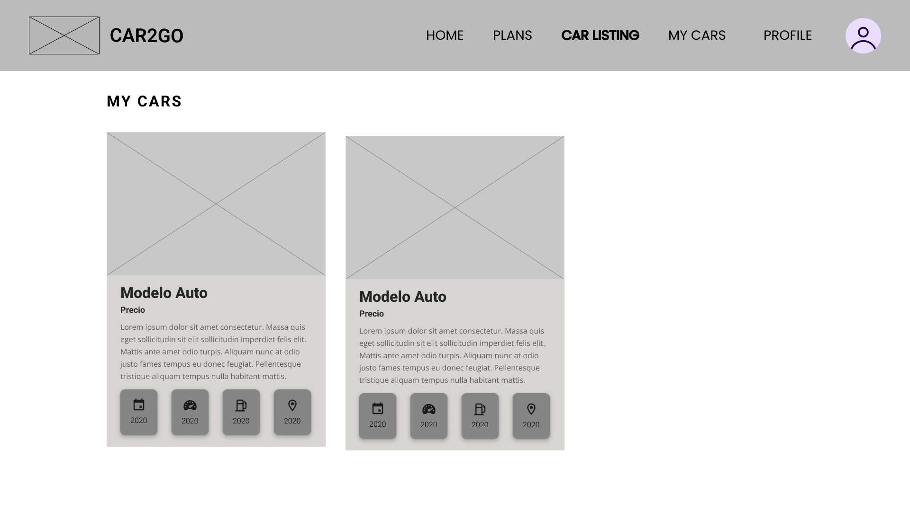

## 

## 

## 

## 

## 

## 

## 

## 

## 

## 


### 4.6.2. Web Applications Wireflow Diagrams.

## 

## 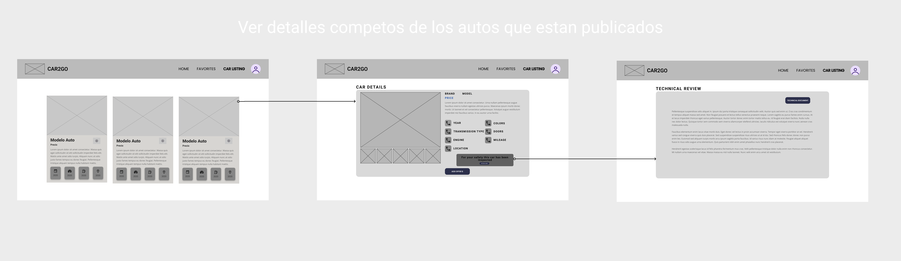

## 

## 

## 

## 

## 

## 

## 


### 4.6.3. Web Applications Mock-ups.

#### Login


### Vista del vendedor


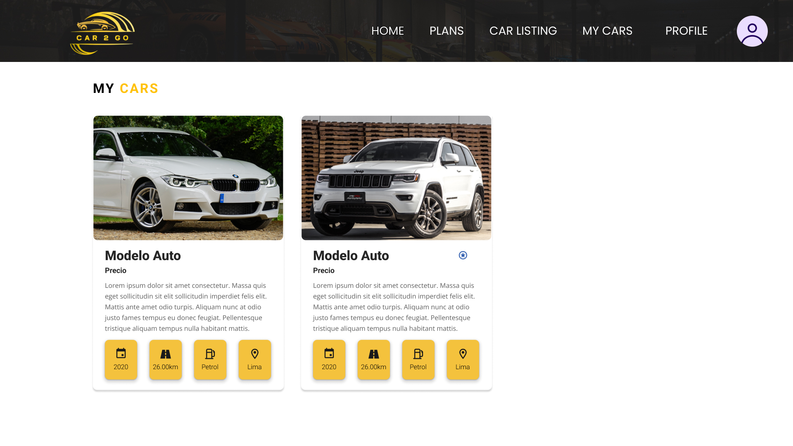


### Vista del comprador


### Vista del mecánico


### 4.6.4. Web Applications User Flow Diagrams.

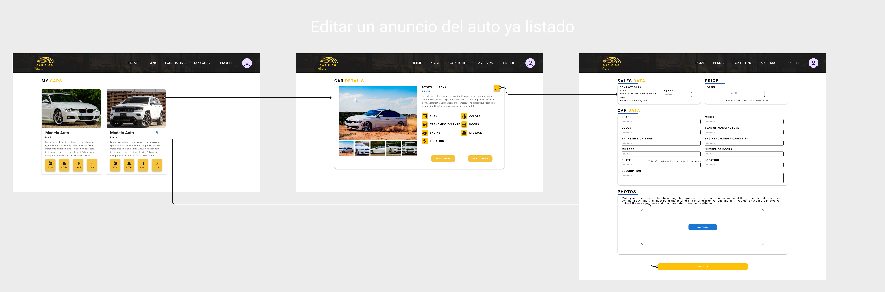
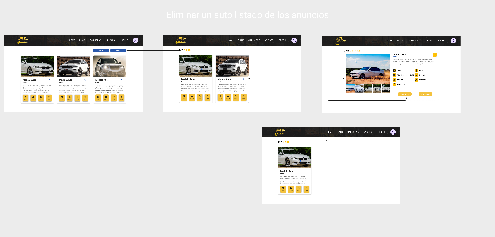
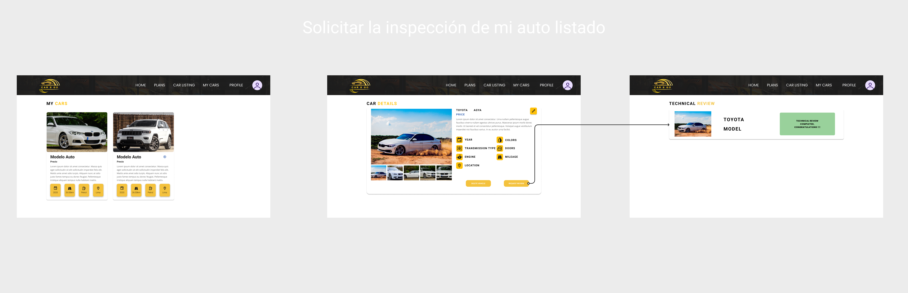


## 4.7. Web Applications Prototyping.

Para poder elaborar los prototipos de la interfaz de usuario destinados a Desktop se siguieron una serie
de criterios fundamentales, entre ellos:

1. Claridad y Facilidad: El enfoque fue lograr que la navegación en la aplicación sea intuitiva y comprensible, con el objetivo
   de que los usuarios puedan comprender plenamente las funciones de la aplicación.
   visualización de reportes estadísticos.
2. Diseño Responsive: Se ha tenido en cuenta la importancia del diseño "responsive" para garantizar que la aplicación web
   sea compatible con una variedad tamaños de pantalla, de tal manera que los usuarios no se vean limitados por el dispositivo que utilicen.
3. Priorización de Información Relevante: El diseño de la aplicación se enfoca en mostrar únicamente la información más importante para los usuarios pertenecientes al segmento objetivo.

## 4.8. Domain-Driven Software Architecture.

El Domain Driven Design (DDD) tiene como objetivo llegar a un entendimiento compartido del dominio que abarca el espacio del problema. En el caso de **Car2Go**, este dominio es la gestión de la compra y venta de vehículos de segunda mano y la interacción con los vendedores, compradores y talleres mecánicos. Gracias a la perspectiva brindada por este enfoque, es posible mejorar la colaboración entre los desarrolladores y los expertos del dominio.

### 4.8.1. Software Architecture Context Diagram.

El diagrama de contexto muestra una vista de alto nivel de las relaciones entre el sistema de software **Car2Go**, los usuarios y, si es el caso, de otros sistemas externos.

<div align="center">
    
</div>

### 4.8.2. Software Architecture Container Diagrams.

El diagrama de contenedores muestra una vista de alto nivel de las relaciones entre las aplicaciones y fuentes de datos que son parte de la ejecución del sistema de software **Car2Go**.

<div align="center">
    
</div>

### 4.8.3. Software Architecture Components Diagrams.

Los diagramas de componentes muestran una vista de las relaciones de los componentes principales del sistema de software **Car2Go**. Estos componentes detallan la implementación de los respectivos módulos en el programa.

### - Authentication Bounded Context

<div align="center">
    
</div>

### - Payment Bounded Context

<div align="center">
    
</div>

### - User Interaction Bounded Context

<div align="center">
    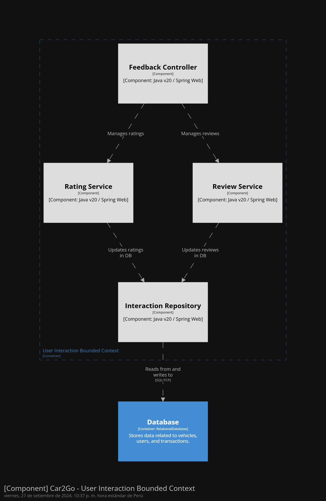
</div>

### - Vehicle Management Bounded Context

<div align="center">
    
</div>

## 4.9. Software Object-Oriented Design.

### 4.9.1. Class Diagrams.


### 4.9.2. Class Dictionary.

Clase User

| Atributo           | Tipo         | Descripción                     |
| ------------------ | ------------ | ------------------------------- |
| userID             | int          | Identificador único del usuario |
| names              | string       | Nombres del usuario             |
| last_name          | string       | Apellidos del usuario           |
| phone_number       | string       | Número telefónio del usuario    |
| email              | string       | Correo del usuario              |
| password           | string       | Contraseña del usuario          |
| role               | string       | Rol del usuario                 |
| subscriptionPlan   | Subscription | Plan de subscripción            |
| transactionHistory | list         | Historial de transacciones      |

<br><br/>
Clase SubscriptionPlan

| Atributo  | Tipo   | Descripción                                  |
| --------- | ------ | -------------------------------------------- |
| planID    | int    | Identificador único del plan de subscripción |
| name      | string | Nombre del plan                              |
| price     | double | Precio del plan                              |
| startDate | date   | Fecha de inicio de la subscripción           |
| endDate   | date   | Fecha de expiración de la subscripción       |
| status    | string | Estado de la subscripción                    |

<br><br/>
Clase Transaction

| Atributo      | Tipo    | Descripción                           |
| ------------- | ------- | ------------------------------------- |
| transactionID | int     | Identificador único de la transacción |
| buyer         | User    | Comprador del auto                    |
| seller        | User    | Vendedor del auto                     |
| vehicle       | Vehicle | Vehículo vendido                      |
| amount        | double  | Precio de venta                       |
| date          | date    | Fecha de la transacción               |
| paymentStatus | string  | Estado del pago de la transacción     |

<br><br/>
Clase Payment

| Atributo      | Tipo        | Descripción                    |
| ------------- | ----------- | ------------------------------ |
| paymentID     | int         | Identificador único del pago   |
| transaction   | Transaction | Transación perteniente al pago |
| paymentMethod | string      | Método de pago                 |
| paymentDate   | date        | Fecha del pago                 |

<br><br/>

<br>
Clase Post

| Atributo    | Tipo    | Descripción                  |
| ----------- | ------- | ---------------------------- |
| postID      | int     | Identificador único del post |
| vehicle     | Vehicle | Vehículo en venta            |
| seller      | User    | Vendedor                     |
| title       | string  | Título del post              |
| description | string  | Descripción del post         |
| price       | double  | Precio del vehículo          |
| status      | string  | Status del post              |
| createdDate | date    | Fecha de creación del post   |
| location    | string  | Ubicación del vehículo       |
| images      | list    | Imágenes del vehículo        |

<br><br/>
Clase Vehicle

| Atributo           | Tipo   | Descripción                      |
| ------------------ | ------ | -------------------------------- |
| vehicleID          | int    | Identificador único del vehículo |
| brand              | string | Marca del vehículo               |
| model              | string | Modelo                           |
| year               | int    | Año de fabricación               |
| price              | double | Precio del vehículo              |
| color              | string | Color principal del vehículo     |
| mileage            | double | Kilometraje                      |
| location           | string | Ubicación del vehículo           |
| images             | list   | Imágenes del vehículo            |
| description        | string | Descripción                      |
| maintenanceHistory | list   | Historial de mantenimiento       |

<br><br/>
Clase Contact

| Atributo  | Tipo   | Descripción                                                 |
| --------- | ------ | ----------------------------------------------------------- |
| contactID | int    | Identificador único del contacto entre comprador y vendedor |
| sender    | User   | Usuario interesado en el vehículo                           |
| receiver  | User   | Usuario dueño del vehículo                                  |
| message   | string | Mensaje enviado                                             |
| date      | date   | Fecha del mensaje                                           |

<br><br/>
Clase Review

| Atributo | Tipo   | Descripción                                     |
| -------- | ------ | ----------------------------------------------- |
| reviewID | int    | Identificador único de la reseña de un vendedor |
| user     | User   | Usuario que publicó la reseña                   |
| seller   | User   | Vendedor que recibe las reseñas                 |
| rating   | int    | Calificación del vendedor                       |
| comment  | string | Comentarios de la reseña                        |
| date     | date   | Fecha de publicación                            |

<br><br/>
Clase Maintenance

| Atributo      | Tipo     | Descripción                           |
| ------------- | -------- | ------------------------------------- |
| maintenanceID | int      | Identificador único del mantenimiento |
| vehicle       | Vehicle  | Vehículo objetivo del mantenimiento   |
| date          | date     | Fecha del mantenimiento               |
| description   | string   | Descripción del mantenimiento         |
| cost          | double   | Costo del mantenimiento               |
| mechanic      | Mechanic | Mecánico a cargo del mantenimiento    |

<br><br/>
Clase Mechanic

| Atributo    | Tipo   | Descripción                          |
| ----------- | ------ | ------------------------------------ |
| mechanicID  | int    | Identificador único del mecánico     |
| names       | string | Nombres                              |
| last_name   | string | Apellidos                            |
| phonenumber | string | Número telefónico                    |
| address     | string | Dirección del taller automotriz      |
| company     | string | Nombre del taller automotriz         |
| email       | string | Correo del mecánico                  |
| password    | string | Contraseña de la cuenta del mecánico |

## 4.10. Database Design.

El sistema de gestión de bases de datos relacional (RDBMS) que utilizaremos para generar las tablas y establecer sus relaciones en nuestra plataforma será MySQL. Hemos elegido MySQL por su facilidad de uso y por su integración con MySQL Workbench, que nos proporciona una herramienta visual eficiente para la administración de la base de datos.

### 4.10.1. Relational/Non-Relational Database Diagram.


# Capítulo V: Product Implementation

## 5.1. Software Configuration Management.

A continuación, se describe el proceso por el cual organizamos, gestionamos y controlamos los cambios en el desarrollo de **Car2Go**.

### 5.1.1. Software Development Environment Configuration.

**Requirements Management**

- **Trello:** Es una herramienta utilizada para gestionar el flujo de trabajo de proyectos principalmente basados en marcos de trabajos ágiles. Será empleado para visualizar y actualizar el estado actual de las tareas e historias de usuario pertenecientes al sprint a desarrollar.
  - Ruta de referencia: https://trello.com/es

**Product UX/UI Design**

- **Figma:** Plataforma de elaboración de prototipos y edición gráfica, principalmente utilizado para el diseño digital. En el caso del proyecto, será utilizado para el prototipado de la aplicación y sus versiones de Desktop y Mobile Web Browser.

  - Ruta de referencia: https://www.figma.com/login

- **Lucidchart:** Aplicación para diagramar flujos. Será empleado para el diseño de wireflows, user-flows y el diagrama de clases asociado a la aplicación.
  - Ruta de referencia: https://www.lucidchart.com/

**Software Development**

- **Visual Studio Code:** Entorno de desarrollo integrado elegido para la elaboración y compilación del código por motivos de dominio por parte de los integrantes del equipo de trabajo. Utilizar este IDE supone de valor para el desarrollo del proyecto puesto que incluye la posibilidad de agregar extensiones de utilidad, soporte de edición de texto en múltiples lenguajes de programación, disponibilidade en múltiples sistemas operativos, entre otros beneficios.

  - Ruta de referencia: https://code.visualstudio.com/

- **HTML5:** HyperText Markup Language, o por sus siglas HTML, es un lenguaje de etiquetado para páginas web. Será empleado en el desarrollo del proyecto para la presentación del contenido en la aplicación.

  - Ruta de referencia: https://www.w3schools.com/html/html5_syntax.asp

- **CSS:** Cascading Style Sheets es un lenguaje que maneja el diseño y presentación de las páginas web, el cual va de la mano con HTML.
  - Ruta de referencia: https://google.github.io/styleguide/htmlcssguide.html
  -
- **Bootstrap:** Framework CSS que permitirá crear componentes web de manera rápida y eficiente. Bootstrap se utilizará para la creación de la interfaz responsiva, asegurando que la plataforma funcione correctamente en distintos dispositivos.

  - Ruta de referencia: https://getbootstrap.com/

- **Next.js:** Este framework basado en React es utilizado para optimizar el desarrollo del frontend. Next.js proporciona funcionalidades como el renderizado del lado del servidor (SSR), rutas dinámicas, y la generación estática de sitios (SSG), lo cual mejora la experiencia del usuario y el SEO de la página.
  - Ruta de referencia: https://nextjs.org/
    <br>
    <br>

**Software Deployment**
<br>
<br>

- Git: Una herramienta de control de versiones que facilita el registro y la gestión de las distintas versiones del programa. Su propósito es mantener un historial de cambios y simplificar la corrección de errores. Los integrantes del equipo
  accederán a través de la línea de comandos en sus sistemas locales.

  Ruta de referencia: https://git-scm.com/
  <br>
  <br>
  **Software Documentation and Project Management**
  <br>
  <br>

- Github: Una plataforma en la nube que hospedará los repositorios de código del proyecto. Permitirá la colaboración en
  tiempo real y la revisión de contribuciones de cada miembro del equipo. Los integrantes del equipo podrán acceder a través de sus navegadores web.

  Ruta de referencia: https://github.com/

### 5.1.2. Source Code Management.

El proyecto seguirá las convenciones del flujo de trabajo establecido por el modelo GitFlow para el control de versiones, empleando GitHub como plataforma y sistema de control de versiones. A continuación, se describirá la implementación de GitFlow como un flujo de trabajo para el control de versiones, junto con el enlace del Landing Page.

**Repositorio de GitHub:**

- Enlace para acceder a la [organización](https://github.com/UPC-PRE-SI729-2402-WX51-G3-Cibersofa)
- Enlace para acceder al repositorio de la [landing page](https://github.com/UPC-PRE-SI729-2402-WX51-G3-Cibersofa/Landing-page)
- Enlace para acceder al repositorio del [informe](https://github.com/UPC-PRE-SI729-2402-WX51-G3-Cibersofa/project-report)

**Flujo de trabajo GitFlow**

El flujo de trabajo a ser implementado para el desarrollo del proyecto se basará en el modelo propuesto por Vincent Driessen en "A successful Git branching model".

<div style="margin-left: auto;
            margin-right: auto;
            width: 50%">

</div>

Gitflow es un modelo de ramificación para Git que se centra en la organización de las ramas de un proyecto de software. El modelo de Gitflow define una serie de ramas estándar y reglas para su uso, lo que facilita la colaboración y la gestión del código en un equipo de desarrollo. En UniRider, utilizamos el modelo de Gitflow para organizar y gestionar las ramas de nuestro proyecto, lo que nos permite trabajar de forma eficiente y colaborativa en el desarrollo de nuestra aplicación web.

La rama **main** es la rama principal de nuestro proyecto, que contiene la versión estables, operativas y listas para implementar de UniRider. Estas variantes han sido previamente evaluadas y se ha verificado la total funcionalidad de estas tras su implementación. Emplearemos etiquetas para identificar cada variante estable y lista para implementar, lo que nos permitirá tener un seguimiento preciso de las variantes y simplificar la administración de futuras actualizaciones.

La rama **develop** es la rama de desarrollo de nuestro proyecto, que contiene la versión en desarrollo de UniRider que aún no han sido sometidas a pruebas, aunque están completadas al 100% y contienen todas las características que se esperan hasta ese momento. Este canal se emplea para cargar la versión y llevar a cabo pruebas finales con el fin de corregir cualquier inconveniente antes de la publicación final en la rama main.

La rama **feature** es la rama de características de nuestro proyecto, que contiene las nuevas características y funcionalidades que se están desarrollando para UniRider. Cada nueva característica se desarrolla en una rama de características separada, lo que permite a los miembros del equipo trabajar de forma independiente en diferentes aspectos de la aplicación y facilita la integración de las nuevas características en la rama de desarrollo.

### 5.1.3. Source Code Style Guide & Conventions.

Para asegurar la coherencia y mantenibilidad del código en **Car2Go**, se seguirán las siguientes convenciones de estilo:

**HTML:**

- Todos los elementos deben estar correctamente cerrados.
- Declarar el tipo de documento en la primera línea como `<!DOCTYPE html>`.
- Utilizar comillas en los atributos que contengan espacios.
- Especificar los atributos `alt`, `width`, y `height` en las imágenes para garantizar la accesibilidad y el rendimiento de la página.

**CSS:**

- Sangría de 2 espacios para mantener el código legible.
- Todo el código en minúsculas.
- Usar comentarios explicativos y eliminar espacios en blanco innecesarios.
- Nombres de clase deben ser descriptivos, reflejando la función o propósito del elemento.

**Bootstrap:**

- Usar las utilidades predefinidas de Bootstrap para componentes y grillas responsivas.
- Evitar la sobrecarga de estilos personalizados y priorizar el uso de las clases estándar de Bootstrap.

**Next.js:**

- Seguir las convenciones de componentes funcionales de React.
- Utilizar hooks cuando sea necesario y modularizar el código en componentes reutilizables.

### 5.1.4. Software Deployment Configuration.

## 5.2. Product Implementation & Deployment.

### Sprint 1

Sprint planning

| Sprint                             | Sprint 1                                                                                                                                                                      |
| ---------------------------------- | ----------------------------------------------------------------------------------------------------------------------------------------------------------------------------- |
| Sprint Planning Background         |
| Date                               | 2025/04/13                                                                                                                                                                    |
| Time                               | 21:00 PM                                                                                                                                                                      |
| Location                           | El desarrollo de la reunión se hizo virtualmente por medio de Discord                                                                                                         |
| Prepared By                        | Meza Camayo, Lynn Jeeferzon                                                                                                                                                   |
| Attendees (to planning meeting)    | Meza Camayo, Lynn Jeeferzon/Castilla Pachas, César Antonio/Serrano Uchuya, Gerald Patricio /Alvarado De La Cruz, Juan Carlos/Valera Garcés, Samuel Ignacio                    |
| Sprint n – 1 Review Summary        | -                                                                                                                                                                             |
| Sprint n – 1 Retrospective Summary |                                                                                                                                                                               |
| Sprint Goal & User Stories         |
| Sprint 1 Goal                      | Desarrollar y desplegar la landing page, aplicación mobil y aplicación web funcional garantizando que cumpla con los requisitos básicos de diseño, contenido y accesibilidad. |
| Sprint 1 Velocity                  | 8                                                                                                                                                                             |
| Sum of Story Points                | 5                                                                                                                                                                             |

### 5.2.1. Sprint Backlogs.

### Tabla de control de estado Sprint 1

| User Story ID | User Story Title            | Task ID | Task Title                             | Task Description                              | Estimation (Hours) | Assigned To                      | Status     |
| :------------ | :-------------------------- | :------ | :------------------------------------- | :-------------------------------------------- | :----------------- | :------------------------------- | :--------- |
| US-01         | Registro de Usuario         | T-01    | Implementar API de registro            | Backend para creación de cuentas de usuario   | 8h                 | Alvarado De La Cruz, Juan Carlos | Done       |
| US-01         | Registro de Usuario         | T-02    | Diseñar formulario de registro         | Frontend web/mobile para registro de usuarios | 6h                 | Castilla Pachas, Cesar Antonio   | Done       |
| US-01         | Registro de Usuario         | T-03    | Validación de datos                    | Validar datos antes de enviar registro        | 4h                 | Serrano Uchuya, Gerald Patricio  | Done       |
| US-01         | Registro de Usuario         | T-04    | Recuperación de contraseña             | Módulo de recuperación de contraseña          | 5h                 | Valera Garcés, Samuel Ignacio    | Done       |
| US-02         | Búsqueda de Autos           | T-05    | API de búsqueda de autos               | Crear endpoint para buscar autos por filtros  | 7h                 | Meza Camayo, Lynn Jeeferzon      | In-Process |
| US-02         | Búsqueda de Autos           | T-06    | Interfaz de búsqueda                   | Frontend de filtros y resultados              | 6h                 | Alvarado De La Cruz, Juan Carlos | Done       |
| US-03         | Listado de Autos            | T-07    | API de publicación de autos            | Crear endpoint para agregar autos             | 7h                 | Meza Camayo, Lynn Jeeferzon      | Done       |
| US-03         | Listado de Autos            | T-08    | Formulario de listado                  | Formulario de frontend para agregar autos     | 6h                 | Serrano Uchuya, Gerald Patricio  | Done       |
| US-04         | Edición de Listado de Autos | T-09    | API de edición de autos                | Actualizar información del auto listado       | 5h                 | Valera Garcés, Samuel Ignacio    | Done       |
| US-04         | Edición de Listado de Autos | T-10    | Interfaz de edición                    | UI para editar autos en perfil                | 4h                 | Castilla Pachas, Cesar Antonio   | Done       |
| US-06         | Ver Detalles del Auto       | T-11    | API de detalles de autos               | Obtener información completa de autos         | 5h                 | Alvarado De La Cruz, Juan Carlos | Done       |
| US-06         | Ver Detalles del Auto       | T-12    | Pantalla de detalles de auto           | Mostrar datos de autos en frontend            | 5h                 | Meza Camayo, Lynn Jeeferzon      | Done       |
| US-08         | Guardar Autos Favoritos     | T-13    | API de favoritos                       | Endpoint para guardar autos como favoritos    | 4h                 | Serrano Uchuya, Gerald Patricio  | Done       |
| US-08         | Guardar Autos Favoritos     | T-14    | Funcionalidad de "Agregar a favoritos" | Botón en el frontend para guardar favoritos   | 4h                 | Valera Garcés, Samuel Ignacio    | Done       |
| US-16         | Sistema de Pago Seguro      | T-15    | Diseño de wallet                       | Permitir que usuarios configuren su wallet    | 5h                 | Castilla Pachas, Cesar Antonio   | In-Process |
| US-17         | Confirmación de Transacción | T-16    | Lógica de confirmación de compra       | Notificar sobre transacciones realizadas      | 5h                 | Alvarado De La Cruz, Juan Carlos | In-Process |

---

### 5.2.2. Implemented Landing Page Evidence

Se alcanzó un desarrollo parcial en la implementación del despliegue de la landing page. La página muestra varias secciones en las que el usuario puede encontrar información relevante sobre los servicios, planes y equipo de Car2Go. A continuación se presentan evidencias del progreso logrado:

# -Sección inicio:

El usuario puede visualizar el inicio de la alnding page.


# -Sección What We Offer:

El usuario puede ver las características clave que ofrecemos, como transacciones seguras, verificación de calidad, talleres especializados y pagos seguros.


# -Sección Planes:

El usuario puede ver los planes que opfrecemos, los cuales se adaptan dependiendo de las necesidades y uso del usuario.


# -Sección About Us::

En esta sección, el usuario puede conocer más sobre la misión y visión de Car2Go, así como entender nuestro compromiso con la seguridad y el servicio al cliente.


# -Sección Our Team:

El usuario puede conocer a los miembros clave del equipo de Car2Go y leer sus testimonios.


# -Sección Contacto:

El usuario puede enviar sus consultas directamente a través de un formulario de contacto, o utilizar las opciones de contacto directo proporcionadas.


### 5.2.3. Implemented Frontend-Web Application Evidence

A continuación, se muestran algunos de los resultados de las diferentes pantallas al ejecutar la aplicación.


### 5.2.4. Acuerdo de Servicio - SaaS

Esta sección establece los derechos, obligaciones y restricciones aplicables a los usuarios de la plataforma, garantizando transparencia en el uso del servicio SaaS.

**_Acuerdo de Servicio SaaS (SaaS Agreement) – Car2Go_**

1.Objeto del Acuerdo

- Este Acuerdo regula el uso del servicio de software como servicio (SaaS) ofrecido por Car2Go a sus usuarios, estableciendo los derechos, obligaciones y limitaciones aplicables.

  2.Derechos y Obligaciones del Usuario

  - El usuario tiene derecho a acceder y utilizar la plataforma conforme a las condiciones estipuladas.

  - El usuario se compromete a utilizar el servicio de manera responsable y conforme a la ley.

  - El usuario acepta no realizar actividades que puedan dañar, interferir o afectar la seguridad del servicio.

  3.Restricciones

  - Queda prohibida la distribución, copia, modificación o explotación no autorizada del software y sus contenidos.

  - Está prohibido el uso del servicio para fines ilegales o no autorizados.

  4.Transparencia y Accesibilidad

  - Car2Go garantiza que los términos son claros, accesibles y están disponibles para consulta pública en todo momento.

  - Se asegura el cumplimiento normativo vigente aplicable a servicios digitales.

  5.Modificaciones al Acuerdo

  - Car2Go podrá modificar los términos y condiciones, notificando oportunamente a los usuarios y manteniendo la transparencia.

  6.Protección de Datos

  - Car2Go se compromete a proteger los datos personales conforme a la legislación aplicable y su política de privacidad.

### 5.2.5. Implemented Native-Mobile Application Evidence

En esta sección se presentan las evidencias de la aplicación movil, la cual fue desarrollada en Android Studio. La aplicación movil cuenta con un diseño responsivo y amigable para el usuario, permitiendo una mejor experiencia al momento de navegar por la aplicación.

- Login screens


**- Vendedor**

- Home screen


- Car list screen


- My car screen


- Car details screen

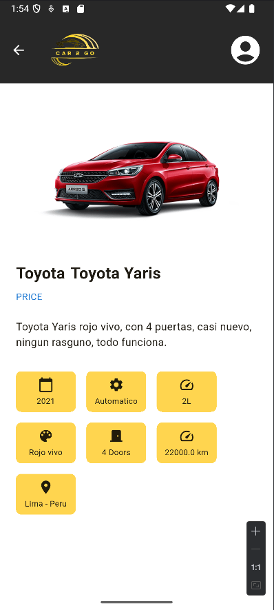

- Car sell screen


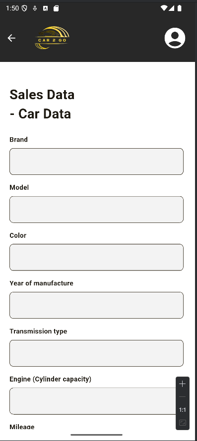


- Plan screen


- Profile screen


- Wallet screen


Execution Evidence for Sprint Review

Link : https://upcedupe-my.sharepoint.com/:v:/g/personal/u202218735_upc_edu_pe/EUC_C6MPuDRBofzl1uDSLbABCOi6iZImr5IjzSq1ufzQeQ?e=pSoNBi&nav=eyJyZWZlcnJhbEluZm8iOnsicmVmZXJyYWxBcHAiOiJTdHJlYW1XZWJBcHAiLCJyZWZlcnJhbFZpZXciOiJTaGFyZURpYWxvZy1MaW5rIiwicmVmZXJyYWxBcHBQbGF0Zm9ybSI6IldlYiIsInJlZmVycmFsTW9kZSI6InZpZXcifX0%3D

### 5.2.6. Implemented RESTful API and/or Serverless Backend Evidence

En esta parte, se muestra la ejecucion de la aplicacion web, tanto del front end como del back end, asi como tambien se muestra el uso de la aplicacion en un servidor de Swagger.


### 5.2.7. RESTful API documentation

En esta seccion, se muestra la documentacion de los servicios del back end de la aplicacion web, asi como tambien se muestra el uso de Swagger para la documentacion de los servicios.

Utilizamos SpringBoot, Spring Security, JWToken y Spring Data jpa

### 5.2.8. Team Collaboration Insights

En esta seccion, se muestra las evidencias de contribuciones del equipo de desarrollo.

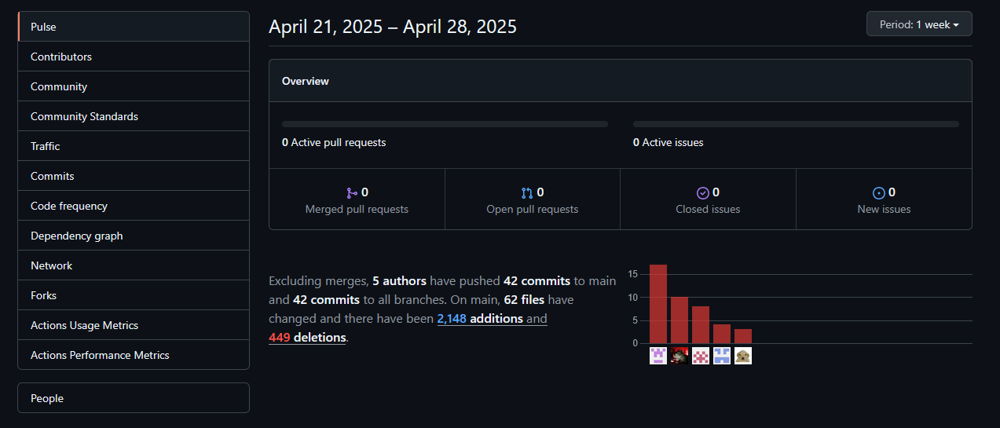


## 5.3. Video About-the-Product.

link: <https://upcedupe-my.sharepoint.com/:v:/g/personal/u202216150_upc_edu_pe/EaRI4vRGmwlCsuV5OCCZwMsB7Z3XHiqhNtDnqI469CBygg?nav=eyJyZWZlcnJhbEluZm8iOnsicmVmZXJyYWxBcHAiOiJPbmVEcml2ZUZvckJ1c2luZXNzIiwicmVmZXJyYWxBcHBQbGF0Zm9ybSI6IldlYiIsInJlZmVycmFsTW9kZSI6InZpZXciLCJyZWZlcnJhbFZpZXciOiJNeUZpbGVzTGlua0NvcHkifX0&e=1euKVz>

# Part II: Verification, Validation & Pipeline

# Capítulo VI: Product Verification & Validation

## 6.1. Testing Suites & Validation

### 6.1.1. Core Entities Unit Tests.

La plataforma al servir como un intermediario entre compradores y vendedores entre la transacción de vehículos debe garantizar que sus características principales funcionen adecuadamente para que nuestros usuarios no tengan dificultades en el uso de la aplicación. Con este objetivo, se desarrollaron las pruebas unitarias para nuestras entidades core: Vehicle y Profile.

<br>
Vehicle: 
<br> 
 Las pruebas unitarias realizadas incluyen la verificación del correcto funcionamiento de la clase Vehicle, asegurando que la creaeción y actualización de vehíuclos se realice adecuadamente, que lo atributos se asignen y modifiquen según lo esperado, y que el estado del vehículo se gestione correctamente. Además, se valida la asignación y recuperación del id del perfil de usuario, así como el mantenimiento del estado por defecto al crear un nuevo vehículo.

Se incluyen las siguientes pruebas:

 <ul>
  <li>testVehicleCreation()</li>
  <li>testVehicleUpdate()</li>
  <li>testStatusUpdate()</li>
  <li>testSetAndGetProfileId()</li>
  <li>testDefaultStatusIsPending()</li>
  <li>testRejectVehicle()</li>
 </ul>

Ejemplo de prueba unitaria:

- Actualización de los datos de un vehículo

```
 @Test
    @DisplayName("Should update a vehicle correctly")
    void testVehicleUpdate() {
        // Arrange:
        vehicle = new Vehicle(validCreateCommand);
        UpdateVehicleCommand updateCommand = new UpdateVehicleCommand(
            UPDATED_NAME,
            UPDATED_PHONE,
            UPDATED_EMAIL,
            VALID_BRAND,
            UPDATED_MODEL,
            UPDATED_COLOR,
            VALID_YEAR,
            UPDATED_PRICE,
            VALID_TRANSMISSION,
            VALID_ENGINE,
            VALID_MILEAGE,
            VALID_DOORS,
            VALID_PLATE,
            VALID_LOCATION,
            VALID_DESCRIPTION,
            VALID_IMAGES,
            VALID_FUEL,
            VALID_SPEED,
            vehicleStatus.PENDING
        );

        // Act:
        vehicle.updateVehicleInfo(updateCommand);

        // Assert:
        assertEquals(UPDATED_NAME, vehicle.getName());
        assertEquals(UPDATED_PHONE, vehicle.getPhone());
        assertEquals(UPDATED_EMAIL, vehicle.getEmail());
        assertEquals(UPDATED_MODEL, vehicle.getModel());
        assertEquals(UPDATED_COLOR, vehicle.getColor());
        assertEquals(UPDATED_PRICE, vehicle.getPrice());
        assertEquals(vehicleStatus.PENDING, vehicle.getStatus());
    }

```

- Agregar profile id a un vehículo

```
@Test
    @DisplayName("Should set and get profileId correctly")
    void testSetAndGetProfileId() {
        // Arrange:
        vehicle = new Vehicle(validCreateCommand);
        long profileId = 12345L;

        // Act:
        vehicle.setProfileId(profileId);

        // Assert:
        assertEquals(profileId, vehicle.getProfileId());
        assertEquals(profileId, vehicle.getUserId());
    }
```

Pruebas de ejecución:


<br><br>
Profile:
<br>
Las pruebas unitarias se enfocan en validar la correcta creación y actualización de perfiles de usuario, así como la gestión de sus métodos de pago. Se verifican que los atributos del perfil se asignen correctamente tanto al crear como actualizar, que el identificador del perfil pueda establecerse y recupearase, y que los métodos de pago puedan añadirse, actualizarse y eliminarse.

Se incluyen las siguientes pruebas:

- testCreateProfileWithCommand()
- testCreateProfileWithUpdateCommand()
- testUpdateName()
- testSetAndGetProfileId()
- testAddPaymentMethod()
- testAddPaymentMethodExceedingLimit()
- testRemovePaymentMethodById()
- testRemoveNonExistentPaymentMethod()
- testUpdatePaymentMethod()
- testUpdateNonExistentPaymentMethod()

Ejemplo de prueba unitaria:

- Crear un perfil de usuario

```
 @Test
    @DisplayName("Should create a profile correctly with CreateProfileCommand")
    void testCreateProfileWithCommand() {
        // Arrange
        CreateProfileCommand command = createSampleCommand();

        // Act
        Profile profile = new Profile(command, PROFILE_ID);

        // Assert
        assertEquals(command.firstName(), profile.getFirstName());
        assertEquals(command.lastName(), profile.getLastName());
        assertEquals(command.email(), profile.getEmail());
        assertEquals(command.image(), profile.getImage());
        assertEquals(command.dni(), profile.getDni());
        assertEquals(command.address(), profile.getAddress());
        assertEquals(command.phone(), profile.getPhone());
        assertEquals(PROFILE_ID, profile.getProfileId());
        assertTrue(profile.getPaymentMethods().isEmpty());
    }

```

- Obtener id del perfil de usuario

```
@Test
    @DisplayName("Should set and get profileId correctly")
    void testSetAndGetProfileId() {
        // Arrange
        Profile profile = new Profile(createSampleCommand(), PROFILE_ID);
        Long newProfileId = 2L;

        // Act
        profile.setProfileId(newProfileId);

        // Assert
        assertEquals(newProfileId, profile.getProfileId());
    }
```

Pruebas de ejecución:
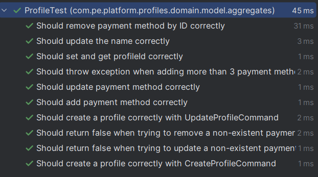

### 6.1.2. Core Integration Test – UserRepository

En esta sección se intentó implementar una **prueba de integración** para validar el correcto funcionamiento del repositorio de usuarios (`UserRepository`). Esta prueba tenía como objetivo garantizar que las operaciones de persistencia (guardar y recuperar usuarios) funcionaran correctamente utilizando una base de datos en memoria.

### Herramientas utilizadas:

- **Spring Boot 3.3.4**
- **Spring Data JPA**
- **JUnit 5**
- **H2 Database (test scope)**
- **AssertJ**
- **IntelliJ IDEA**

---

### Escenario aplicado: Persistencia de usuario

Se buscó validar el flujo de creación y recuperación de un usuario mediante el método `findByUsername`. Para ello se desarrolló el siguiente test:

```java
@Test
void testCreateAndFindUserByUsername() {
    // Arrange
    User user = new User("testuser", "secret123");

    // Act
    userRepository.save(user);
    Optional<User> found = userRepository.findByUsername("testuser");

    // Assert
    assertThat(found).isPresent();
    assertThat(found.get().getPassword()).isEqualTo("secret123");
}
```

## Archivo application-test.properties:


### Resultado de ejecución

Durante la ejecución de la prueba, se presentaron conflictos relacionados con la configuración del entorno de pruebas y la compatibilidad entre versiones del SDK de Java, Maven y Spring Boot.

A pesar de haber realizado múltiples correcciones —como la inclusión de la base de datos H2, la creación del archivo `application-test.properties`, la alineación del `pom.xml` con Java 21 y la configuración adecuada del entorno en IntelliJ IDEA—, la prueba no se ejecutó exitosamente.

El error principal fue un conflicto entre la versión del SDK utilizada en el proyecto (Java 21) y configuraciones residuales que hacían referencia a Java 23, provocando fallos al compilar y cargar el contexto de Spring Boot. Adicionalmente, se presentaron errores de integración con la base de datos embebida al momento de instanciar el `DataSource`.

Como resultado, la prueba quedó en estado fallido, pero con la estructura y configuraciones necesarias preparadas para su ejecución futura.

Pruebas de ejecución:


### 6.1.3. Core Behavior-Driven Development

En esta sección se aplicaron técnicas de Behavior-Driven Development (BDD) para definir y verificar el comportamiento esperado del sistema desde la perspectiva del usuario. Se utilizó la herramienta Cucumber integrada con Spring Boot y JUnit 5, permitiendo escribir pruebas automatizadas en lenguaje natural mediante escenarios Gherkin.

### Herramientas utilizadas:

- **Cucumber 7.14.0**
- **JUnit Platform Suite (JUnit 5)**
- **Spring Boot 3.3.4**
- **IntelliJ IDEA con plugin Cucumber for Java**

### Escenario aplicado: Publicación de vehículo por parte de un vendedor

Se eligió validar el flujo funcional de la publicación de un nuevo vehículo, correspondiente a la _User Story US-03_, donde un vendedor desea registrar un vehículo en la plataforma.

### Escenario BDD (`publicar_auto.feature`)


### Implementación del escenario en Java

La lógica de cada paso (`Given`, `When`, `Then`) fue implementada en la clase `VehiclePublicationSteps.java`:


### Resultado de la ejecución

La prueba se ejecutó correctamente utilizando el runner `CucumberTestRunner.java`, arrojando un resultado exitoso:


Mediante BDD y Cucumber se logró documentar y validar el comportamiento funcional de una de las funcionalidades clave del sistema. Esta práctica no solo permitió verificar la lógica de negocio desde el punto de vista del usuario, sino que también aporta a la automatización de pruebas y la trazabilidad entre los requerimientos funcionales y su implementación técnica.

### 6.1.4. Core System Tests.

En esta sección se realizaron pruebas de sistema con el objetivo de validar la funcionalidad integral del sistema Car2Go, considerando la interacción entre frontend, backend y base de datos. Estas pruebas simulan escenarios reales desde el punto de vista del usuario y permiten validar la respuesta del sistema ante operaciones completas, como publicar un vehículo o guardar favoritos.

---

### Prueba 1: Publicación de vehículo (flujo completo Web)

**Objetivo:** Validar que un vendedor pueda publicar un nuevo vehículo desde la interfaz o mediante API, y que este vehículo sea registrado correctamente en la plataforma.

| Elemento             | Descripción                                   |
| -------------------- | --------------------------------------------- |
| Plataforma           | Web                                           |
| Rol                  | Vendedor                                      |
| Endpoint involucrado | `POST /api/v1/vehicle`                        |
| Datos enviados       | Marca, modelo, precio, imágenes, etc.         |
| Resultado esperado   | Respuesta 201 y vehículo con estado `PENDING` |

**Evidencia:**

- Prueba ejecutada mediante escenario BDD (`CucumberTestRunner`)
- Resultado exitoso: `1 test passed - Process finished with exit code 0`
- El vehículo puede consultarse luego con `GET /api/v1/vehicle/{id}`


---

### Prueba 2: Guardar vehículo como favorito (flujo móvil o API)

**Objetivo:** Validar que un comprador pueda guardar un vehículo en su lista de favoritos correctamente.

| Elemento             | Descripción                           |
| -------------------- | ------------------------------------- |
| Plataforma           | Móvil / API                           |
| Rol                  | Comprador                             |
| Endpoint involucrado | `POST /api/v1/favorites/{vehicleId}`  |
| Requisitos           | Usuario autenticado con rol `BUYER`   |
| Resultado esperado   | Código 200 y objeto `Favorite` creado |

**Evidencia:**

- Se envió una solicitud autenticada con JWT válido
- El vehículo fue agregado a favoritos y puede verificarse con `GET /api/v1/favorites/my-favorites`


Las pruebas de sistema validaron que las funcionalidades críticas del sistema (publicación de vehículos y gestión de favoritos) funcionan correctamente, integrando autenticación, persistencia de datos, lógica de negocio y respuesta API. Esto garantiza que la aplicación está lista para pruebas de aceptación por parte del usuario final.

## 6.2. Static testing & Verification

### 6.2.1. Static Code Analysis

#### 6.2.1.1. Coding standard & Code conventions.

#### 6.2.1.2. Code Quality & Code Security.

### 6.2.2. Reviews

## 6.3. Validation Interviews.

### 6.3.1. Diseño de Entrevistas.

### 6.3.2. Registro de Entrevistas.

### 6.3.3. Evaluaciones según heurísticas.

## 6.4. Auditoría de Experiencias de Usuario

### 6.4.1. Auditoría realizada.

#### 6.4.1.1. Información del grupo auditado.

#### 6.4.1.2. Cronograma de auditoría realizada.

#### 6.4.1.3. Contenido de auditoría realizada.

### 6.4.2. Auditoría recibida.

#### 6.4.2.1. Información del grupo auditor.

#### 6.4.2.2. Cronograma de auditoría recibida.

#### 6.4.2.3. Contenido de auditoría recibida.

#### 6.4.2.4. Resumen de modificaciones para subsanar hallazgos.

# Capítulo VII: DevOps Practices

## 7.1. Continuous Integration

### 7.1.1. Tools and Practices.

Para la integración continua se utilizó GitHub Actions, la cual es una plataforma de automatización CI/CD que permite ejecutar flujos de trabajo definidos en archivos YAML. Para esto, se configuró un archivo llamado flutter_ci.yml dentro del directorio .github/workflows, el cual define una serie de acciones automatizadas para compilar, analizar y probar el proyecto Flutter, utilizando buenas practicas como lo son "flutter analyze" o "flutter test" que se ven en la captura.


### 7.1.2. Build & Test Suite Pipeline Components.

El pipeline de CI incluye las siguientes etapas previametne configuradas:


## 7.2. Continuous Delivery

### 7.2.1. Tools and Practices.

Se aplicó Continuous Delivery al mantener el software en un estado liberable en todo momento, gracias al pipeline de pruebas y análisis configurado en GitHub Actions.


### 7.2.2. Stages Deployment Pipeline Components.

Las pruebas mostraron resultados correctos en los siguientes stages de nuestro pipeline:

Build & Analyze: Garantizando que el código es válido y sigue buenas prácticas.

Test: Asegurando que el comportamiento de la aplicación está validado automáticamente.

Resultado final: Al pasar estas etapas, el proyecto está en un estado listo para entrega.


## 7.3. Continuous deployment

### 7.3.1. Tools and Practices.

Para implementar el despliegue continuo en este proyecto, se ha utilizado GitHub Actions como herramienta principal de integración y entrega continua (CI/CD). GitHub Actions permite automatizar tareas de construcción, pruebas y despliegue directamente desde el repositorio de código fuente, integrándose con otros servicios externos mediante acciones preconstruidas o personalizadas.

En el flujo implementado, se emplea Flutter para la construcción del proyecto en versión web, y Firebase Hosting como plataforma para el despliegue y hospedaje de la aplicación. La configuración incluye:

  - Automatización del pipeline: mediante workflows definidos en archivos YAML, se ejecutan pasos automáticos al realizar un push a ramas específicas del repositorio.

  - Manejo seguro de credenciales: las claves necesarias para el despliegue a Firebase, como el token de acceso y la cuenta de servicio, se gestionan mediante secretos en GitHub, garantizando confidencialidad.

  - Control de versiones y ramas: se utiliza una rama específica para despliegue (pg-deployment), asegurando que solo código validado y estable sea desplegado en producción.

  - Pruebas automatizadas: antes del despliegue se ejecutan comandos de análisis y testeo para asegurar la calidad del código.


  
Estas prácticas garantizan un proceso confiable, repetible y escalable para la entrega continua de la aplicación.

### 7.3.2. Production Deployment Pipeline Components.

El pipeline de despliegue productivo está compuesto por los siguientes elementos principales:

    Repositorio de código en GitHub: donde se mantiene el código fuente y se gestionan las ramas para desarrollo y despliegue.

    Workflow de GitHub Actions: definido en un archivo .yml dentro del repositorio, que orquesta las siguientes fases:

      - Checkout del código.

      - Instalación de la versión específica de Flutter.

      - Instalación de dependencias del proyecto.

      - Construcción de la aplicación para web en modo release.

      - Instalación de la CLI de Firebase.

      - Despliegue automático a Firebase Hosting usando credenciales almacenadas en secretos.

    Firebase Hosting: plataforma cloud que recibe y hospeda la aplicación web generada, ofreciendo alta disponibilidad y rendimiento para los usuarios finales.

    Gestión de secretos: el pipeline utiliza variables de entorno seguras para manejar tokens y credenciales de Firebase sin exponerlas en el código.

    Control de ramas: el despliegue solo se activa mediante push en la rama designada, evitando despliegues accidentales de código no validado.

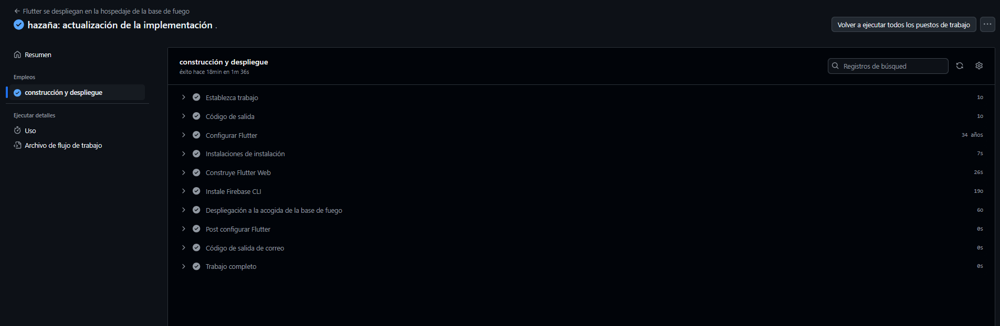

Este pipeline permite que cada cambio aprobado y consolidado en la rama de despliegue sea inmediatamente publicado, asegurando que la aplicación se mantenga actualizada y disponible para los usuarios sin necesidad de intervenciones manuales.

## 7.4. Continuous Monitoring

### 7.4.1. Tools and Practices

### 7.4.2. Monitoring Pipeline Components

### 7.4.3. Alerting Pipeline Components

### 7.4.4. Notification Pipeline Components.

# Part III: Experiment-Driven Lifecycle

# Capítulo VIII: Experiment-Driven Development

## 8.1. Experiment Planning

### 8.1.1. As-Is Summary.

### 8.1.2. Raw Material: Assumptions, Knowledge Gaps, Ideas, Claims.

### 8.1.3. Experiment-Ready Questions.

### 8.1.4. Question Backlog.

### 8.1.5. Experiment Cards.

## 8.2. Experiment Design

### 8.2.1. Hypotheses.

### 8.2.2. Measures.

### 8.2.3. Conditions.

### 8.2.4. Scale Calculations and Decisions.

### 8.2.5. Methods Selection.

### 8.2.6. Data Analytics: Goals, KPIs and Metrics Selection.

### 8.2.7. Web and Mobile Tracking Plan.

## 8.3. Experimentation

### 8.3.1. To-Be User Stories.

### 8.3.2. To-Be Product Backlog

### 8.3.3. Pipeline-supported, Experiment-Driven To-Be Software Platform Lifecycle

#### 8.3.3.1. To-Be Sprint Backlogs

#### 8.3.3.2. Implemented To-Be Landing Page Evidence

#### 8.3.3.3. Implemented To-Be Frontend-Web Application Evidence

#### 8.3.3.4. Implemented To-Be Native-Mobile Application Evidence

#### 8.3.3.5. Implemented To-Be RESTful API and/or Serverless Backend Evidence

#### 8.3.3.6. Team Collaboration Insights

### 8.3.4. To-Be Validation Interviews

#### 8.3.4.1. Diseño de Entrevistas.

#### 8.3.4.2. Registro de Entrevistas.

## 8.4. Experiment Aftermath & Analysis

### 8.4.1. Analysis and Interpretation of Results

### 8.4.2. Re-scored and Re-prioritized Question Backlog

## 8.5. Continuous Learning

### 8.5.1. Shareback Session Artifacts: Learning Workflow

## 8.6. To-Be Software Platform Pre-launch

### 8.6.1. About-the-Product Intro Video

# Conclusiones

## Conclusiones y recomendaciones.

**Concluciones:**

-Al iniciar este proyecto, identificamos que el mercado de autos de segunda mano enfrenta problemas de desconfianza y falta de transparencia. Con el Lean UX Canvas, validamos que tanto compradores como vendedores necesitan una plataforma segura, fácil de usar y con herramientas de verificación confiables. Nuestro equipo, con habilidades en desarrollo, diseño y marketing, trabajó en conjunto para definir una solución realista y centrada en el usuario.

- Con las entrevistas realizadas, los usuarios compradores han confirmado que necesitan de una plataforma que les ayude a facilitar la compra de autos de segunda mano.

- En conclusión, este proyecto no solo ha resultado en una aplicación funcional y alineada con las necesidades del mercado, sino que también nos ha brindado valiosas lecciones sobre el desarrollo de plataformas digitales centradas en el usuario. Estamos convencidos de que, con las actualizaciones y mejoras planeadas, nuestra solución se posicionará como una de las opciones más confiables y eficientes para la compraventa de autos usados. El trabajo en equipo, la metodología aplicada y el feedback constante han sido clave para llegar a este punto, y seguiremos iterando para ofrecer una experiencia aún mejor en el futuro.

- En conclusion,En esta etapa se implemento suites de pruebas unitarias, de integración, basadas en comportamiento y pruebas del sistema completo, lo que permitió validar la estabilidad y correcto funcionamiento de las funcionalidades centrales del proyecto, asegurando un producto confiable y robusto.

- En conclusión, se incorporaron prácticas DevOps de integración continua, entrega continua y despliegue continuo. La automatización de los pipelines de compilación, pruebas y despliegue facilitó un flujo de trabajo ágil y confiable, garantizando que las actualizaciones mantengan altos estándares de calidad y se entreguen de manera eficiente a producción.

# Video About-the-Team.

# Bibliografía

# Anexos

Link del repositorio de Github: <https://github.com/InnoSoft-1ASI0732-Diseno-Experimentos>

Link de landing page desplegado: <https://innosoft-1asi0732-diseno-experimentos.github.io/Car2Go-Landing-Page/>

link de Continuous Integration y Continuous Delivery : <https://github.com/testttttttertetewtwesdv/Car2Go-Movil> 

Link de Production Deployment Pipeline Components: <https://github.com/InnoSoft-1ASI0732-Diseno-Experimentos/Car2Go-Movil/actions>
