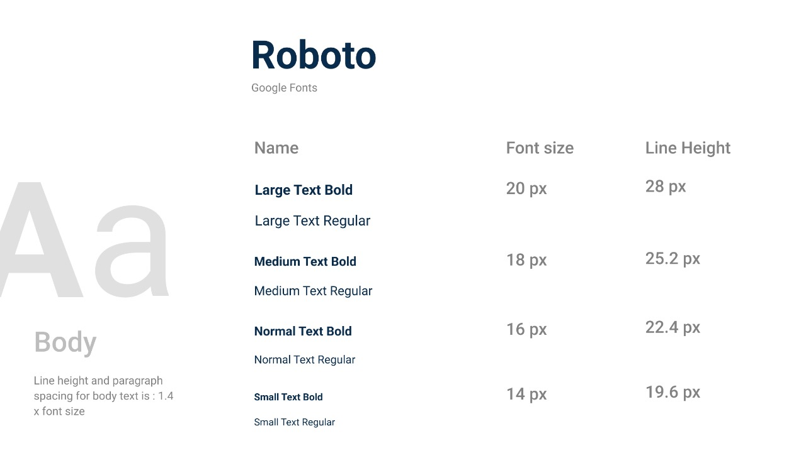
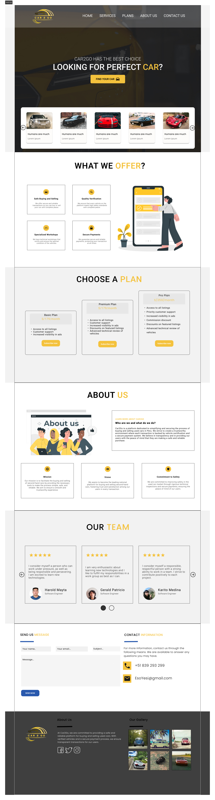
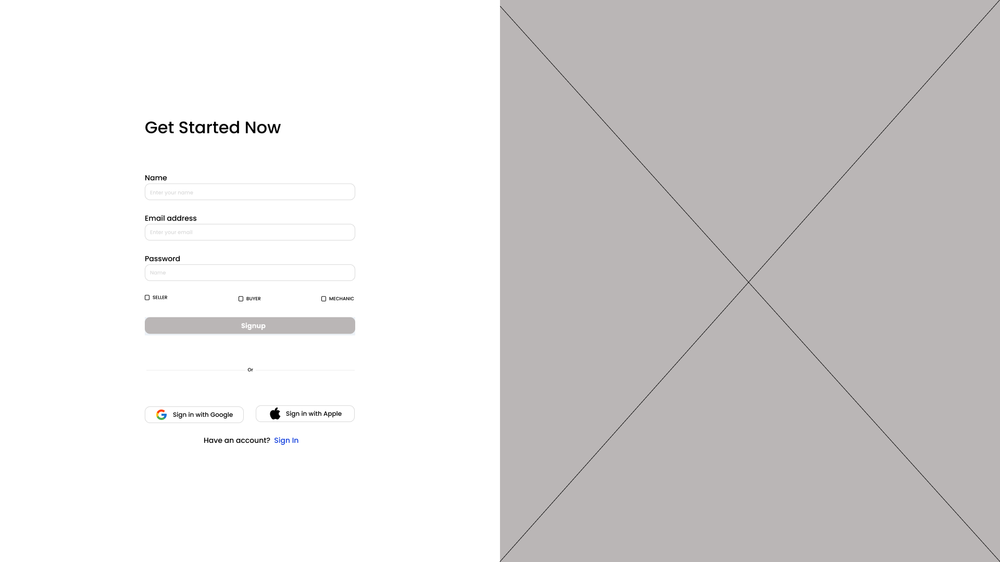
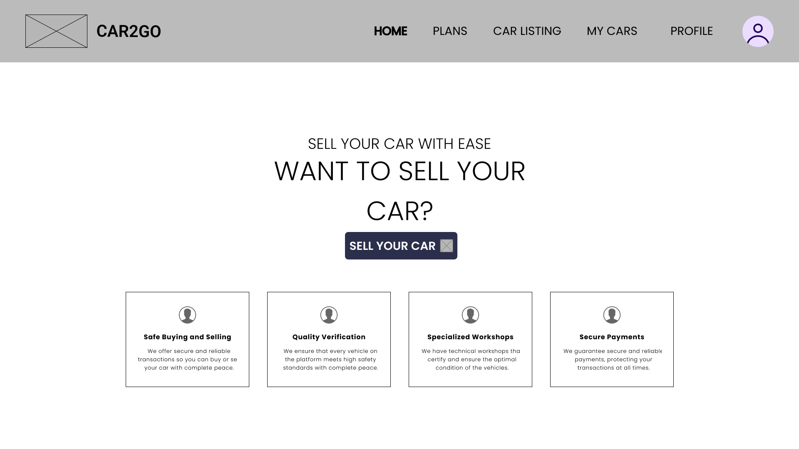
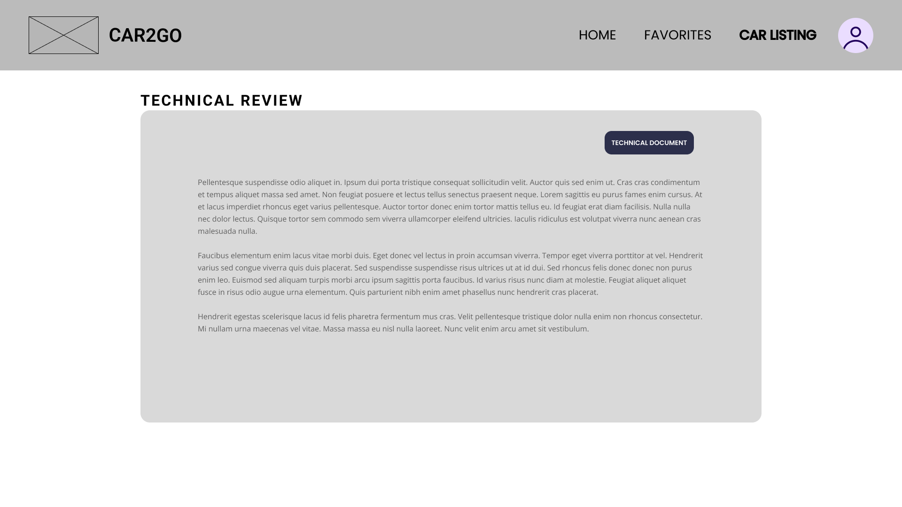
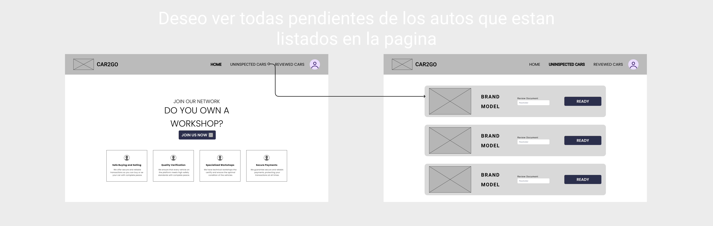
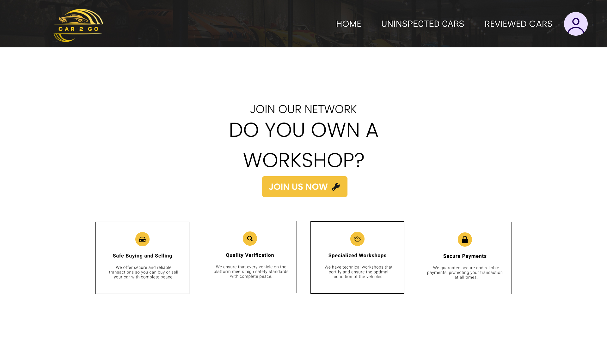
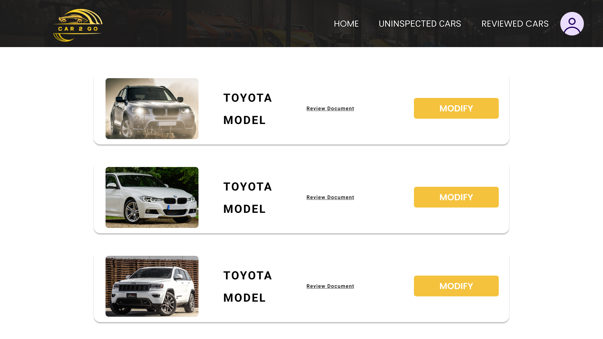

<h1 align="center"> UNIVERSIDAD PERUANA DE CIENCIAS APLICADAS </h1>

<h2 align="center"> INGENIERIA DE SOFTWARE</h2>
<h2 align="center"> CICLO 2025-1</h2>

<div align="center">
    
</div>

<br>
<h3 align="center"> Diseño de Experimentos de Ingeniería de Software - WS51 </h3>
<h3 align="center"> Profesor del Curso: Juan Carlos Tinoco Licas </h3>
<h3 align="center"> "INFORME DE TRABAJO FINAL"</h3>
<h3 align="center"> Nombre de Startup: InnoSoft </h3>
<h3 align="center"> Nombre del Producto:   </h3>

<div align="center">

| Miembro                        |   Código   |
| :----------------------------- | :--------: |
| Meza Camayo, Lynn Jeeferzon    | U20201C320 |
| Castilla Pachas, César Antonio |            |
| Serrano Uchuya, Gerald Patricio|            |
| Alvarado De La Cruz, Juan Carlos|            |
| Valera Garcés, Samuel Ignacio  |            |


</div>
<h3 align="center"> MAYO - 2024   </h3>

## REGISTRO DE VERSIONES

<div align="center">

| Versión  |   Fecha   |       Autor     |           Descripción de Modificación           |
|----------|-----------|-----------------|-------------------------------------------------|
|    0.1   | 03/04/25  |     Lynn Meza   | Creaccion Structura del informe                 |
|          |   |        |                  |
|       |   |        |                  |
</div>

## PROJECT REPORT COLLABORATION INSIGHTS

URL del respositorio de GitHub de la organización: [https://github.com/orgs/InnoSoft-1ASI0732-Diseno-Experimentos/repositories](https://github.com/orgs/InnoSoft-1ASI0732-Diseno-Experimentos/repositories)

## CONTENIDO

### Tabla de contenido

- [Part I: As-Is Software Project](#part-i-as-is-software-project)
- [Capítulo I: Introducción](#capítulo-i-introducción)
  - [1.1. Startup Profile](#11-startup-profile)
    - [1.1.1. Descripción de la Startup](#111-descripción-de-la-startup)
    - [1.1.2. Perfiles de integrantes del equipo](#112-perfiles-de-integrantes-del-equipo)
  - [1.2. Solution Profile](#12-solution-profile)
    - [1.2.1. Antecedentes y problemática](#121-antecedentes-y-problemática)
    - [1.2.2. Lean UX Process.](#122-lean-ux-process)
      - [1.2.2.1. Lean UX Problem Statements.](#1221-lean-ux-problem-statements)
      - [1.2.2.2. Lean UX Assumptions.](#1222-lean-ux-assumptions)
      - [1.2.2.3. Lean UX Hypothesis Statements.](#1223-lean-ux-hypothesis-statements)
      - [1.2.2.4. Lean UX Canvas.](#1224-lean-ux-canvas)
  - [1.3. Segmentos objetivo.](#13-segmentos-objetivo)
- [Capítulo II: Requirements Elicitation \& Analysis](#capítulo-ii-requirements-elicitation--analysis)
  - [2.1. Competidores.](#21-competidores)
    - [2.1.1. Análisis competitivo.](#211-análisis-competitivo)
    - [2.1.2. Estrategias y tácticas frente a competidores.](#212-estrategias-y-tácticas-frente-a-competidores)
  - [2.2. Entrevistas.](#22-entrevistas)
    - [2.2.1. Diseño de entrevistas.](#221-diseño-de-entrevistas)
    - [2.2.2. Registro de entrevistas.](#222-registro-de-entrevistas)
    - [2.2.3. Análisis de entrevistas.](#223-análisis-de-entrevistas)
  - [2.3. Needfinding.](#23-needfinding)
    - [2.3.1. User Personas.](#231-user-personas)
    - [2.3.2. User Task Matrix.](#232-user-task-matrix)
    - [2.3.3. User Journey Mapping.](#233-user-journey-mapping)
    - [2.3.4. Empathy Mapping.](#234-empathy-mapping)
    - [2.3.5. As-is Scenario Mapping.](#235-as-is-scenario-mapping)
  - [2.4. Ubiquitous Language.](#24-ubiquitous-language)
- [Capítulo III: Requirements Specification](#capítulo-iii-requirements-specification)
  - [3.1. To-Be Scenario Mapping.](#31-to-be-scenario-mapping)
  - [3.2. User Stories.](#32-user-stories)
  - [3.3. Product Backlog.](#33-product-backlog)
  - [3.4. Impact Mapping.](#34-impact-mapping)
- [Capítulo IV: Product Design](#capítulo-iv-product-design)
  - [4.1. Style Guidelines.](#41-style-guidelines)
    - [4.1.1. General Style Guidelines.](#411-general-style-guidelines)
  - [](#)
    - [4.1.2. Web Style Guidelines.](#412-web-style-guidelines)
    - [4.1.3. Mobile Style Guidelines.](#413-mobile-style-guidelines)
      - [4.1.3.1. iOS Mobile Style Guidelines.](#4131-ios-mobile-style-guidelines)
      - [4.1.3.2. Android Mobile Style Guidelines.](#4132-android-mobile-style-guidelines)
  - [4.2. Information Architecture.](#42-information-architecture)
    - [4.2.1. Organization Systems.](#421-organization-systems)
    - [4.2.2. Labeling Systems.](#422-labeling-systems)
    - [4.2.3. SEO Tags and Meta Tags](#423-seo-tags-and-meta-tags)
    - [4.2.4. Searching Systems.](#424-searching-systems)
    - [4.2.5. Navigation Systems.](#425-navigation-systems)
  - [4.3. Landing Page UI Design.](#43-landing-page-ui-design)
    - [4.3.1. Landing Page Wireframe.](#431-landing-page-wireframe)
  - [](#-1)
    - [4.3.2. Landing Page Mock-up.](#432-landing-page-mock-up)
  - [](#-2)
  - [4.4. Mobile Applications UX/UI Design.](#44-mobile-applications-uxui-design)
    - [4.4.1. Mobile Applications Wireframes.](#441-mobile-applications-wireframes)
    - [4.4.2. Mobile Applications Wireflow Diagrams.](#442-mobile-applications-wireflow-diagrams)
    - [4.4.3. Mobile Applications Mock-ups.](#443-mobile-applications-mock-ups)
  - [](#-3)
  - [](#-4)
  - [](#-5)
  - [](#-6)
  - [](#-7)
  - [](#-8)
  - [](#-9)
  - [](#-10)
  - [](#-11)
  - [](#-12)
  - [](#-13)
  - [](#-14)
  - [](#-15)
  - [](#-16)
  - [](#-17)
  - [](#-18)
  - [](#-19)
  - [](#-20)
    - [4.4.4. Mobile Applications User Flow Diagrams.](#444-mobile-applications-user-flow-diagrams)
  - [](#-21)
  - [](#-22)
  - [](#-23)
  - [](#-24)
  - [](#-25)
  - [](#-26)
  - [](#-27)
  - [4.5. Mobile Applications Prototyping.](#45-mobile-applications-prototyping)
    - [4.5.1. Android Mobile Applications Prototyping.](#451-android-mobile-applications-prototyping)
    - [4.5.2. iOS Mobile Applications Prototyping.](#452-ios-mobile-applications-prototyping)
  - [4.6. Web Applications UX/UI Design.](#46-web-applications-uxui-design)
    - [4.6.1. Web Applications Wireframes.](#461-web-applications-wireframes)
  - [](#-28)
  - [](#-29)
  - [](#-30)
  - [](#-31)
  - [](#-32)
  - [](#-33)
  - [](#-34)
  - [](#-35)
  - [](#-36)
  - [](#-37)
  - [](#-38)
  - [](#-39)
  - [](#-40)
  - [](#-41)
  - [](#-42)
  - [](#-43)
  - [](#-44)
  - [](#-45)
  - [](#-46)
  - [](#-47)
    - [4.6.2. Web Applications Wireflow Diagrams.](#462-web-applications-wireflow-diagrams)
  - [](#-48)
  - [](#-49)
  - [](#-50)
  - [](#-51)
  - [](#-52)
  - [](#-53)
  - [](#-54)
  - [](#-55)
  - [](#-56)
    - [4.6.3. Web Applications Mock-ups.](#463-web-applications-mock-ups)
      - [Login](#login)
    - [Vista del vendedor](#vista-del-vendedor)
    - [Vista del comprador](#vista-del-comprador)
    - [Vista del mecánico](#vista-del-mecánico)
    - [4.6.4. Web Applications User Flow Diagrams.](#464-web-applications-user-flow-diagrams)
  - [4.7. Web Applications Prototyping.](#47-web-applications-prototyping)
  - [4.8. Domain-Driven Software Architecture.](#48-domain-driven-software-architecture)
    - [4.8.1. Software Architecture Context Diagram.](#481-software-architecture-context-diagram)
    - [4.8.2. Software Architecture Container Diagrams.](#482-software-architecture-container-diagrams)
    - [4.8.3. Software Architecture Components Diagrams.](#483-software-architecture-components-diagrams)
    - [- Authentication Bounded Context](#--authentication-bounded-context)
    - [- Payment Bounded Context](#--payment-bounded-context)
    - [- User Interaction Bounded Context](#--user-interaction-bounded-context)
    - [- Vehicle Management Bounded Context](#--vehicle-management-bounded-context)
  - [4.9. Software Object-Oriented Design.](#49-software-object-oriented-design)
    - [4.9.1. Class Diagrams.](#491-class-diagrams)
    - [4.9.2. Class Dictionary.](#492-class-dictionary)
  - [4.10. Database Design.](#410-database-design)
    - [4.10.1. Relational/Non-Relational Database Diagram.](#4101-relationalnon-relational-database-diagram)
- [Capítulo V: Product Implementation](#capítulo-v-product-implementation)
  - [5.1. Software Configuration Management.](#51-software-configuration-management)
    - [5.1.1. Software Development Environment Configuration.](#511-software-development-environment-configuration)
    - [5.1.2. Source Code Management.](#512-source-code-management)
    - [5.1.3. Source Code Style Guide \& Conventions.](#513-source-code-style-guide--conventions)
    - [5.1.4. Software Deployment Configuration.](#514-software-deployment-configuration)
  - [5.2. Product Implementation \& Deployment.](#52-product-implementation--deployment)
    - [5.2.1. Sprint Backlogs.](#521-sprint-backlogs)
    - [5.2.2. Implemented Landing Page Evidence](#522-implemented-landing-page-evidence)
    - [5.2.3. Implemented Frontend-Web Application Evidence](#523-implemented-frontend-web-application-evidence)
    - [5.2.4. Implemented Native-Mobile Application Evidence](#524-implemented-native-mobile-application-evidence)
    - [5.2.5. Implemented RESTful API and/or Serverless Backend Evidence](#525-implemented-restful-api-andor-serverless-backend-evidence)
    - [5.2.6. RESTful API documentation](#526-restful-api-documentation)
    - [5.2.7. Team Collaboration Insights](#527-team-collaboration-insights)
  - [5.3. Video About-the-Product.](#53-video-about-the-product)
- [Part II: Verification, Validation \& Pipeline](#part-ii-verification-validation--pipeline)
- [Capítulo VI: Product Verification \& Validation](#capítulo-vi-product-verification--validation)
  - [6.1. Testing Suites \& Validation](#61-testing-suites--validation)
    - [6.1.1. Core Entities Unit Tests.](#611-core-entities-unit-tests)
    - [6.1.2. Core Integration Tests.](#612-core-integration-tests)
    - [6.1.3. Core Behavior-Driven Development](#613-core-behavior-driven-development)
    - [6.1.4. Core System Tests.](#614-core-system-tests)
  - [6.2. Static testing \& Verification](#62-static-testing--verification)
    - [6.2.1. Static Code Analysis](#621-static-code-analysis)
      - [6.2.1.1. Coding standard \& Code conventions.](#6211-coding-standard--code-conventions)
      - [6.2.1.2. Code Quality \& Code Security.](#6212-code-quality--code-security)
    - [6.2.2. Reviews](#622-reviews)
  - [6.3. Validation Interviews.](#63-validation-interviews)
    - [6.3.1. Diseño de Entrevistas.](#631-diseño-de-entrevistas)
    - [6.3.2. Registro de Entrevistas.](#632-registro-de-entrevistas)
    - [6.3.3. Evaluaciones según heurísticas.](#633-evaluaciones-según-heurísticas)
  - [6.4. Auditoría de Experiencias de Usuario](#64-auditoría-de-experiencias-de-usuario)
    - [6.4.1. Auditoría realizada.](#641-auditoría-realizada)
      - [6.4.1.1. Información del grupo auditado.](#6411-información-del-grupo-auditado)
      - [6.4.1.2. Cronograma de auditoría realizada.](#6412-cronograma-de-auditoría-realizada)
      - [6.4.1.3. Contenido de auditoría realizada.](#6413-contenido-de-auditoría-realizada)
    - [6.4.2. Auditoría recibida.](#642-auditoría-recibida)
      - [6.4.2.1. Información del grupo auditor.](#6421-información-del-grupo-auditor)
      - [6.4.2.2. Cronograma de auditoría recibida.](#6422-cronograma-de-auditoría-recibida)
      - [6.4.2.3. Contenido de auditoría recibida.](#6423-contenido-de-auditoría-recibida)
      - [6.4.2.4. Resumen de modificaciones para subsanar hallazgos.](#6424-resumen-de-modificaciones-para-subsanar-hallazgos)
- [Capítulo VII: DevOps Practices](#capítulo-vii-devops-practices)
  - [7.1. Continuous Integration](#71-continuous-integration)
    - [7.1.1. Tools and Practices.](#711-tools-and-practices)
    - [7.1.2. Build \& Test Suite Pipeline Components.](#712-build--test-suite-pipeline-components)
  - [7.2. Continuous Delivery](#72-continuous-delivery)
    - [7.2.1. Tools and Practices.](#721-tools-and-practices)
    - [7.2.2. Stages Deployment Pipeline Components.](#722-stages-deployment-pipeline-components)
  - [7.3. Continuous deployment](#73-continuous-deployment)
    - [7.3.1. Tools and Practices.](#731-tools-and-practices)
    - [7.3.2. Production Deployment Pipeline Components.](#732-production-deployment-pipeline-components)
  - [7.4. Continuous Monitoring](#74-continuous-monitoring)
    - [7.4.1. Tools and Practices](#741-tools-and-practices)
    - [7.4.2. Monitoring Pipeline Components](#742-monitoring-pipeline-components)
    - [7.4.3. Alerting Pipeline Components](#743-alerting-pipeline-components)
    - [7.4.4. Notification Pipeline Components.](#744-notification-pipeline-components)
- [Part III: Experiment-Driven Lifecycle](#part-iii-experiment-driven-lifecycle)
- [Capítulo VIII: Experiment-Driven Development](#capítulo-viii-experiment-driven-development)
  - [8.1. Experiment Planning](#81-experiment-planning)
    - [8.1.1. As-Is Summary.](#811-as-is-summary)
    - [8.1.2. Raw Material: Assumptions, Knowledge Gaps, Ideas, Claims.](#812-raw-material-assumptions-knowledge-gaps-ideas-claims)
    - [8.1.3. Experiment-Ready Questions.](#813-experiment-ready-questions)
    - [8.1.4. Question Backlog.](#814-question-backlog)
    - [8.1.5. Experiment Cards.](#815-experiment-cards)
  - [8.2. Experiment Design](#82-experiment-design)
    - [8.2.1. Hypotheses.](#821-hypotheses)
    - [8.2.2. Measures.](#822-measures)
    - [8.2.3. Conditions.](#823-conditions)
    - [8.2.4. Scale Calculations and Decisions.](#824-scale-calculations-and-decisions)
    - [8.2.5. Methods Selection.](#825-methods-selection)
    - [8.2.6. Data Analytics: Goals, KPIs and Metrics Selection.](#826-data-analytics-goals-kpis-and-metrics-selection)
    - [8.2.7. Web and Mobile Tracking Plan.](#827-web-and-mobile-tracking-plan)
  - [8.3. Experimentation](#83-experimentation)
    - [8.3.1. To-Be User Stories.](#831-to-be-user-stories)
    - [8.3.2. To-Be Product Backlog](#832-to-be-product-backlog)
    - [8.3.3. Pipeline-supported, Experiment-Driven To-Be Software Platform Lifecycle](#833-pipeline-supported-experiment-driven-to-be-software-platform-lifecycle)
      - [8.3.3.1. To-Be Sprint Backlogs](#8331-to-be-sprint-backlogs)
      - [8.3.3.2. Implemented To-Be Landing Page Evidence](#8332-implemented-to-be-landing-page-evidence)
      - [8.3.3.3. Implemented To-Be Frontend-Web Application Evidence](#8333-implemented-to-be-frontend-web-application-evidence)
      - [8.3.3.4. Implemented To-Be Native-Mobile Application Evidence](#8334-implemented-to-be-native-mobile-application-evidence)
      - [8.3.3.5. Implemented To-Be RESTful API and/or Serverless Backend Evidence](#8335-implemented-to-be-restful-api-andor-serverless-backend-evidence)
      - [8.3.3.6. Team Collaboration Insights](#8336-team-collaboration-insights)
    - [8.3.4. To-Be Validation Interviews](#834-to-be-validation-interviews)
      - [8.3.4.1. Diseño de Entrevistas.](#8341-diseño-de-entrevistas)
      - [8.3.4.2. Registro de Entrevistas.](#8342-registro-de-entrevistas)
  - [8.4. Experiment Aftermath \& Analysis](#84-experiment-aftermath--analysis)
    - [8.4.1. Analysis and Interpretation of Results](#841-analysis-and-interpretation-of-results)
    - [8.4.2. Re-scored and Re-prioritized Question Backlog](#842-re-scored-and-re-prioritized-question-backlog)
  - [8.5. Continuous Learning](#85-continuous-learning)
    - [8.5.1. Shareback Session Artifacts: Learning Workflow](#851-shareback-session-artifacts-learning-workflow)
  - [8.6. To-Be Software Platform Pre-launch](#86-to-be-software-platform-pre-launch)
    - [8.6.1. About-the-Product Intro Video](#861-about-the-product-intro-video)
- [Conclusiones](#conclusiones)
  - [Conclusiones y recomendaciones.](#conclusiones-y-recomendaciones)
- [Video About-the-Team.](#video-about-the-team)
- [Bibliografía](#bibliografía)
- [Anexos](#anexos)

## STUDENT OUTCOME

<table center>
  <tr>
    <th>CRITERIO ESPECIFICO</th>
    <th>ACCIONES REALIZADAS</th>
    <th>CONCLUSIONES</th>
  </tr>
  <tr>
    <th>4.c.1 Reconoce responsabilidad etica y profesional en situaciones de ingeneria de software</th>
    <td></td>
    <td></td>
  </tr>
  <tr>
    <th>4.c.2 Emite juicios informados considerando el impacto de las soluciones de ingeniería de software en contextos globales, económicos, ambientales y sociales</th>
    <td></td>
    <td></td>
  </tr>
</table>

# Part I: As-Is Software Project
# Capítulo I: Introducción
## 1.1. Startup Profile
### 1.1.1. Descripción de la Startup
### 1.1.2. Perfiles de integrantes del equipo
## 1.2. Solution Profile
### 1.2.1. Antecedentes y problemática
### 1.2.2. Lean UX Process.
#### 1.2.2.1. Lean UX Problem Statements.
#### 1.2.2.2. Lean UX Assumptions.
#### 1.2.2.3. Lean UX Hypothesis Statements.
#### 1.2.2.4. Lean UX Canvas.
## 1.3. Segmentos objetivo.
# Capítulo II: Requirements Elicitation & Analysis
## 2.1. Competidores.
### 2.1.1. Análisis competitivo.
### 2.1.2. Estrategias y tácticas frente a competidores.
## 2.2. Entrevistas.
### 2.2.1. Diseño de entrevistas.
### 2.2.2. Registro de entrevistas.
### 2.2.3. Análisis de entrevistas.
## 2.3. Needfinding.
### 2.3.1. User Personas.
### 2.3.2. User Task Matrix.
### 2.3.3. User Journey Mapping.
### 2.3.4. Empathy Mapping.
### 2.3.5. As-is Scenario Mapping.
## 2.4. Ubiquitous Language.
# Capítulo III: Requirements Specification
## 3.1. To-Be Scenario Mapping.
## 3.2. User Stories.
## 3.3. Product Backlog.
## 3.4. Impact Mapping.
# Capítulo IV: Product Design
## 4.1. Style Guidelines.
### 4.1.1. General Style Guidelines.
**Branding:**

* Logo representativo de _Car2Go_
  

**Typography:**

* La tipografía de nuestro logotipo adoptará el elegante estilo Roboto, reconocido por su modernidad y su atractivo visual para nuestros usuarios. Este estilo no solo refleja la innovación y la creatividad que caracterizarán a nuestra aplicación, sino que también resalta la vanguardia que buscamos transmitir.


---


**Colors:**
* Hemos seleccionado el color #F4C23D como color primario porque transmite confianza y amabilidad, cualidades esenciales para crear una plataforma donde los usuarios se sientan bienvenidos y seguros al interactuar. Este tono dorado, cálido y acogedor, invita a la participación y genera un ambiente positivo para las transacciones.

* Como color secundario, hemos elegido #2959AD por su asociación con el profesionalismo y la seriedad. Este azul oscuro añade un toque de credibilidad y formalidad a la plataforma, asegurando a los usuarios que están realizando sus transacciones en un entorno confiable y bien gestionado.


### 4.1.2. Web Style Guidelines.
_Icons:_

* Cuando se trata de diseñar una página web, los íconos juegan un papel crucial en la creación de una interfaz de usuario intuitiva y fácil de usar. Estos elementos visuales pequeños tienen el poder de mejorar la comprensión de los usuarios sobre la funcionalidad de diferentes partes de nuestra página. Los íconos permiten a los usuarios entender rápidamente la función de cada elemento y su simplicidad y claridad los hacen fácilmente comprensibles. Mantener una consistencia en el uso de íconos en toda la página ayuda a evitar confusiones entre los usuarios.


_Breackpoints_

* Los breakpoints más conocidos en **ANGULAR** son los siguientes:

<table>
  <thead>
    <tr>
      <th style="text-align:center;">Breakpoint</th>
      <th style="text-align:center;">Class infix</th>
      <th style="text-align:center;">Dimensions</th>
    </tr>
  </thead>
  <tbody>
    <tr>
      <td style="text-align:center;">X-Small</td>
      <td style="text-align:center;">None</td>
      <td style="text-align:center;">&lt;576px</td>
    </tr>
    <tr>
      <td style="text-align:center;">Small</td>
      <td style="text-align:center;">sm</td>
      <td style="text-align:center;">≥576px</td>
    </tr>
    <tr>
      <td style="text-align:center;">Medium</td>
      <td style="text-align:center;">md</td>
      <td style="text-align:center;">≥768px</td>
    </tr>
    <tr>
      <td style="text-align:center;">Large</td>
      <td style="text-align:center;">lg</td>
      <td style="text-align:center;">≥992px</td>
    </tr>
    <tr>
      <td style="text-align:center;">Extra large</td>
      <td style="text-align:center;">xl</td>
      <td style="text-align:center;">≥1200px</td>
    </tr>
    <tr>
      <td style="text-align:center;">Extra, extra large</td>
      <td style="text-align:center;">xxl</td>
      <td style="text-align:center;">≥1400px</td>
    </tr>
  </tbody>
</table>


* Y los que usaremos en el proyecto principalmente son los de 768px y 1024px, ya que son los más comunes en los dispositivos móviles y de escritorio.
### 4.1.3. Mobile Style Guidelines.
#### 4.1.3.1. iOS Mobile Style Guidelines.
#### 4.1.3.2. Android Mobile Style Guidelines.
## 4.2. Information Architecture.
### 4.2.1. Organization Systems.
El sitio web se dividirá en las siguientes secciones:
- Home: Aquí se ubicará el eslogan de la marca y un botón para dirigir a los usuarios a la aplicación web. <br><br/>
- Services: Se muestran las principales características que ofrece la aplicación. <br><br/>
- Plans: Se ubican los planes de suscripción para los segmentos objetivos y las ventajas de cada uno. <br><br/>
- About us: Descripción de la plataforma, misión, visión y los integrantes del proyecto<br><br/>
- Contact us: Formulario para enviar dudas de los usuarios por correo más información de contacto.<br><br/>

La aplicación web tendrá las siguientes secciones según el segmento objetivo:
- Vendedor: "Home", "Plans", "Car Listing", "My Cars" y "Profile"
- Comprador: "Home","Favorites", "Car Listing" y "Profile"
- Mecánico: "Home", "Uninspected Cars", "Reviewed Cars"

Con relación al sistema secuencial, se tienen 2 procesos principales:
- Compra de vehículo: Seleccionar, contactar, pagar y confirmar. <br><br/>
- Publicación de venta: Añadir fotos, detalles del vehículo, información adicional y publicar la oferta.
### 4.2.2. Labeling Systems.
Colocar las etiquetas adecuadas en las secciones, botones y otros elementos en el landing page y la aplicación web permiten que los usuarios comprendan rápidamente las funcionalidades y contenido de la plataforma.
A continuación, se listarán las principales etiquetas según las principales funcionalidades:
- Navegación Principal: "Home", "Favorites", "Car Listing", "Profile"
  <br></br>
- Listado de autos: "My Cars", "Sell Car", "Price", "Filters"
  <br></br>
- Detalle del vehículo: "Year", "Colors", "Mileage", "Location", "Add Offer"
  <br></br>
- Publicación de oferta: "Brand", "Model", "Color", "Description", "Contact Data"
  <br></br>
- Proceso de compra : "Add Offer", "Review here", "Send", "Data"
  <br></br>
- Perfil del usuario: "Name", "Last Name", "Birthdate", "Identity document", "Address", "PHOTO URL"
  <br></br>
### 4.2.3. SEO Tags and Meta Tags
Con el fin de mejorar la prioridad en los motores de búsqueda, facilitar la llegada de nuevas usuarios y brindarles información relevante del landing page y la aplicación web, se añadirán los siguientes "Meta tags" como etiquetas HTML en las principales páginas de nuestra plataforma:

````
<title>Car2Go - Compra y Venta de Autos de Segunda Mano</title>
<meta name="description" content="Car2Go es tu plataforma ideal para comprar y vender autos de segunda mano de manera rápida y segura. Explora vehículos, publica anuncios y coordina sin complicaciones.">
<meta name="keywords" content="compra autos segunda mano, venta autos usados, plataforma autos, anuncios vehículos, comprar coches">
<meta name="author" content="Car2Go Team">
````
### 4.2.4. Searching Systems.
Es importante facilitar la búsqueda y el filtro de información para los usuarios con el fin de que puedan utilizar la plataforma sin problemas. Se dispondrá de una barra de búsqueda en la sección "Car Listing" y los usuarios podrán guardar en favoritos los autos de su preferencia. Sumado a esto, se podrán aplicar una variedad de filtros (marca, modelo, rango de precio, año de fabricación, etc.) a los resultados de la búsqueda para que cada usuario encuentre el auto de su preferencia. <br><br/>
Los resultados de la búsqueda se mostrarán en una cuadrícula, donde cada vehículo incluirá una foto, su precio, marca, modelo, ubicación, entre otros datos.Finalmente, al hacer clic en un resultado específico, se mostrarán más imágenes y detalles del vehículo, junto con un botón para contactar al vendedor.

### 4.2.5. Navigation Systems.
Navegar por nuestra plataforma debe ser lo suficientemente intuitivo para que los usuarios puedan cumplir satisfactoriamente sus objetivos. Con esto en mente, la principal forma desplazarse en el contenido será una barra de navegación ubicada en la parte superior de todas las páginas. Esta contendrá las siguientes secciones: Home, Car Listing, Profile, Plans, etc. Además, se incluirán "call to action" en distintas partes de cada sección. Por ejemplo, "Sell Car" en "Car Listing" y "Add Offer" en los ofertas publicadas. <br><br/>
Por otro lado, se agregará la paginación en la parte inferior de la cuadrícula de los resultados. Finalmente, el footer contendrá secciones como "About Us", "Terms and conditions" y "Privacy Policy", así como información de contacto.
## 4.3. Landing Page UI Design.
### 4.3.1. Landing Page Wireframe.


**Hero alterno 1**:

---
**Hero alterno 2**:

### 4.3.2. Landing Page Mock-up.


**Hero alterno 1**:

---
**Hero alterno 2**:

## 4.4. Mobile Applications UX/UI Design.
### 4.4.1. Mobile Applications Wireframes.
### 4.4.2. Mobile Applications Wireflow Diagrams.
### 4.4.3. Mobile Applications Mock-ups.

**Iniciar Sesion:**


**Vendedor**


---

---

---

---

---

---

---

---

---

---

---

---


**Comprador**


---

---

---

---

---


**Mecanico**


---


### 4.4.4. Mobile Applications User Flow Diagrams.


---

---

---

---

---

---

---


## 4.5. Mobile Applications Prototyping.
### 4.5.1. Android Mobile Applications Prototyping.
### 4.5.2. iOS Mobile Applications Prototyping.
## 4.6. Web Applications UX/UI Design.
### 4.6.1. Web Applications Wireframes.

---

---

---

---

---

---

---

---

---

---

---

---

---

---

---

---

---

---

---

---

### 4.6.2. Web Applications Wireflow Diagrams.

---

---

---

---

---

---

---

---

---

### 4.6.3. Web Applications Mock-ups.
#### Login


### Vista del vendedor


### Vista del comprador


### Vista del mecánico



### 4.6.4. Web Applications User Flow Diagrams.


## 4.7. Web Applications Prototyping.
Para poder elaborar los prototipos de la interfaz de usuario destinados a Desktop se siguieron una serie
de criterios fundamentales, entre ellos:

1. Claridad y Facilidad: El enfoque fue lograr que la navegación en la aplicación sea intuitiva y comprensible, con el objetivo
   de que los usuarios puedan comprender plenamente las funciones de la aplicación.
   visualización de reportes estadísticos.
2. Diseño Responsive: Se ha tenido en cuenta la importancia del diseño "responsive" para garantizar que la aplicación web
   sea compatible con una variedad tamaños de pantalla, de tal manera que los usuarios no se vean limitados por el dispositivo que utilicen.
3. Priorización de Información Relevante: El diseño de la aplicación se enfoca en mostrar únicamente la información más importante para los usuarios pertenecientes al segmento objetivo.
## 4.8. Domain-Driven Software Architecture.
El Domain Driven Design (DDD) tiene como objetivo llegar a un entendimiento compartido del dominio que abarca el espacio del problema. En el caso de **Car2Go**, este dominio es la gestión de la compra y venta de vehículos de segunda mano y la interacción con los vendedores, compradores y talleres mecánicos. Gracias a la perspectiva brindada por este enfoque, es posible mejorar la colaboración entre los desarrolladores y los expertos del dominio.
### 4.8.1. Software Architecture Context Diagram.
El diagrama de contexto muestra una vista de alto nivel de las relaciones entre el sistema de software **Car2Go**, los usuarios y, si es el caso, de otros sistemas externos.

<div align="center">
    
</div>

### 4.8.2. Software Architecture Container Diagrams.
El diagrama de contenedores muestra una vista de alto nivel de las relaciones entre las aplicaciones y fuentes de datos que son parte de la ejecución del sistema de software **Car2Go**.

<div align="center">
    
</div>

### 4.8.3. Software Architecture Components Diagrams.
Los diagramas de componentes muestran una vista de las relaciones de los componentes principales del sistema de software **Car2Go**. Estos componentes detallan la implementación de los respectivos módulos en el programa.

### - Authentication Bounded Context

<div align="center">
    
</div>

### - Payment Bounded Context

<div align="center">
    
</div>

### - User Interaction Bounded Context

<div align="center">
    
</div>

### - Vehicle Management Bounded Context

<div align="center">
    
</div>

## 4.9. Software Object-Oriented Design.
### 4.9.1. Class Diagrams.


### 4.9.2. Class Dictionary.
Clase User

| Atributo           | Tipo   | Descripción                     |
|--------------------|--------|---------------------------------|
| userID             | int    | Identificador único del usuario |
| names              | string | Nombres del usuario             |
| last_name          | string | Apellidos del usuario           |
| phone_number       | string | Número telefónio del usuario    |
| email              | string | Correo del usuario              |
| password           | string | Contraseña del usuario          |
| role               | string | Rol del usuario                 |
| subscriptionPlan   | Subscription | Plan de subscripción            |
| transactionHistory | list   | Historial de transacciones      |

<br><br/>
Clase SubscriptionPlan

| Atributo | Tipo   | Descripción                                  |
|----------|--------|----------------------------------------------|
| planID   | int    | Identificador único del plan de subscripción |
| name     | string | Nombre del plan                              |
| price    | double | Precio del plan                              |
| startDate| date   | Fecha de inicio de la subscripción           |
| endDate  | date   | Fecha de expiración de la subscripción       |
| status   | string | Estado de la subscripción                    |
 
<br><br/>
Clase Transaction

| Atributo      | Tipo    | Descripción                           |
|---------------|---------|---------------------------------------|
| transactionID | int     | Identificador único de la transacción |
| buyer         | User    | Comprador del auto                    |
| seller        | User    | Vendedor del auto                     |
| vehicle       | Vehicle | Vehículo vendido                      |
| amount        | double  | Precio de venta                       |
| date          | date    | Fecha de la transacción               |
| paymentStatus | string  | Estado del pago de la transacción     |

<br><br/>
Clase Payment

| Atributo      | Tipo        | Descripción                    |
|---------------|-------------|--------------------------------|
| paymentID     | int         | Identificador único del pago   |
| transaction   | Transaction | Transación perteniente al pago |
| paymentMethod | string      | Método de pago                 |
| paymentDate   | date        | Fecha del pago                 |

<br><br/>

<br>
Clase Post

| Atributo    | Tipo    | Descripción                  |
|-------------|---------|------------------------------|
| postID      | int     | Identificador único del post |
| vehicle     | Vehicle | Vehículo en venta            |
| seller      | User    | Vendedor                     |
| title       | string  | Título del post              |
| description | string  | Descripción del post         |
| price       | double  | Precio del vehículo          |
| status      | string  | Status del post              |
| createdDate | date    | Fecha de creación del post   |
| location    | string  | Ubicación del vehículo       |
| images      | list    | Imágenes del vehículo        |

<br><br/>
Clase Vehicle

| Atributo           | Tipo   | Descripción                      |
|--------------------|--------|----------------------------------|
| vehicleID          | int    | Identificador único del vehículo |
| brand              | string | Marca del vehículo               |
| model              | string | Modelo                           |
| year               | int    | Año de fabricación               |
| price              | double | Precio del vehículo              |
| color              | string | Color principal del vehículo     |
| mileage            | double | Kilometraje                      |
| location           | string | Ubicación del vehículo           |
| images             | list   | Imágenes del vehículo            |
| description        | string | Descripción                      |
| maintenanceHistory | list   | Historial de mantenimiento       |

<br><br/>
Clase Contact

| Atributo  | Tipo   | Descripción                                                 |
|-----------|--------|-------------------------------------------------------------|
| contactID | int    | Identificador único del contacto entre comprador y vendedor |
| sender    | User   | Usuario interesado en el vehículo                           |
| receiver  | User   | Usuario dueño del vehículo                                  |
| message   | string | Mensaje enviado                                             |
| date      | date   | Fecha del mensaje                                           |

<br><br/>
Clase Review

| Atributo | Tipo   | Descripción                                     |
|----------|--------|-------------------------------------------------|
| reviewID | int    | Identificador único de la reseña de un vendedor |
| user     | User   | Usuario que publicó la reseña                   |
| seller   | User   | Vendedor que recibe las reseñas                 |
| rating   | int    | Calificación del vendedor                       |
| comment  | string | Comentarios de la reseña                        |
| date     | date   | Fecha de publicación                            |

<br><br/>
Clase Maintenance

| Atributo      | Tipo     | Descripción                           |
|---------------|----------|---------------------------------------|
| maintenanceID | int      | Identificador único del mantenimiento |
| vehicle       | Vehicle  | Vehículo objetivo del mantenimiento   |
| date          | date     | Fecha del mantenimiento               |
| description   | string   | Descripción del mantenimiento         |
| cost          | double   | Costo del mantenimiento               |
| mechanic      | Mechanic | Mecánico a cargo del mantenimiento    |

<br><br/>
Clase Mechanic

| Atributo    | Tipo   | Descripción                          |
|-------------|--------|--------------------------------------|
| mechanicID  | int    | Identificador único del mecánico     |
| names       | string | Nombres                              |
| last_name   | string | Apellidos                            |
| phonenumber | string | Número telefónico                    |
| address     | string | Dirección del taller automotriz      |
| company     | string | Nombre del taller automotriz         |
| email       | string | Correo del mecánico                  |
| password    | string | Contraseña de la cuenta del mecánico |


## 4.10. Database Design.
El sistema de gestión de bases de datos relacional (RDBMS) que utilizaremos para generar las tablas y establecer sus relaciones en nuestra plataforma será MySQL. Hemos elegido MySQL por su facilidad de uso y por su integración con MySQL Workbench, que nos proporciona una herramienta visual eficiente para la administración de la base de datos.
### 4.10.1. Relational/Non-Relational Database Diagram.


# Capítulo V: Product Implementation
## 5.1. Software Configuration Management.
### 5.1.1. Software Development Environment Configuration.
### 5.1.2. Source Code Management.
### 5.1.3. Source Code Style Guide & Conventions.
### 5.1.4. Software Deployment Configuration.
## 5.2. Product Implementation & Deployment.
### 5.2.1. Sprint Backlogs.
### 5.2.2. Implemented Landing Page Evidence
### 5.2.3. Implemented Frontend-Web Application Evidence
### 5.2.4. Implemented Native-Mobile Application Evidence
### 5.2.5. Implemented RESTful API and/or Serverless Backend Evidence
### 5.2.6. RESTful API documentation
### 5.2.7. Team Collaboration Insights
## 5.3. Video About-the-Product.
# Part II: Verification, Validation & Pipeline
# Capítulo VI: Product Verification & Validation
## 6.1. Testing Suites & Validation
### 6.1.1. Core Entities Unit Tests.
### 6.1.2. Core Integration Tests.
### 6.1.3. Core Behavior-Driven Development
### 6.1.4. Core System Tests.
## 6.2. Static testing & Verification
### 6.2.1. Static Code Analysis
#### 6.2.1.1. Coding standard & Code conventions.
#### 6.2.1.2. Code Quality & Code Security.
### 6.2.2. Reviews
## 6.3. Validation Interviews.
### 6.3.1. Diseño de Entrevistas.
### 6.3.2. Registro de Entrevistas.
### 6.3.3. Evaluaciones según heurísticas.
## 6.4. Auditoría de Experiencias de Usuario
### 6.4.1. Auditoría realizada.
#### 6.4.1.1. Información del grupo auditado.
#### 6.4.1.2. Cronograma de auditoría realizada.
#### 6.4.1.3. Contenido de auditoría realizada.
### 6.4.2. Auditoría recibida.
#### 6.4.2.1. Información del grupo auditor.
#### 6.4.2.2. Cronograma de auditoría recibida.
#### 6.4.2.3. Contenido de auditoría recibida.
#### 6.4.2.4. Resumen de modificaciones para subsanar hallazgos.
# Capítulo VII: DevOps Practices
## 7.1. Continuous Integration
### 7.1.1. Tools and Practices.
### 7.1.2. Build & Test Suite Pipeline Components.
## 7.2. Continuous Delivery
### 7.2.1. Tools and Practices.
### 7.2.2. Stages Deployment Pipeline Components.
## 7.3. Continuous deployment
### 7.3.1. Tools and Practices.
### 7.3.2. Production Deployment Pipeline Components.
## 7.4. Continuous Monitoring
### 7.4.1. Tools and Practices
### 7.4.2. Monitoring Pipeline Components
### 7.4.3. Alerting Pipeline Components
### 7.4.4. Notification Pipeline Components.
# Part III: Experiment-Driven Lifecycle
# Capítulo VIII: Experiment-Driven Development
## 8.1. Experiment Planning
### 8.1.1. As-Is Summary.
### 8.1.2. Raw Material: Assumptions, Knowledge Gaps, Ideas, Claims.
### 8.1.3. Experiment-Ready Questions.
### 8.1.4. Question Backlog.
### 8.1.5. Experiment Cards.
## 8.2. Experiment Design
### 8.2.1. Hypotheses.
### 8.2.2. Measures.
### 8.2.3. Conditions.
### 8.2.4. Scale Calculations and Decisions.
### 8.2.5. Methods Selection.
### 8.2.6. Data Analytics: Goals, KPIs and Metrics Selection.
### 8.2.7. Web and Mobile Tracking Plan.
## 8.3. Experimentation
### 8.3.1. To-Be User Stories.
### 8.3.2. To-Be Product Backlog
### 8.3.3. Pipeline-supported, Experiment-Driven To-Be Software Platform Lifecycle
#### 8.3.3.1. To-Be Sprint Backlogs
#### 8.3.3.2. Implemented To-Be Landing Page Evidence
#### 8.3.3.3. Implemented To-Be Frontend-Web Application Evidence
#### 8.3.3.4. Implemented To-Be Native-Mobile Application Evidence
#### 8.3.3.5. Implemented To-Be RESTful API and/or Serverless Backend Evidence
#### 8.3.3.6. Team Collaboration Insights
### 8.3.4. To-Be Validation Interviews
#### 8.3.4.1. Diseño de Entrevistas.
#### 8.3.4.2. Registro de Entrevistas.
## 8.4. Experiment Aftermath & Analysis
### 8.4.1. Analysis and Interpretation of Results
### 8.4.2. Re-scored and Re-prioritized Question Backlog
## 8.5. Continuous Learning
### 8.5.1. Shareback Session Artifacts: Learning Workflow
## 8.6. To-Be Software Platform Pre-launch
### 8.6.1. About-the-Product Intro Video
# Conclusiones
## Conclusiones y recomendaciones.
# Video About-the-Team.
# Bibliografía
# Anexos


