<p align="center">
    <strong>Universidad Peruana de Ciencias Aplicadas</strong><br>
<br>
    <br>
<br>
    <strong>Ingeniería de Software - 7mo Ciclo</strong><br>
<br>
    <strong>Diseño de Experimentos de Ingeniería de Software - 1ASI0732-2510-4430 </strong><br>  
<br>
    <strong>Juan Carlos Tinoco Licas</strong><br>
    <br> <strong>INFORME DE TRABAJO FINAL - TF </strong> 
</p>

<p align="center">
    <strong>Startup: InnoSoft </strong><br>
    <strong>Producto:  Car2Go </strong>
</p>

<h3 align="center" >Team Members:</h3>
<table>
  <tr>
      <th style="text-align:center;">Member</th>
      <th style="text-align:center;">Code</th>
  </tr>
  <tr>
      <td>...</td>
      <td>...</td>
  </tr>
  <tr>
      <td>...</td>
      <td>...</td>
  </tr>
  <tr>
      <td>...</td>
      <td>...</td>
  </tr>
  <tr>
      <td>Samuel Ignacio, Valera Garces</td>
      <td>U202111952</td>
  </tr>
  <tr>
      <td>...</td>
      <td>...</td>
  </tr>
</table>

# Registro de Versiones del Informe

| Versión | Fecha       | Autor | Descripción de modificación |
| ------- | ----------- | ----- | --------------------------- |
| V0.1    | .../.../... | ...   | Creación del repositorio    |

---

**Project Report Collaboration Insights**
URL del repositorio de GitHub de la organización: [https://github.com/Cibersofa](https://github.com/UPC-PRE-SI729-2402-WX51-G3-Cibersofa)

_TB1_

Para el desarrollo de la entrega TB1, se opto por dividir el trabajo de la siguiente forma:

| Integrante | Actvidades Asignadas                       |
| ---------- | ------------------------------------------ |
|            | - ... <br> - Capitulo 1<br> -       |
|            | - ... <br> - Capitulo 2 <br> -      |
|            | - ... <br> - Capitulo 4 <br> - <br> |
|Samuel Ignacio, Valera Garces|- Capitulo 1-3 -> modificaciones             |
|            | - ... <br> - Capitulo 4             |

**Evidencia**:


---

_TP1_

Para el desarrollo de la entrega TP1, se opto por dividir el trabajo de la siguiente forma:

| Integrante | Actvidades Asignadas |
| ---------- | -------------------- |
|            | -                    |
|            | -                    |
|            | -                    |
|            | -                    |
|            | -                    |

**Evidencia**:

## 

_TB2_

Para el desarrollo de la entrega TB2, se opto por dividir el trabajo de la siguiente forma:

| Integrante | Actvidades Asignadas                                               |
| ---------- | ------------------------------------------------------------------ |
|            | - Entrevista <br> - BC vechile <br> - Actualización en el Frontend |
|            | - Entrevista <br> - BC Payment <br> - Actualización en el Frontend |
|            | - Entrevista <br> - BC Profile <br> - Actualización en el Frontend |
|            | - Entrevista <br> - BC Payment <br> - Actualización en el Frontend |
|            | - Entrevista <br> - BC Payment <br> - Actualización en el Frontend |

**Evidencia**:


---

_TF1_

Para el desarrollo de la entrega TF1, se opto por dividir el trabajo de la siguiente forma:

| Integrante | Actvidades Asignadas |
| ---------- | -------------------- |
|            | -                    |
|            | -                    |
|            | -                    |
|            | -                    |
|            | -                    |

**Evidencia**:


---

# Student Outcome

En el siguiente cuadro se describe las acciones realizadas y enunciados de
conclusiones cual por parte del grupo, que permiten sustentar el haber alcanzado el logro del ABET – EAC - Student Outcome 5.

<table>
  <tr>
    <td><b>Criterio específico</b></td>
    <td><b>Acciones realizadas</b></td>
    <td><b>Conclusiones</b></td>
  </tr>
  <tr>
    <td><b>4.c.1 Reconoce responsabilidad
ética y profesional en
situaciones de ingeniería de
software </b></td>
    <td><br>
<br>
   </td>
    <td>Car2Go fue diseñado con el objetivo de ofrecer una experiencia de usuario excepcional y diferenciarse de la competencia. Los estilos visuales seleccionados, junto con una cuidadosa organización de la información, garantizan no solo coherencia estética, sino también una navegación intuitiva y un acceso simplificado a las funciones clave para todos los usuarios, independientemente de su nivel de experiencia.<br>
</tr>
<br><br>
  <tr>
    <td><b>4.c.2 Emite juicios informados
considerando el impacto de las
soluciones de ingeniería de
software en contextos globales,
económicos, ambientales y
sociales</b></td>
<td>
</td>
    <td>Car2Go fue diseñado con el objetivo de ofrecer una experiencia de usuario excepcional y destacar frente a la competencia. Los estilos visuales cuidadosamente seleccionados y la organización meticulosa de la información garantizan una coherencia visual sólida. Además, facilitan la navegación y el acceso a las funciones clave, haciendo que tanto usuarios con experiencia técnica como aquellos menos familiarizados con la tecnología puedan utilizar la plataforma de manera eficiente. <br>
</tr>
<br><br>
</table>

# Contenido

### Tabla de contenido

- [Registro de Versiones del Informe](#registro-de-versiones-del-informe)
  - [](#)
- [Student Outcome](#student-outcome)
- [Contenido](#contenido)
    - [Tabla de contenido](#tabla-de-contenido)
- [Chapter I: Introducción](#chapter-i-introducción)
  - [1.1. StartUp Profile](#11-startup-profile)
    - [1.1.1. Description de la StartUp](#111-description-de-la-startup)
    - [1.1.2. Perfiles de integrantes del equipo](#112-perfiles-de-integrantes-del-equipo)
  - [1.2. Solution Profile](#12-solution-profile)
    - [1.2.1. Antecedentes y problemática](#121-antecedentes-y-problemática)
    - [1.2.2. Lean UX Process.](#122-lean-ux-process)
      - [1.2.2.1. Lean UX Problem Statements.](#1221-lean-ux-problem-statements)
      - [1.2.2.2. Lean UX Assumptions.](#1222-lean-ux-assumptions)
      - [1.2.2.3. Lean UX Hypothesis Statements.](#1223-lean-ux-hypothesis-statements)
      - [1.2.2.4. Lean UX Canvas.](#1224-lean-ux-canvas)
  - [1.3. Segmentos objetivo.](#13-segmentos-objetivo)
- [Capítulo II: Requirements Elicitation \& Analysis](#capítulo-ii-requirements-elicitation--analysis)
  - [2.1. Competidores.](#21-competidores)
    - [2.1.1. Análisis competitivo.](#211-análisis-competitivo)
    - [2.1.2. Estrategias y tácticas frente a competidores.](#212-estrategias-y-tácticas-frente-a-competidores)
  - [2.2. Entrevistas.](#22-entrevistas)
    - [2.2.1. Diseño de entrevistas.](#221-diseño-de-entrevistas)
    - [2.2.2. Registro de entrevistas.](#222-registro-de-entrevistas)
    - [2.2.3. Análisis de entrevistas.](#223-análisis-de-entrevistas)
  - [2.3. Needfinding.](#23-needfinding)
    - [2.3.1. User Personas.](#231-user-personas)
    - [2.3.2. User Task Matrix.](#232-user-task-matrix)
    - [2.3.3. User Journey Mapping.](#233-user-journey-mapping)
    - [2.3.4. Empathy Mapping.](#234-empathy-mapping)
    - [2.3.5. As-is Scenario Mapping.](#235-as-is-scenario-mapping)
  - [2.4. Ubiquitous Language.](#24-ubiquitous-language)
- [Capítulo III: Requirements Specification](#capítulo-iii-requirements-specification)
  - [3.1. To-Be Scenario Mapping.](#31-to-be-scenario-mapping)
  - [3.2. User Stories.](#32-user-stories)
  - [3.3. Product Backlog.](#33-product-backlog)
  - [3.4. Impact Mapping.](#34-impact-mapping)
- [Capítulo IV: Product Design](#capítulo-iv-product-design)
  - [4.1. Style Guidelines.](#41-style-guidelines)
    - [4.1.1. General Style Guidelines.](#411-general-style-guidelines)
    - [4.1.2. Web Style Guidelines.](#412-web-style-guidelines)
    - [4.1.3. Mobile Style Guidelines.](#413-mobile-style-guidelines)
      - [4.1.3.1. iOS Mobile Style Guidelines.](#4131-ios-mobile-style-guidelines)
      - [4.1.3.2. Android Mobile Style Guidelines.](#4132-android-mobile-style-guidelines)
  - [4.2. Information Architecture.](#42-information-architecture)
    - [4.2.1. Organization Systems.](#421-organization-systems)
    - [4.2.2. Labeling Systems.](#422-labeling-systems)
    - [4.2.3. SEO Tags and Meta Tags](#423-seo-tags-and-meta-tags)
    - [4.2.4. Searching Systems.](#424-searching-systems)
    - [4.2.5. Navigation Systems.](#425-navigation-systems)
  - [4.3. Landing Page UI Design.](#43-landing-page-ui-design)
    - [4.3.1. Landing Page Wireframe.](#431-landing-page-wireframe)
    - [4.3.2. Landing Page Mock-up.](#432-landing-page-mock-up)
  - [4.4. Mobile Applications UX/UI Design.](#44-mobile-applications-uxui-design)
    - [4.4.1. Mobile Applications Wireframes.](#441-mobile-applications-wireframes)
    - [4.4.2. Mobile Applications Wireflow Diagrams.](#442-mobile-applications-wireflow-diagrams)
    - [4.4.3. Mobile Applications Mock-ups.](#443-mobile-applications-mock-ups)
    - [4.4.4. Mobile Applications User Flow Diagrams.](#444-mobile-applications-user-flow-diagrams)
  - [4.5. Mobile Applications Prototyping.](#45-mobile-applications-prototyping)
    - [4.5.1. Android Mobile Applications Prototyping.](#451-android-mobile-applications-prototyping)
    - [4.5.2. iOS Mobile Applications Prototyping.](#452-ios-mobile-applications-prototyping)
  - [4.6. Web Applications UX/UI Design.](#46-web-applications-uxui-design)
    - [4.6.1. Web Applications Wireframes.](#461-web-applications-wireframes)
    - [4.6.2. Web Applications Wireflow Diagrams.](#462-web-applications-wireflow-diagrams)
    - [4.6.3. Web Applications Mock-ups.](#463-web-applications-mock-ups)
    - [4.6.4. Web Applications User Flow Diagrams.](#464-web-applications-user-flow-diagrams)
  - [4.7. Web Applications Prototyping.](#47-web-applications-prototyping)
  - [4.8. Domain-Driven Software Architecture.](#48-domain-driven-software-architecture)
    - [4.8.1. Software Architecture Context Diagram.](#481-software-architecture-context-diagram)
    - [4.8.2. Software Architecture Container Diagrams.](#482-software-architecture-container-diagrams)
    - [4.8.3. Software Architecture Components Diagrams.](#483-software-architecture-components-diagrams)
  - [4.9. Software Object-Oriented Design.](#49-software-object-oriented-design)
    - [4.9.1. Class Diagrams.](#491-class-diagrams)
    - [4.9.2. Class Dictionary.](#492-class-dictionary)
  - [4.10. Database Design.](#410-database-design)
    - [4.10.1. Relational/Non-Relational Database Diagram.](#4101-relationalnon-relational-database-diagram)
- [Capítulo V: Product Implementation](#capítulo-v-product-implementation)
  - [5.1. Software Configuration Management.](#51-software-configuration-management)
    - [5.1.1. Software Development Environment Configuration.](#511-software-development-environment-configuration)
    - [5.1.2. Source Code Management.](#512-source-code-management)
    - [5.1.3. Source Code Style Guide \& Conventions.](#513-source-code-style-guide--conventions)
    - [5.1.4. Software Deployment Configuration.](#514-software-deployment-configuration)
  - [5.2. Product Implementation \& Deployment.](#52-product-implementation--deployment)
    - [5.2.1. Sprint Backlogs.](#521-sprint-backlogs)
    - [5.2.2. Implemented Landing Page Evidence](#522-implemented-landing-page-evidence)
    - [5.2.3. Implemented Frontend-Web Application Evidence](#523-implemented-frontend-web-application-evidence)
    - [5.2.4. Implemented Native-Mobile Application Evidence](#524-implemented-native-mobile-application-evidence)
    - [5.2.5. Implemented RESTful API and/or Serverless Backend Evidence](#525-implemented-restful-api-andor-serverless-backend-evidence)
    - [5.2.6. RESTful API documentation](#526-restful-api-documentation)
    - [5.2.7. Team Collaboration Insights](#527-team-collaboration-insights)
  - [5.3. Video About-the-Product.](#53-video-about-the-product)
- [Part II: Verification, Validation \& Pipeline](#part-ii-verification-validation--pipeline)
- [Capítulo VI: Product Verification \& Validation](#capítulo-vi-product-verification--validation)
  - [6.1. Testing Suites \& Validation](#61-testing-suites--validation)
    - [6.1.1. Core Entities Unit Tests.](#611-core-entities-unit-tests)
    - [6.1.2. Core Integration Tests.](#612-core-integration-tests)
    - [6.1.3. Core Behavior-Driven Development](#613-core-behavior-driven-development)
    - [6.1.4. Core System Tests.](#614-core-system-tests)
  - [6.2. Static testing \& Verification](#62-static-testing--verification)
    - [6.2.1. Static Code Analysis](#621-static-code-analysis)
      - [6.2.1.1. Coding standard \& Code conventions.](#6211-coding-standard--code-conventions)
      - [6.2.1.2. Code Quality \& Code Security.](#6212-code-quality--code-security)
    - [6.2.2. Reviews](#622-reviews)
  - [6.3. Validation Interviews.](#63-validation-interviews)
    - [6.3.1. Diseño de Entrevistas.](#631-diseño-de-entrevistas)
    - [6.3.2. Registro de Entrevistas.](#632-registro-de-entrevistas)
    - [6.3.3. Evaluaciones según heurísticas.](#633-evaluaciones-según-heurísticas)
  - [6.4. Auditoría de Experiencias de Usuario](#64-auditoría-de-experiencias-de-usuario)
    - [6.4.1. Auditoría realizada.](#641-auditoría-realizada)
      - [6.4.1.1. Información del grupo auditado.](#6411-información-del-grupo-auditado)
      - [6.4.1.2. Cronograma de auditoría realizada.](#6412-cronograma-de-auditoría-realizada)
      - [6.4.1.3. Contenido de auditoría realizada.](#6413-contenido-de-auditoría-realizada)
    - [6.4.2. Auditoría recibida.](#642-auditoría-recibida)
      - [6.4.2.1. Información del grupo auditor.](#6421-información-del-grupo-auditor)
      - [6.4.2.2. Cronograma de auditoría recibida.](#6422-cronograma-de-auditoría-recibida)
      - [6.4.2.3. Contenido de auditoría recibida.](#6423-contenido-de-auditoría-recibida)
      - [6.4.2.4. Resumen de modificaciones para subsanar hallazgos.](#6424-resumen-de-modificaciones-para-subsanar-hallazgos)
- [Capítulo VII: DevOps Practices](#capítulo-vii-devops-practices)
  - [7.1. Continuous Integration](#71-continuous-integration)
    - [7.1.1. Tools and Practices.](#711-tools-and-practices)
    - [7.1.2. Build \& Test Suite Pipeline Components.](#712-build--test-suite-pipeline-components)
  - [7.2. Continuous Delivery](#72-continuous-delivery)
    - [7.2.1. Tools and Practices.](#721-tools-and-practices)
    - [7.2.2. Stages Deployment Pipeline Components.](#722-stages-deployment-pipeline-components)
  - [7.3. Continuous deployment](#73-continuous-deployment)
    - [7.3.1. Tools and Practices.](#731-tools-and-practices)
    - [7.3.2. Production Deployment Pipeline Components.](#732-production-deployment-pipeline-components)
  - [7.4. Continuous Monitoring](#74-continuous-monitoring)
    - [7.4.1. Tools and Practices](#741-tools-and-practices)
    - [7.4.2. Monitoring Pipeline Components](#742-monitoring-pipeline-components)
    - [7.4.3. Alerting Pipeline Components](#743-alerting-pipeline-components)
    - [7.4.4. Notification Pipeline Components.](#744-notification-pipeline-components)
- [Part III: Experiment-Driven Lifecycle](#part-iii-experiment-driven-lifecycle)
- [Capítulo VIII: Experiment-Driven Development](#capítulo-viii-experiment-driven-development)
  - [8.1. Experiment Planning](#81-experiment-planning)
    - [8.1.1. As-Is Summary.](#811-as-is-summary)
    - [8.1.2. Raw Material: Assumptions, Knowledge Gaps, Ideas, Claims.](#812-raw-material-assumptions-knowledge-gaps-ideas-claims)
    - [8.1.3. Experiment-Ready Questions.](#813-experiment-ready-questions)
    - [8.1.4. Question Backlog.](#814-question-backlog)
    - [8.1.5. Experiment Cards.](#815-experiment-cards)
  - [8.2. Experiment Design](#82-experiment-design)
    - [8.2.1. Hypotheses.](#821-hypotheses)
    - [8.2.2. Measures.](#822-measures)
    - [8.2.3. Conditions.](#823-conditions)
    - [8.2.4. Scale Calculations and Decisions.](#824-scale-calculations-and-decisions)
    - [8.2.5. Methods Selection.](#825-methods-selection)
    - [8.2.6. Data Analytics: Goals, KPIs and Metrics Selection.](#826-data-analytics-goals-kpis-and-metrics-selection)
    - [8.2.7. Web and Mobile Tracking Plan.](#827-web-and-mobile-tracking-plan)
  - [8.3. Experimentation](#83-experimentation)
    - [8.3.1. To-Be User Stories.](#831-to-be-user-stories)
    - [8.3.2. To-Be Product Backlog](#832-to-be-product-backlog)
    - [8.3.3. Pipeline-supported, Experiment-Driven To-Be Software Platform Lifecycle](#833-pipeline-supported-experiment-driven-to-be-software-platform-lifecycle)
      - [8.3.3.1. To-Be Sprint Backlogs](#8331-to-be-sprint-backlogs)
      - [8.3.3.2. Implemented To-Be Landing Page Evidence](#8332-implemented-to-be-landing-page-evidence)
      - [8.3.3.3. Implemented To-Be Frontend-Web Application Evidence](#8333-implemented-to-be-frontend-web-application-evidence)
      - [8.3.3.4. Implemented To-Be Native-Mobile Application Evidence](#8334-implemented-to-be-native-mobile-application-evidence)
      - [8.3.3.5. Implemented To-Be RESTful API and/or Serverless Backend Evidence](#8335-implemented-to-be-restful-api-andor-serverless-backend-evidence)
      - [8.3.3.6. Team Collaboration Insights](#8336-team-collaboration-insights)
    - [8.3.4. To-Be Validation Interviews](#834-to-be-validation-interviews)
      - [8.3.4.1. Diseño de Entrevistas.](#8341-diseño-de-entrevistas)
      - [8.3.4.2. Registro de Entrevistas.](#8342-registro-de-entrevistas)
  - [8.4. Experiment Aftermath \& Analysis](#84-experiment-aftermath--analysis)
    - [8.4.1. Analysis and Interpretation of Results](#841-analysis-and-interpretation-of-results)
    - [8.4.2. Re-scored and Re-prioritized Question Backlog](#842-re-scored-and-re-prioritized-question-backlog)
  - [8.5. Continuous Learning](#85-continuous-learning)
    - [8.5.1. Shareback Session Artifacts: Learning Workflow](#851-shareback-session-artifacts-learning-workflow)
  - [8.6. To-Be Software Platform Pre-launch](#86-to-be-software-platform-pre-launch)
    - [8.6.1. About-the-Product Intro Video](#861-about-the-product-intro-video)
- [Conclusiones](#conclusiones)
  - [Conclusiones y recomendaciones.](#conclusiones-y-recomendaciones)
- [Video About-the-Team.](#video-about-the-team)
  - [Conclusiones y recomendaciones.](#conclusiones-y-recomendaciones)
- [Video About-the-Team.](#video-about-the-team)
- [Bibliografía](#bibliografía)
- [Anexos](#anexos)

<br><br>

# Chapter I: Introducción

## 1.1. StartUp Profile

En esta sección describiremos el perfil de nuestra Startup.

### 1.1.1. Description de la StartUp

InnoSoft es una startup creada en 2024 por un grupo de estudiantes de Ingeniería de Software.
Nuestra plataforma "Car2Go" está dedicada a transformar el mercado de autos de segunda mano,
ofreciendo una solución innovadora y accesible para personas que desean comprar o vender vehículos usados.

- Misión: Nuestra misión es facilitar la compra y venta de autos de segunda mano mediante
  una plataforma intuitiva y eficiente, proporcionando a nuestros usuarios todas
  las herramientas necesarias para que el proceso sea sencillo, seguro y confiable.

- Visión: Aspiramos a convertirnos en la principal plataforma Nacional para la compra y
  venta de autos de segunda mano, impulsando la confianza y
  la satisfacción de nuestros usuarios en cada transacción.

### 1.1.2. Perfiles de integrantes del equipo

<table align="center"  border="1" width="70%" style="text-align:center;">
     <tr align="center">
        <td rowspan="3">

        </td>
        <td align="left">
            <b>Nombre y Apellido: </b>
            <br>            
Lynn Jeeferzon, Meza Camayo
        </td>
    </tr>
    <tr>
        <td align="left">
        <b>Carrera: </b>
        <br>
        Ing. de Software
        </td>
    </tr>
    <tr>
        <td align="left">
        <b>Acerca de: </b>
        <br>
Mi nombre es Lynn Jeeferzon Meza Camayo, tengo 21 años. Me considero un integrante activo, comprometido con el trabajo y con muchas ganas de aprender más de este proyecto y curso.
<br> Escogí esta carrera por mi interés en saber cómo se crean la juegos, aplicaciones y software. <br> Me gusta la tecnología, leer novelas ligeras y jugar videojuegos de trabajo en equipo con amigos. Cuento con conocimiento en C++, HTML, Git,JavaScript,  Java y SQL.
        </td>
    </tr>
    <tr align="center">
        <td rowspan="3">

        </td>
        <td align="left">
            <b>Nombre y Apellido:</b>
            <br>            
Cesar Antonio, Castilla Pachas
        </td>
    </tr>
    <tr>
        <td align="left">
        <b>Carrera:</b>
        <br>
        Ing. de Software
        </td>
    </tr>
    <tr>
        <td align="left">
        <b>Acerca de:</b>
        <br>
Tengo 21 años y estudió la carrera de Ingeniería de Software en la Universidad Peruana de Ciencias Aplicadas. Me encanta crear páginas web y dar soluciones creativas, soy una persona responsable y puntual. Además, me encanta trabajar en equipo. Cada día me gusta aprender algo nuevo y poder ampliar mis conocimientos.
        </td>
    </tr>
<tr align="center">
        <td rowspan="3">

        </td>
        <td align="left">
            <b>Nombre y Apellido: </b>
            <br>            
Gerald Patricio Serrano Uchuya
        </td>
    </tr>
    <tr>
        <td align="left">
        <b>Carrera:</b>
        <br>
        Ing. de Software
        </td>
    </tr>
    <tr>
        <td align="left">
        <b>Acerca de:</b>
        <br>
Soy Gerald Serrano. Estoy en 7mp ciclo de Ingeniería de software. Me enfoco en las tecnologías web como Angular, ASP.net y Spring. Soy alguien muy entusiasta al momento de aprender nuevas tecnologías y me gusta cumplir lo mejor que pueda mis responsibilidades en un grupo de trabajo.
        </td>
    </tr>
    <tr align="center">
        <td rowspan="3">

        </td>
        <td align="left">
            <b>Nombre y Apellido:</b>
            <br>            
Samuel Ignacio, Valera Garces        
        </td>
    </tr>
    <tr>
        <td align="left">
        <b>Carrera:</b>
        <br>
        Ing. de Software
        </td>
    </tr>
    <tr>
        <td align="left">
        <b>Acerca de:</b>
        <br>
            Hola, mi nombre es Samuel, estudiante de la carrera de Ingeniería de software. Me considero una persona responsable, empática y con adaptación rápida al trabajo en equipo. Cuento con conocimiento en diversos lenguajes de programacion. Mi objetivo a futuro es utilizar la tecnología para el desarrollo de aplicaciones que necesite la sociedad en el día a día. En mis tiempos libres, me gusta practicar guitarra y leer.
        </td>
    </tr>
    <tr align="center">
        <td rowspan="3">

        </td>
        <td align="left">
            <b>Nombre y Apellido:</b>
            <br>            
Juan Carlos, Alvarado De La Cruz
        </td>
    </tr>
    <tr>
        <td align="left">
        <b>Carrera:</b>
        <br>
        Ing. de Software
        </td>
    </tr>
    <tr>
        <td align="left">
        <b>Acerca de:</b>
        <br>
Soy Juan Carlos Alvarado, soy estudiante de la carrera de Ing. de Software. Me gusta resolver problemas y aprender cosas que son de mi interés, tengo experiencia programando en C++ y en Python.
        </td>
    </tr>
</table>

## 1.2. Solution Profile

En esta sección se detallan los aspectos claves de nuestra solución de software, incluyendo sus
características distintivas, propuestas de valor y estrategias de monetización.

**Nombre del producto:** Car2Go

**Descripción:** Car2Go es una plataforma innovadora diseñada para facilitar la compra y
venta de autos de segunda mano, conectando de manera eficiente a compradores y vendedores.
La plataforma ofrece una experiencia fluida y sin problemas, permitiendo a los usuarios explorar vehículos,
gestionar sus publicaciones y comunicarse de manera efectiva. Car2Go proporciona herramientas de seguimiento
en tiempo real para las transacciones y opciones de personalización que garantizan una experiencia óptima y segura.

**Monetización:** Car2Go generará ingresos mediante una combinación de planes de suscripción y
comisiones por venta. Los vendedores podrán elegir entre diferentes planes de suscripción,
que ofrecen acceso a funciones avanzadas como la destacación de anuncios, herramientas de marketing
y análisis detallados. Además, se aplicará una comisión básica por cada transacción completada.
Los compradores realizarán el pago a través de transferencia bancaria, subiendo una captura de pantalla
del comprobante para que el vendedor confirme la transacción. Esta estrategia mixta asegura que tanto los usuarios que opten por un plan de
suscripción como aquellos que prefieran pagar por transacción puedan beneficiarse de la plataforma.

### 1.2.1. Antecedentes y problemática

La industria de compra y venta de autos de segunda mano enfrenta desafíos significativos
en términos de seguridad, eficiencia y accesibilidad. Los compradores y vendedores se encuentran
bajo presión debido a la creciente demanda de vehículos usados, pero enfrentan obstáculos como la falta
de plataformas seguras, la dificultad para verificar la autenticidad de los pagos,
y la escasez de herramientas tecnológicas que faciliten transacciones confiables y sin fricciones.

- **What?**  
  La industria automotriz de segunda mano enfrenta desafíos importantes en la
  gestión eficiente de las transacciones y la seguridad de las mismas,
  debido a la falta de plataformas tecnológicas adecuadas que garanticen procesos transparentes y seguros.
  <br><br>
- **When?**  
  Este problema se ha intensificado en los últimos años, especialmente con el crecimiento del mercado de autos usados,
  impulsado por el aumento de la demanda y la necesidad de opciones más accesibles para los consumidores.
  <br><br>
- **Where?**  
  Este problema es global y afecta a compradores y vendedores en diversas regiones del mundo, tanto en mercados desarrollados como en desarrollo.
  <br><br>
- **Who?**  
  Los compradores y vendedores de autos usados, desde individuos hasta concesionarios pequeños, están directamente involucrados en estas dificultades,
  ya que son responsables de realizar transacciones seguras y exitosas en un mercado competitivo.
  <br><br>
- **Why?**  
  Es crucial abordar esta problemática porque la compra y venta de autos de segunda mano es una parte esencial de la economía global, ofreciendo opciones
  asequibles para los consumidores y contribuyendo al desarrollo económico de muchos países.
  <br><br>
- **How?**  
  Se necesitan soluciones tecnológicas innovadoras que ayuden a los usuarios a realizar transacciones de manera más segura, eficiente y confiable, optimizando
  la experiencia de compra y venta y garantizando la transparencia en cada paso del proceso.
  <br><br>
- **How much?**  
  El costo de implementar estas soluciones tecnológicas puede variar según la escala de la plataforma y los
  recursos disponibles para la adopción de tecnología en el mercado de autos de segunda mano.
  <br><br>

### 1.2.2. Lean UX Process

#### 1.2.2.1. Lean UX Problem Statements

- En la industria de compra y venta de autos de segunda mano, existe
  una falta de plataformas tecnológicas integradas que permitan a los compradores y vendedores realizar
  transacciones de manera segura y eficiente. Este vacío tecnológico dificulta la confianza entre las partes y
  la optimización del proceso de compra-venta, lo que conduce a una experiencia frustrante y puede limitar el crecimiento de este mercado.
  Además, mejorar la colaboración entre compradores, vendedores y talleres técnicos es crucial para garantizar transacciones transparentes y
  satisfactorias para todas las partes involucradas.

#### 1.2.2.2. Lean UX Assumptions

**Business Outcomes:**

- Lograr un crecimiento mensual del 20% en el número de usuarios activos de la plataforma, medido por el número de transacciones realizadas a través de Car2Go.
  <br><br>
- Tener al menos 200 vehículos vendidos a través de la plataforma en el primer año de lanzamiento.
  <br><br>
- Alcanzar una tasa de satisfacción del 85% entre los usuarios al final del primer año, lo que indicará una alta retención y confianza en la plataforma.

**Users Assumptions :**

**1. ¿Quien es el usuario?**

- Compradores de autos usados
  <br><br>
- Vendedores de autos usados
  <br><br>
- Talleres técnicos

**2. ¿Donde entra nuestro producto en su trabajo o su vida?**

- Car2Go se integra directamente en la vida de los compradores y vendedores al facilitar el proceso de transacción, haciéndolo más seguro y accesible.

**3. ¿Cual es el problema que nuestro producto soluciona?**

- Falta de transparencia y confianza en las transacciones de autos usados.

- Dificultades en la verificación del estado del vehículo y la confirmación de pagos.

- Complejidad en la comunicación entre compradores, vendedores y talleres técnicos.

**4. ¿Como y cuando nuestro producto es usado?**

- La plataforma será utilizada durante todo el proceso de compra y venta, desde la búsqueda del vehículo hasta
  la confirmación del pago. Los talleres técnicos usarán aquella información para ofrecer sus servicios.

**5. ¿Que caracteristicas son importantes?**

- Sistema de filtrado y verificación de vehículos
- Transacciones seguras mediante verificación de pago.
- Organización y seguimiento del proceso de compra-venta.
- Información detallada y transparente sobre los vehículos
- Comunicación eficiente entre compradores y vendedores

**6. ¿Como deberia nuestro producto verse o comportarse?**

- El producto debe verse con una interfaz simple, interactiva, atractiva e inclusiva. Debe poder comportarse correctamente, ser capaz de llamar la atención de quien la use, pero tambien otorgar una experiencia innovadora y acogedora a nuestro segmento objetivo.

**User Outcomes:**

- **Compradores de Autos Usados:** Establecer como objetivo aumentar la confianza en el proceso de compra de vehículos usados, logrando una reducción del 30% en el número de incidencias críticas reportadas por compradores durante el primer año de uso de Car2Go.
- **Vendedores de Autos Usados:** Mejorar la tasa de conversión de ventas en un 25% durante el primer año, garantizando que solo los vehículos verificados y aprobados sean listados en la plataforma. Esto reducirá los problemas relacionados con la venta y aumentará la satisfacción del vendedor.
- **Talleres Técnicos:** Incrementar el número de inspecciones y certificaciones realizadas en un 40% durante el primer año, facilitando una mayor colaboración con Car2Go. Este aumento se logrará mediante la integración eficiente de sus servicios en la plataforma y la generación de más oportunidades de verificación.

¿Que está intentando conseguir el usuario?

- **Compradores:** Quiero encontrar un auto confiable y realizar la compra de manera segura.
- **Vendedores:** Quiero vender mis autos de manera rápida y segura.
- **Talleres Técnicos:** Quiero ofrecer mis servicios de inspección y certificación de vehículos de manera eficiente y confiable.

¿Como se quiere sentir el usuario?

- **Compradores de autos usados:** Quiero sentir confianza y seguridad al momento de realizar mi compra.
- **Vendedores de autos usados:** Quiero sentirme respaldado y protegido durante el proceso de venta.
- **Talleres Técnicos:** Quiero sentirme valorado y reconocido por mi trabajo en la plataforma.

¿Como nuestro producto lo acerca a su objetivo?

- **Compradores de autos usados:** Les proporciona una plataforma segura para encontrar y comprar vehículos usados.
- **Vendedores de autos usados:** Les facilita el proceso de venta, asegurando la transacción y reduciendo riesgos.
- **Talleres Técnicos:** Les conecta con clientes potenciales, incrementando la demanda de sus servicios.

¿Por que nuestros usuarios se interesarian por nuestro producto? ¿Que beneficio podrian obtener?

- **Compradores de autos usados:** Acceso a una plataforma segura y confiable para comprar autos usados.
- **Vendedores de autos usados:** Capacidad de vender sus vehículos de manera rápida y sin riesgos.
- **Talleres Técnicos:** Oportunidad de ofrecer servicios a un mercado específico y creciente.

¿Que cambio en su comportamiento veremos que nos dira que nuestro objetivo ha sido logrado?

- **Compradores y Vendedores:** Esperamos que la plataforma se utilice de manera constante para todas las transacciones
  de autos usados, lo que indicará un aumento en la confianza y la seguridad en el proceso. Un incremento en el número de
  transacciones realizadas a través de Car2Go, junto con una reducción en las quejas o disputas relacionadas con la transparencia
  y la verificación, nos indicará que la plataforma está cumpliendo su objetivo de mejorar la confianza en el mercado de autos usados.

- **Talleres Técnicos:** Esperamos que los talleres técnicos vean un aumento en la demanda de sus servicios a través de la plataforma,
  lo que indicará que los usuarios confían en su trabajo y están dispuestos a pagar por sus servicios. Un incremento en el número de inspecciones
  y certificaciones realizadas a través de Car2Go demostrará que los talleres técnicos están obteniendo beneficios significativos de su colaboración con la plataforma.

**Feature Assumptions**

- **Creemos que** el producto debe contar con planes estándar y premium que se adapten a las necesidades del usuario, ofreciendo flexibilidad y valor agregado.
  <br><br>
- **Creemos que** el producto debe poder proporcionar opciones de valoración y revisión de autos por parte de los talleres técnicos.
  <br><br>
- **Creemos que** el producto debe ofrecer un sistema de verificación de pagos y transacciones seguras.
  <br><br>
- **Creemos que** el producto debe facilitar la comunicación directa entre compradores y vendedores para mejorar la transparencia y la confianza.

#### 1.2.2.3. Lean UX Hypothesis Statements

- Creemos que al implementar un proceso riguroso de verificación para cada vehículo antes de su inclusión en la plataforma, podemos aumentar la confianza de los compradores en la calidad y la transparencia de las ofertas, lo que resultará en una mayor seguridad en las transacciones y una reducción en las disputas.
  <br><br>
- Creemos que al integrar un sistema de inspecciones y certificaciones realizadas por talleres técnicos a través de Car2Go, podemos incrementar la demanda de servicios técnicos, lo que beneficiará a los talleres y garantizará la calidad de los vehículos disponibles en la plataforma.
  <br><br>
- Creemos que al ofrecer una plataforma exclusiva sin freemium y con un filtro de calidad para los vehículos, podemos mejorar la eficiencia del proceso de compra-venta, aumentando la satisfacción del cliente y optimizando las transacciones al asegurar que solo los vehículos que cumplen con los estándares de calidad sean mostrados.
  <br><br>
- Creemos que al proporcionar una interfaz intuitiva y amigable, podemos mejorar la experiencia general del usuario en la plataforma, resultando en una mayor satisfacción y un aumento en el uso continuo de Car2Go.
  <br><br>
- Creemos que al implementar un sistema de verificación de pagos y transacciones seguras, podemos reducir los riesgos de fraude y estafas, lo que aumentará la confianza de los usuarios en la plataforma y fomentará la realización de transacciones seguras y confiables.

<br><br>
<br><br>
<br><br><br><br><br><br><br><br><br><br><br><br><br><br><br><br><br><br>

#### 1.2.2.4. Lean UX Canvas

<table>
    <tr>
        <th >BUSINESS PROBLEM</th>
        <th>SOLUTION IDEAS</th>
        <th>BUSINESS OUTCOMES</th>
    </tr>
    <tr>
        <td >
            En la industria de compra y venta de autos de segunda mano, existe una falta de plataformas tecnológicas integradas que permitan a los compradores y vendedores realizar transacciones de manera segura y eficiente. Este vacío tecnológico dificulta la confianza entre las partes y la optimización del proceso de compra-venta, lo que conduce a una experiencia frustrante y puede limitar el crecimiento de este mercado. Además, mejorar la colaboración entre compradores, vendedores y talleres técnicos es crucial para garantizar transacciones transparentes y satisfactorias para todas las partes involucradas.
        </td>
        <td>
            Desarrollo de una plataforma tecnológica para la gestión eficiente de la compra y venta de autos usados.<br>
            Implementación de funciones estándar y premium para satisfacer las necesidades de compradores y vendedores.<br>
            Creación de un sistema de verificación de vehículos y un directorio de talleres técnicos para garantizar la calidad y seguridad de las transacciones.<br>
            Integración de herramientas para simplificar la gestión de transacciones, incluyendo la verificación de pagos, la documentación de vehículos, y la logística de entrega y recepción.
        </td>
        <td>
            <ul>
                <li>Incremento de la adopción y fidelización de usuarios: Al brindar una solución completa para la compra-venta de autos usados, aspiramos a aumentar significativamente la aceptación en nuestra plataforma.</li>
                <li>Optimización de la eficiencia operativa: Al implementar procesos automatizados y herramientas de gestión avanzada, buscamos optimizar la eficiencia operativa de la plataforma.</li>
                <li>Reducción de pérdidas económicas: Al ofrecer un sistema de gestión de transacciones sólido, minimizaremos las pérdidas económicas tanto para los usuarios como para la plataforma, garantizando ingresos recurrentes y una mejor experiencia de usuario.</li>
            </ul>
        </td>
    </tr>
    <tr>
        <th >USER & CUSTOMERS</th>
        <th> </th>
        <th>USER BENEFITS</th>
    </tr>
    <tr>
        <td >
            <ul>
                <li>Compradores de autos usados</li>
                <li>Vendedores de autos usados</li>
                <li>Talleres técnicos</li>
            </ul>
        </td>
        <td>
        </td>
        <td>
            <ul>
                <li>Seguridad al tener un sistema de verificación sólido</li>
                <li>Facilidad al realizar transacciones de compra-venta</li>
                <li>Acceso a servicios de inspección y certificación confiables</li>
            </ul>
        </td>
    </tr>
    <tr>
        <th>HYPOTHESIS</th>
        <th>WHAT'S THE MOST IMPORTANT THING WE NEED TO LEARN FIRST?</th>
        <th>WHATS THE LEAST AMOUNT OF WORK WE NEED TO DO TO LEARN THE MOST IMPORTANT THING?</th>
    </tr>
    <tr>
        <td>
            <ul>
                <li>Creemos que, al implementar un riguroso proceso de verificación para cada vehículo, podemos aumentar la confianza de los compradores en la calidad y la transparencia de las ofertas, lo que reducirá las disputas y aumentará la seguridad en las transacciones.</li>
                <li>Creemos que, al ofrecer un proceso de compra-venta optimizado y sin freemium, podemos mejorar la eficiencia del proceso, lo que resultará en una mayor satisfacción del cliente y optimizará las transacciones al asegurar que solo se muestren vehículos que cumplen con los estándares de calidad.</li>
                <li>Creemos que, al integrar un sistema de inspecciones y certificaciones realizadas por talleres técnicos, podemos fortalecer la demanda de servicios técnicos, lo que beneficiará a los talleres y garantizará la calidad de los vehículos disponibles.</li>
                <li>Creemos que, al proporcionar una interfaz intuitiva y amigable, podemos mejorar la experiencia general del usuario para hacer más fácil el proceso de compra-venta, lo que resultará en mayor adopción de la plataforma de compra-venta de autos de 2Go.</li>
            </ul>
        </td>
        <td>
            <ul>
                <li>Los recursos que deberíamos tener para mantener una plataforma de tal magnitud.</li>
                <li>La tecnología necesaria para operar eficazmente la plataforma.</li>
                <li>La demanda y disposición del mercado para la plataforma.</li>
            </ul>
        </td>
        <td>
            <ul>
                <li>Realizar encuestas y entrevistas con usuarios potenciales para evaluar la demanda y disposición del mercado.</li>
                <li>Desarrollar un prototipo de baja fidelidad sobre la interfaz y las funcionalidades clave de la plataforma para obtener retroalimentación temprana de los usuarios.</li>
                <li>Plantear un formato de resolución planteando las tareas más importantes e información faltante.</li>
            </ul>
        </td>
    </tr>
</table>
<!--
<div align=center>
    
</div>
-->
## 1.3. Segmentos Objetivo

**Compradores de Autos Usados:**

- Personas interesadas en adquirir un vehículo de segunda mano, que buscan opciones asequibles y confiables en el mercado.
- Buscan una plataforma que garantice la calidad y transparencia de los vehículos.
- Interesados en un proceso de compra sencillo, con acceso a vehículos certificados y con historial claro.

**Vendedores de Autos Usados:**

- Individuos que desean vender sus vehículos de manera rápida y segura.
- Buscan una plataforma que les permita listar sus vehículos de forma eficiente y atraer a compradores potenciales.
- Interesados en un proceso de venta transparente y sin complicaciones, con opciones de verificación y pagos seguros.

  <br><br><br><br>

# Chapter II: Requirements Elicitation & Analysis

## 2.1. Competidores

Nuestros competidores abarcan una variedad de empresas en el mercado de autos de segunda mano, que se han ido fortaleciendo a lo largo del tiempo en plataformas digitales. Esto abarca grandes sitios webs de venta de vehículos usados.

Aquí unos competidores directos que proporcionan servicios similares al nuestro:


- **NeoAuto**: [NeoAuto](https://neoauto.com/venta-de-autos-usados-en-lima?gad_source=1&gclid=Cj0KCQjw_sq2BhCUARIsAIVqmQtS4NTpmRTLgjG9aqoxczpnBP_zQPfrGnqWX53OOE22ruL_N90cup8aAvHuEALw_wcB)

  NeoAuto es una plataforma en línea disponible para web y dispositivos móviles que facilita la compra y venta de autos de segunda mano. Fundada por un equipo de innovadores peruanos, NeoAuto ha logrado posicionarse como uno de los líderes en el mercado automotriz de segunda mano en Perú. La plataforma permite a los usuarios acceder a una amplia variedad de vehículos usados, todos verificados para garantizar su calidad y confiabilidad. Gracias a su gran aceptación, NeoAuto se ha expandido y ahora es un referente en el sector automotriz en el país, ayudando a miles de peruanos a encontrar su auto ideal.

<br><br>
- **AUTOLAND Perú**: [AutoLand Perú](https://autoland.com.pe/seminuevos/)

  AutoLand Perú es un portal en línea especializado en la compra y venta de vehículos de segunda mano, accesible tanto desde su sitio web como desde su aplicación móvil. Fundado por un grupo de expertos en el sector automotriz peruano, AutoLand Perú se ha destacado por ofrecer una plataforma confiable y segura para transacciones de autos usados. La plataforma permite a los usuarios explorar una extensa selección de vehículos, todos sometidos a rigurosas inspecciones para asegurar su calidad. Gracias a su enfoque en la satisfacción del cliente, AutoLand Perú se ha consolidado como una de las opciones preferidas en el mercado de autos de segunda mano en el país.

<br><br>
- **Autopia.pe**: [Autopia.pe](https://www.autopia.pe)

  Autopia.pe es una plataforma digital especializada en la compra y venta de autos de segunda mano, diseñada para brindar a los usuarios una experiencia simple y segura. Fundada por un equipo de emprendedores peruanos apasionados por el sector automotriz, Autopia.pe se ha posicionado rápidamente como una opción confiable para quienes buscan vehículos usados en Perú. La plataforma ofrece una amplia gama de autos, todos inspeccionados y certificados para garantizar su estado y calidad. Gracias a su enfoque en la transparencia y la satisfacción del cliente, Autopia.pe se ha convertido en una referencia clave en el mercado automotriz de segunda mano en el país.
  <br><br><br><br><br><br><br><br><br><br><br><br><br><br><br><br><br><br><br><br><br><br>

## 2.1.1. Análisis competitivo
<table>
 <tr>
    <th colspan="6">Competitive Analysis Landscape</th>
  </tr>
  <tr>
  <th>¿Por qué llevar a cabo este análisis?</th>
    <td colspan="6"> Realizaremos un análisis competitivo porque es muy importante identificar oportunidades de diferenciación, entender las fortalezas y debilidades de los competidores, y adaptar la estrategia para posicionar mejor la plataforma en el mercado.</td>
  </tr>
  <tr>
    <th></th>
    <th></th>
    <th>Car2Go</th>
    <th>NeoAuto</th>
    <th>AutoLand Perú</th>
    <th>Autopia.pe</th>
  </tr>
  <tr>
    <th rowspan="2">Perfil</th>
    <td><strong>Overview</strong></td>
    <td>Plataforma de compra y venta de autos de segunda mano con un fuerte énfasis en la verificación y certificación de datos.</td>
    <td>Plataforma en línea para la compra y venta de autos de segunda mano en Perú, con una sólida presencia en el mercado.</td>
    <td>Plataforma especializada en la compra y venta de vehículos usados, con un énfasis en la confiabilidad y seguridad de las transacciones.</td>
    <td>Plataforma digital enfocada en la simplicidad y seguridad de la compra y venta de autos de segunda mano.</td>
  </tr>
  <tr>
    <td><strong>Ventaja competitiva ¿Qué valor ofrece a los clientes?</strong></td>
    <td>Seguridad y confianza al comprar, sabiendo que todos los datos y fotos están verificados y actualizados regularmente. Ahorran tiempo al evitar pasos adicionales de verificación.</td>
    <td>Acceso a una gran cantidad de opciones y confianza en una plataforma bien establecida.</td>
    <td>Tranquilidad al saber que los autos han pasado por un proceso de inspección.</td>
    <td>Proceso de compra sencillo y seguro, con una selección de vehículos que han sido inspeccionados.</td>
  </tr>
  <tr>
    <th rowspan="2">Perfil de Marketing</th>
    <td><strong>Mercado objetivo</strong></td>
    <td>Compradores y vendedores de autos de segunda mano que buscan seguridad y confianza en su adquisición.</td>
    <td>Consumidores peruanos interesados en comprar o vender autos usados a través de una plataforma confiable.</td>
    <td>Consumidores peruanos que priorizan la seguridad y confiabilidad en la compra de un auto de segunda mano.</td>
    <td>Usuarios que buscan una plataforma fácil de usar para comprar o vender autos usados, con énfasis en la transparencia y satisfacción del cliente.</td>
  </tr>
  <tr>
    <td><strong>Estrategias de marketing</strong></td>
    <td>Campañas focalizadas en redes sociales y Google ads, orientadas a personas que buscan comprar un auto usado.</td>
    <td>Campañas de branding en televisión, radio y redes sociales para mantener la visibilidad de la marca a nivel nacional.</td>
    <td>Anuncios en prensa, radio y televisión local que resalten la confiabilidad y las rigurosas inspecciones de los autos en venta.</td>
    <td>Campañas en redes sociales enfocadas a un público más joven, destacando la facilidad de uso y la transparencia de la plataforma.</td>
  </tr>
  <tr>
    <th rowspan="3">Perfil de Producto</th>
    <td><strong>Productos & Servicios</strong></td>
    <td>Autos verificados y certificados mensualmente, con asesoría personalizada.</td>
    <td>Amplio catálogo de autos usados, con servicios adicionales como financiamiento y seguros.</td>
    <td>Autos usados con inspecciones rigurosas y garantía limitada.</td>
    <td>Autos seleccionados con inspección única al momento de la publicación, enfocados en la transparencia.</td>
  </tr>
  <tr>
    <td><strong>Precios & Costos</strong></td>
    <td>Precios medio-altos debido a las certificaciones mensuales; costos operativos elevados por las inspecciones regulares.</td>
    <td>Variedad de precios, desde opciones económicas hasta de alta gama; costos moderados por verificación básica.</td>
    <td>Precios competitivos con un enfoque en el valor a través de la calidad; costos relacionados con inspecciones detalladas.</td>
    <td>Precios variados con enfoque en la transparencia; costos de mantenimiento digital y una única certificación inicial.</td>
  </tr>
  <tr>
    <td><strong>Canales de distribución (Web y/o Móvil)</strong></td>
    <td>Distribución digital a través de web y app, con apoyo de talleres asociados.</td>
    <td>Distribución principal en su sitio web y aplicación móvil, con apoyo de socios financieros.</td>
    <td>Distribución en línea y en puntos de venta físicos.</td>
    <td>Distribución digital a través de su sitio web y app, con atención al cliente en línea.</td>
  </tr>
  <tr>
    <th rowspan="4">Análisis SWOT</th>
    <td><strong>Fortalezas</strong></td>
    <td>Verificación y certificación mensual de vehículo, lo que garantiza alta confianza y seguridad para el comprador.</td>
    <td>Amplia oferta de vehículos y sólida presencia en el mercado, con servicios adicionales como financiamiento.</td>
    <td>Inspecciones rigurosas y garantía limitada que refuerzan la calidad y seguridad de los autos vendidos.</td>
    <td>Transparencia en la información del vehículo y proceso de compra simplificado.</td>
  </tr>
  <tr>
    <td><strong>Debilidades</strong></td>
    <td>Costos operativos altos debido a las inspecciones mensuales, lo que puede traducirse en precios más altos para los usuarios.</td>
    <td>Menor enfoque en la verificación continua de datos, lo que puede generar dudas sobre la autenticidad de la información.</td>
    <td>Dependencia de puntos de venta físicos puede limitar el alcance y la comodidad en comparación con plataformas digitales puras.</td>
    <td>Inspección única puede no ofrecer el mismo nivel de garantía continua que la verificación mensual de Car2Go.</td>
  </tr>
  <tr>
    <td><strong>Oportunidades</strong></td>
    <td>Expansión de otros mercados que valoren la verificación continua y el valor añadido de vehículos certificados.</td>
    <td>Expansión de servicios adicionales como seguros y financiamiento para atraer a más compradores.</td>
    <td>Potencial para integrar más tecnología y herramientas digitales para mejorar la experiencia del usuario.</td>
    <td>Ampliar la oferta de servicios adicionales y mejorar la frecuencia de inspección para competir con plataformas que ofrezcan verificación continua.</td>
  </tr>
  <tr>
    <td><strong>Amenazas</strong></td>
    <td>Competencia de plataformas con menores costos operativos y precios más bajos que no ofrecen verificación continua.</td>
    <td>Riesgo de pérdida de credibilidad si no se mejora la verificación de datos frente a competidores más transparentes.</td>
    <td>Competencia creciente de plataformas digitales que ofrecen una experiencia más ágil y moderna.</td>
    <td>Riesgo de quedar atrás si no se actualizan las prácticas de verificación y certificación para igualar a competidores con procesos más exhaustivos.</td>
  </tr>
</table>

## 2.1.2. Estrategias y tácticas frente a competidores

<table style="width:100%">
  <thead>
    <tr>
      <th>Categoría</th>
      <th>Estrategias y Tácticas</th>
    </tr>
  </thead>
  <tbody>
    <tr>
      <td><strong>Oportunidades</strong></td>
      <td>- O1: Verificación continua<br>- O2: Expansión de mercado<br>- O3: Alianzas estratégicas<br>- O4: Valor añadido de servicios adicionales</td>
    </tr>
    <tr>
      <td><strong>Amenazas</strong></td>
      <td>- A1: Competencia de precios bajos<br>- A2: Plataforma digital de competencia<br>- A3: Mayor alcance y visibilidad</td>
    </tr>
    <tr>
      <td><strong>Fortalezas</strong></td>
      <td>- F1: Garantía de calidad<br>- F2: Seguridad al comprador<br>- F3: Proceso de compra simplificado<br>- F4: Credibilidad de información</td>
    </tr>
    <tr>
      <td><strong>Estrategias FO (Ofensivas)</strong></td>
      <td>- FO1: Promoción de verificación continua<br>- FO2: Expansión a nuevos mercados</td>
    </tr>
    <tr>
      <td><strong>Estrategias FA (Defensivas)</strong></td>
      <td>- FA1: Fortalecimiento de la experiencia del usuario<br>- FA2: Mejora continua en el proceso de verificación<br>- FA3: Mantenimiento de precios competitivos</td>
    </tr>
    <tr>
      <td><strong>Debilidades</strong></td>
      <td>- D1: Costos operativos<br>- D2: Menor flexibilidad<br>- D3: Menor alcance de mercado</td>
    </tr>
    <tr>
      <td><strong>Estrategias DO (Reorientación)</strong></td>
      <td>- DO1: Optimización de costos operativos<br>- DO2: Expansión digital</td>
    </tr>
    <tr>
      <td><strong>Estrategias DA (Supervivencia)</strong></td>
      <td>- DA1: Ajuste de precios<br>- DA2: Reducción de costos<br>- DA3: A</td>
    </tr>
  </tbody>
</table>

## 2.2. Entrevistas

### 2.2.1. Diseño de entrevistas

#### Segmento 1: Compradores de Autos de Segunda Mano
1. ¿Cuáles son los factores más importantes para ti al comprar un auto de segunda mano?
2. ¿Qué tipo de información consideras imprescindible antes de decidirte a comprar un vehículo?
3. ¿Cómo sueles verificar la credibilidad del vendedor y el estado del vehículo?
4. ¿Te sentirías más seguro si el auto tuviera un historial de revisiones verificadas por talleres?
5. ¿Qué tan importante es para ti la transparencia en la información del vehículo (kilometraje, accidentes previos, etc.)?
6. ¿Estarías dispuesto a pagar más por un auto con datos verificables y reportes de un taller confiable?
7. ¿Qué dificultades has enfrentado en el pasado al intentar comprar un auto usado?
8. ¿Qué tan cómodo te sientes utilizando aplicaciones o plataformas en línea para comprar vehículos?
9. ¿Qué funciones adicionales te gustaría ver en una plataforma que te conecte con vendedores de autos usados?
10. ¿Confías más en un vendedor particular o en concesionarios al comprar autos de segunda mano? ¿Por qué?

#### Segmento 2: Vendedores de Autos de Segunda Mano
1. ¿Cuáles son los principales desafíos que enfrentas al vender un auto de segunda mano?
2. ¿Cómo sueles garantizar la credibilidad y confiabilidad de la información que proporcionas a los compradores?
3. ¿Qué tan dispuesto estarías a someter tu vehículo a una revisión en un taller para obtener un reporte verificable?
4. ¿Crees que la existencia de un historial de revisiones ayudaría a vender más rápido tu vehículo?
5. ¿Qué información consideras clave para atraer a compradores potenciales?
6. ¿Qué tan cómodo te sentirías subiendo y compartiendo datos detallados y verificados del vehículo en una plataforma en línea?
7. ¿Cómo evalúas el impacto de una plataforma que asegure la veracidad de los datos en el proceso de venta de tu vehículo?
8. ¿Cuáles son tus expectativas en cuanto al tiempo que te toma vender un auto? ¿Crees que esta plataforma podría acelerarlo?
9. ¿Qué tan dispuesto estarías a pagar una tarifa adicional por servicios que aumenten la confianza del comprador?
10. ¿Qué características o servicios adicionales te gustaría que ofreciera una plataforma dedicada a la venta de autos de segunda mano?

#### Segmento 3: Talleres mecánicos encargados de revisiones
1.  ¿Cuál es tu nivel de experiencia en realizar inspecciones y revisiones para la venta de autos de segunda mano?
2.  ¿Qué tipos de revisiones crees que son esenciales para garantizar la calidad y seguridad de un vehículo usado?
3.  ¿Qué tan interesado estarías en asociarte con una plataforma que te conecte con vendedores que buscan revisiones pagadas?
4.  ¿Qué tipo de certificaciones o informes sueles emitir después de realizar una inspección completa?
5.  ¿Cómo garantizarías la precisión y objetividad en los datos que proporcionas sobre un vehículo?
6.  ¿Qué tipos de revisiones o servicios adicionales te gustaría ofrecer a través de una plataforma de venta de autos?
7.  ¿Cómo gestionarías la demanda de revisiones si el volumen de solicitudes aumenta debido a la asociación con la plataforma?
8.  ¿Qué tan importante es para ti mantener una buena reputación y confianza entre compradores y vendedores?
9.  ¿Cómo valorarías la oportunidad de aumentar tus ingresos a través de estas revisiones pagadas?
10. ¿Qué consideraciones adicionales tendrías al integrarte en una plataforma que busca asegurar la credibilidad de los autos en venta?

<br><br><br><br>
## 2.2.2. Registro de entrevistas.

### **Segmento 1: Compradores de Autos de Segunda Mano**

### **Entrevistado 1:**
- **Nombre y Apellido:** ...
- **Edad:** ... años
- **Tiempo de la entrevista:** ...
- **Evidencia de la reunión:**
  <br><br>

  <div align=center>
    
  </div>
<br><br>

- **URL del video:** [...](link)
  <br><br>
- **Informe de Resumen sobre la entrevista:**

  ...

---
<br><br><br><br><br><br><br><br><br><br><br><br>

### **Entrevistado 2:**
- **Nombre y Apellido:** ...
- **Edad:** ... años
- **Tiempo de la entrevista:** ...
- **Evidencia de la reunión:**
  <br><br>

  <div align=center>
    
  </div>
<br><br>

- **URL del video:** [...](link)
  <br><br>
- **Informe de Resumen sobre la entrevista:**

  ...

---
<br><br><br><br><br><br><br><br><br><br><br><br>

### **Segmento 2: Vendedores de Autos de Segunda Mano**

### **Entrevistado 1:**
- **Nombre y Apellido:** ...
- **Edad:** ... años
- **Tiempo de la entrevista:** ...
- **Evidencia de la reunión:**
  <br><br>

  <div align=center>
    
  </div>
<br><br>

- **URL del video:** [...](link)
  <br><br>
- **Informe de Resumen sobre la entrevista:**

  ...

---
<br><br><br><br><br><br><br><br><br><br><br><br>

### **Entrevistado 2:**
- **Nombre y Apellido:** ...
- **Edad:** ... años
- **Tiempo de la entrevista:** ...
- **Evidencia de la reunión:**
  <br><br>

  <div align=center>
    
  </div>
<br><br>

- **URL del video:** [...](link)
  <br><br>
- **Informe de Resumen sobre la entrevista:**

  ...

---
<br><br><br><br><br><br><br><br><br><br><br><br>

### **Entrevistado 3:**
- **Nombre y Apellido:** ...
- **Edad:** ... años
- **Tiempo de la entrevista:** ...
- **Evidencia de la reunión:**
  <br><br>

  <div align=center>
    
  </div>
<br><br>

- **URL del video:** [...](link)
  <br><br>
- **Informe de Resumen sobre la entrevista:**

  ...

---
<br><br><br><br><br><br><br><br><br><br><br><br>


## 2.2.3. Análisis de entrevistas
**Segmento objetivo: Compradores de Autos de Segunda Mano**

En las entrevistas con Gabriel Martel y Anatoly Noriega, encontramos que ambos coinciden en la importancia de la transparencia por parte del vendedor, así como en la necesidad de contar con revisiones técnicas recientes para garantizar el estado del auto. Ambos compradores también priorizan el kilometraje como un factor clave en su decisión de compra. Sin embargo, mientras Gabriel se fija en aspectos estéticos como la pintura, Anatoly pone mayor énfasis en la digitalización del proceso de compra y la obtención de certificaciones verificadas. Este análisis revela que los compradores buscan confianza y seguridad en sus transacciones, siendo la transparencia y la documentación los elementos más valorados.

**Segmento objetivo: Vendedores de Autos de Segunda Mano**

Mijael Yen y Jefrey Sanchez coincidieron en que la desconfianza de los compradores es el principal desafío al intentar vender autos de segunda mano. Ambos destacaron la importancia de proporcionar documentación que garantice la autenticidad del estado del vehículo. Mijael ve en la transparencia una oportunidad para generar confianza con el comprador, mientras que Jefrey considera que establecer un precio justo es clave para acelerar la venta. El análisis muestra que la confianza y una comunicación clara sobre el estado del auto son factores determinantes en el éxito de una venta.

**Segmento objetivo: Talleres Mecánicos**

Tanto Maomed Chocce como Oscar Román destacaron la importancia de revisar los componentes clave del vehículo, como los frenos, el motor y la batería, antes de ponerlos a la venta. Ambos coincidieron en que el kilometraje es uno de los factores más importantes para evaluar el estado del auto. Además, ambos ven en las plataformas tecnológicas una oportunidad para atraer más clientes interesados en revisar autos antes de comprarlos, lo que mejoraría la seguridad en las transacciones.

<br><br><br><br><br><br><br><br><br><br><br><br><br><br><br><br><br><br><br><br><br><br><br><br><br><br><br><br><br><br><br><br>
## 2.3. Needfinding.
## 2.3.1. User Personas.

### Compradores de segunda mano:

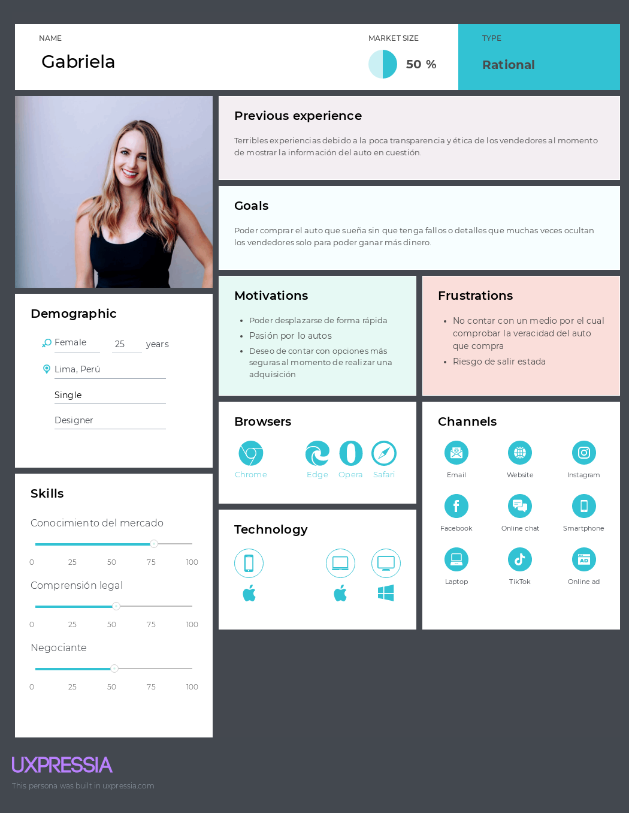


### Vendedores de segunda mano:


<br><br><br><br><br><br>

### Talleres mecánicos:

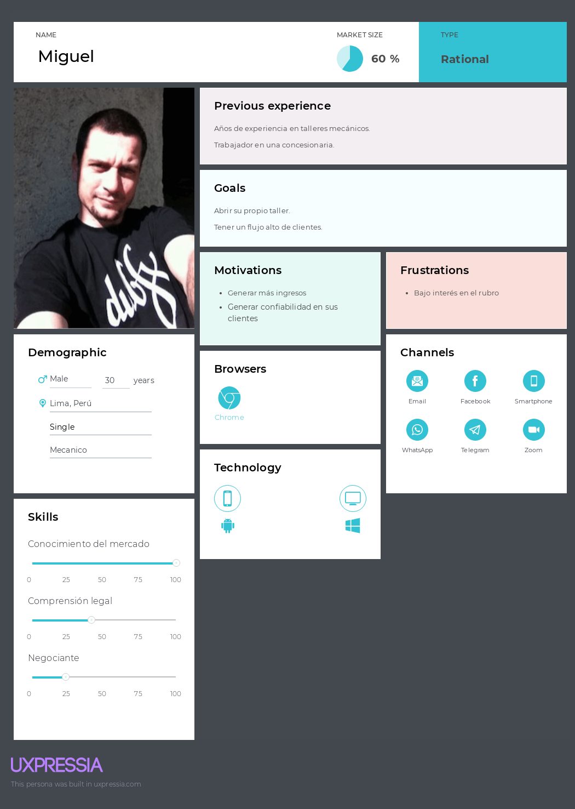
<br><br><br><br>


## 2.3.2. User Task Matrix.

A continuación, presentaremos los User Task Matrix de los segmentos objetivos que encontramos.

<table>
 <tr>
    <th>Task Matrix</th>
    <th colspan="2">Vendedor de autos</th>
    <th colspan="2">Comprador de autos</th>
    <th colspan="2">Talleres Mecánicos</th>
  </tr>
  <tr>
    <th></th>
    <th>Frecuencia</th>
    <th>Importancia</th>
    <th>Frecuencia</th>
    <th>Importancia</th>
    <th>Frecuencia</th>
    <th>Importancia</th>
  </tr>
  <tr>
    <th>Inspeccionar la pintura del vehículo</th>
    <th>Alta</th>
    <th>Alta</th>
    <th>Alta</th>
    <th>Alta</th>
    <th>Media</th>
    <th>Media</th>
  </tr>
  <tr>
    <th>Revisar el kilometraje</th>
    <th>Alta</th>
    <th>Alta</th>
    <th>Alta</th>
    <th>Alta</th>
    <th>Alta</th>
    <th>Alta</th>
  </tr>
  <tr>
    <th>Revisar el historial de mantenimiento</th>
    <th>Media</th>
    <th>Alta</th>
    <th>Alta</th>
    <th>Alta</th>
    <th>Alta</th>
    <th>Alta</th>
  </tr>
  <tr>
    <th>Evaluar el interior del vehículo</th>
    <th>Alta</th>
    <th>Media</th>
    <th>Alta</th>
    <th>Media</th>
    <th>Media</th>
    <th>Baja</th>
  </tr>
  <tr>
    <th>Verificar el funcionamiento del motor</th>
    <th>Media</th>
    <th>Alta</th>
    <th>Alta</th>
    <th>Alta</th>
    <th>Alta</th>
    <th>Alta</th>
  </tr>
  <tr>
    <th>Comprobar el sistema de frenos</th>
    <th>Media</th>
    <th>Alta</th>
    <th>Alta</th>
    <th>Alta</th>
    <th>Alta</th>
    <th>Alta</th>
  </tr>
  <tr>
    <th>Verificar los documentos legales</th>
    <th>Alta</th>
    <th>Alta</th>
    <th>Alta</th>
    <th>Alta</th>
    <th>Alta</th>
    <th>Alta</th>
  </tr>
  <tr>
    <th>Revisar el estado de la batería</th>
    <th>Media</th>
    <th>Media</th>
    <th>Media</th>
    <th>Media</th>
    <th>Alta</th>
    <th>Alta</th>
  </tr>
  <tr>
    <th>Verificar las llantas y la suspensión</th>
    <th>Media</th>
    <th>Alta</th>
    <th>Alta</th>
    <th>Alta</th>
    <th>Alta</th>
    <th>Alta</th>
  </tr>
  <tr>
    <th>Revisar posibles fugas de fluidos</th>
    <th>Baja</th>
    <th>Media</th>
    <th>Media</th>
    <th>Alta</th>
    <th>Alta</th>
    <th>Alta</th>
  </tr>
</table>

Podemos ver que hay muchas actividades que comparten los 3 segmentos sin embargo se diferencian en ciertas partes técnicas, como el mecánico, y estética, en cuanto a los vendedores y compradores.
<br><br><br><br>

## 2.3.3. User Journey Mapping.

### Compradores de segunda mano:


<br><br><br><br><br><br><br><br>

### Vendedores de segunda mano:


### Talleres mecánicos:


<br><br><br><br><br><br><br><br><br><br><br><br><br><br><br><br><br><br><br><br>

## 2.3.4. Empathy Mapping.

### Compradores de segunda mano:


<br><br><br><br><br><br>

### Vendedores de segunda mano:


<br><br><br><br><br><br><br><br><br><br><br><br><br>

### Talleres mecánicos:


<br><br><br><br><br><br><br><br><br>

## 2.3.5. As-is Scenario Mapping

### Segmento Objetivo #1:  Compradores de autos de segunda mano (25-45 años)


### Segmento Objetivo #2: Vendedores de autos de segunda mano (25-55 años)


### Segmento Objetivo #3:  Talleres mecánicos


[LINK DEL MIRO](https://miro.com/app/board/uXjVMm70eUI=/?share_link_id=313743584808)
<br><br>

## 2.4 Ubiquitous Language

1. **Comprador:** Persona que está interesada en adquirir un auto de segunda mano.

2. **Vendedor:** Persona que ofrece su auto para la venta en la plataforma.

3. **Auto Verificado:** Vehículo que ha pasado por una inspección técnica realizada por un taller mecánico asociado.

4. **Taller Mecánico:** Entidad o empresa encargada de revisar y certificar el estado de los autos listados en la plataforma.

5. **Transacción Segura:** Proceso de compra-venta en el que se utiliza el sistema de pagos de la plataforma para asegurar que ambas partes cumplan con sus compromisos.

6. **Anuncio Destacado:** Publicación que aparece en la parte superior de los resultados de búsqueda para mejorar la visibilidad del auto que está en venta.

7. **Inspección Técnica:** Proceso mediante el cual un taller verifica el estado del auto en términos de mecánica, carrocería, y documentación.

8. **Historial del Auto:** Registro de los eventos relevantes asociados al vehículo, como reparaciones, multas o accidentes anteriores.

9. **Kilometraje:** Distancia total recorrida por el auto, un indicador clave del desgaste del vehículo.
# Capítulo III: Requirements Specification
## 3.1. To-Be Scenario Mapping.
## 3.2. User Stories.
## 3.3. Product Backlog.
## 3.4. Impact Mapping.
# Capítulo IV: Product Design


## 4.1. Style Guidelines.


### 4.1.1. General Style Guidelines.
**Branding:**

* Logo representativo de _Car2Go_
  

**Typography:**

* La tipografía de nuestro logotipo adoptará el elegante estilo Roboto, reconocido por su modernidad y su atractivo visual para nuestros usuarios. Este estilo no solo refleja la innovación y la creatividad que caracterizarán a nuestra aplicación, sino que también resalta la vanguardia que buscamos transmitir.


---


**Colors:**
* Hemos seleccionado el color #F4C23D como color primario porque transmite confianza y amabilidad, cualidades esenciales para crear una plataforma donde los usuarios se sientan bienvenidos y seguros al interactuar. Este tono dorado, cálido y acogedor, invita a la participación y genera un ambiente positivo para las transacciones.

* Como color secundario, hemos elegido #2959AD por su asociación con el profesionalismo y la seriedad. Este azul oscuro añade un toque de credibilidad y formalidad a la plataforma, asegurando a los usuarios que están realizando sus transacciones en un entorno confiable y bien gestionado.


### 4.1.2. Web Style Guidelines.
_Icons:_

* Cuando se trata de diseñar una página web, los íconos juegan un papel crucial en la creación de una interfaz de usuario intuitiva y fácil de usar. Estos elementos visuales pequeños tienen el poder de mejorar la comprensión de los usuarios sobre la funcionalidad de diferentes partes de nuestra página. Los íconos permiten a los usuarios entender rápidamente la función de cada elemento y su simplicidad y claridad los hacen fácilmente comprensibles. Mantener una consistencia en el uso de íconos en toda la página ayuda a evitar confusiones entre los usuarios.


_Breackpoints_

* Los breakpoints más conocidos en **ANGULAR** son los siguientes:

<table>
  <thead>
    <tr>
      <th style="text-align:center;">Breakpoint</th>
      <th style="text-align:center;">Class infix</th>
      <th style="text-align:center;">Dimensions</th>
    </tr>
  </thead>
  <tbody>
    <tr>
      <td style="text-align:center;">X-Small</td>
      <td style="text-align:center;">None</td>
      <td style="text-align:center;">&lt;576px</td>
    </tr>
    <tr>
      <td style="text-align:center;">Small</td>
      <td style="text-align:center;">sm</td>
      <td style="text-align:center;">≥576px</td>
    </tr>
    <tr>
      <td style="text-align:center;">Medium</td>
      <td style="text-align:center;">md</td>
      <td style="text-align:center;">≥768px</td>
    </tr>
    <tr>
      <td style="text-align:center;">Large</td>
      <td style="text-align:center;">lg</td>
      <td style="text-align:center;">≥992px</td>
    </tr>
    <tr>
      <td style="text-align:center;">Extra large</td>
      <td style="text-align:center;">xl</td>
      <td style="text-align:center;">≥1200px</td>
    </tr>
    <tr>
      <td style="text-align:center;">Extra, extra large</td>
      <td style="text-align:center;">xxl</td>
      <td style="text-align:center;">≥1400px</td>
    </tr>
  </tbody>
</table>


* Y los que usaremos en el proyecto principalmente son los de 768px y 1024px, ya que son los más comunes en los dispositivos móviles y de escritorio.
### 4.1.3. Mobile Style Guidelines.


#### 4.1.3.1. iOS Mobile Style Guidelines.


#### 4.1.3.2. Android Mobile Style Guidelines.


## 4.2. Information Architecture.


### 4.2.1. Organization Systems.
El sitio web se dividirá en las siguientes secciones:
- Home: Aquí se ubicará el eslogan de la marca y un botón para dirigir a los usuarios a la aplicación web. <br><br/>
- Services: Se muestran las principales características que ofrece la aplicación. <br><br/>
- Plans: Se ubican los planes de suscripción para los segmentos objetivos y las ventajas de cada uno. <br><br/>
- About us: Descripción de la plataforma, misión, visión y los integrantes del proyecto<br><br/>
- Contact us: Formulario para enviar dudas de los usuarios por correo más información de contacto.<br><br/>

La aplicación web tendrá las siguientes secciones según el segmento objetivo:
- Vendedor: "Home", "Plans", "Car Listing", "My Cars" y "Profile"
- Comprador: "Home","Favorites", "Car Listing" y "Profile"
- Mecánico: "Home", "Uninspected Cars", "Reviewed Cars"

Con relación al sistema secuencial, se tienen 2 procesos principales:
- Compra de vehículo: Seleccionar, contactar, pagar y confirmar. <br><br/>
- Publicación de venta: Añadir fotos, detalles del vehículo, información adicional y publicar la oferta.
### 4.2.2. Labeling Systems.
Colocar las etiquetas adecuadas en las secciones, botones y otros elementos en el landing page y la aplicación web permiten que los usuarios comprendan rápidamente las funcionalidades y contenido de la plataforma.
A continuación, se listarán las principales etiquetas según las principales funcionalidades:
- Navegación Principal: "Home", "Favorites", "Car Listing", "Profile"
  <br></br>
- Listado de autos: "My Cars", "Sell Car", "Price", "Filters"
  <br></br>
- Detalle del vehículo: "Year", "Colors", "Mileage", "Location", "Add Offer"
  <br></br>
- Publicación de oferta: "Brand", "Model", "Color", "Description", "Contact Data"
  <br></br>
- Proceso de compra : "Add Offer", "Review here", "Send", "Data"
  <br></br>
- Perfil del usuario: "Name", "Last Name", "Birthdate", "Identity document", "Address", "PHOTO URL"
  <br></br>
### 4.2.3. SEO Tags and Meta Tags
Con el fin de mejorar la prioridad en los motores de búsqueda, facilitar la llegada de nuevas usuarios y brindarles información relevante del landing page y la aplicación web, se añadirán los siguientes "Meta tags" como etiquetas HTML en las principales páginas de nuestra plataforma:

````
<title>Car2Go - Compra y Venta de Autos de Segunda Mano</title>
<meta name="description" content="Car2Go es tu plataforma ideal para comprar y vender autos de segunda mano de manera rápida y segura. Explora vehículos, publica anuncios y coordina sin complicaciones.">
<meta name="keywords" content="compra autos segunda mano, venta autos usados, plataforma autos, anuncios vehículos, comprar coches">
<meta name="author" content="Car2Go Team">
````
### 4.2.4. Searching Systems.
Es importante facilitar la búsqueda y el filtro de información para los usuarios con el fin de que puedan utilizar la plataforma sin problemas. Se dispondrá de una barra de búsqueda en la sección "Car Listing" y los usuarios podrán guardar en favoritos los autos de su preferencia. Sumado a esto, se podrán aplicar una variedad de filtros (marca, modelo, rango de precio, año de fabricación, etc.) a los resultados de la búsqueda para que cada usuario encuentre el auto de su preferencia. <br><br/>
Los resultados de la búsqueda se mostrarán en una cuadrícula, donde cada vehículo incluirá una foto, su precio, marca, modelo, ubicación, entre otros datos.Finalmente, al hacer clic en un resultado específico, se mostrarán más imágenes y detalles del vehículo, junto con un botón para contactar al vendedor.

### 4.2.5. Navigation Systems.
Navegar por nuestra plataforma debe ser lo suficientemente intuitivo para que los usuarios puedan cumplir satisfactoriamente sus objetivos. Con esto en mente, la principal forma desplazarse en el contenido será una barra de navegación ubicada en la parte superior de todas las páginas. Esta contendrá las siguientes secciones: Home, Car Listing, Profile, Plans, etc. Además, se incluirán "call to action" en distintas partes de cada sección. Por ejemplo, "Sell Car" en "Car Listing" y "Add Offer" en los ofertas publicadas. <br><br/>
Por otro lado, se agregará la paginación en la parte inferior de la cuadrícula de los resultados. Finalmente, el footer contendrá secciones como "About Us", "Terms and conditions" y "Privacy Policy", así como información de contacto.
## 4.3. Landing Page UI Design.


### 4.3.1. Landing Page Wireframe.


**Hero alterno 1**:

---
**Hero alterno 2**:
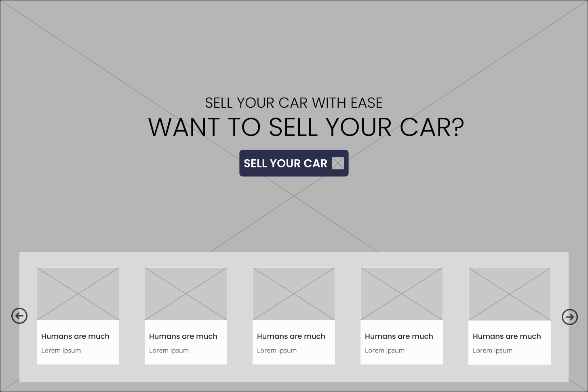
### 4.3.2. Landing Page Mock-up.


**Hero alterno 1**:

---
**Hero alterno 2**:

## 4.4. Mobile Applications UX/UI Design.


### 4.4.1. Mobile Applications Wireframes.
**Registrarse:**


**Iniciar Sesion:**


**Recuperar contraseña**


**Vendedor**


---

---

---

---

---

---

---

---

---

---

---

---

---

**Comprador**


---

---

---

---

---


**Mecanico**


---


### 4.4.2. Mobile Applications Wireflow Diagrams.


---

---

---

---

---

---
### 4.4.3. Mobile Applications Mock-ups.

**Iniciar Sesion:**


---

---


**Vendedor**


---

---

---

---
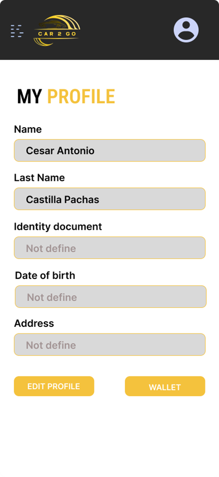
---

---

---

---

---

---

---


**Comprador**


---

---

---

---

---


### 4.4.4. Mobile Applications User Flow Diagrams.


---

---

---

---

---

---


## 4.5. Mobile Applications Prototyping.

### 4.5.1. Android Mobile Applications Prototyping.


[Link del video Android](https://drive.google.com/file/d/1MkEfYLDvhWnqCsu8oyKr32VPtOOdNF56/view?usp=sharing)

### 4.5.2. iOS Mobile Applications Prototyping.


[Link del video IOS](https://drive.google.com/file/d/16jxS-h_tQdrCmrbPsso76fqsp8y62IMh/view?usp=sharing)


## 4.6. Web Applications UX/UI Design.


### 4.6.1. Web Applications Wireframes.

---

---

---

---
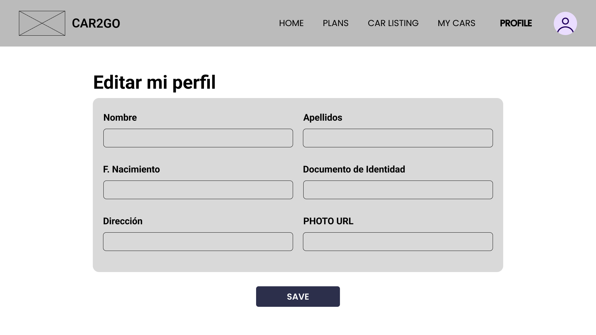
---

---

---

---

---

---

---

---

---

---
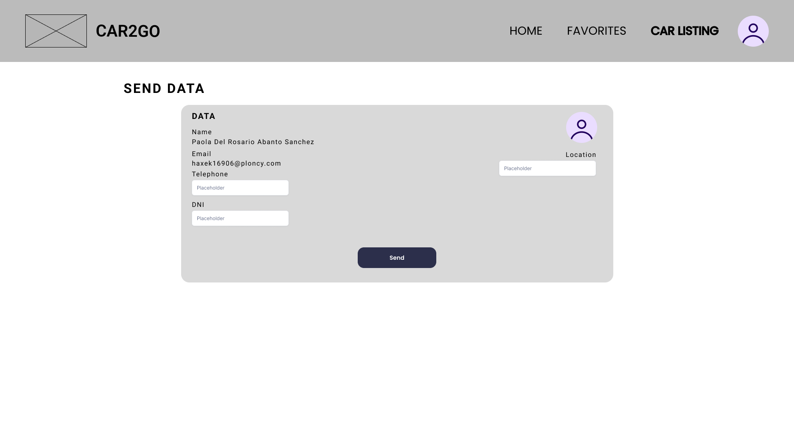
---

---

---

---
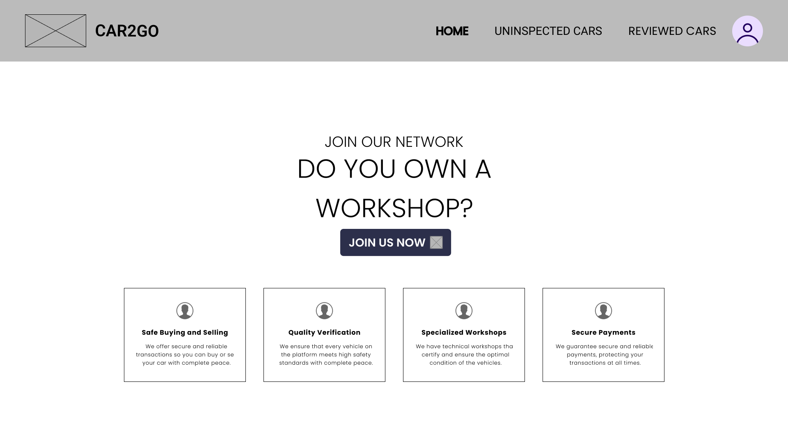
---

---

### 4.6.2. Web Applications Wireflow Diagrams.
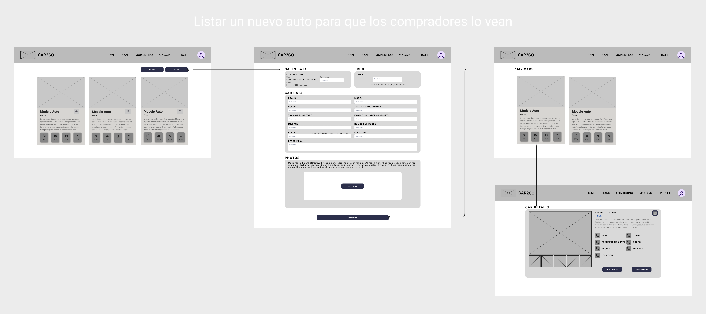
---

---

---

---

---

---

---

---

---

### 4.6.3. Web Applications Mock-ups.
#### Login


### Vista del vendedor


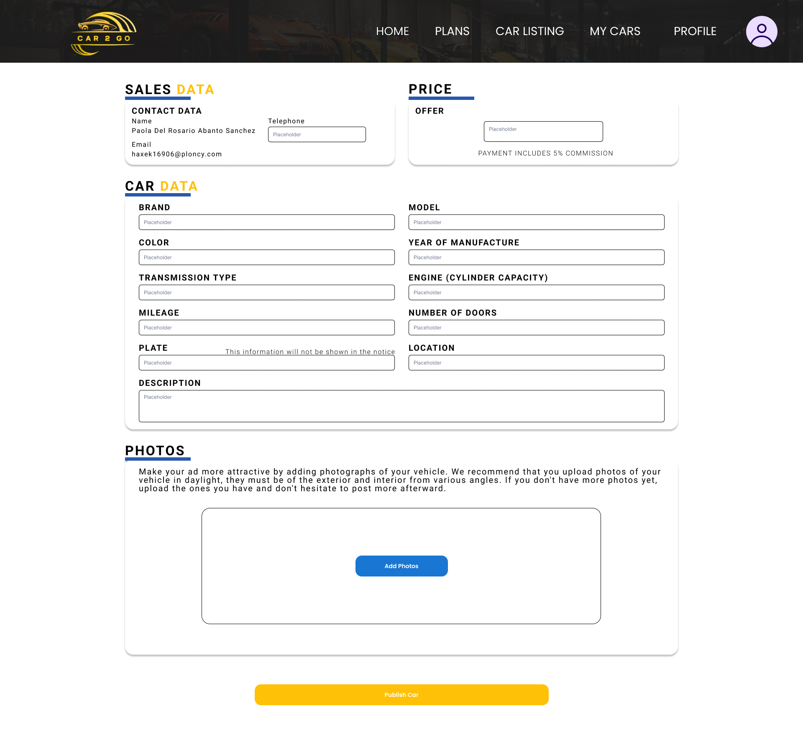


### Vista del comprador


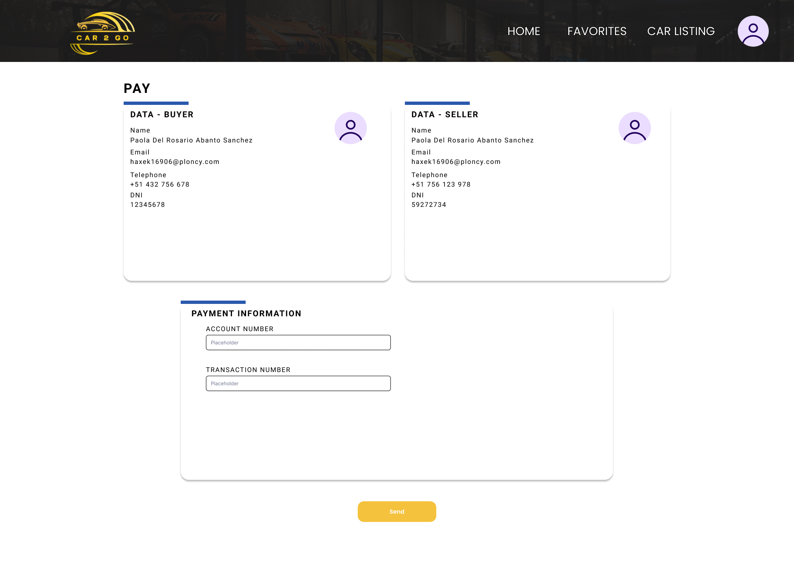

### Vista del mecánico


### 4.6.4. Web Applications User Flow Diagrams.


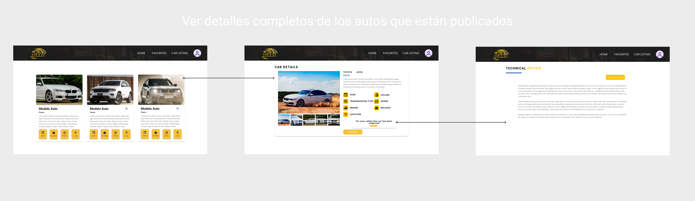


## 4.7. Web Applications Prototyping.
Para poder elaborar los prototipos de la interfaz de usuario destinados a Desktop se siguieron una serie
de criterios fundamentales, entre ellos:

1. Claridad y Facilidad: El enfoque fue lograr que la navegación en la aplicación sea intuitiva y comprensible, con el objetivo
   de que los usuarios puedan comprender plenamente las funciones de la aplicación.
   visualización de reportes estadísticos.
2. Diseño Responsive: Se ha tenido en cuenta la importancia del diseño "responsive" para garantizar que la aplicación web
   sea compatible con una variedad tamaños de pantalla, de tal manera que los usuarios no se vean limitados por el dispositivo que utilicen.
3. Priorización de Información Relevante: El diseño de la aplicación se enfoca en mostrar únicamente la información más importante para los usuarios pertenecientes al segmento objetivo.
## 4.8. Domain-Driven Software Architecture.
El Domain Driven Design (DDD) tiene como objetivo llegar a un entendimiento compartido del dominio que abarca el espacio del problema. En el caso de **Car2Go**, este dominio es la gestión de la compra y venta de vehículos de segunda mano y la interacción con los vendedores, compradores y talleres mecánicos. Gracias a la perspectiva brindada por este enfoque, es posible mejorar la colaboración entre los desarrolladores y los expertos del dominio.
### 4.8.1. Software Architecture Context Diagram.
El diagrama de contexto muestra una vista de alto nivel de las relaciones entre el sistema de software **Car2Go**, los usuarios y, si es el caso, de otros sistemas externos.

<div align="center">
    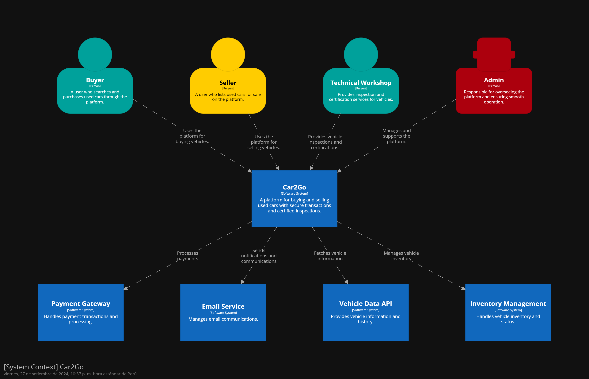
</div>

### 4.8.2. Software Architecture Container Diagrams.
El diagrama de contenedores muestra una vista de alto nivel de las relaciones entre las aplicaciones y fuentes de datos que son parte de la ejecución del sistema de software **Car2Go**.

<div align="center">
    
</div>

### 4.8.3. Software Architecture Components Diagrams.
Los diagramas de componentes muestran una vista de las relaciones de los componentes principales del sistema de software **Car2Go**. Estos componentes detallan la implementación de los respectivos módulos en el programa.

### - Authentication Bounded Context

<div align="center">
    
</div>

### - Payment Bounded Context

<div align="center">
    
</div>

### - User Interaction Bounded Context

<div align="center">
    
</div>

### - Vehicle Management Bounded Context

<div align="center">
    
</div>

## 4.9. Software Object-Oriented Design.


### 4.9.1. Class Diagrams.


### 4.9.2. Class Dictionary.
Clase User

| Atributo           | Tipo   | Descripción                     |
|--------------------|--------|---------------------------------|
| userID             | int    | Identificador único del usuario |
| names              | string | Nombres del usuario             |
| last_name          | string | Apellidos del usuario           |
| phone_number       | string | Número telefónio del usuario    |
| email              | string | Correo del usuario              |
| password           | string | Contraseña del usuario          |
| role               | string | Rol del usuario                 |
| subscriptionPlan   | Subscription | Plan de subscripción            |
| transactionHistory | list   | Historial de transacciones      |

<br><br/>
Clase SubscriptionPlan

| Atributo | Tipo   | Descripción                                  |
|----------|--------|----------------------------------------------|
| planID   | int    | Identificador único del plan de subscripción |
| name     | string | Nombre del plan                              |
| price    | double | Precio del plan                              |
| startDate| date   | Fecha de inicio de la subscripción           |
| endDate  | date   | Fecha de expiración de la subscripción       |
| status   | string | Estado de la subscripción                    |
 
<br><br/>
Clase Transaction

| Atributo      | Tipo    | Descripción                           |
|---------------|---------|---------------------------------------|
| transactionID | int     | Identificador único de la transacción |
| buyer         | User    | Comprador del auto                    |
| seller        | User    | Vendedor del auto                     |
| vehicle       | Vehicle | Vehículo vendido                      |
| amount        | double  | Precio de venta                       |
| date          | date    | Fecha de la transacción               |
| paymentStatus | string  | Estado del pago de la transacción     |

<br><br/>
Clase Payment

| Atributo      | Tipo        | Descripción                    |
|---------------|-------------|--------------------------------|
| paymentID     | int         | Identificador único del pago   |
| transaction   | Transaction | Transación perteniente al pago |
| paymentMethod | string      | Método de pago                 |
| paymentDate   | date        | Fecha del pago                 |

<br><br/>

<br>
Clase Post

| Atributo    | Tipo    | Descripción                  |
|-------------|---------|------------------------------|
| postID      | int     | Identificador único del post |
| vehicle     | Vehicle | Vehículo en venta            |
| seller      | User    | Vendedor                     |
| title       | string  | Título del post              |
| description | string  | Descripción del post         |
| price       | double  | Precio del vehículo          |
| status      | string  | Status del post              |
| createdDate | date    | Fecha de creación del post   |
| location    | string  | Ubicación del vehículo       |
| images      | list    | Imágenes del vehículo        |

<br><br/>
Clase Vehicle

| Atributo           | Tipo   | Descripción                      |
|--------------------|--------|----------------------------------|
| vehicleID          | int    | Identificador único del vehículo |
| brand              | string | Marca del vehículo               |
| model              | string | Modelo                           |
| year               | int    | Año de fabricación               |
| price              | double | Precio del vehículo              |
| color              | string | Color principal del vehículo     |
| mileage            | double | Kilometraje                      |
| location           | string | Ubicación del vehículo           |
| images             | list   | Imágenes del vehículo            |
| description        | string | Descripción                      |
| maintenanceHistory | list   | Historial de mantenimiento       |

<br><br/>
Clase Contact

| Atributo  | Tipo   | Descripción                                                 |
|-----------|--------|-------------------------------------------------------------|
| contactID | int    | Identificador único del contacto entre comprador y vendedor |
| sender    | User   | Usuario interesado en el vehículo                           |
| receiver  | User   | Usuario dueño del vehículo                                  |
| message   | string | Mensaje enviado                                             |
| date      | date   | Fecha del mensaje                                           |

<br><br/>
Clase Review

| Atributo | Tipo   | Descripción                                     |
|----------|--------|-------------------------------------------------|
| reviewID | int    | Identificador único de la reseña de un vendedor |
| user     | User   | Usuario que publicó la reseña                   |
| seller   | User   | Vendedor que recibe las reseñas                 |
| rating   | int    | Calificación del vendedor                       |
| comment  | string | Comentarios de la reseña                        |
| date     | date   | Fecha de publicación                            |

<br><br/>
Clase Maintenance

| Atributo      | Tipo     | Descripción                           |
|---------------|----------|---------------------------------------|
| maintenanceID | int      | Identificador único del mantenimiento |
| vehicle       | Vehicle  | Vehículo objetivo del mantenimiento   |
| date          | date     | Fecha del mantenimiento               |
| description   | string   | Descripción del mantenimiento         |
| cost          | double   | Costo del mantenimiento               |
| mechanic      | Mechanic | Mecánico a cargo del mantenimiento    |

<br><br/>
Clase Mechanic

| Atributo    | Tipo   | Descripción                          |
|-------------|--------|--------------------------------------|
| mechanicID  | int    | Identificador único del mecánico     |
| names       | string | Nombres                              |
| last_name   | string | Apellidos                            |
| phonenumber | string | Número telefónico                    |
| address     | string | Dirección del taller automotriz      |
| company     | string | Nombre del taller automotriz         |
| email       | string | Correo del mecánico                  |
| password    | string | Contraseña de la cuenta del mecánico |


## 4.10. Database Design.
El sistema de gestión de bases de datos relacional (RDBMS) que utilizaremos para generar las tablas y establecer sus relaciones en nuestra plataforma será MySQL. Hemos elegido MySQL por su facilidad de uso y por su integración con MySQL Workbench, que nos proporciona una herramienta visual eficiente para la administración de la base de datos.
### 4.10.1. Relational/Non-Relational Database Diagram.


# Capítulo V: Product Implementation

## 5.1. Software Configuration Management.

A continuación, se describe el proceso por el cual organizamos, gestionamos y controlamos los cambios en el desarrollo de **Car2Go**.

### 5.1.1. Software Development Environment Configuration.

**Requirements Management**

- **Trello:** Es una herramienta utilizada para gestionar el flujo de trabajo de proyectos principalmente basados en marcos de trabajos ágiles. Será empleado para visualizar y actualizar el estado actual de las tareas e historias de usuario pertenecientes al sprint a desarrollar.
  - Ruta de referencia: https://trello.com/es

**Product UX/UI Design**

- **Figma:** Plataforma de elaboración de prototipos y edición gráfica, principalmente utilizado para el diseño digital. En el caso del proyecto, será utilizado para el prototipado de la aplicación y sus versiones de Desktop y Mobile Web Browser.

  - Ruta de referencia: https://www.figma.com/login

- **Lucidchart:** Aplicación para diagramar flujos. Será empleado para el diseño de wireflows, user-flows y el diagrama de clases asociado a la aplicación.
  - Ruta de referencia: https://www.lucidchart.com/

**Software Development**

- **Visual Studio Code:** Entorno de desarrollo integrado elegido para la elaboración y compilación del código por motivos de dominio por parte de los integrantes del equipo de trabajo. Utilizar este IDE supone de valor para el desarrollo del proyecto puesto que incluye la posibilidad de agregar extensiones de utilidad, soporte de edición de texto en múltiples lenguajes de programación, disponibilidade en múltiples sistemas operativos, entre otros beneficios.

  - Ruta de referencia: https://code.visualstudio.com/

- **HTML5:** HyperText Markup Language, o por sus siglas HTML, es un lenguaje de etiquetado para páginas web. Será empleado en el desarrollo del proyecto para la presentación del contenido en la aplicación.

  - Ruta de referencia: https://www.w3schools.com/html/html5_syntax.asp

- **CSS:** Cascading Style Sheets es un lenguaje que maneja el diseño y presentación de las páginas web, el cual va de la mano con HTML.
  - Ruta de referencia: https://google.github.io/styleguide/htmlcssguide.html
  -
- **Bootstrap:** Framework CSS que permitirá crear componentes web de manera rápida y eficiente. Bootstrap se utilizará para la creación de la interfaz responsiva, asegurando que la plataforma funcione correctamente en distintos dispositivos.

  - Ruta de referencia: https://getbootstrap.com/

- **Next.js:** Este framework basado en React es utilizado para optimizar el desarrollo del frontend. Next.js proporciona funcionalidades como el renderizado del lado del servidor (SSR), rutas dinámicas, y la generación estática de sitios (SSG), lo cual mejora la experiencia del usuario y el SEO de la página.
  - Ruta de referencia: https://nextjs.org/
    <br>
    <br>

**Software Deployment**
<br>
<br>

- Git: Una herramienta de control de versiones que facilita el registro y la gestión de las distintas versiones del programa. Su propósito es mantener un historial de cambios y simplificar la corrección de errores. Los integrantes del equipo
  accederán a través de la línea de comandos en sus sistemas locales.

  Ruta de referencia: https://git-scm.com/
  <br>
  <br>
  **Software Documentation and Project Management**
  <br>
  <br>

- Github: Una plataforma en la nube que hospedará los repositorios de código del proyecto. Permitirá la colaboración en
  tiempo real y la revisión de contribuciones de cada miembro del equipo. Los integrantes del equipo podrán acceder a través de sus navegadores web.

  Ruta de referencia: https://github.com/

### 5.1.2. Source Code Management.

El proyecto seguirá las convenciones del flujo de trabajo establecido por el modelo GitFlow para el control de versiones, empleando GitHub como plataforma y sistema de control de versiones. A continuación, se describirá la implementación de GitFlow como un flujo de trabajo para el control de versiones, junto con el enlace del Landing Page.

**Repositorio de GitHub:**

- Enlace para acceder a la [organización](https://github.com/UPC-PRE-SI729-2402-WX51-G3-Cibersofa)
- Enlace para acceder al repositorio de la [landing page](https://github.com/UPC-PRE-SI729-2402-WX51-G3-Cibersofa/Landing-page)
- Enlace para acceder al repositorio del [informe](https://github.com/UPC-PRE-SI729-2402-WX51-G3-Cibersofa/project-report)

**Flujo de trabajo GitFlow**

El flujo de trabajo a ser implementado para el desarrollo del proyecto se basará en el modelo propuesto por Vincent Driessen en "A successful Git branching model".

<div style="margin-left: auto;
            margin-right: auto;
            width: 50%">

</div>

Gitflow es un modelo de ramificación para Git que se centra en la organización de las ramas de un proyecto de software. El modelo de Gitflow define una serie de ramas estándar y reglas para su uso, lo que facilita la colaboración y la gestión del código en un equipo de desarrollo. En UniRider, utilizamos el modelo de Gitflow para organizar y gestionar las ramas de nuestro proyecto, lo que nos permite trabajar de forma eficiente y colaborativa en el desarrollo de nuestra aplicación web.

La rama **main** es la rama principal de nuestro proyecto, que contiene la versión estables, operativas y listas para implementar de UniRider. Estas variantes han sido previamente evaluadas y se ha verificado la total funcionalidad de estas tras su implementación. Emplearemos etiquetas para identificar cada variante estable y lista para implementar, lo que nos permitirá tener un seguimiento preciso de las variantes y simplificar la administración de futuras actualizaciones.

La rama **develop** es la rama de desarrollo de nuestro proyecto, que contiene la versión en desarrollo de UniRider que aún no han sido sometidas a pruebas, aunque están completadas al 100% y contienen todas las características que se esperan hasta ese momento. Este canal se emplea para cargar la versión y llevar a cabo pruebas finales con el fin de corregir cualquier inconveniente antes de la publicación final en la rama main.

La rama **feature** es la rama de características de nuestro proyecto, que contiene las nuevas características y funcionalidades que se están desarrollando para UniRider. Cada nueva característica se desarrolla en una rama de características separada, lo que permite a los miembros del equipo trabajar de forma independiente en diferentes aspectos de la aplicación y facilita la integración de las nuevas características en la rama de desarrollo.

### 5.1.3. Source Code Style Guide & Conventions.

Para asegurar la coherencia y mantenibilidad del código en **Car2Go**, se seguirán las siguientes convenciones de estilo:

**HTML:**

- Todos los elementos deben estar correctamente cerrados.
- Declarar el tipo de documento en la primera línea como `<!DOCTYPE html>`.
- Utilizar comillas en los atributos que contengan espacios.
- Especificar los atributos `alt`, `width`, y `height` en las imágenes para garantizar la accesibilidad y el rendimiento de la página.

**CSS:**

- Sangría de 2 espacios para mantener el código legible.
- Todo el código en minúsculas.
- Usar comentarios explicativos y eliminar espacios en blanco innecesarios.
- Nombres de clase deben ser descriptivos, reflejando la función o propósito del elemento.

**Bootstrap:**

- Usar las utilidades predefinidas de Bootstrap para componentes y grillas responsivas.
- Evitar la sobrecarga de estilos personalizados y priorizar el uso de las clases estándar de Bootstrap.

**Next.js:**

- Seguir las convenciones de componentes funcionales de React.
- Utilizar hooks cuando sea necesario y modularizar el código en componentes reutilizables.

### 5.1.4. Software Deployment Configuration.

## 5.2. Product Implementation & Deployment.

### 5.2.1. Sprint Backlogs.

| Sprint                             | Sprint 1                                                                                                                                                                                     |
| ---------------------------------- | -------------------------------------------------------------------------------------------------------------------------------------------------------------------------------------------- |
| Sprint Planning Background         |
| Date                               | 2025/04/13                                                                                                                                                                                   |
| Time                               | 21:00 PM                                                                                                                                                                                     |
| Location                           | El desarrollo de la reunión se hizo virtualmente por medio de Discord                                                                                                                        |
| Prepared By                        | Meza Camayo, Lynn Jeeferzon                                                                                                                                                                  |
| Attendees (to planning meeting)    | Meza Camayo, Lynn Jeeferzon/Castilla Pachas, César Antonio/Serrano Uchuya, Gerald Patricio /Alvarado De La Cruz, Juan Carlos/Valera Garcés, Samuel Ignacio                                   |
| Sprint n – 1 Review Summary        |  -                                                                                |
| Sprint n – 1 Retrospective Summary |                                                                                                                                                                                              |
| Sprint Goal & User Stories         |
| Sprint 1 Goal                      | Desarrollar y desplegar la landing page, aplicación mobil y aplicación web funcional garantizando que cumpla con los requisitos básicos de diseño, contenido y accesibilidad. |
| Sprint 1 Velocity                  | 8                                                                                                                                                                                            |
| Sum of Story Points                | 5                                                                                                                                                                                            |

### 5.2.2. Implemented Landing Page Evidence


### 5.2.3. Implemented Frontend-Web Application Evidence

### 5.2.4. Implemented Native-Mobile Application Evidence

### 5.2.5. Implemented RESTful API and/or Serverless Backend Evidence

### 5.2.6. RESTful API documentation

### 5.2.7. Team Collaboration Insights

## 5.3. Video About-the-Product.

# Part II: Verification, Validation & Pipeline

# Capítulo VI: Product Verification & Validation

## 6.1. Testing Suites & Validation

### 6.1.1. Core Entities Unit Tests.

### 6.1.2. Core Integration Tests.

### 6.1.3. Core Behavior-Driven Development

### 6.1.4. Core System Tests.

## 6.2. Static testing & Verification

### 6.2.1. Static Code Analysis

#### 6.2.1.1. Coding standard & Code conventions.

#### 6.2.1.2. Code Quality & Code Security.

### 6.2.2. Reviews

## 6.3. Validation Interviews.

### 6.3.1. Diseño de Entrevistas.

### 6.3.2. Registro de Entrevistas.

### 6.3.3. Evaluaciones según heurísticas.

## 6.4. Auditoría de Experiencias de Usuario

### 6.4.1. Auditoría realizada.

#### 6.4.1.1. Información del grupo auditado.

#### 6.4.1.2. Cronograma de auditoría realizada.

#### 6.4.1.3. Contenido de auditoría realizada.

### 6.4.2. Auditoría recibida.

#### 6.4.2.1. Información del grupo auditor.

#### 6.4.2.2. Cronograma de auditoría recibida.

#### 6.4.2.3. Contenido de auditoría recibida.

#### 6.4.2.4. Resumen de modificaciones para subsanar hallazgos.

# Capítulo VII: DevOps Practices

## 7.1. Continuous Integration

### 7.1.1. Tools and Practices.

### 7.1.2. Build & Test Suite Pipeline Components.

## 7.2. Continuous Delivery

### 7.2.1. Tools and Practices.

### 7.2.2. Stages Deployment Pipeline Components.

## 7.3. Continuous deployment

### 7.3.1. Tools and Practices.

### 7.3.2. Production Deployment Pipeline Components.

## 7.4. Continuous Monitoring

### 7.4.1. Tools and Practices

### 7.4.2. Monitoring Pipeline Components

### 7.4.3. Alerting Pipeline Components

### 7.4.4. Notification Pipeline Components.

# Part III: Experiment-Driven Lifecycle

# Capítulo VIII: Experiment-Driven Development

## 8.1. Experiment Planning

### 8.1.1. As-Is Summary.

### 8.1.2. Raw Material: Assumptions, Knowledge Gaps, Ideas, Claims.

### 8.1.3. Experiment-Ready Questions.

### 8.1.4. Question Backlog.

### 8.1.5. Experiment Cards.

## 8.2. Experiment Design

### 8.2.1. Hypotheses.

### 8.2.2. Measures.

### 8.2.3. Conditions.

### 8.2.4. Scale Calculations and Decisions.

### 8.2.5. Methods Selection.

### 8.2.6. Data Analytics: Goals, KPIs and Metrics Selection.

### 8.2.7. Web and Mobile Tracking Plan.

## 8.3. Experimentation

### 8.3.1. To-Be User Stories.

### 8.3.2. To-Be Product Backlog

### 8.3.3. Pipeline-supported, Experiment-Driven To-Be Software Platform Lifecycle

#### 8.3.3.1. To-Be Sprint Backlogs

#### 8.3.3.2. Implemented To-Be Landing Page Evidence

#### 8.3.3.3. Implemented To-Be Frontend-Web Application Evidence

#### 8.3.3.4. Implemented To-Be Native-Mobile Application Evidence

#### 8.3.3.5. Implemented To-Be RESTful API and/or Serverless Backend Evidence

#### 8.3.3.6. Team Collaboration Insights

### 8.3.4. To-Be Validation Interviews

#### 8.3.4.1. Diseño de Entrevistas.

#### 8.3.4.2. Registro de Entrevistas.

## 8.4. Experiment Aftermath & Analysis

### 8.4.1. Analysis and Interpretation of Results

### 8.4.2. Re-scored and Re-prioritized Question Backlog

## 8.5. Continuous Learning

### 8.5.1. Shareback Session Artifacts: Learning Workflow

## 8.6. To-Be Software Platform Pre-launch

### 8.6.1. About-the-Product Intro Video

# Conclusiones

## Conclusiones y recomendaciones.

# Video About-the-Team.

# Bibliografía

# Anexos
